<h2 style="color:red;">✅ Deep Learning</h2>


<h3 style="color:blue;">📌 What is Deep Learning?</h3>

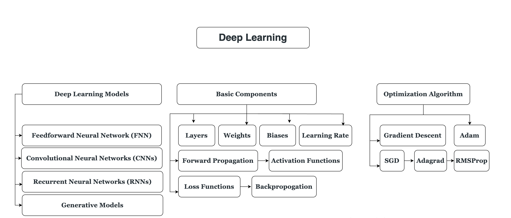

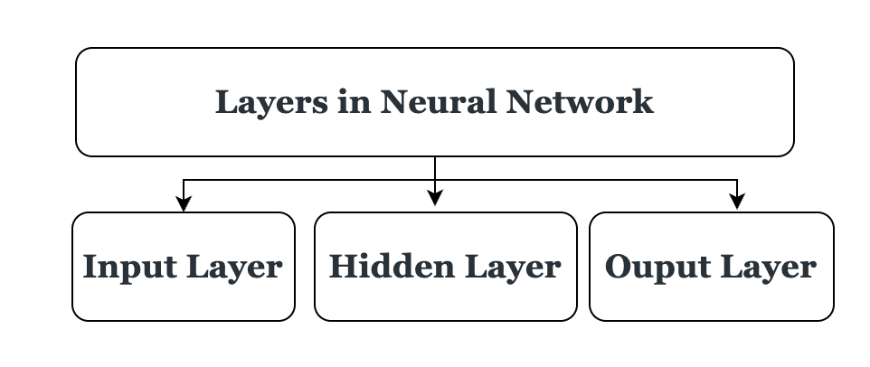

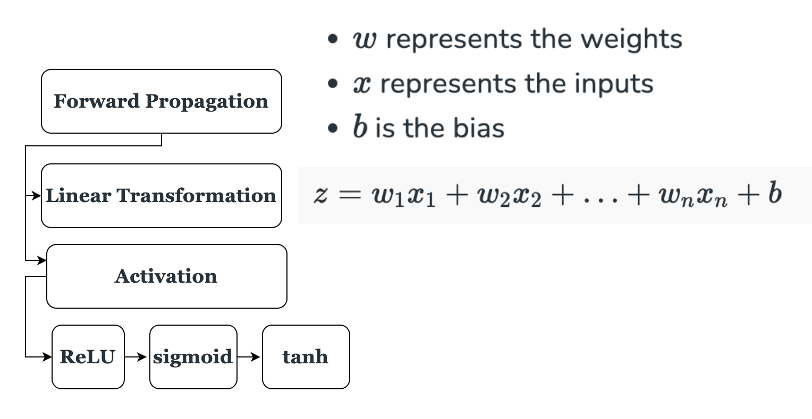

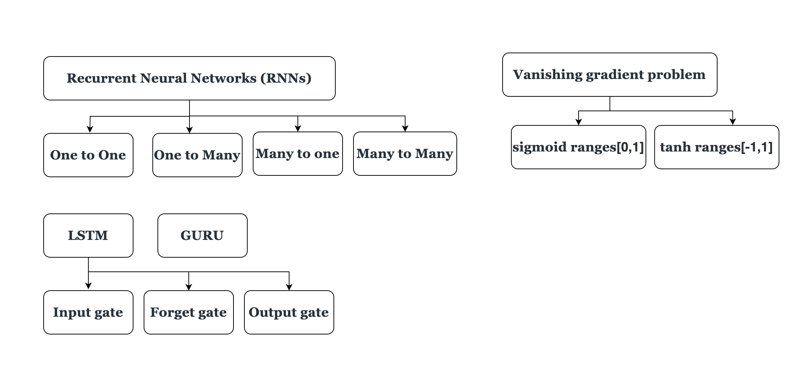

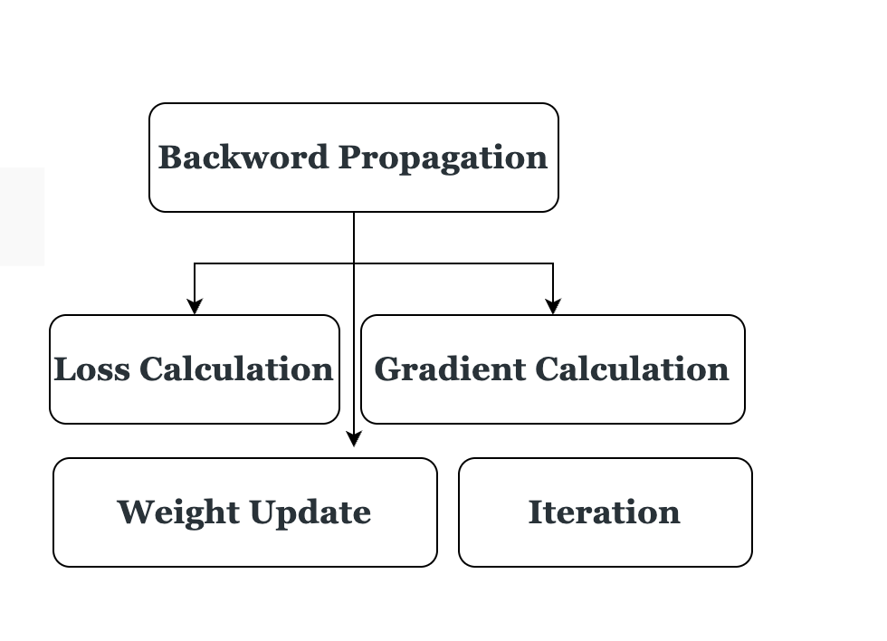


**Deep Learning** is a subset of **Machine Learning (ML)** that uses algorithms called **artificial neural networks**, inspired by the structure and function of the human brain. Deep learning is particularly powerful when working with unstructured data like images, audio, text, or videos.

The **"deep"** in deep learning refers to the number of layers in these neural networks. A neural network is composed of layers of interconnected nodes **(neurons)**. A deep neural network has many **hidden layers** between the input and output layers, allowing it to learn and represent data at various levels of abstraction.


<h3 style="color:blue;">📌 Key Concepts</h3>

1. **Neural Networks**

A neural network is made up of layers of nodes (neurons):

   - **Input layer** (where data is fed)

   - **Hidden layers** (where computation happens)

   - **Output layer** (where the result is produced)

2. **Deep Neural Networks (DNN)**

A "deep" network has **multiple hidden layers**. These allow it to learn **complex patterns**.

3. **Common Deep Learning Architectures:**

   - **CNN (Convolutional Neural Networks)** – for images

   - **RNN (Recurrent Neural Networks)** – for sequences, e.g., text

   - **Transformers** – modern architectures used in NLP (like ChatGPT)


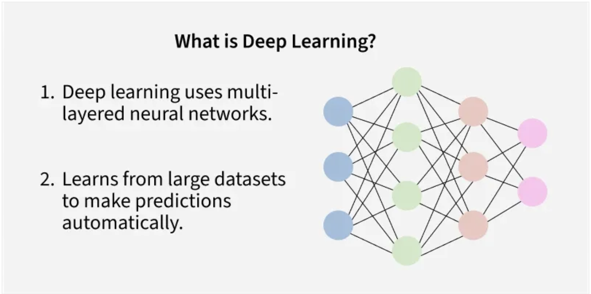

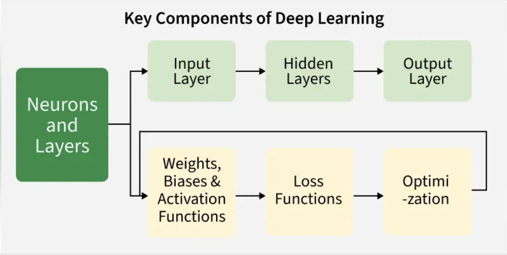

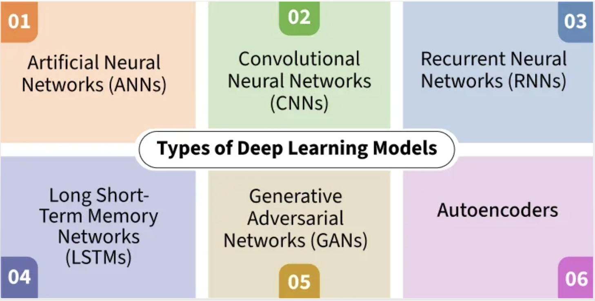

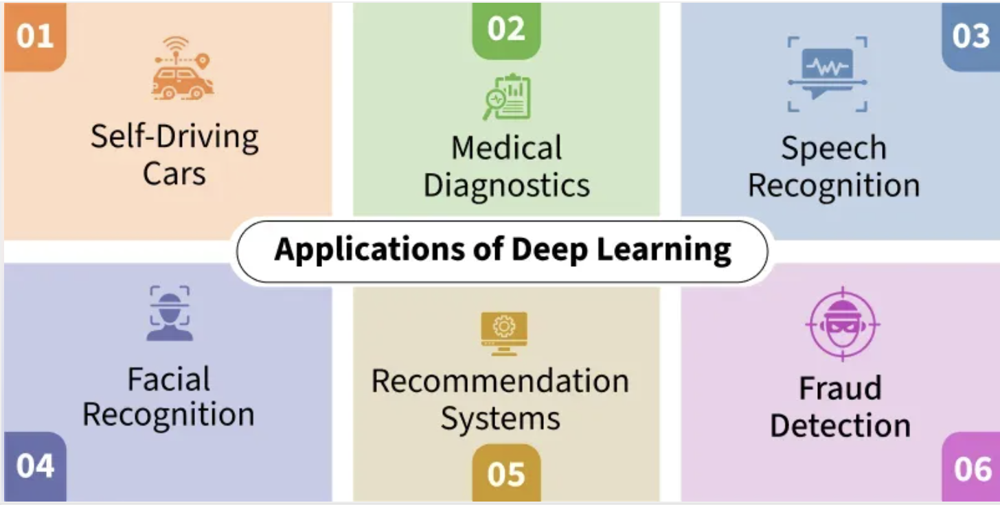

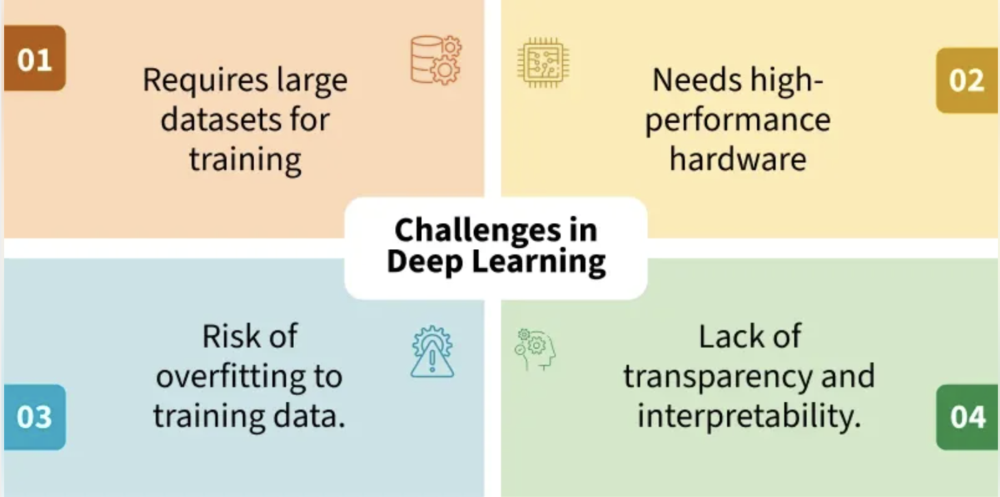


<h3 style="color:blue;">📌 What is a Neural Network?</h3>

Neural networks are machine learning models that mimic the complex functions of the human brain.
These models consist of interconnected nodes or neurons that process data, learn patterns and enable tasks such as pattern recognition and decision-making.

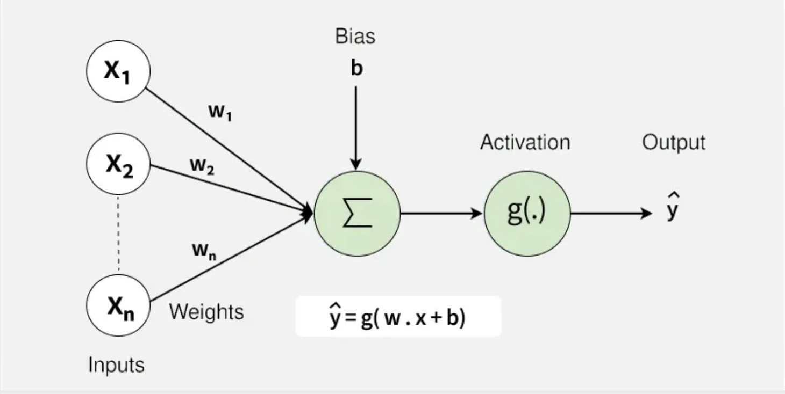

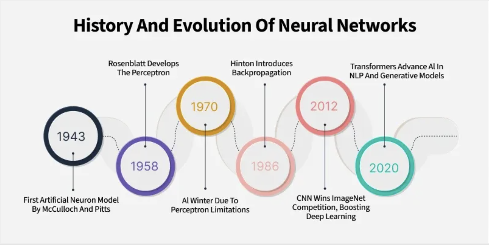

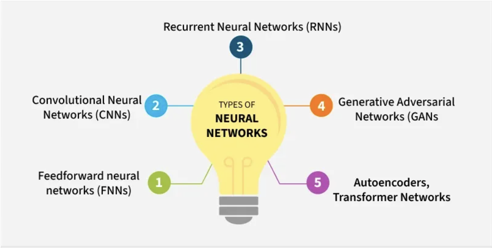

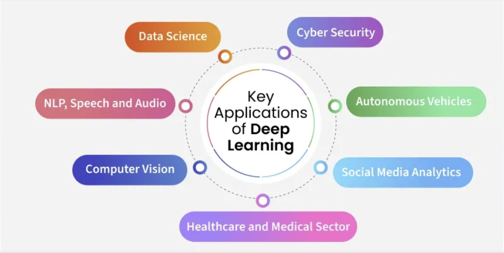


<h3 style="color:blue;">📌 Understanding Neural Networks in Deep Learning</h3>

Neural networks are capable of learning and identifying patterns directly from data without pre-defined rules. These networks are built from several key components:

1. **Neurons:** The basic units that receive inputs, each neuron is governed by a threshold and an activation function.

2. **Connections:** Links between neurons that carry information, regulated by weights and biases.

3. **Weights and Biases:** These parameters determine the strength and influence of connections.

4. **Propagation Functions:** Mechanisms that help process and transfer data across layers of neurons.

5. **Learning Rule:** The method that adjusts weights and biases over time to improve accuracy.

<h3 style="color:blue;">📌 Neural networks follows a structured, three-stage process:</h3>

1. **Input Computation:** Data is fed into the network.

2. **Output Generation:** Based on the current parameters, the network generates an output.

3. **Iterative Refinement:** The network refines its output by adjusting weights and biases, gradually improving its performance on diverse tasks.

<h3 style="color:blue;">📌 In an adaptive learning environment:</h3>

- The neural network is exposed to a simulated scenario or dataset.

- Parameters such as weights and biases are updated in response to new data or conditions.

- With each adjustment, the network’s response evolves allowing it to adapt effectively to different tasks or environments.

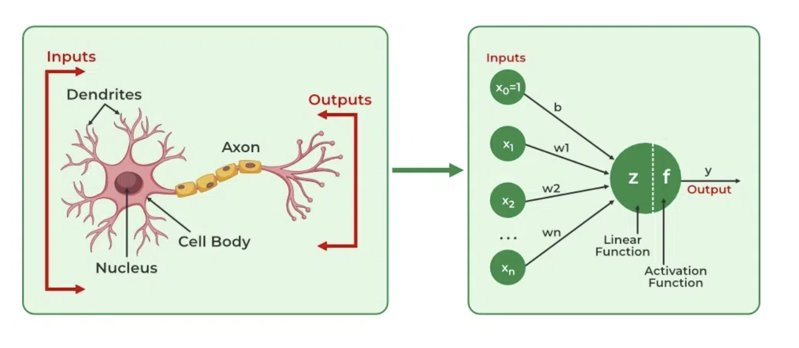


<h3 style="color:blue;">📌 Layers in Neural Network Architecture:</h3>

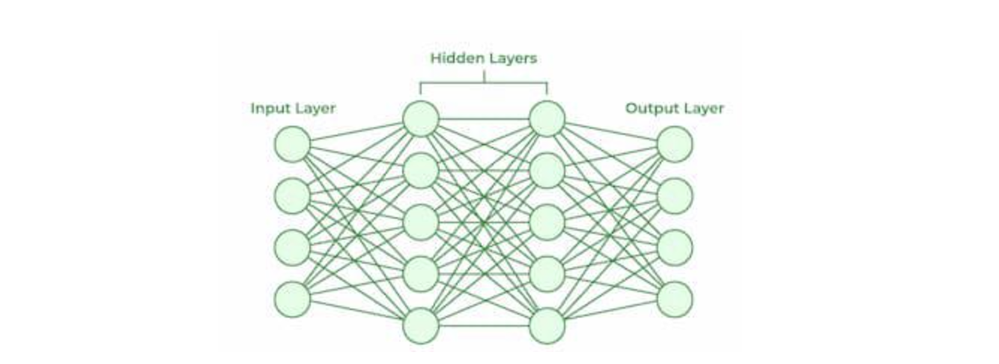


<h3 style="color:blue;">📌 What is Forward Propagation?</h3>

When data is input into the network, it passes through the network in the forward direction, from the input layer through the hidden layers to the output layer. This process is known as forward propagation. Here’s what happens during this phase:

**1. Linear Transformation:** Each neuron in a layer receives inputs which are multiplied by the weights associated with the connections. These products are summed together and a bias is added to the sum. This can be represented mathematically as:

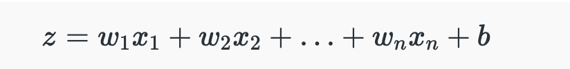

where

- **w** represents the weights

- **x** represents the inputs

- **b** is the bias

**2. Activation:** The result of the linear transformation (denoted as z) is then passed through an activation function. The activation function is crucial because it introduces non-linearity into the system, enabling the network to learn more complex patterns. Popular activation functions include ```ReLU```, ```sigmoid``` and ```tanh```.


**Forward Propagation** is the process of **passing input data through the neural network layer-by-layer** to get an output (or prediction).

- Computing **weighted sums**

- Applying **activation functions**

- Passing the output to the next layer, until reaching the final prediction


It's like **feeding data forward** through the network.

<h3 style="color:blue;">🛒 Real-Time Example: Predicting Purchase Decision in E-Commerce</h3>

Imagine you're building a model to predict whether a customer will buy a product or not, based on:

| Feature            | Value      |
| ------------------ | ---------- |
| Time on website    | 10 minutes |
| Pages visited      | 5          |
| Previous purchases | 2          |


Feed this input into a small neural network to predict: **Buy (1) or Not Buy (0)**.


<h3 style="color:blue;">🧠 Neural Network Structure</h3>

Let’s say your network looks like this:

- **Input Layer:** 3 neurons (for 3 input features)

- **Hidden Layer:** 2 neurons

- **Output Layer:** 1 neuron (Buy or Not)

Input → [Hidden1, Hidden2] → Output

<h3 style="color:blue;">➗ Step-by-Step Forward Propagation</h3>

**🎯 Inputs**

```
x = [10, 5, 2]  # Time, Pages, Purchases
```

**🔗 Weights (Randomly initialized)**

Hidden Layer weights:

```
w1 = [[0.2, 0.4, 0.1],   # Weights for Hidden1
      [0.5, 0.3, 0.2]]   # Weights for Hidden2
```

Output Layer weights:

```
w2 = [0.6, 0.9]  # Weights from Hidden1 and Hidden2 to Output
```

**📈 Step 1: Input → Hidden Layer**

**For Hidden1:**

```
z1 = 10*0.2 + 5*0.4 + 2*0.1 = 2 + 2 + 0.2 = 4.2
a1 = sigmoid(4.2) ≈ 0.985
```

**For Hidden2:**

```
z2 = 10*0.5 + 5*0.3 + 2*0.2 = 5 + 1.5 + 0.4 = 6.9
a2 = sigmoid(6.9) ≈ 0.999
```

Now, hidden layer outputs:

hidden_output = [0.985, 0.999]


**🧮 Step 2: Hidden → Output**

```
z3 = 0.985*0.6 + 0.999*0.9 = 0.591 + 0.899 = 1.49
a3 = sigmoid(1.49) ≈ 0.816
```

**✅ Final Prediction:** 0.816

This means:

```There's an 81.6% chance that the customer will buy the product.```

**🧠 Summary**

| Step | Layer   | Formula                           | Value   |
| ---- | ------- | --------------------------------- | ------- |
| 1    | Hidden1 | `z = x·w + b` → `sigmoid(z)`      | `0.985` |
| 2    | Hidden2 | same as above                     | `0.999` |
| 3    | Output  | `z = hidden·w + b` → `sigmoid(z)` | `0.816` |


<h3 style="color:blue;">📌 Why It Matters</h3>

Forward propagation is how the neural network **generates predictions** before learning. Once predictions are made, we compare them to the actual result, and then **backpropagation** is used to update weights to improve future predictions.

**Simple Python example using NumPy:**

```
import numpy as np

def sigmoid(x):
    return 1 / (1 + np.exp(-x))

# Inputs
x = np.array([10, 5, 2])

# Weights
w1 = np.array([[0.2, 0.4, 0.1],
               [0.5, 0.3, 0.2]])
w2 = np.array([0.6, 0.9])

# Forward pass
hidden_input = np.dot(w1, x)
hidden_output = sigmoid(hidden_input)

final_input = np.dot(w2, hidden_output)
output = sigmoid(final_input)

print(f"Final output (purchase probability): {output:.3f}")
```

**Final output (purchase probability):** 0.816


<h3 style="color:blue;">📌 What is Backpropagation?</h3>
After forward propagation, the network evaluates its performance using a loss function which measures the difference between the actual output and the predicted output. The goal of training is to minimize this loss. This is where backpropagation comes into play:

1. **Loss Calculation:** The network calculates the loss which provides a measure of error in the predictions. The loss function could vary; common choices are mean squared error for regression tasks or cross-entropy loss for classification.

2. **Gradient Calculation:** The network computes the gradients of the loss function with respect to each weight and bias in the network. This involves applying the chain rule of calculus to find out how much each part of the output error can be attributed to each weight and bias.

3. **Weight Update:** Once the gradients are calculated, the weights and biases are updated using an optimization algorithm like stochastic gradient descent (SGD). The weights are adjusted in the opposite direction of the gradient to minimize the loss. The size of the step taken in each update is determined by the learning rate.


Backpropagation is the **learning process** in deep learning. After forward propagation (i.e., making a prediction), the model:

1. Compares the **predicted output** to the **actual value** using a **loss function**

2. Calculates **how wrong** the prediction was (the error)

3. Moves **backward through the network**, adjusting the **weights** so that future predictions improve

**👉 Forward propagation = prediction**

**👉 Backpropagation = learning**

<h3 style="color:blue;">🔁 Using the Same Example: E-Commerce Purchase Prediction</h3>

**🧠 Setup Recap**

- **Input:** [10, 5, 2]

- **Predicted output:** 0.816 (from forward propagation)

- **Actual output (label):** 1 (customer actually bought)

- **Loss function:** Binary Cross-Entropy

<h3 style="color:blue;">⚙️ Step-by-Step Backpropagation</h3>

We use **gradient descent** to update the weights by calculating the **gradient of the loss** w.r.t. each weight.

**🔧 1. Compute Loss (Binary Cross Entropy)**

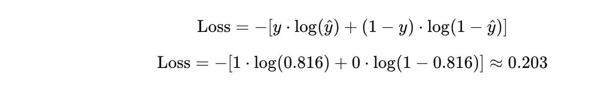

This is the **error** we want to minimize.

**🔄 2. Compute Gradients (Chain Rule)**

We use the **chain rule** of calculus to backpropagate the error.

Let’s focus on the output neuron and then the hidden layer.

**🧮 a. Output Layer**

We calculate how much the output neuron contributed to the error.

Let’s denote:

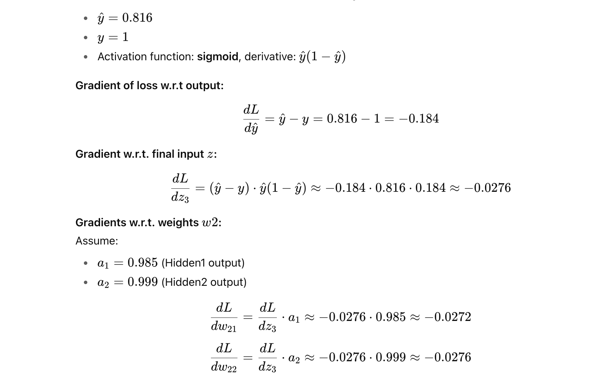


**🔁 b. Hidden Layer**

We now calculate how the hidden neurons contributed to the output error.

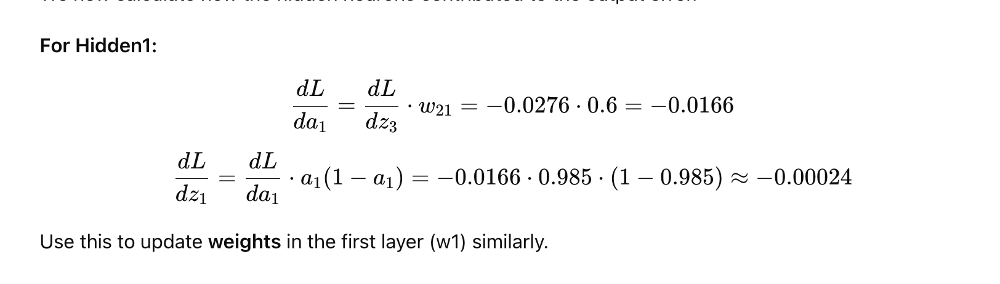

**🔁 3. Update Weights**

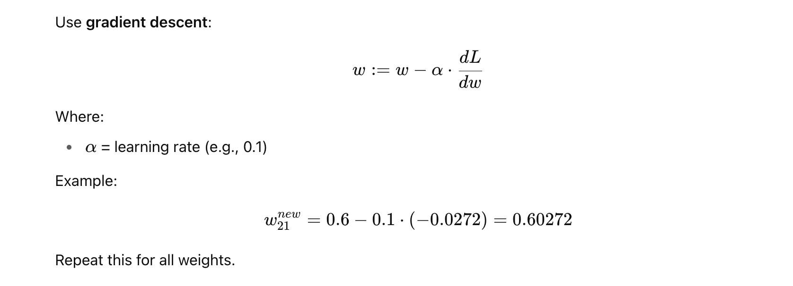

**🔄 This Process Repeats...**

In each **epoch** (training cycle), the network:

- Performs forward pass (predict)

- Calculates loss (compare with actual)

- Performs backward pass (update weights)

Over many **epochs**, the network **learns patterns** and improves accuracy.

**🎓 Visualization**

Input → Hidden Layer → Output (forward)
       ← Gradients ←           (backward)


**✅ Summary**

| Stage         | What Happens      |
| ------------- | ----------------- |
| Forward Prop  | Predict output    |
| Compare       | Calculate loss    |
| Backward Prop | Compute gradients |
| Update        | Adjust weights    |

**Here’s a mini example in NumPy (gradient calculation):**

```
import numpy as np

def sigmoid(x):
    return 1 / (1 + np.exp(-x))
def sigmoid_deriv(x):
    return x * (1 - x)

# Input and label
X = np.array([[10, 5, 2]])
y = np.array([[1]])

# Weights
w1 = np.random.rand(3, 2)
w2 = np.random.rand(2, 1)

# Forward
hidden_input = np.dot(X, w1)
hidden_output = sigmoid(hidden_input)
final_input = np.dot(hidden_output, w2)
output = sigmoid(final_input)

# Loss and backprop
error = y - output
d_output = error * sigmoid_deriv(output)
d_hidden = d_output.dot(w2.T) * sigmoid_deriv(hidden_output)

# Update weights
lr = 0.1
w2 += hidden_output.T.dot(d_output) * lr
w1 += X.T.dot(d_hidden) * lr

print(f"Updated output: {output}")
```
```
Updated output: [[0.7875618]]
```

**📦 No Libraries Required (uses only numpy)**

```
# Code inside the notebook
import numpy as np

def sigmoid(x):
    return 1 / (1 + np.exp(-x))

def sigmoid_derivative(x):
    return x * (1 - x)

# Input features: [Time on website, Pages visited, Previous purchases]
X = np.array([[10, 5, 2]])  # shape (1,3)
y = np.array([[1]])         # Target: Buy (1)

# Initialize weights (3 inputs → 2 hidden, 2 hidden → 1 output)
np.random.seed(1)
w1 = np.random.rand(3, 2)  # weights from input → hidden
w2 = np.random.rand(2, 1)  # weights from hidden → output

learning_rate = 0.1
epochs = 1000

for epoch in range(epochs):
    # Forward propagation
    hidden_input = np.dot(X, w1)
    hidden_output = sigmoid(hidden_input)
    
    final_input = np.dot(hidden_output, w2)
    output = sigmoid(final_input)

    # Backpropagation
    error = y - output
    d_output = error * sigmoid_derivative(output)
    
    error_hidden = d_output.dot(w2.T)
    d_hidden = error_hidden * sigmoid_derivative(hidden_output)
    
    # Update weights
    w2 += hidden_output.T.dot(d_output) * learning_rate
    w1 += X.T.dot(d_hidden) * learning_rate
    
    if epoch % 100 == 0:
        print(f"Epoch {epoch} → Loss: {np.mean(np.abs(error)):.4f}, Output: {output[0][0]:.4f}")
```
```
Epoch   0 → Loss: 0.3706, Output: 0.6294  
Epoch 100 → Loss: 0.1836, Output: 0.8164  
Epoch 200 → Loss: 0.1310, Output: 0.8690  
Epoch 300 → Loss: 0.1058, Output: 0.8942  
Epoch 400 → Loss: 0.0906, Output: 0.9094  
Epoch 500 → Loss: 0.0803, Output: 0.9197  
Epoch 600 → Loss: 0.0727, Output: 0.9273  
Epoch 700 → Loss: 0.0668, Output: 0.9332  
Epoch 800 → Loss: 0.0622, Output: 0.9378  
Epoch 900 → Loss: 0.0583, Output: 0.9417  
```

**Loss vs. Epoch plot**

```
import matplotlib.pyplot as plt

# Epochs and corresponding loss values
epochs = list(range(0, 1000, 100))
losses = [0.3706, 0.1836, 0.1310, 0.1058, 0.0906, 0.0803, 0.0727, 0.0668, 0.0622, 0.0583]

# Plotting
plt.figure(figsize=(8, 5))
plt.plot(epochs, losses, marker='o', linestyle='-', linewidth=2)
plt.title('Loss vs. Epoch')
plt.xlabel('Epoch')
plt.ylabel('Loss')
plt.grid(True)
plt.tight_layout()
plt.show()
```

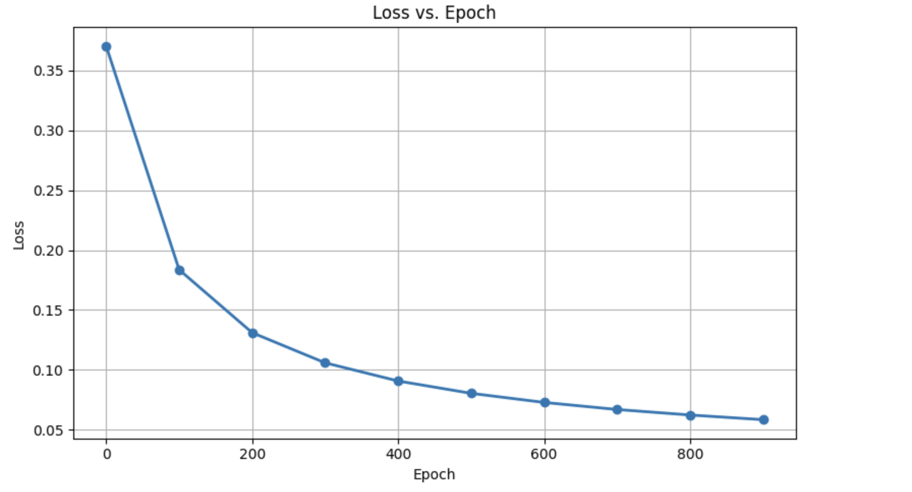


Here is the **Loss vs. Epoch** plot. You can see the loss steadily decreases over time, which shows the model is learning and improving its predictions.


<h3 style="color:blue;">📌 Iteration</h3>

This process of forward propagation, loss calculation, backpropagation and weight update is repeated for many iterations over the dataset. Over time, this iterative process reduces the loss and the network's predictions become more accurate.

Through these steps, neural networks can adapt their parameters to better approximate the relationships in the data, thereby improving their performance on tasks such as classification, regression or any other predictive modeling.


<h3 style="color:blue;">📌 Example of Email Classification</h3>

Let's consider a record of an email dataset:

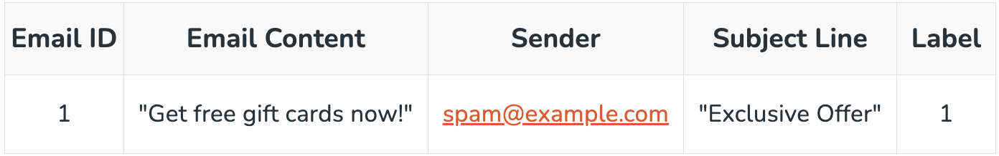

To classify this email, we will create a feature vector based on the analysis of keywords such as "free" "win" and "offer"

The feature vector of the record can be presented as:

- "free": Present (1)

- "win": Absent (0)

- "offer": Present (1)

<h3 style="color:blue;">📌 How Neurons Process Data in a Neural Network</h3>

In a neural network, input data is passed through multiple layers, including one or more hidden layers. Each neuron in these hidden layers performs several operations, transforming the input into a usable output.

1. **Input Layer:** The input layer contains 3 nodes that indicates the presence of each keyword.

2. **Hidden Layer:** The input vector is passed through the hidden layer. Each neuron in the hidden layer performs two primary operations: a weighted sum followed by an activation function.

**Weights:**

- Neuron H1: [0.5,−0.2,0.3]

- Neuron H2: [0.4,0.1,−0.5]

**Input Vector:** [1,0,1]

**Weighted Sum Calculation**

- **For H1:** (1×0.5)+(0×−0.2)+(1×0.3)=0.5+0+0.3=0.8

- **For H2:** (1×0.4)+(0×0.1)+(1×−0.5)=0.4+0−0.5=−0.1

**Activation Function**

Here we will use ```ReLu activation function```:

- **H1 Output:** ReLU(0.8)= 0.8

- **H2 Output:** ReLu(-0.1) = 0

**3. Output Layer**

The activated values from the hidden neurons are sent to the output neuron where they are again processed using a weighted sum and an activation function.

- **Output Weights:** [0.7, 0.2]

- **Input from Hidden Layer:** [0.8, 0]

- **Weighted Sum:** (0.8×0.7)+(0×0.2)=0.56+0=0.56

- **Activation (Sigmoid):** 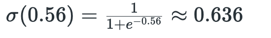

**4. Final Classification**

- The output value of approximately **0.636** indicates the probability of the email being spam.

- Since this value is greater than 0.5, the neural network classifies the email as spam (1).


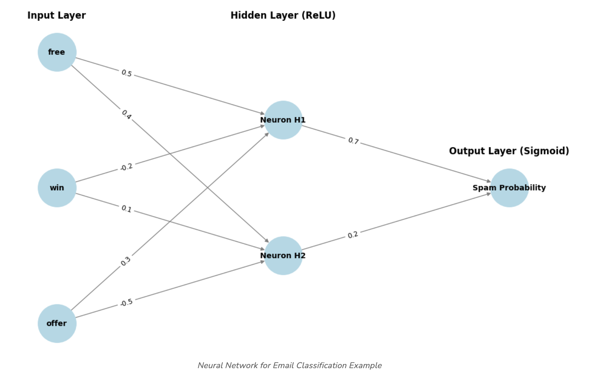


<h3 style="color:blue;">📌 Learning of a Neural Network</h3>

**1. Learning with Supervised Learning**

In supervised learning, a neural network learns from labeled input-output pairs provided by a teacher. The network generates outputs based on inputs and by comparing these outputs to the known desired outputs, an error signal is created. The network iteratively adjusts its parameters to minimize errors until it reaches an acceptable performance level.


**2. Learning with Unsupervised Learning**

Unsupervised learning involves data without labeled output variables. The primary goal is to understand the underlying structure of the input data (X). Unlike supervised learning, there is no instructor to guide the process. Instead, the focus is on modeling data patterns and relationships, with techniques like clustering and association commonly used.

**3. Learning with Reinforcement Learning**

Reinforcement learning enables a neural network to learn through interaction with its environment. The network receives feedback in the form of rewards or penalties, guiding it to find an optimal policy or strategy that maximizes cumulative rewards over time. This approach is widely used in applications like gaming and decision-making.


<h3 style="color:blue;">📌 Types of Neural Networks</h3>

<h3 style="color:blue;">🧠 1. Feedforward Neural Network (FNN)</h3>

- **Description:** The simplest type; data flows in one direction (input → hidden → output).

- **Use Case:** Basic classification/regression tasks.

- **Example:** Predicting house prices, email spam detection.

<h3 style="color:blue;">🔁 2. Recurrent Neural Network (RNN)</h3>

- **Description:** Designed for **sequential data**. It has memory of previous inputs.

- **Use Case:** Time series, speech recognition, text generation.

- **Example:** Language modeling, stock price prediction.

<h3 style="color:blue;">🔄 Variants of RNN:</h3>

- **LSTM (Long Short-Term Memory):** Solves vanishing gradient problem; better for long sequences.

- **GRU (Gated Recurrent Unit):** A simpler alternative to LSTM.

<h3 style="color:blue;">🖼️ 3. Convolutional Neural Network (CNN)</h3>

- **Description:** Uses filters/kernels to detect spatial patterns in images.

- **Use Case:** Image classification, object detection, facial recognition.

- **Example:** Self-driving cars, medical imaging.

<h3 style="color:blue;">🧮 4. Radial Basis Function Network (RBFN)</h3>

- **Description:** Uses radial basis functions as activation functions; good for pattern recognition.

- **Use Case:** Function approximation, time-series prediction.

- **Example:** Signal classification.

<h3 style="color:blue;">🕸️ 5. Modular Neural Network (MNN)</h3>

- **Description:** Combines multiple networks (modules) that work independently and combine their outputs.

- **Use Case:** When tasks can be split across different models.

- **Example:** Multi-modal tasks (e.g., combining image + text inputs).

<h3 style="color:blue;">🌐 6. Generative Adversarial Networks (GANs)</h3>

- **Description:** Consists of two networks — Generator & Discriminator — competing against each other.

- **Use Case:** Image generation, data augmentation, deepfake creation.

- **Example:** Creating realistic human faces, art generation.

<h3 style="color:blue;">🔤 7. Transformer Networks</h3>

- **Description:** Uses self-attention mechanism; excels at handling long-range dependencies.

- **Use Case:** NLP tasks (translation, summarization, Q&A).

- **Example:** ChatGPT, BERT, GPT, T5

<h3 style="color:blue;">🤖 8. Autoencoders</h3>

- **Description:** Learns compressed representations of data (encoder) and reconstructs them (decoder).

- **Use Case:** Dimensionality reduction, denoising, anomaly detection.

- **Example:** Recommender systems, image compression.

<h3 style="color:blue;">🧱 9. Self-Organizing Maps (SOM)</h3>

- **Description:** Unsupervised network that reduces dimensions and clusters data.

- **Use Case:** Exploratory data analysis, visualization.

- **Example:** Customer segmentation.

<h3 style="color:blue;">📊 Summary Table</h3>

| Neural Network Type        | Key Use Case                                |
| -------------------------- | ------------------------------------------- |
| Feedforward Neural Network | General classification/regression           |
| CNN                        | Image and video analysis                    |
| RNN / LSTM / GRU           | Text, speech, sequential data               |
| GAN                        | Image & video generation                    |
| Autoencoder                | Dimensionality reduction, anomaly detection |
| Transformer                | Natural Language Processing (NLP)           |
| RBFN                       | Function approximation                      |
| SOM                        | Clustering, dimensionality reduction        |
| Modular NN                 | Complex multi-task systems                  |


<h3 style="color:blue;">📌 How to choose the right neural network for your problem?</h3>

Choosing the **right neural network** for your problem depends on **three key factors**:

1. **✅ Nature of the data**

2. **✅ Type of problem**

3. **✅ Resources (compute, time, data volume)**


<h3 style="color:blue;">🔍 1. Understand Your Data Type</h3>

| Data Type       | Description                              | Common Networks                     |
| --------------- | ---------------------------------------- | ----------------------------------- |
| **Images**      | Photos, videos, medical scans            | CNN, GAN                            |
| **Sequences**   | Time-series, speech, stock data          | RNN, LSTM, GRU, Transformer         |
| **Text**        | Sentences, documents                     | RNN, LSTM, Transformer              |
| **Tabular**     | Excel/CSV data (structured rows/columns) | Feedforward Neural Network          |
| **Mixed Modal** | Combining text + image + numbers         | Modular NN, Multimodal Transformers |
| **Unlabeled**   | No ground truth (unsupervised)           | Autoencoders, SOM, GAN              |


<h3 style="color:blue;">🔧 2. Match Problem Type to Model</h3>

| Problem Type                | Recommended Networks                                      |
| --------------------------- | --------------------------------------------------------- |
| **Classification**          | FNN, CNN, RNN, Transformers                               |
| **Regression**              | FNN, RBFN, LSTM                                           |
| **Object Detection**        | CNN (YOLO, Faster R-CNN)                                  |
| **Image Generation**        | GANs                                                      |
| **Text Generation**         | Transformers (GPT), LSTM                                  |
| **Translation**             | Transformer (like T5, BERT, MarianMT)                     |
| **Anomaly Detection**       | Autoencoders, LSTM (for time series)                      |
| **Clustering/Segmentation** | SOM, CNN (for image segmentation), k-Means + Autoencoders |
| **Recommendation Systems**  | Autoencoders, Transformers, Embedding models              |


<h3 style="color:blue;">🧠 3. Consider Model Complexity and Resources</h3>

| Factor                 | Light Models            | Heavy Models              |
| ---------------------- | ----------------------- | ------------------------- |
| **Training Data Size** | Small → FNN, SVM        | Large → CNN, Transformers |
| **Hardware**           | CPU → FNN, Autoencoders | GPU → CNN, Transformers   |
| **Real-time need**     | Fast → FNN, LSTM        | Slower → BERT, GPT        |

<h3 style="color:blue;">📊 Decision Flowchart (Simplified)</h3>

```
→ Do you have images?
     → Yes → CNN or GAN
     → No →
→ Do you have sequential data?
     → Yes → RNN / LSTM / Transformer
     → No →
→ Is your data tabular (structured)?
     → Yes → FNN (MLP)
→ Is your problem text-based (NLP)?
     → Yes → Transformer (e.g., BERT/GPT)
→ Is your data unlabeled?
     → Yes → Autoencoder / SOM / GAN
```

<h3 style="color:blue;">🎯 Example Use Cases</h3>

| Use Case                        | Best Neural Network        |
| ------------------------------- | -------------------------- |
| Detecting spam emails           | RNN, LSTM, Transformer     |
| Diagnosing diseases from X-rays | CNN                        |
| Predicting stock prices         | LSTM, GRU                  |
| Translating English to French   | Transformer (T5, MarianMT) |
| Chatbot like ChatGPT            | Transformer (GPT)          |
| Recommending movies on Netflix  | Autoencoder, Transformer   |


**✅ Tips**

- **Start simple:** Begin with FNN or Logistic Regression if you’re unsure.

- **Use pre-trained models:** Especially for NLP and vision (e.g., BERT, ResNet).

- **Use AutoML:** Tools like Google AutoML, H2O.ai, or AutoKeras can auto-select the best architecture.

- **Don’t overcomplicate:** Deep learning isn’t always better than traditional ML.

<h3 style="color:blue;">📌 A Neural Network Playground</h3>

[A Neural Network Playground](https://playground.tensorflow.org/)

[A Neural Network Playground](https://www.ccom.ucsd.edu/~cdeotte/programs/neuralnetwork.html)

[A Neural Network Playground](https://huggingface.co/spaces/ameerazam08/neural-network-playground)
