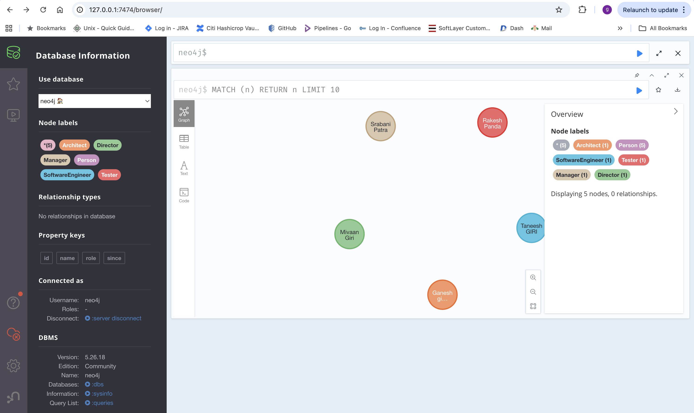
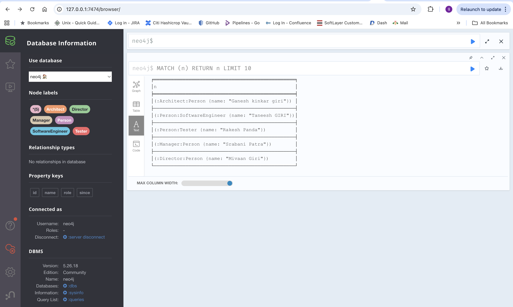

# cypher

## CREATE

- The **```CREATE```** clause allows you to create nodes and relationships.
- To define these entities, **```CREATE```** uses a syntax similar to that of **```MATCH```**. However, while patterns only need to evaluate to either true or false, the syntax for **```CREATE```** needs to specify exactly what nodes and relationships to create.

## Syntax for nodes
The **```CREATE```** clause allows you to create one or more nodes. Each node can be assigned **```labels```** and **```properties```**. You can bind each node to a **```variable```** that you can refer to later in the query. Multiple **```labels```** are separated by **```colons```**.

**Requirements:**

represent people who can have multiple roles (e.g., ```actor```, ```director```) in a graph database.

**Cyper Query:**

```
CREATE 
(charlie:Person:Actor {name: 'Charlie Sheen'}), 
(oliver:Person:Director {name: 'Oliver Stone'})
```

1️⃣ **CREATE**

- Tells Neo4j to **```create new nodes```** in the graph.
- This does **not** check if they already exist (duplicates possible).
- Used when you are sure the data is new.

2️⃣ **(charlie:Person:Actor {name: 'Charlie Sheen'})**

This creates **one node** with:

| Component                 | Meaning                                     |
| ------------------------- | ------------------------------------------- |
| `charlie`                 | Variable name (used only within this query) |
| `:Person`                 | Label → general classification              |
| `:Actor`                  | Label → specific role                       |
| `{name: 'Charlie Sheen'}` | Properties (key–value data)                 |


📌 **Requirement satisfied here:**

A single entity can belong to **multiple categories** (```Person``` + ```Actor```) without duplication.

3️⃣ **(oliver:Person:Director {name: 'Oliver Stone'})**

Similarly creates:

| Component                | Meaning             |
| ------------------------ | ------------------- |
| `oliver`                 | Query variable      |
| `:Person`                | General entity type |
| `:Director`              | Role                |
| `{name: 'Oliver Stone'}` | Property            |


📌 **Requirement satisfied here:**

Another person, but with a **different role**, while still being a **Person**.

🧩 **Why use multiple labels instead of a property?**

❌ **Bad (less efficient)**

```
(:Person {name:'Charlie Sheen', role:'Actor'})
```

✅ **Good (your query)**

```
(:Person:Actor {name:'Charlie Sheen'})
```

**Why?**

| Reason                  | Benefit              |
| ----------------------- | -------------------- |
| Labels are indexed      | Faster queries       |
| Multiple labels allowed | One node, many roles |
| Cleaner queries         | `MATCH (:Actor)`     |
| Scales well             | Enterprise-grade KG  |


🔎 **Example Queries Enabled by This Design**

**Find all actors**

```
MATCH (a:Actor) RETURN a.name
```

**Find all directors**

```
MATCH (d:Director) RETURN d.name
```

**Find all people**

```
MATCH (p:Person) RETURN p.name
```

**Find people who are both Actor AND Director**

```
MATCH (p:Person:Actor:Director) RETURN p.name
```

Multiple labels can also be separated by an ampersand **&**, in the same manner as it is used in label expressions. Separation by colon **:** and ampersand **&** cannot be mixed in the same clause.

**Cyper Query:**

```
CREATE 
(charlie:Person&Actor {name: 'Charlie Sheen'}), 
(oliver:Person&Director {name: 'Oliver Stone'})
```

Both of the above queries create two nodes, bound to the variables **charlie** and **oliver**, each with a **Person** label and a **name** property. The node representing ```Charlie Sheen``` also has the label **Actor** while the node representing ```Oliver Stone``` is assigned the label **Director**.


## Syntax for relationships

📌 **Cypher Relationship Syntax – Explained**

🔹 **Query**

```
CREATE
  (charlie:Person:Actor {name: 'Charlie Sheen'})
    -[:ACTED_IN {role: 'Bud Fox'}]->
  (wallStreet:Movie {title: 'Wall Street'})
    <-[:DIRECTED]-
  (oliver:Person:Director {name: 'Oliver Stone'})
```

This query creates the **Person** nodes for Charlie Sheen and Oliver Stone and the **Movie** node for Wall Street. It also created the relationships of the types **ACTED_IN** and **DIRECTED** between them.

## Reusing variables
The previous example created a path between the specified nodes. Note, that these newly created nodes and relationships are not connected to what was previously in the graph. To connect them to already existing data, bind the desired nodes and relationships to variables. These variables can then be passed along to subsequent clauses in a query that target pre-existing elements in the graph.

**Cyper Query:**

```
MATCH (charlie:Person {name: 'Charlie Sheen'}), (oliver:Person {name: 'Oliver Stone'})
CREATE (charlie)-[:ACTED_IN {role: 'Bud Fox'}]->(wallStreet:Movie {title: 'Wall Street'})<-[:DIRECTED]-(oliver)
```

In this example, the **MATCH** clause finds the nodes Charlie Sheen and Oliver Stone and binds them to the **charlie** and **oliver** variables respectively. These variables are then passed along to the subsequent **CREATE** clause, which creates new relationships from the bound nodes.

You can also reuse variables from the same **CREATE**, both in the same or a later clause. This way, you can, for example, define constructs that are more complex than just a linear path.

**Cyper Query:**

```
CREATE p = (charlie:Person:Actor {name: 'Charlie Sheen'})-[:ACTED_IN {role: 'Bud Fox'}]->(wallStreet:Movie {title: 'Wall Street'})<-[:DIRECTED]-(oliver:Person:Director {name: 'Oliver Stone'}), (wallStreet)<-[:ACTED_IN {role: 'Gordon Gekko'}]-(michael:Person:Actor {name: 'Michael Douglas'})
RETURN length(p)
```

Creates all three nodes for Charlie Sheen, Oliver Stone and Michael Douglas and connects them all to the node representing the Wall Street movie. It then returns the length of the path from Charlie Sheen to Oliver Stone.

Note that when repeating a node’s variable, you may not add labels or properties to the repetition.


## Example:

```
CREATE
(Ganesh:Person:Architect{name:'Ganesh kinkar giri'})
```

**OP:**

```
Added 2 labels, created 1 node, set 1 property, completed after 11 ms.
```


```
MATCH (a:Person) return a.name
```

**OP:**

```
"Ganesh kinkar giri"
```


```
MATCH (n) RETURN n LIMIT 25
```

**Table:**

```
{
  "identity": 0,
  "labels": [
    "Person",
    "Architect"
  ],
  "properties": {
    "name": "Ganesh kinkar giri"
  },
  "elementId": "4:8667926f-58ca-43b3-a452-a345911d9507:0"
}
```

```
CREATE
(Taneesh:Person:SoftwareEngineer{name:'Taneesh GIRI'}),
(Rakesh:Person:Tester{name:'Rakesh Panda'}),
(Srabani:Person:Manager{name:'Srabani Patra'}),
(Mivaan:Person:Director{name:'Mivaan Giri'})
```


```
MATCH (n) RETURN n LIMIT 10
```






```
MATCH (a:Architect) RETURN a.name
```


```
MATCH (a:Person) RETURN a.name
```


