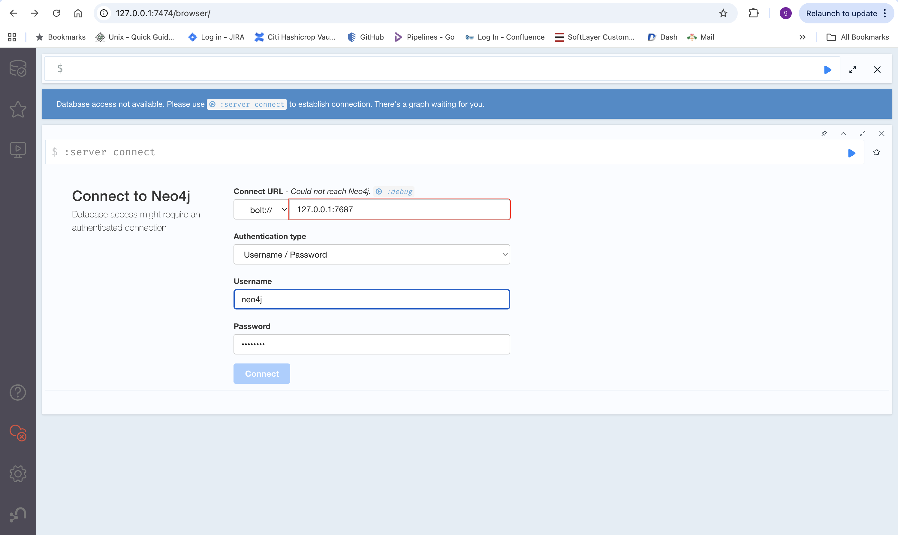

## PVC

**pvc.yaml**

```
apiVersion: v1
kind: PersistentVolumeClaim
metadata:
  name: neo4j-data-pvc
spec:
  accessModes:
    - ReadWriteOnce
  resources:
    requests:
      storage: 10Gi
```

## Secret

**Secret.yaml**

```
apiVersion: v1
kind: Secret
metadata:
  name: neo4j-auth
  namespace: ganesh-aimlapp
type: Opaque
stringData:
  auth: neo4j/admin123
```

## Deployment

**Deployment-Neo4j.yaml**

```
apiVersion: apps/v1
kind: Deployment
metadata:
  name: neo4j
  namespace: ganesh-aimlapp
spec:
  replicas: 1
  selector:
    matchLabels:
      app: neo4j
  template:
    metadata:
      labels:
        app: neo4j
    spec:
      containers:
        - name: neo4j
          image: neo4j:5
          imagePullPolicy: IfNotPresent

          ports:
            - name: http
              containerPort: 7474
            - name: bolt
              containerPort: 7687

          env:
            # 🔐 Authentication
            - name: NEO4J_AUTH
              valueFrom:
                secretKeyRef:
                  name: neo4j-auth
                  key: auth

            # ✅ REQUIRED FIX for K8s env var injection
            - name: NEO4J_server_config_strict__validation_enabled
              value: "false"

            # 🧠 Memory tuning
            - name: NEO4J_dbms_memory_heap_initial__size
              value: "2G"
            - name: NEO4J_dbms_memory_heap_max__size
              value: "4G"
            - name: NEO4J_dbms_memory_pagecache_size
              value: "2G"

            # 🌐 Listen on all interfaces
            - name: NEO4J_server_default__listen__address
              value: "0.0.0.0"

            # 🔑 CRITICAL: Bolt configuration for Ingress usage
            - name: NEO4J_dbms_connector_bolt_listen__address
              value: "0.0.0.0:7687"
            - name: NEO4J_dbms_connector_bolt_advertised__address
              value: "localhost:7687"

          volumeMounts:
            - name: neo4j-data
              mountPath: /data

          readinessProbe:
            httpGet:
              path: /
              port: 7474
            initialDelaySeconds: 30
            periodSeconds: 10

          livenessProbe:
            httpGet:
              path: /
              port: 7474
            initialDelaySeconds: 60
            periodSeconds: 20

      volumes:
        - name: neo4j-data
          persistentVolumeClaim:
            claimName: neo4j-data-pvc
```

## Service

**Service-Neo4j.yaml**

```
apiVersion: v1
kind: Service
metadata:
  name: neo4j
  namespace: ganesh-aimlapp
spec:
  type: ClusterIP
  selector:
    app: neo4j
  ports:
    - name: http
      port: 7474
      targetPort: 7474
    - name: bolt
      port: 7687
      targetPort: 7687
```

## Ingress

**ingress-Neo4j.yaml**

```
apiVersion: networking.k8s.io/v1
kind: Ingress
metadata:
  name: neo4j
  namespace: ganesh-aimlapp
  annotations:
    nginx.ingress.kubernetes.io/proxy-body-size: "0"
    nginx.ingress.kubernetes.io/proxy-read-timeout: "600"
    nginx.ingress.kubernetes.io/proxy-send-timeout: "600"
    # ⛔️ No ssl-redirect
    # ⛔️ No cookie affinity
spec:
  ingressClassName: nginx
  rules:
    - host: neo4j.apps.kubernetes.aimledu.cloud
      http:
        paths:
          - path: /
            pathType: Prefix
            backend:
              service:
                name: neo4j
                port:
                  number: 7474
```

## Local Port forward

```
kubectl -n ganesh-aimlapp port-forward service/neo4j 7687:7687
kubectl -n ganesh-aimlapp port-forward service/neo4j 7474:7474
```

http://127.0.0.1:7474/browser/





