<h2 style="color:red;">✅ Linear Algebra For Machine Learning</h2>

<h3 style="color:blue;">📌 What is Linear Algebra?</h3>

Linear algebra is a core mathematical foundation for machine learning, as most datasets and models are represented using vectors and matrices.
It allows efficient computation, data manipulation and optimization, making complex tasks manageable.

- Data in ML is represented as vectors (features) and matrices (datasets).

- Operations like dot product, matrix multiplication and transformations power ML algorithms.

- Key concepts such as eigenvalues, eigenvectors and decompositions simplify dimensionality reduction, optimization and training.

- Algorithms like PCA, SVD, regression, SVMs and neural networks rely heavily on linear algebra.

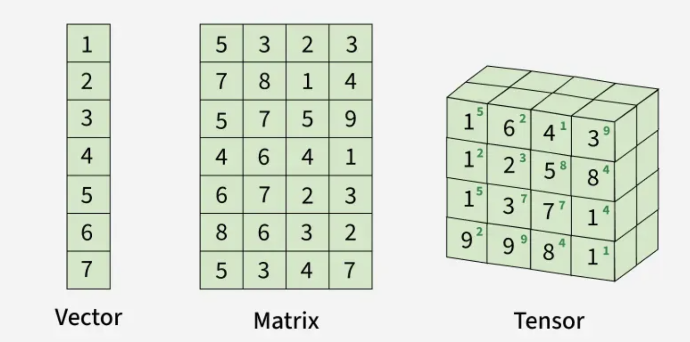

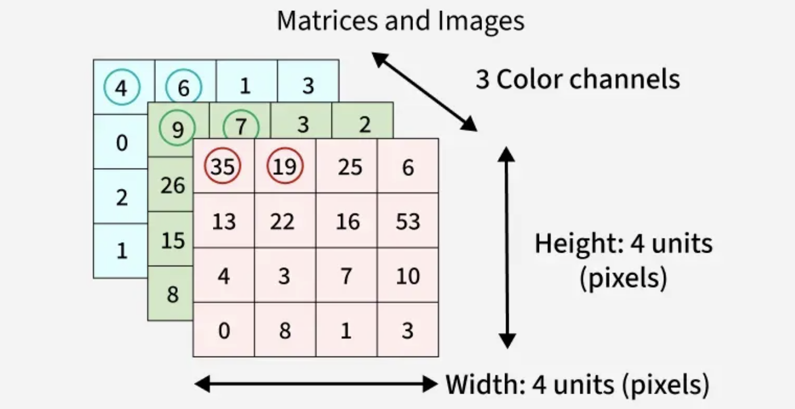

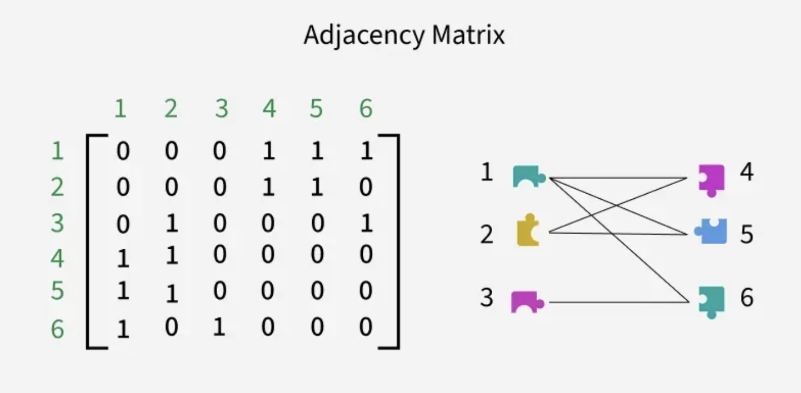

<h3 style="color:blue;">📌 Fundamental Concepts in Linear Algebra for Machine Learning</h3>

In machine learning, **vectors**, **matrices** and **scalars** play key roles in handling and processing data.

<h3 style="color:blue;">1. Vectors</h3>

Vectors are quantities that have both magnitude and direction, often represented as arrows in space.

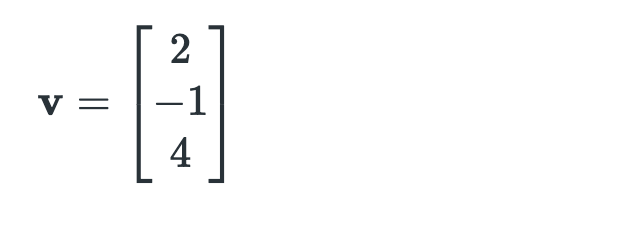

<h3 style="color:blue;">2. Matrices</h3>

Matrices are rectangular arrays of numbers, arranged in rows and columns. Matrices are used to represent linear transformations, systems of linear equations and data transformations in machine learning.

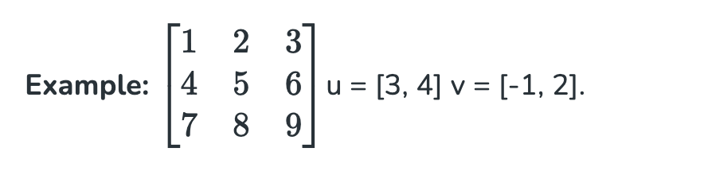

A matrix is a rectangular array of numbers arranged in rows and columns.

**Notation:** an m×n matrix A has m rows and n columns and entries 𝑎𝑖𝑗 (row i, column j):

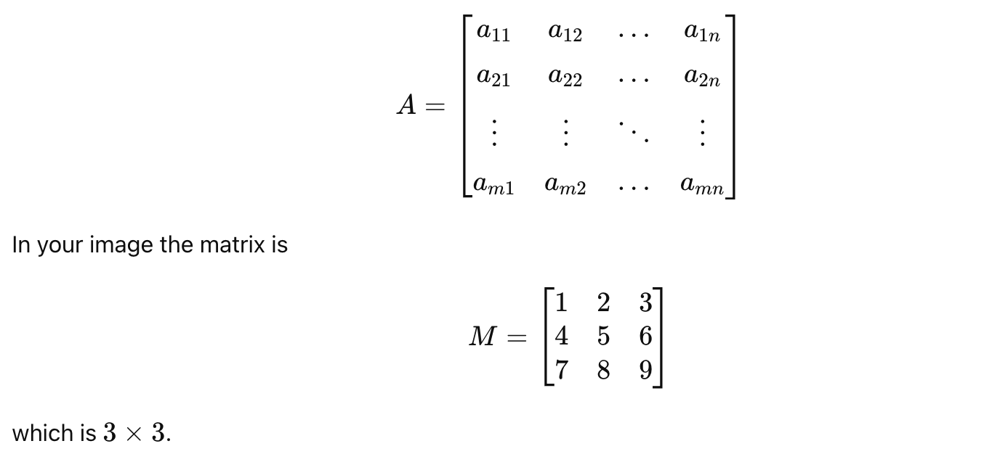

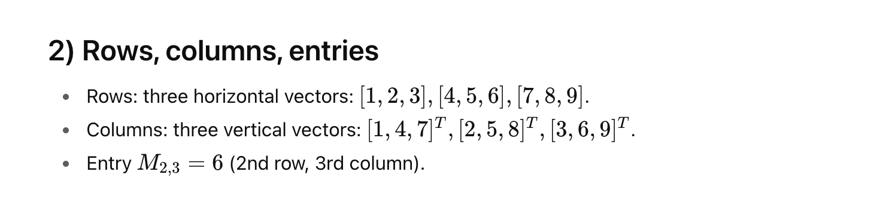

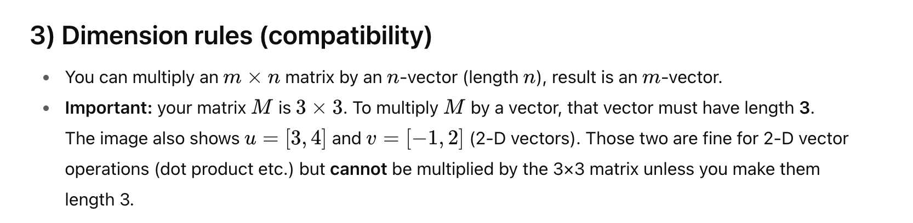

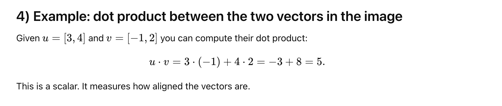

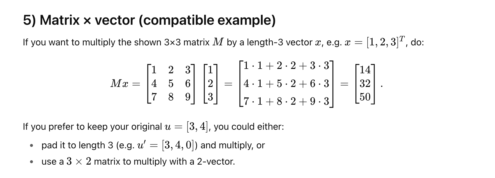

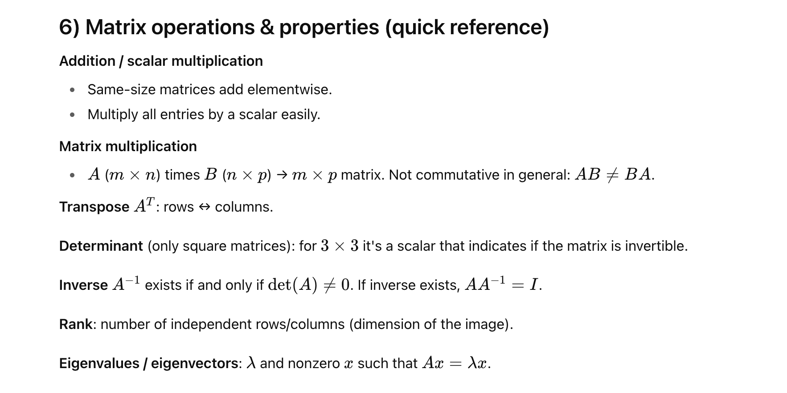

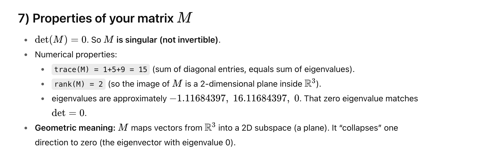

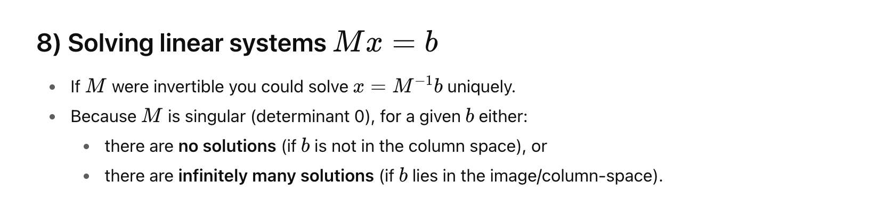

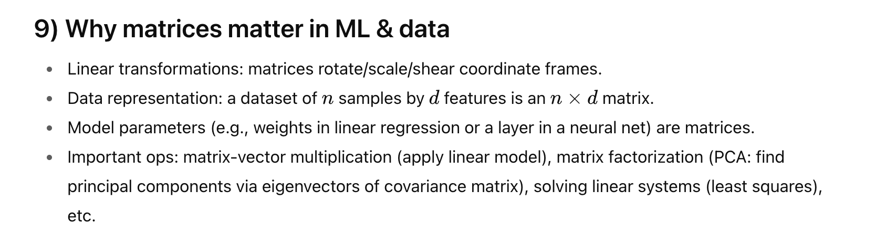

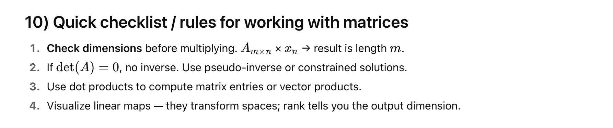

<h3 style="color:blue;">3. Scalars</h3>

Scalars are single numerical values, without direction, magnitude only. Scalars are just single numbers that can multiply vectors or matrices. In machine learning, they’re used to adjust things like the weights in a model or the learning rate during training

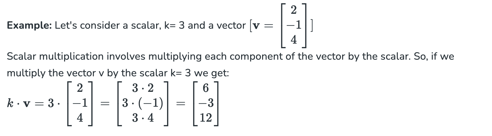

<h3 style="color:blue;">Operations in Linear Algebra</h3>

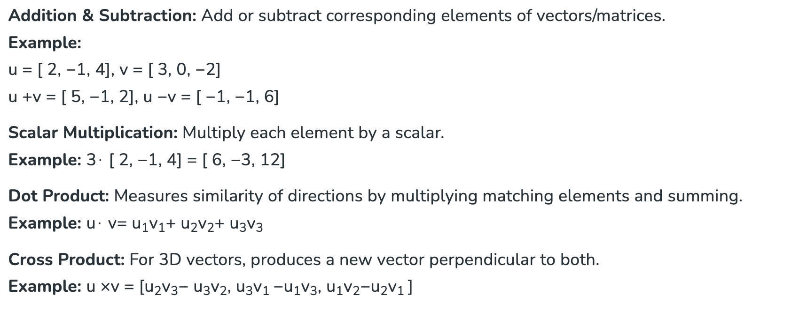

<h3 style="color:blue;">Linear Transformations</h3>

Linear transformations are basic operations in linear algebra that change vectors and matrices while keeping important properties like straight lines and proportionality. In machine learning, they are key for tasks like preparing data, creating features and training models. This section covers the definition, types and uses of linear transformations.

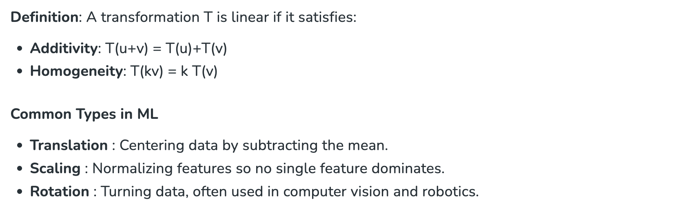

<h3 style="color:blue;">Matrix Operations</h3>

Matrix operations are central to linear algebra and widely used in machine learning for data handling, transformations and model training. The most common ones are:

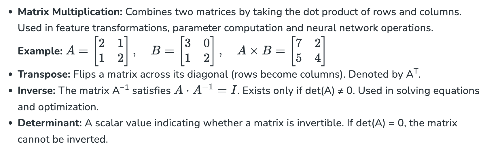

<h3 style="color:blue;">Eigenvalues and Eigenvectors</h3>

Eigenvalues and eigenvectors describe how matrices transform space, making them fundamental in many ML algorithms.

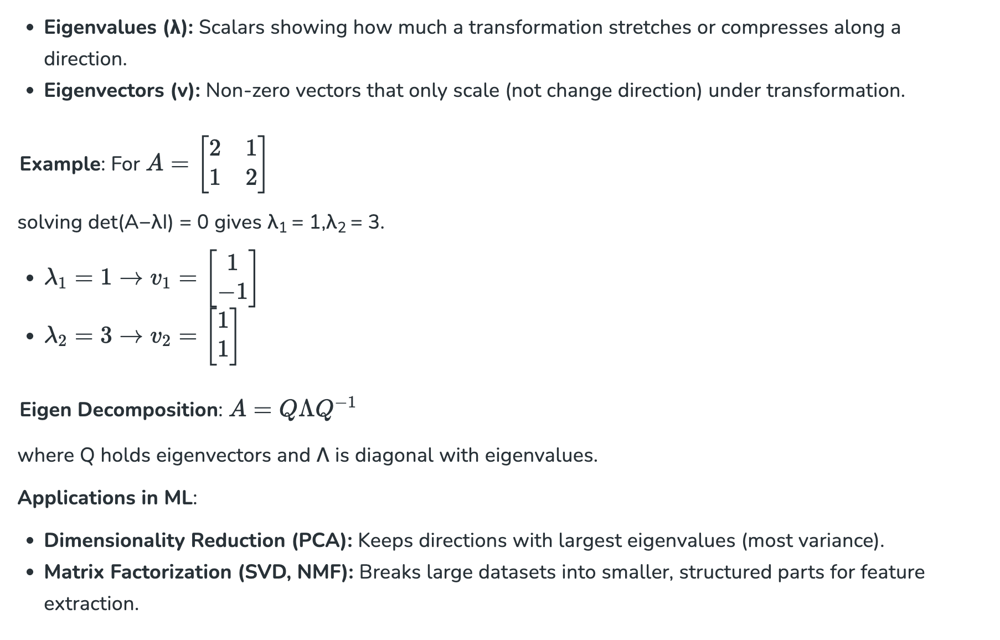

<h3 style="color:blue;">Solving Linear Systems of equations</h3>

Linear systems are common in machine learning for parameter estimation and optimization. Key methods include:

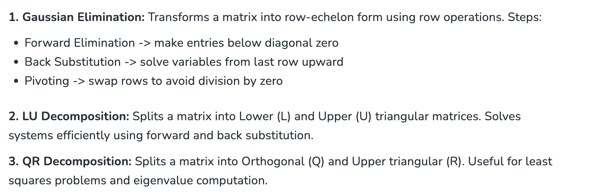

<h3 style="color:blue;">Applications of Linear Algebra in Machine Learning</h3>

Linear algebra powers many ML algorithms by enabling data manipulation, model representation and optimization. Key applications include:

- **PCA (Principal Component Analysis):** Reduces dimensionality by computing covariance, eigenvalues/eigenvectors and projecting data onto principal components.

- **SVD (Singular Value Decomposition):** Factorizes a matrix into A = UΣVT, used for dimensionality reduction, compression and noise filtering.

- **Linear Regression:** Models relationships via matrix form Y = Xβ+ ϵ, solved using the normal equation XTXβ = XTY.

- **SVM (Support Vector Machines):** Uses the kernel trick and optimization to find decision boundaries for classification and regression.

- **Neural Networks:** Depend on matrix multiplications, gradient descent and weight initialization for training deep models.
