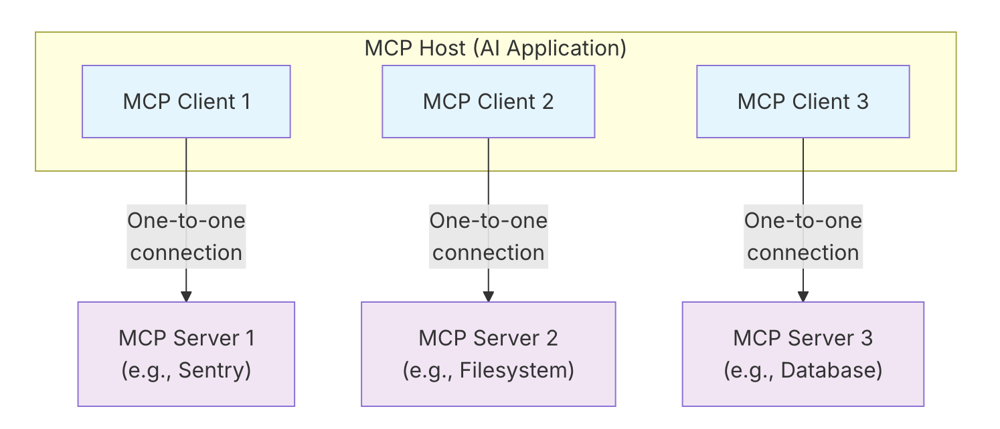
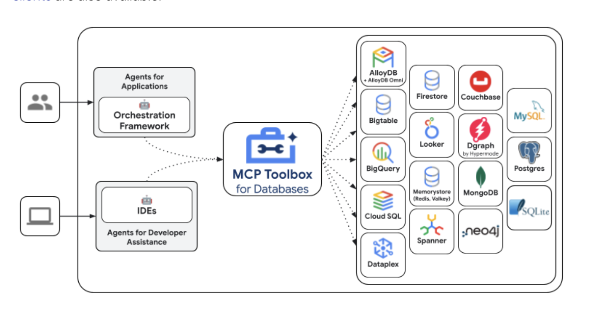

<h2 style="color:red;">✅ Model Context Protocol (MCP)</h2>

<h3 style="color:blue;">📌 What is Model Context Protocol (MCP)?</h3>

MCP is an open protocol that standardizes how applications provide context to large language models (LLMs).

Think of MCP like a USB-C port for AI applications. Just as USB-C provides a standardized way to connect your devices to various peripherals and accessories, MCP provides a standardized way to connect AI models to different data sources and tools. MCP enables you to build agents and complex workflows on top of LLMs and connects your models with the world.

<h3 style="color:blue;">📌 MCP provides:</h3>

- **A growing list of pre-built integrations** that your LLM can directly plug into

- **A standardized way** to build custom integrations for AI applications

- **An open protocol** that everyone is free to implement and use

- **The flexibility to change** between different apps and take your context with you


<h3 style="color:blue;">📌 Concepts of MCP:</h3>

MCP follows a client-server architecture where an MCP host — an AI application.

Client establishes connections to one or more MCP servers.

The MCP host accomplishes this by creating one MCP client for each MCP server. Each MCP client maintains a dedicated one-to-one connection with its corresponding MCP server.

The key participants in the MCP architecture are:

1. **MCP Host:** The AI application that coordinates and manages one or multiple MCP clients

2. **MCP Client:** A component that maintains a connection to an MCP server and obtains context from an MCP server for the MCP host to use

3. **MCP Server:** A program that provides context to MCP clients


**For example:** Visual Studio Code acts as an MCP host. When Visual Studio Code establishes a connection to an MCP server, such as the **Sentry MCP server**, the Visual Studio Code runtime instantiates an MCP client object that maintains the connection to the Sentry MCP server. When Visual Studio Code subsequently connects to another MCP server, such as the **local filesystem server**, the Visual Studio Code runtime instantiates an additional MCP client object to maintain this connection, hence maintaining a one-to-one relationship of MCP clients to MCP servers.




<h3 style="color:blue;">📌 MCP consists of two layers:</h3>

- **Data layer:** Defines the JSON-RPC based protocol for client-server communication, including lifecycle management, and core primitives, such as tools, resources, prompts and notifications.

- **Transport layer:** Defines the communication mechanisms and channels that enable data exchange between clients and servers, including transport-specific connection establishment, message framing, and authorization.


Conceptually the data layer is the inner layer, while the transport layer is the outer layer.


<h3 style="color:blue;">📌 Data layer:</h3>

The data layer implements a JSON-RPC 2.0 based exchange protocol that defines the message structure and semantics. This layer includes:

- **Lifecycle management:** Handles connection initialization, capability negotiation, and connection termination between clients and servers

- **Server features:** Enables servers to provide core functionality including tools for AI actions, resources for context data, and prompts for interaction templates from and to the client

- **Client features:** Enables servers to ask the client to sample from the host LLM, elicit input from the user, and log messages to the client

- **Utility features:** Supports additional capabilities like notifications for real-time updates and progress tracking for long-running operations


<h3 style="color:blue;">📌 Transport layer:</h3>

The transport layer manages communication channels and authentication between clients and servers. It handles connection establishment, message framing, and secure communication between MCP participants.


MCP supports two transport mechanisms:

- **Stdio transport:** Uses standard input/output streams for direct process communication between local processes on the same machine, providing optimal performance with no network overhead.

- **Streamable HTTP transport:** Uses HTTP POST for client-to-server messages with optional Server-Sent Events for streaming capabilities. This transport enables remote server communication and supports standard HTTP authentication methods including bearer tokens, API keys, and custom headers. MCP recommends using OAuth to obtain authentication tokens.


The transport layer abstracts communication details from the protocol layer, enabling the same JSON-RPC 2.0 message format across all transport mechanisms.

<h3 style="color:blue;">📌 Primitives:</h3>

MCP primitives are the most important concept within MCP. They define what clients and servers can offer each other. These primitives specify the types of contextual information that can be shared with AI applications and the range of actions that can be performed.

MCP defines three core primitives that servers can expose:

- **Tools:** Executable functions that AI applications can invoke to perform actions (e.g., file operations, API calls, database queries)

- **Resources:** Data sources that provide contextual information to AI applications (e.g., file contents, database records, API responses)

- **Prompts:** Reusable templates that help structure interactions with language models (e.g., system prompts, few-shot examples)

Each primitive type has associated methods for discovery ```(*/list)```, retrieval ```(*/get)```, and in some cases, execution ```(tools/call)```. MCP clients will use the ```*/list``` methods to discover available primitives. For example, a client can first list all available tools ```(tools/list)``` and then execute them. This design allows listings to be dynamic.


MCP also defines primitives that clients can expose. These primitives allow MCP server authors to build richer interactions.

- **Sampling:** Allows servers to request language model completions from the client’s AI application. This is useful when servers’ authors want access to a language model, but want to stay model independent and not include a language model SDK in their MCP server. They can use the ```sampling/complete``` method to request a language model completion from the client’s AI application.

- **Elicitation:** Allows servers to request additional information from users. This is useful when servers’ authors want to get more information from the user, or ask for confirmation of an action. They can use the ```elicitation/request``` method to request additional information from the user.

- **Logging:** Enables servers to send log messages to clients for debugging and monitoring purposes.


<h3 style="color:blue;">📌 Connect to Remote MCP Servers:</h3>

Remote MCP servers extend AI applications’ capabilities beyond your local environment, providing access to internet-hosted tools, services, and data sources. By connecting to remote MCP servers, you transform AI assistants from helpful tools into informed teammates capable of handling complex, multi-step projects with real-time access to external resources.


Remote MCP servers function similarly to local MCP servers but are hosted on the internet rather than your local machine. They expose tools, prompts, and resources that Claude can use to perform tasks on your behalf. These servers can integrate with various services such as project management tools, documentation systems, code repositories, and any other API-enabled service.


The key advantage of remote MCP servers is their accessibility. Unlike local servers that require installation and configuration on each device, remote servers are available from any MCP client with an internet connection. This makes them ideal for web-based AI applications, integrations that emphasize ease-of-use and services that require server-side processing or authentication.

<h3 style="color:blue;">📌 What are Custom Connectors?:</h3>

Custom Connectors serve as the bridge between Claude and remote MCP servers. They allow you to connect Claude directly to the tools and data sources that matter most to your workflows, enabling Claude to operate within your favorite software and draw insights from the complete context of your external tools.

With Custom Connectors, you can:

- **Connect Claude to existing remote MCP servers** provided by third-party developers

- **Build your own remote MCP servers to connect with any tool**


<h3 style="color:blue;">📌 Best Practices for Using Remote MCP Servers:</h3>

When working with remote MCP servers, consider these recommendations to ensure a secure and efficient experience:

**Security considerations:** Always verify the authenticity of remote MCP servers before connecting. Only connect to servers from trusted sources, and review the permissions requested during authentication. Be cautious about granting access to sensitive data or systems.

**Managing multiple connectors:** You can connect to multiple remote MCP servers simultaneously. Organize your connectors by purpose or project to maintain clarity. Regularly review and remove connectors you no longer use to keep your workspace organized and secure.


<h3 style="color:blue;">📌 Build an MCP Server:</h3>

**Core MCP Concepts**

MCP servers can provide three main types of capabilities:

1. **Resources:** File-like data that can be read by clients (like API responses or file contents)

2. **Tools:** Functions that can be called by the LLM (with user approval)

3. **Prompts:** Pre-written templates that help users accomplish specific tasks

**System requirements**

- Python 3.10 or higher installed.

- You must use the Python MCP SDK 1.2.0 or higher.


```
# Create a new directory for our project

uv init weather
cd weather

# Create virtual environment and activate it

uv venv
source .venv/bin/activate

# Install dependencies

uv add "mcp[cli]" httpx

# Create  server file

touch weather.py
```


<h3 style="color:blue;">📌 Building your server:</h3>

**Importing packages and setting up the instance**

```weather.py```

```
from typing import Any
import httpx
from mcp.server.fastmcp import FastMCP

# Initialize FastMCP server
mcp = FastMCP("weather")

# Constants
NWS_API_BASE = "https://api.weather.gov"
USER_AGENT = "weather-app/1.0"
```

The FastMCP class uses Python type hints and docstrings to automatically generate tool definitions, making it easy to create and maintain MCP tools.

**Helper functions**

Next, let’s add our helper functions for querying and formatting the data from the National Weather Service API:


```
async def make_nws_request(url: str) -> dict[str, Any] | None:
    """Make a request to the NWS API with proper error handling."""
    headers = {
        "User-Agent": USER_AGENT,
        "Accept": "application/geo+json"
    }
    async with httpx.AsyncClient() as client:
        try:
            response = await client.get(url, headers=headers, timeout=30.0)
            response.raise_for_status()
            return response.json()
        except Exception:
            return None

def format_alert(feature: dict) -> str:
    """Format an alert feature into a readable string."""
    props = feature["properties"]
    return f"""
Event: {props.get('event', 'Unknown')}
Area: {props.get('areaDesc', 'Unknown')}
Severity: {props.get('severity', 'Unknown')}
Description: {props.get('description', 'No description available')}
Instructions: {props.get('instruction', 'No specific instructions provided')}
"""
```

**Implementing tool execution**

The tool execution handler is responsible for actually executing the logic of each tool.

```
@mcp.tool()
async def get_alerts(state: str) -> str:
    """Get weather alerts for a US state.

    Args:
        state: Two-letter US state code (e.g. CA, NY)
    """
    url = f"{NWS_API_BASE}/alerts/active/area/{state}"
    data = await make_nws_request(url)

    if not data or "features" not in data:
        return "Unable to fetch alerts or no alerts found."

    if not data["features"]:
        return "No active alerts for this state."

    alerts = [format_alert(feature) for feature in data["features"]]
    return "\n---\n".join(alerts)

@mcp.tool()
async def get_forecast(latitude: float, longitude: float) -> str:
    """Get weather forecast for a location.

    Args:
        latitude: Latitude of the location
        longitude: Longitude of the location
    """
    # First get the forecast grid endpoint
    points_url = f"{NWS_API_BASE}/points/{latitude},{longitude}"
    points_data = await make_nws_request(points_url)

    if not points_data:
        return "Unable to fetch forecast data for this location."

    # Get the forecast URL from the points response
    forecast_url = points_data["properties"]["forecast"]
    forecast_data = await make_nws_request(forecast_url)

    if not forecast_data:
        return "Unable to fetch detailed forecast."

    # Format the periods into a readable forecast
    periods = forecast_data["properties"]["periods"]
    forecasts = []
    for period in periods[:5]:  # Only show next 5 periods
        forecast = f"""
{period['name']}:
Temperature: {period['temperature']}°{period['temperatureUnit']}
Wind: {period['windSpeed']} {period['windDirection']}
Forecast: {period['detailedForecast']}
"""
        forecasts.append(forecast)

    return "\n---\n".join(forecasts)
```

**Running the server**

Finally, let’s initialize and run the server:

```
if __name__ == "__main__":
    # Initialize and run the server
    mcp.run(transport='stdio')
```


Your server is complete! Run ```uv run weather.py``` to start the MCP server, which will listen for messages from MCP hosts.


Let’s now test your server from an existing MCP host, Claude for Desktop.


<h3 style="color:blue;">📌 Testing your server with Claude for Desktop:</h3>

First, make sure you have Claude for Desktop installed.

We’ll need to configure Claude for Desktop for whichever MCP servers you want to use. To do this, open your Claude for Desktop App configuration at ```~/Library/Application Support/Claude/claude_desktop_config.json``` in a text editor. Make sure to create the file if it doesn’t exist.

You’ll then add your servers in the ```mcpServers``` key. The MCP UI elements will only show up in Claude for Desktop if at least one server is properly configured.


```
{
  "mcpServers": {
    "weather": {
      "command": "uv",
      "args": [
        "--directory",
        "/ABSOLUTE/PATH/TO/PARENT/FOLDER/weather",
        "run",
        "weather.py"
      ]
    }
  }
}
```


<h3 style="color:blue;">📌 Building MCP with LLMs:</h3>

MCP development using LLMs such as Claude or any LLM


<h3 style="color:blue;">📌 Build an MCP Client:</h3>

How to build an LLM-powered chatbot client that connects to MCP servers.

**Setting Up Your Environment**

First, create a new Python project with uv

```
# Create project directory
uv init mcp-client
cd mcp-client

# Create virtual environment
uv venv

# Activate virtual environment
# On Windows:
.venv\Scripts\activate
# On Unix or macOS:
source .venv/bin/activate

# Install required packages
uv add mcp anthropic python-dotenv

# Remove boilerplate files
# On Windows:
del main.py
# On Unix or macOS:
rm main.py

# Create our main file
touch client.py
```

**Setting Up Your API Key**

You’ll need an Anthropic API key from the Anthropic Console.

Create a .env file to store it:

```
# Create .env file
touch .env
```

Add your key to the .env file:

```
ANTHROPIC_API_KEY=<your key here>
```

Add .env to your .gitignore:

```
echo ".env" >> .gitignore
```

**Creating the Client**

**Basic Client Structure**

First, let’s set up our imports and create the basic client class:

```
import asyncio
from typing import Optional
from contextlib import AsyncExitStack

from mcp import ClientSession, StdioServerParameters
from mcp.client.stdio import stdio_client

from anthropic import Anthropic
from dotenv import load_dotenv

load_dotenv()  # load environment variables from .env

class MCPClient:
    def __init__(self):
        # Initialize session and client objects
        self.session: Optional[ClientSession] = None
        self.exit_stack = AsyncExitStack()
        self.anthropic = Anthropic()
    # methods will go here
```

**Server Connection Management**

Next, we’ll implement the method to connect to an MCP server:

```
async def connect_to_server(self, server_script_path: str):
    """Connect to an MCP server

    Args:
        server_script_path: Path to the server script (.py or .js)
    """
    is_python = server_script_path.endswith('.py')
    is_js = server_script_path.endswith('.js')
    if not (is_python or is_js):
        raise ValueError("Server script must be a .py or .js file")

    command = "python" if is_python else "node"
    server_params = StdioServerParameters(
        command=command,
        args=[server_script_path],
        env=None
    )

    stdio_transport = await self.exit_stack.enter_async_context(stdio_client(server_params))
    self.stdio, self.write = stdio_transport
    self.session = await self.exit_stack.enter_async_context(ClientSession(self.stdio, self.write))

    await self.session.initialize()

    # List available tools
    response = await self.session.list_tools()
    tools = response.tools
    print("\nConnected to server with tools:", [tool.name for tool in tools])
```

**Query Processing Logic**

Now let’s add the core functionality for processing queries and handling tool calls:

```
async def process_query(self, query: str) -> str:
    """Process a query using Claude and available tools"""
    messages = [
        {
            "role": "user",
            "content": query
        }
    ]

    response = await self.session.list_tools()
    available_tools = [{
        "name": tool.name,
        "description": tool.description,
        "input_schema": tool.inputSchema
    } for tool in response.tools]

    # Initial Claude API call
    response = self.anthropic.messages.create(
        model="claude-3-5-sonnet-20241022",
        max_tokens=1000,
        messages=messages,
        tools=available_tools
    )

    # Process response and handle tool calls
    final_text = []

    assistant_message_content = []
    for content in response.content:
        if content.type == 'text':
            final_text.append(content.text)
            assistant_message_content.append(content)
        elif content.type == 'tool_use':
            tool_name = content.name
            tool_args = content.input

            # Execute tool call
            result = await self.session.call_tool(tool_name, tool_args)
            final_text.append(f"[Calling tool {tool_name} with args {tool_args}]")

            assistant_message_content.append(content)
            messages.append({
                "role": "assistant",
                "content": assistant_message_content
            })
            messages.append({
                "role": "user",
                "content": [
                    {
                        "type": "tool_result",
                        "tool_use_id": content.id,
                        "content": result.content
                    }
                ]
            })

            # Get next response from Claude
            response = self.anthropic.messages.create(
                model="claude-3-5-sonnet-20241022",
                max_tokens=1000,
                messages=messages,
                tools=available_tools
            )

            final_text.append(response.content[0].text)

    return "\n".join(final_text)
```

**Interactive Chat Interface**

Now we’ll add the chat loop and cleanup functionality:

```
async def chat_loop(self):
    """Run an interactive chat loop"""
    print("\nMCP Client Started!")
    print("Type your queries or 'quit' to exit.")

    while True:
        try:
            query = input("\nQuery: ").strip()

            if query.lower() == 'quit':
                break

            response = await self.process_query(query)
            print("\n" + response)

        except Exception as e:
            print(f"\nError: {str(e)}")

async def cleanup(self):
    """Clean up resources"""
    await self.exit_stack.aclose()
```

**Main Entry Point**

Finally, we’ll add the main execution logic:

```
async def main():
    if len(sys.argv) < 2:
        print("Usage: python client.py <path_to_server_script>")
        sys.exit(1)

    client = MCPClient()
    try:
        await client.connect_to_server(sys.argv[1])
        await client.chat_loop()
    finally:
        await client.cleanup()

if __name__ == "__main__":
    import sys
    asyncio.run(main())
```

**Running the Client**

To run your client with any MCP server:

```
uv run client.py path/to/server.py # python server
uv run client.py path/to/build/index.js # node server
```

<h3 style="color:blue;">📌 Inspector:</h3>

MCP Inspector for testing and debugging Model Context Protocol servers

The MCP Inspector is an interactive developer tool for testing and debugging MCP servers.


<h3 style="color:blue;">📌 MCP Toolbox for Databases - GCP:</h3>

MCP Toolbox for Databases is an open source MCP server that helps you build Gen AI tools so that your agents can access data in your database. Google’s Agent Development Kit (ADK) has built in support for The MCP Toolbox for Databases.



