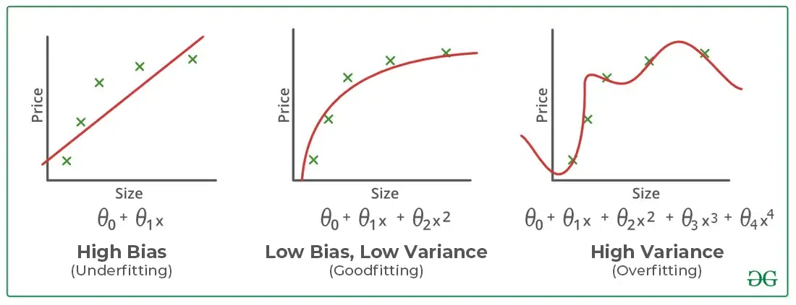

<h2 style="color:red;">✅ What is Artificial Intelligence (AI)?</h2>
Artificial Intelligence (AI) is the field of computer science that focuses on creating machines or software that can simulate human intelligence.

<h3 style="color:blue;">📌 Key aspects of AI include:</h3>

- **Mimicking human intelligence:** The goal of AI is to enable systems to "think" and "act" like humans, or at least to perform tasks in a way that suggests intelligence.

- **Learning from data:** A core part of modern AI is machine learning, where systems are trained on vast amounts of data to identify patterns and make predictions or decisions without being explicitly programmed for every scenario.

- **Problem-solving:** AI systems are designed to solve complex problems by systematically searching through possible actions to reach a desired goal.

<h3 style="color:blue;">📌 AI is an umbrella term that encompasses various subfields, such as:</h3>

- **Machine Learning (ML):** The use of algorithms and data to enable systems to learn and improve over time.

- **Deep Learning:** A subset of machine learning that uses multi-layered neural networks inspired by the human brain.

- **Natural Language Processing (NLP):** The ability of computers to understand, interpret, and generate human language.

- **Computer Vision:** Enabling machines to "see" and interpret visual information from images and videos.

- **Generative AI:** Models that can create new, original content like text, images, or audio.

<h2 style="color:red;">✅ What is Machine learning (ML)?</h2>
Machine learning (ML) is a subfield of artificial intelligence that empowers computers to learn and improve from experience without being explicitly programmed for every possible scenario. Instead of following a rigid set of rules, ML algorithms are trained on vast amounts of data to identify patterns, make predictions, and generate insights.

<h3 style="color:blue;">📌 Core component of ML</h3>

<h3 style="color:blue;">📌 Core concepts of ML</h3>

- **Learning from Data:** The fundamental idea behind machine learning is that a system can be given a dataset and, through a process of statistical analysis and pattern recognition, it can learn the underlying relationships within that data. The more data it receives, the better it becomes at its task.

- **The Model:** The "brain" of a machine learning system is the model. This is the piece of software that has been trained on the data. For example, a model trained to predict house prices would have learned the mathematical relationship between factors like location, square footage, and the final sale price.

- **Trial and Error:** Machine learning often involves an iterative process. The model makes a prediction, its accuracy is evaluated, and then the model is adjusted to reduce its errors. This cycle of "evaluate and optimize" is how the system continuously refines its performance.

<h3 style="color:blue;">📌 Types of Machine Learning</h3>

There are three main types of machine learning.

1. **Supervised Learning:** This is the most common type. The algorithm is trained on a "labeled" dataset, meaning the data includes both the input and the correct output. The model learns to map the input to the output, and once trained, it can predict the output for new, unseen data.

2. **Unsupervised Learning:** In this case, the algorithm is given "unlabeled" data—it has no prior knowledge of the correct outputs. The goal is for the algorithm to discover hidden patterns and structures on its own. 

3. **Reinforcement Learning:** Focuses on training an agent to make optimal decisions through trial and error using rewards.

<h3 style="color:blue;">📌 Underfitting and Overfitting</h3>

Machine learning models aim to perform well on both training data and new, unseen data and is considered "good" if:

1. It learns patterns effectively from the training data.

2. It generalizes well to new, unseen data.

3. It avoids memorizing the training data (overfitting) or failing to capture relevant patterns (underfitting).

To evaluate how well a model learns and generalizes, we monitor its performance on both the training data and a separate validation or test dataset which is often measured by its **accuracy** or **prediction errors**.

However, achieving this balance **can be challenging**.

Two common issues that affect a model's performance and generalization ability are **overfitting** and **underfitting**.

These problems are major contributors to poor performance in machine learning models. Let's us understand what they are and how they contribute to ML models.

<h3 style="color:blue;">📌 Bias and Variance in Machine Learning</h3>

**Bias and variance** are two key sources of error in machine learning models that directly impact their performance and generalization ability.

**Bias:** is the error that happens when a machine learning model is too simple and doesn't learn enough details from the data. It's like assuming all birds can only be small and fly, so the model fails to recognize big birds like ostriches or penguins that can't fly and get biased with predictions.

- These assumptions make the model easier to train but may prevent it from capturing the underlying complexities of the data.

- High bias typically leads to **underfitting**, where the model performs poorly on both training and testing data because it fails to learn enough from the data.

- **Example:** A linear regression model applied to a dataset with a non-linear relationship.

**Variance:** Error that happens when a machine learning model learns too much from the data, including random noise.

 - A high-variance model learns not only the patterns but also the noise in the training data, which leads to poor generalization on unseen data.

 - High variance typically leads to **overfitting**, where the model performs well on training data but poorly on testing data.

<h3 style="color:blue;">📌 Overfitting and Underfitting: The Core Issues</h3>

**1. Overfitting in Machine Learning**

Overfitting happens when a model learns too much from the training data, including details that don’t matter (like noise or outliers).

- For example, imagine fitting a very complicated curve to a set of points. The curve will go through every point, but it won’t represent the actual pattern.

- As a result, the model works great on training data but fails when tested on new data.

Overfitting models are like students who memorize answers instead of understanding the topic. They do well in practice tests (training) but struggle in real exams (testing).

**Reasons for Overfitting:**

- High variance and low bias.

- The model is too complex.

- The size of the training data.

**2. Underfitting in Machine Learning**

Underfitting is the opposite of overfitting. It happens when a model is too simple to capture what’s going on in the data.

- For example, imagine drawing a straight line to fit points that actually follow a curve. The line misses most of the pattern.

- In this case, the model doesn’t work well on either the training or testing data.

Underfitting models are like students who don’t study enough. They don’t do well in practice tests or real exams. **Note: The underfitting model has High bias and low variance**.

**Reasons for Underfitting:**

1. The model is too simple, So it may be not capable to represent the complexities in the data.

2. The input features which is used to train the model is not the adequate representations of underlying factors influencing the target variable.

3. The size of the training dataset used is not enough.

4. Excessive regularization are used to prevent the overfitting, which constraint the model to capture the data well.

5. Features are not scaled.

Let's visually understand the concept of underfitting, proper fitting, and overfitting.

- **Underfitting :** Straight line trying to fit a curved dataset but cannot capture the data's patterns, leading to poor performance on both training and test sets.

- **Overfitting:** A squiggly curve passing through all training points, failing to generalize performing well on training data but poorly on test data.

- **Appropriate Fitting:** Curve that follows the data trend without overcomplicating to capture the true patterns in the data.

<h3 style="color:blue;">📌 Balance Between Bias and Variance</h3>

The relationship between bias and variance is often referred to as the bias-variance tradeoff, which highlights the need for balance:

- Increasing model complexity reduces bias but increases variance (risk of overfitting).

- Simplifying the model reduces variance but increases bias (risk of underfitting).

The goal is to find an optimal balance where both bias and variance are minimized, resulting in good generalization performance.

Imagine you're trying to predict the price of houses based on their size, and you decide to draw a line or curve that best fits the data points on a graph. How well this line captures the trend in the data depends on the complexity of the model you use.

- When a model is too simple, like fitting a straight line to curved data, it has **high bias** and fails to capture the true relationship, leading to **underfitting**. For example, a linear model cannot represent a non-linear increase in house prices with size.

- However, if the model becomes too complex, like a fourth-degree polynomial that adjusts to every point, it develops **high variance**, overfits the training data, and struggles to generalize to new data. This is overfitting, where the model performs well on training but poorly on testing.

- An ideal model strikes a balance with **low bias and low variance**, capturing the overall pattern without overreacting to noise. For instance, a smooth second-degree polynomial fits the data well without being overly complex.

<h3 style="color:blue;">📌 How to Address Overfitting and Underfitting?</h3>

| **Underfitting** – Techniques to Reduce | **Overfitting** – Techniques to Reduce |
|------------------------------------------|------------------------------------------|
| ✅ Increase model complexity (e.g., deeper trees, more layers). | ✅ Improve the quality of training data to focus on meaningful patterns. |
| ✅ Increase the number of features, perform feature engineering. | ✅ Increase the training data to improve generalization. |
| ✅ Remove noise from the data. | ✅ Reduce model complexity (e.g., prune trees, reduce layers). |
| ✅ Increase the number of epochs or training duration. | ✅ Use early stopping – stop training when validation loss starts increasing. |
|                                          | ✅ Apply Ridge (L2) or Lasso (L1) regularization. |
|                                          | ✅ Use dropout in neural networks. |

