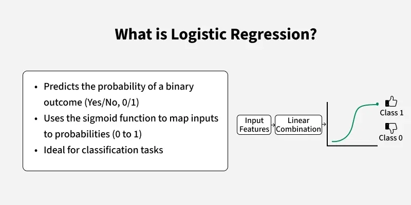
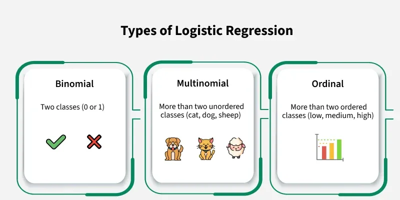
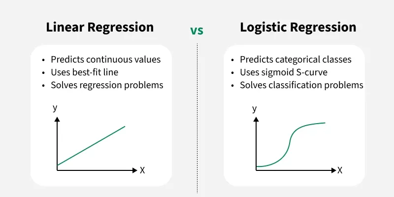
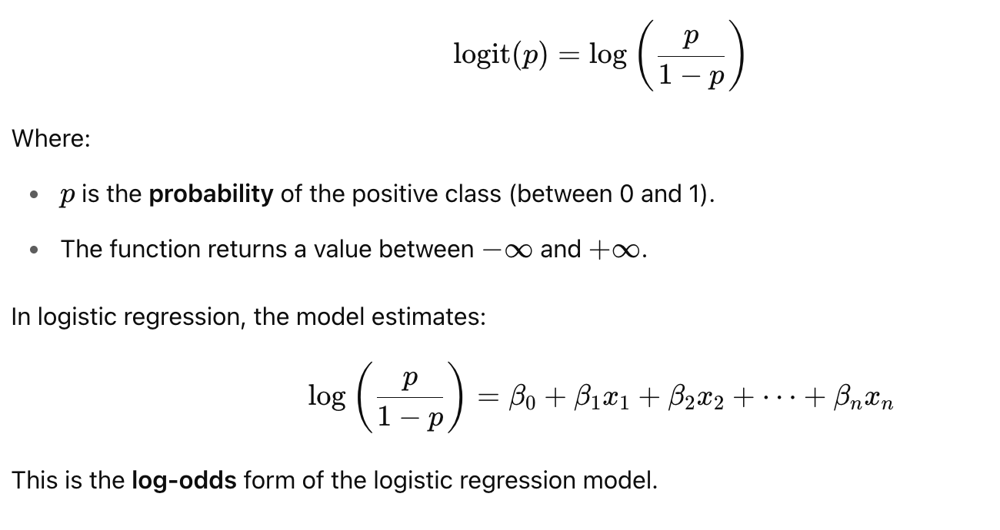
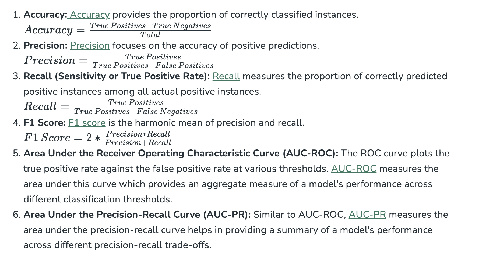
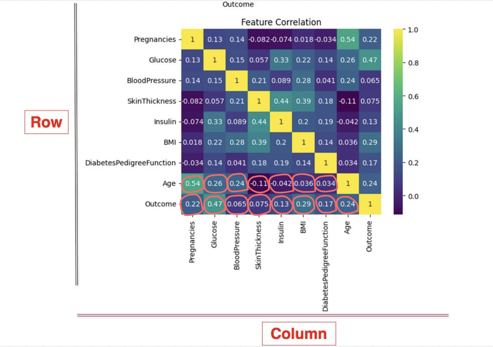
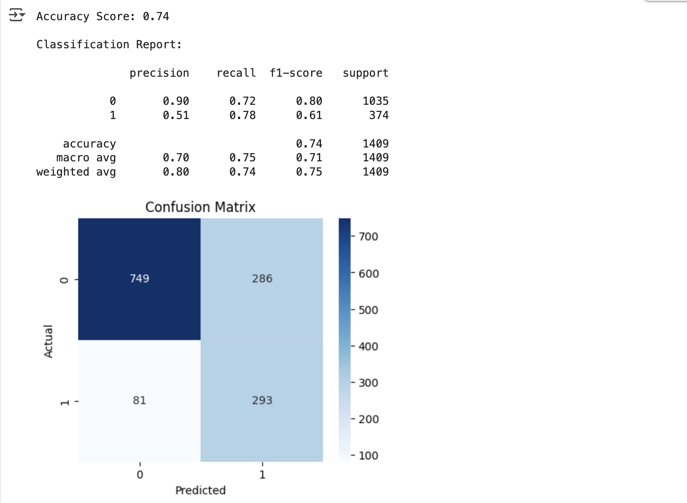
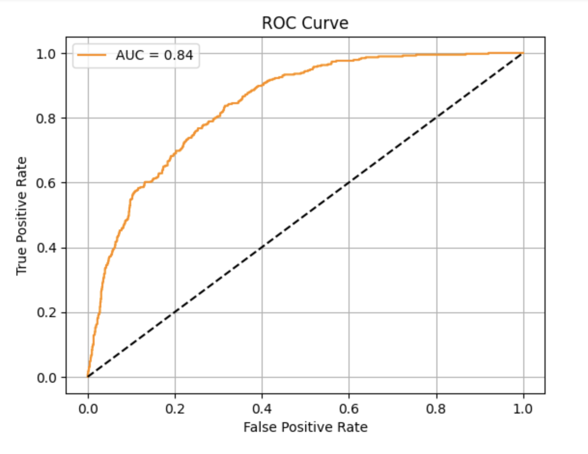

<h2 style="color:red;">✅ What is Classification in Supervised Learning?</h2>

**Classification** is a type of Supervised Learning where the model learns from labeled data to predict discrete categories or classes.

**Classification teaches a machine to sort things into categories. It learns by looking at examples with labels (like emails marked "spam" or "not spam"). After learning, it can decide which category new items belong to, like identifying if a new email is spam or not.**

For example a classification model might be trained on dataset of images labeled as either **dogs** or **cats** and it can be used to predict the class of new and unseen images as dogs or cats based on their features such as color, texture and shape.

<h3 style="color:blue;">📌 Types of Classification</h3>

When we talk about classification in machine learning, we’re talking about the process of sorting data into categories based on specific features or characteristics. There are different types of classification problems depending on how many categories (or classes) we are working with and how they are organized. There are two main classification types in machine learning:

1. **Binary Classification**

This is the simplest kind of classification. In binary classification, the goal is to sort the data into **two distinct categories**.

Think of it like a simple choice between two options. Imagine a system that sorts emails into either spam or not spam. It works by looking at different features of the email like certain keywords or sender details, and decides whether it’s spam or not. It only chooses between these two options.

2. **Multiclass Classification**

Here, instead of just two categories, the data needs to be sorted into **more than two categories**. The model picks the one that best matches the input. Think of an image recognition system that sorts pictures of animals into categories like **cat, dog, and bird**.

Basically, machine looks at the features in the image (like shape, color, or texture) and chooses which animal the picture is most likely to be based on the training it received.

<h3 style="color:blue;">📌 Examples of Machine Learning Classification in Real Life</h3>

- **Email spam filtering**

- **Credit risk assessment:** Algorithms predict whether a loan applicant is likely to default by analyzing factors such as credit score, income, and loan history. This helps banks make informed lending decisions and minimize financial risk.

- **Medical diagnosis:** Machine learning models classify whether a patient has a certain condition (e.g., cancer or diabetes) based on medical data such as test results, symptoms, and patient history. This aids doctors in making quicker, more accurate diagnoses, improving patient care.

- **Image classification:** Applied in fields such as facial recognition, autonomous driving, and medical imaging.

- **Sentiment analysis:** Determining whether the sentiment of a piece of text is positive, negative, or neutral. Businesses use this to understand customer opinions, helping to improve products and services.

- **Fraud detection:** Algorithms detect fraudulent activities by analyzing transaction patterns and identifying anomalies crucial in protecting against credit card fraud and other financial crimes.

- **Recommendation systems:** Used to recommend products or content based on past user behavior, such as suggesting movies on Netflix or products on Amazon. This personalization boosts user satisfaction and sales for businesses.

<h3 style="color:blue;">📌 Key characteristics of Classification Models</h3>

1. **Class Separation:** Classification relies on distinguishing between distinct classes. The goal is to learn a model that can separate or categorize data points into predefined classes based on their features.

2. **Decision Boundaries:** The model draws decision boundaries in the feature space to differentiate between classes. These boundaries can be linear or non-linear.

3. **Sensitivity to Data Quality:** Classification models are sensitive to the quality and quantity of the training data. Well-labeled, representative data ensures better performance, while noisy or biased data can lead to poor predictions.

4. **Handling Imbalanced Data:** Classification problems may face challenges when one class is underrepresented. Special techniques like resampling or weighting are used to handle class imbalances.

5. **Interpretability:** Some classification algorithms, such as Decision Trees, offer higher interpretability, meaning it's easier to understand why a model made a particular prediction.

<h3 style="color:blue;">📌 Classification Algorithms</h3>

Now, for implementation of any classification model it is essential to understand **Logistic Regression**, which is one of the most fundamental and widely used algorithms in machine learning for classification tasks. There are various types of **classifiers algorithms**. Some of them are : 

**Linear Classifiers:** Linear classifier models create a linear decision boundary between classes. They are simple and computationally efficient. Some of the linear classification models are as follows: 

1. **Logistic Regression**

2. **Support Vector Machines having kernel = 'linear'**

3. **Single-layer Perceptron**

4. **Stochastic Gradient Descent (SGD) Classifier**


**Non-linear Classifiers:** Non-linear models create a non-linear decision boundary between classes. They can capture more complex relationships between input features and target variable. Some of the non-linear classification models are as follows:


1. **K-Nearest Neighbours**

2. **Kernel SVM**

3. **Naive Bayes**

4. **Decision Tree Classification**

5. **Random Forests**

6. **AdaBoost**

3. **Bagging Classifier**

4. **Voting Classifier**

5. **Extra Trees Classifier**

6. **Multi-layer Artificial Neural Networks**


<h3 style="color:blue;">📌 Logistic Regression in Machine Learning</h3>

Logistic Regression is a supervised machine learning algorithm used for classification problems.
Unlike linear regression which predicts continuous values it predicts the probability that an input belongs to a specific class.

It is used for binary classification where the output can be one of two possible categories such as Yes/No, True/False or 0/1. It uses **sigmoid** function to convert inputs into a probability value between 0 and 1. 







<h3 style="color:blue;">📌 Types of Logistic Regression</h3>

Logistic regression can be classified into three main types based on the nature of the dependent variable:

1. **Binomial Logistic Regression:** This type is used when the dependent variable has only two possible categories. Examples include Yes/No, Pass/Fail or 0/1. It is the most common form of logistic regression and is used for binary classification problems.

2. **Multinomial Logistic Regression:** This is used when the dependent variable has three or more possible categories that are not ordered. For example, classifying animals into categories like "cat," "dog" or "sheep." It extends the binary logistic regression to handle multiple classes.

3. **Ordinal Logistic Regression:** This type applies when the dependent variable has three or more categories with a natural order or ranking. Examples include ratings like "low," "medium" and "high." It takes the order of the categories into account when modeling.

<h3 style="color:blue;">📌 Assumptions of Logistic Regression</h3>

Understanding the assumptions behind logistic regression is important to ensure the model is applied correctly, main assumptions are:

1. **Independent observations:** Each data point is assumed to be independent of the others means there should be no correlation or dependence between the input samples.

2. **Binary dependent variables:** It takes the assumption that the dependent variable must be binary, means it can take only two values. For more than two categories **SoftMax functions** are used.

3. **Linearity relationship between independent variables and log odds:** The model assumes a linear relationship between the independent variables and the log odds of the dependent variable which means the predictors affect the log odds in a linear way.

4. **No outliers:** The dataset should not contain extreme outliers as they can distort the estimation of the logistic regression coefficients.

5. **Large sample size:** It requires a sufficiently large sample size to produce reliable and stable results.


<h3 style="color:blue;">📌 Understanding Sigmoid Function</h3>

1. The sigmoid function is a important part of logistic regression which is used to convert the raw output of the model into a probability value between 0 and 1.

2. This function takes any real number and maps it into the range 0 to 1 forming an "S" shaped curve called the sigmoid curve or logistic curve. Because probabilities must lie between 0 and 1, the sigmoid function is perfect for this purpose.

3. In logistic regression, we use a threshold value usually 0.5 to decide the class label.

    - If the sigmoid output is same or above the threshold, the input is classified as Class 1.

    - If it is below the threshold, the input is classified as Class 0.

<h3 style="color:blue;">📌 How does Logistic Regression work?</h3>

The logit function is commonly used in **Logistic Regression**, especially when working with binary classification problems. It maps probabilities (values between 0 and 1) to real numbers (−∞ to +∞). Here's a full explanation and example of how it works:

<h3 style="color:blue;">📌 What is the logit function?</h3>

The logit function is defined as:



**Logistic Function (Sigmoid)**

The inverse of the logit function is the sigmoid function:


<h3 style="color:blue;">📌 How to Evaluate Logistic Regression Model?</h3>



<h3 style="color:blue;">📌 Differences Between Linear and Logistic Regression?</h3>

| Feature                                   | Linear Regression                                           | Logistic Regression                                            |
|-------------------------------------------|-------------------------------------------------------------|----------------------------------------------------------------|
| Purpose                                   | Predict continuous dependent variable                       | Predict categorical dependent variable                         |
| Problem Type                              | Regression                                                   | Classification                                                 |
| Prediction Output                         | Continuous value (e.g., price, age)                          | Categorical value (e.g., 0 or 1, Yes or No)                    |
| Curve                                     | Best fit line                                                | S-curve (Sigmoid function)                                     |
| Estimation Method                         | Least Squares Estimation                                     | Maximum Likelihood Estimation                                  |
| Relationship Requirement                  | Requires linear relationship                                 | Does **not** require linear relationship                       |
| Collinearity                              | Can handle some collinearity                                | Should have little or no collinearity                          |
| Target Variable                           | Continuous                                                   | Categorical                                                    |


<h3 style="color:blue;">📌 Key Concepts</h3>

| Aspect        | Details                                                                    |
| ------------- | -------------------------------------------------------------------------- |
| **Objective** | Predict **class labels** (e.g., Yes/No, Spam/Not Spam, Disease/No Disease) |
| **Input**     | Features (X)                                                               |
| **Output**    | Categorical label (Y)                                                      |
| **Type**      | Supervised Learning                                                        |
| **Examples**  | Email spam detection, Disease prediction, Image recognition                |


<h3 style="color:blue;">📌 Real-time Example: Medical Diagnosis System</h3>

Imagine a hospital wants to predict whether a patient has **Diabetes** based on medical measurements.

**Sample Dataset**

| Glucose | Blood Pressure | BMI  | Age | Outcome |
| ------- | -------------- | ---- | --- | ------- |
| 148     | 72             | 33.6 | 50  | 1       |
| 85      | 66             | 26.6 | 31  | 0       |


- **Input Features (X):** Glucose, Blood Pressure, BMI, Age

- **Target (Y):** Outcome → 1 (Has Diabetes), 0 (No Diabetes)


<h3 style="color:blue;">📌 Steps in Classification Project</h3>

1. **Data Collection**

Medical records, lab test results, etc.

2. **Data Preprocessing**

    - Handle missing values

    - Normalize/scale features

    - Encode categorical variables (if any)

3. **Exploratory Data Analysis (EDA)**

    - Visualize class balance, distributions, correlations.

4. **Feature Selection**

    - Use correlation or feature importance (from models).

5. **Model Building**

- Common models for classification:

    - **Logistic Regression**

    - **Decision Tree**

    - **Random Forest**

    - **Support Vector Machine (SVM)**

    - **K-Nearest Neighbors (KNN)**

    - **Naive Bayes**

    - **Neural Networks**

```
from sklearn.ensemble import RandomForestClassifier
model = RandomForestClassifier()
model.fit(X_train, y_train)
```


6. **Model Evaluation**

- Use classification metrics:

    - **Accuracy**
    
    - **Precision**

    - **Recall**

    - **F1 Score**

    - **Confusion Matrix**

    - **ROC AUC**

```
from sklearn.metrics import classification_report, confusion_matrix
print(confusion_matrix(y_test, y_pred))
print(classification_report(y_test, y_pred))
```

<h3 style="color:blue;">📌 Evaluation Example</h3>

| Predicted ↓ / Actual → | Positive | Negative |
| ---------------------- | -------- | -------- |
| Positive               | TP       | FP       |
| Negative               | FN       | TN       |


<h3 style="color:blue;">📌 Real-World Classification Use Cases</h3>

| Domain        | Use Case                    | Classes                    |
| ------------- | --------------------------- | -------------------------- |
| Finance       | Fraud Detection             | Fraud / Not Fraud          |
| HR/Recruiting | Resume Screening            | Suitable / Not Suitable    |
| Healthcare    | Disease Prediction          | Positive / Negative        |
| Retail        | Customer Churn              | Churn / Retain             |
| Security      | Intrusion Detection         | Attack / Normal            |
| Email         | Spam Filter                 | Spam / Not Spam            |
| Telecom       | Call Drop Reason Prediction | Technical / Customer-based |


<h3 style="color:blue;">📌 Tools/Libraries for Classification</h3>

- **Python:** ```scikit-learn, xgboost, lightgbm, catboost, tensorflow, pytorch```

- **Visualization:** ```matplotlib, seaborn, plotly```


<h2 style="color:red;">✅ Use Cases</h2>

<h3 style="color:blue;">📌 Predicting Diabetes - (Classification)</h3>


<h3 style="color:green;">1. Imports Library</h3>

```
import pandas as pd
import seaborn as sns
from sklearn.metrics import mean_squared_error, r2_score
import numpy as np
from sklearn.model_selection import train_test_split
from sklearn.ensemble import RandomForestClassifier
from sklearn.metrics import classification_report, confusion_matrix, accuracy_score
```


<h3 style="color:green;">2. Load Data</h3>

[Pima Indians Diabetes Database](https://www.kaggle.com/datasets/uciml/pima-indians-diabetes-database)

```
df = pd.read_csv('diabetes.csv')
df.head()
```

| Pregnancies | Glucose | BloodPressure | SkinThickness | Insulin | BMI  | DiabetesPedigreeFunction | Age | Outcome |
|-------------|---------|----------------|----------------|---------|------|---------------------------|-----|---------|
| 6           | 148     | 72             | 35             | 0       | 33.6 | 0.627                     | 50  | 1       |
| 1           | 85      | 66             | 29             | 0       | 26.6 | 0.351                     | 31  | 0       |
| 8           | 183     | 64             | 0              | 0       | 23.3 | 0.672                     | 32  | 1       |
| 1           | 89      | 66             | 23             | 94      | 28.1 | 0.167                     | 21  | 0       |
| 0           | 137     | 40             | 35             | 168     | 43.1 | 2.288                     | 33  | 1       |


<h3 style="color:green;">3. Data Preprocessing</h3>

<h3 style="color:green;">1. Handle Missing Data</h3>

 - **Check for NaN or null values**

```
print(df.isnull().sum())
```

| Column Name              | Missing Values |
| ------------------------ | -------------- |
| Pregnancies              | 0              |
| Glucose                  | 0              |
| BloodPressure            | 0              |
| SkinThickness            | 0              |
| Insulin                  | 0              |
| BMI                      | 0              |
| DiabetesPedigreeFunction | 0              |
| Age                      | 0              |
| Outcome                  | 0              |

- **Drop rows or columns with too many missing values**

- **Impute missing values:**

    - Mean/Median (numerical)

    - Mode (categorical)

    - Forward/Backward fill

    - Model-based imputation

- **Check & Remove Duplicate value**

    - Detect and remove duplicate rows 

```
print(df.duplicated().sum())
```

- **Handle Outliers**

- Identify outliers using:

    - IQR (Interquartile Range)

    - Z-score

    - Boxplot

- Remove or cap outliers

- **Data Type Correction**

- Ensure columns have correct data types:

    - e.g., convert ```object to int, datetime, or float```

    - Use ```pd.to_numeric() or pd.to_datetime()```

- **Normalize / Scale Values**

    - Standardize features (```StandardScaler, MinMaxScaler```)

    - Normalize data if using distance-based models (e.g., KNN, SVM)

- **Fix Structural Errors**

    - Inconsistent formatting (e.g., ```yes, Yes, Y```)

    - Incorrect spelling or labels

    - Strip whitespaces

    - Format phone numbers, dates, currencies


- **Handle Categorical Variables**

- Encode using:

    - One-hot encoding (```pd.get_dummies```)

    - Label encoding

    - Frequency/target encoding (advanced)


- **Remove Irrelevant or Redundant Features**

    - Drop ID columns, unnecessary time stamps

    - Use correlation or variance analysis to drop low-impact features


- **Binning / Discretization**

    - Convert continuous variables to categories (e.g., age groups)

- **Text Cleaning (for NLP)**

    - Lowercasing, stopword removal, stemming/lemmatization, punctuation removal

    - Text Cleaning (for NLP)**


- **Feature Engineering**

    - Create new features from existing data (e.g., BMI from weight/height)


- **Consistency Checks**

    - Ensure dates are in logical order (e.g., start_date < end_date)

    - Check valid ranges (e.g., age > 0)


<h3 style="color:blue;">✅ Data Cleaning Template (Python Code)</h3>

```
import pandas as pd
import numpy as np
from sklearn.impute import SimpleImputer
from sklearn.preprocessing import StandardScaler

# Load your dataset
df = pd.read_csv("your_dataset.csv")  # replace with your actual file path

# 1. Check for missing values
print("Missing values:\n", df.isnull().sum())

# 2. Replace zero values in specific columns (common in medical datasets)
cols_with_zero_as_nan = ['Glucose', 'BloodPressure', 'SkinThickness', 'Insulin', 'BMI']
df[cols_with_zero_as_nan] = df[cols_with_zero_as_nan].replace(0, np.nan)

# 3. Impute missing values with median
imputer = SimpleImputer(strategy='median')
df[cols_with_zero_as_nan] = imputer.fit_transform(df[cols_with_zero_as_nan])

# 4. Remove duplicates
df = df.drop_duplicates()

# 5. Convert data types (if necessary)
# Example: df['Age'] = df['Age'].astype(int)

# 6. Detect and remove outliers using IQR
def remove_outliers_iqr(df, columns):
    for col in columns:
        Q1 = df[col].quantile(0.25)
        Q3 = df[col].quantile(0.75)
        IQR = Q3 - Q1
        lower = Q1 - 1.5 * IQR
        upper = Q3 + 1.5 * IQR
        df = df[(df[col] >= lower) & (df[col] <= upper)]
    return df

df = remove_outliers_iqr(df, cols_with_zero_as_nan + ['Age'])

# 7. Normalize/Standardize data
scaler = StandardScaler()
numerical_features = df.drop(columns=['Outcome']).columns
df[numerical_features] = scaler.fit_transform(df[numerical_features])

# 8. Final check
print("\nCleaned Data Preview:\n", df.head())
print("\nData Types:\n", df.dtypes)
print("\nShape of cleaned data:", df.shape)
```


<h3 style="color:blue;">📌 Exploratory Data Analysis (EDA) – Complete Guide with Python</h3>


**✅ Typical EDA Activities**


| Step | Description                                             |
| ---- | ------------------------------------------------------- |
| 1️⃣  | Understand dataset structure (rows, columns, datatypes) |
| 2️⃣  | Descriptive statistics (mean, median, mode, std)        |
| 3️⃣  | Null/missing values analysis                            |
| 4️⃣  | Value distributions and outliers                        |
| 5️⃣  | Correlation analysis                                    |
| 6️⃣  | Feature relationships (scatter, box, violin plots)      |
| 7️⃣  | Target variable balance check (classification)          |


<h3 style="color:blue;">📌 Exploratory Data Analysis (EDA) – Complete Guide with Python</h3>

```
import pandas as pd
import matplotlib.pyplot as plt
import seaborn as sns

# Load dataset
df = pd.read_csv("diabetes.csv")

# 1. Shape & basic info
print("Dataset shape:", df.shape)
print(df.info())

# 2. Summary statistics
print(df.describe())

# 3. Check class balance
sns.countplot(data=df, x='Outcome')
plt.title("Class Distribution (0 = No Diabetes, 1 = Diabetes)")
plt.show()

# 4. Missing value check
print(df.isnull().sum())

# 5. Correlation matrix
plt.figure(figsize=(10, 8))
sns.heatmap(df.corr(), annot=True, cmap='coolwarm')
plt.title("Correlation Heatmap")
plt.show()

# 6. Pairplot (optional for small data)
sns.pairplot(df, hue='Outcome')
plt.show()

# 7. Distribution of numerical features
df.hist(figsize=(12, 10), bins=20)
plt.suptitle("Histograms of Features")
plt.show()

# 8. Box plots to detect outliers
plt.figure(figsize=(12, 8))
for i, column in enumerate(df.columns[:-1], 1):
    plt.subplot(3, 3, i)
    sns.boxplot(data=df, y=column)
    plt.title(f'Boxplot of {column}')
plt.tight_layout()
plt.show()

# 9. Check skewness
print(df.skew())
```

<h3 style="color:blue;">📌 Key Questions to Answer During EDA:</h3>

- Are there any missing values or outliers?

- Are there highly correlated features?

- Is the target variable (e.g., Outcome) imbalanced?

- Which features differ significantly between classes?


<h3 style="color:blue;">📌 Heatmap Explanation (Correlation Heatmap)</h3>

A heatmap is a graphical representation of data using colors to indicate the strength of correlation between variables. In EDA, a correlation heatmap is commonly used to understand relationships between numerical features.


<h3 style="color:blue;">📌 What Is Correlation?</h3>

Correlation measures the linear relationship between two variables. The value ranges from:

- **+1** → perfect positive correlation (as one increases, so does the other)

- **0** → no correlation

- **–1** → perfect negative correlation (as one increases, the other decreases)

<h3 style="color:blue;">📌 How to Read a Correlation Heatmap</h3>

```
import seaborn as sns
import matplotlib.pyplot as plt

plt.figure(figsize=(10, 8))
sns.heatmap(df.corr(), annot=True, cmap='coolwarm', fmt=".2f")
plt.title("Correlation Heatmap")
plt.show()
```

| Element           | Description                                                       |
| ----------------- | ----------------------------------------------------------------- |
| `df.corr()`       | Calculates pairwise correlation between all numerical columns.    |
| `annot=True`      | Shows the correlation coefficient numbers in each cell.           |
| `cmap='coolwarm'` | Color map; red = high positive correlation, blue = high negative. |
| `fmt=".2f"`       | Shows values up to 2 decimal places.                              |


<h3 style="color:blue;">📌 What to Look for in Heatmaps</h3>

| Goal                          | Example                                                                   |
| ----------------------------- | ------------------------------------------------------------------------- |
| 🔍 Identify multicollinearity | If two features have correlation > 0.9 or < –0.9, one can be removed.     |
| 🎯 Target association         | Look for features highly correlated with the target variable (`Outcome`). |
| 🧼 Data cleaning              | Helps identify redundant variables.                                       |


<h3 style="color:blue;">📌 Example Interpretation</h3>

| Feature 1 | Feature 2   | Correlation | Interpretation                                                     |
| --------- | ----------- | ----------- | ------------------------------------------------------------------ |
| Glucose   | Outcome     | **0.47**    | Moderate positive correlation – higher glucose relates to diabetes |
| BMI       | Outcome     | **0.31**    | Slight positive correlation                                        |
| Age       | Pregnancies | **0.54**    | Older individuals tend to have more pregnancies in the dataset     |


<h3 style="color:blue;">📌 Example Output of Correlation with Outcome</h3>



**Correlation with Outcome**

| Feature                      | Correlation with Outcome |
| ---------------------------- | ------------------------ |
| **Glucose**                  | **0.47** ✅               |
| **BMI**                      | **0.31** ✅               |
| **Age**                      | **0.23** ✅               |
| **DiabetesPedigreeFunction** | 0.17 ✅                   |
| Pregnancies                  | 0.22                     |
| SkinThickness                | 0.07                     |
| BloodPressure                | 0.06                     |
| Insulin                      | 0.13                     |
| **Outcome**                  | 1.00 (self)              |


**Correlation with Age** 

| Feature                      | Correlation with Age |
| ---------------------------- | ------------------------ |
| **Pregnancies**              | **0.54** ✅                |
| **Glucose**                  | **0.26** ✅                   |
| **BloodPressure**            | **0.24** ✅                    |
| **Outcome**                  | **0.24** ✅                    |
| BMI                          | 0.036                     |
| **Age**                      | 1.00 (self)                     |
| DiabetesPedigreeFunction     | 0.034                     |
| SkinThickness                | - 0.11 ✅                      |
| Insulin                      | - 0.042                     |


<h3 style="color:blue;">📌 Key Insights</h3>

- ```Glucose``` has the **strongest positive correlation** with diabetes. Makes sense biologically.

- ```BMI```, ```Age```, and ```DiabetesPedigreeFunction``` also have a **moderate correlation** with the ```Outcome```.

- ```BloodPressure```, ```SkinThickness```, and ```Insulin``` have **weak correlation**, but may still be useful in multivariate models.


<h3 style="color:blue;">📌 Telco Customer Churn</h3>

[Telco Customer Churn](https://www.kaggle.com/datasets/blastchar/telco-customer-churn)

```
import pandas as pd
import numpy as np
import matplotlib.pyplot as plt
import seaborn as sns

from sklearn.model_selection import train_test_split
from sklearn.preprocessing import LabelEncoder, StandardScaler
from sklearn.linear_model import LogisticRegression
from sklearn.metrics import (
    classification_report, confusion_matrix, accuracy_score,
    roc_auc_score, roc_curve
)

# Load dataset
df = pd.read_csv("WA_Fn-UseC_-Telco-Customer-Churn.csv")

# Drop customerID
df.drop('customerID', axis=1, inplace=True)

# Convert TotalCharges to numeric
df['TotalCharges'] = pd.to_numeric(df['TotalCharges'], errors='coerce')

# Fill missing values with median
df['TotalCharges'].fillna(df['TotalCharges'].median(), inplace=True)

# Encode binary variables
binary_cols = ['Partner', 'Dependents', 'PhoneService', 'PaperlessBilling', 'Churn']
for col in binary_cols:
    df[col] = df[col].map({'Yes': 1, 'No': 0})

# One-hot encode categorical features
df = pd.get_dummies(df, drop_first=True)

# Boxplot for numerical features to detect outliers
plt.figure(figsize=(14, 6))
df[['tenure', 'MonthlyCharges', 'TotalCharges']].boxplot()
plt.title("Boxplot for Numerical Features")
plt.grid(True)
plt.show()

# Define X and y
X = df.drop('Churn', axis=1)
y = df['Churn']

# Scale features
scaler = StandardScaler()
X_scaled = scaler.fit_transform(X)

# Train-Test Split
X_train, X_test, y_train, y_test = train_test_split(
    X_scaled, y, test_size=0.2, stratify=y, random_state=42
)

# Logistic Regression with class balancing
log_reg = LogisticRegression(class_weight='balanced', max_iter=10000)
log_reg.fit(X_train, y_train)

# Predict
y_pred = log_reg.predict(X_test)
y_proba = log_reg.predict_proba(X_test)[:, 1]

# Accuracy
accuracy = accuracy_score(y_test, y_pred)
print(f"\nAccuracy Score: {accuracy:.2f}")

# Classification Report
print("\nClassification Report:\n")
print(classification_report(y_test, y_pred, digits=2))

# Confusion Matrix
plt.figure(figsize=(5, 4))
sns.heatmap(confusion_matrix(y_test, y_pred), annot=True, fmt='d', cmap='Blues')
plt.title("Confusion Matrix")
plt.xlabel("Predicted")
plt.ylabel("Actual")
plt.show()

# ROC Curve
fpr, tpr, thresholds = roc_curve(y_test, y_proba)
roc_auc = roc_auc_score(y_test, y_proba)

plt.figure()
plt.plot(fpr, tpr, label=f"AUC = {roc_auc:.2f}", color='darkorange')
plt.plot([0, 1], [0, 1], 'k--')
plt.xlabel("False Positive Rate")
plt.ylabel("True Positive Rate")
plt.title("ROC Curve")
plt.legend()
plt.grid(True)
plt.show()

# Find optimal threshold
optimal_threshold = thresholds[np.argmax(tpr - fpr)]
print(f"\nOptimal Threshold: {optimal_threshold:.2f}")

# Predict with new threshold
y_pred_new = (y_proba >= optimal_threshold).astype(int)

# Adjusted Classification Report
print("\nClassification Report with Adjusted Threshold:\n")
print(classification_report(y_test, y_pred_new, digits=2))

# Adjusted Confusion Matrix
plt.figure(figsize=(5, 4))
sns.heatmap(confusion_matrix(y_test, y_pred_new), annot=True, fmt='d', cmap='Greens')
plt.title("Confusion Matrix (Adjusted Threshold)")
plt.xlabel("Predicted")
plt.ylabel("Actual")
plt.show()
```






