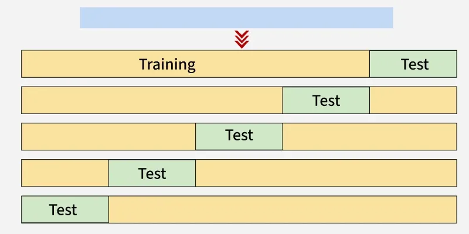
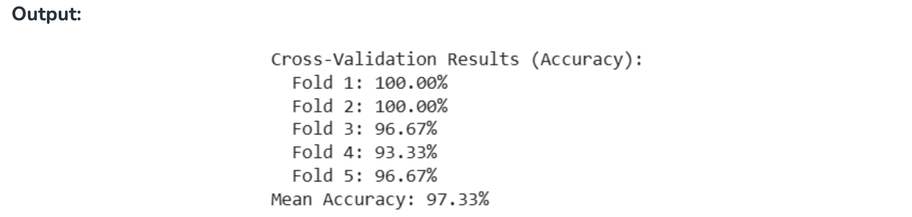

<h2 style="color:red;">✅ Cross Validation in Machine Learning</h2>

<h3 style="color:blue;">📌 What is Cross Validation in Machine Learning?</h3>

Cross-validation is a technique used to check how well a machine learning model performs on unseen data.
It splits the data into several parts, trains the model on some parts and tests it on the remaining part repeating this process multiple times. Finally the results from each validation step are averaged to produce a more accurate estimate of the model's performance.

The main purpose of cross validation is to prevent **overfitting**. If you want to make sure your machine learning model is not just memorizing the training data but is capable of adapting to real-world data cross-validation is a commonly used technique.


In scikit-learn a random split into training and test sets can be quickly computed with the train_test_split helper function. Let’s load the iris data set to fit a linear support vector machine on it:

```
import numpy as np
from sklearn.model_selection import train_test_split
from sklearn import datasets
from sklearn import svm

X, y = datasets.load_iris(return_X_y=True)
X.shape, y.shape
```

We can now quickly sample a training set while holding out 40% of the data for testing (evaluating) our classifier:

```
X_train, X_test, y_train, y_test = train_test_split(
    X, y, test_size=0.4, random_state=0)

X_train.shape, y_train.shape
X_test.shape, y_test.shape

clf = svm.SVC(kernel='linear', C=1).fit(X_train, y_train)
clf.score(X_test, y_test)
```

## 🔹 What is C in SVM?

```C```is the **regularization parameter** in SVM.

It controls the trade-off between:

- **Having a wide margin (simpler model, better generalization)**

- **Classifying training points correctly (lower training error)**

## 🔸 Intuition (Margin vs Misclassification)

- **Large C (e.g., C=1000):**

  - The model **tries very hard** to classify all training points correctly.

  - **Narrow margin**, less tolerance for misclassification.

  - Risk of **overfitting** (memorizes training data, may fail on unseen data).

- **Small C (e.g., C=0.01):**

  - The model **allows some misclassifications**.

  - **Wider margin,** focuses more on generalization.

  - Risk of **underfitting** (too simple, misses patterns).


When evaluating different settings (“hyperparameters”) for estimators, such as the C setting that must be manually set for an SVM, there is still a risk of overfitting on the test set because the parameters can be tweaked until the estimator performs optimally. This way, knowledge about the test set can “leak” into the model and evaluation metrics no longer report on generalization performance.To solve this problem, yet another part of the dataset can be held out as a so-called “validation set”: training proceeds on the training set, after which evaluation is done on the validation set, and when the experiment seems to be successful, final evaluation can be done on the test set.

However, by partitioning the available data into three sets, we drastically reduce the number of samples which can be used for learning the model, and the results can depend on a particular random choice for the pair of (train, validation) sets.

A solution to this problem is a procedure called **cross-validation** (CV for short). A test set should still be held out for final evaluation, but the validation set is no longer needed when doing CV. In the basic approach, called k-fold CV, the training set is split into k smaller sets (other approaches are described below, but generally follow the same principles). The following procedure is followed for each of the k “folds”:

- A model is trained using ```k -1``` of the folds as training data;

- the resulting model is validated on the remaining part of the data (i.e., it is used as a test set to compute a performance measure such as accuracy).

The performance measure reported by k-fold cross-validation is then the average of the values computed in the loop. This approach can be computationally expensive, but does not waste too much data (as is the case when fixing an arbitrary validation set), which is a major advantage in problems such as inverse inference where the number of samples is very small.


## Computing cross-validated metrics

The simplest way to use cross-validation is to call the ```cross_val_score``` helper function on the estimator and the dataset.

The following example demonstrates how to estimate the accuracy of a linear kernel support vector machine on the iris dataset by splitting the data, fitting a model and computing the score 5 consecutive times (with different splits each time):

```
from sklearn.model_selection import cross_val_score
clf = svm.SVC(kernel='linear', C=1, random_state=42)
scores = cross_val_score(clf, X, y, cv=5)
scores
```

The mean score and the standard deviation are hence given by:

```
print("%0.2f accuracy with a standard deviation of %0.2f" % (scores.mean(), scores.std()))
0.98 accuracy with a standard deviation of 0.02
```

By default, the score computed at each CV iteration is the ```score``` method of the estimator. It is possible to change this by using the scoring parameter:

```
from sklearn import metrics
scores = cross_val_score(
    clf, X, y, cv=5, scoring='f1_macro')
scores
```

## String name scorers

# Scikit-learn Scoring Reference

## Classification

| Scoring String Name              | Function                                | Comment                                    |
|----------------------------------|-----------------------------------------|--------------------------------------------|
| `accuracy`                       | `metrics.accuracy_score`                 |                                            |
| `balanced_accuracy`              | `metrics.balanced_accuracy_score`        |                                            |
| `top_k_accuracy`                 | `metrics.top_k_accuracy_score`           |                                            |
| `average_precision`              | `metrics.average_precision_score`        |                                            |
| `neg_brier_score`                | `metrics.brier_score_loss`               |                                            |
| `f1`                             | `metrics.f1_score`                       | for binary targets                         |
| `f1_micro`                       | `metrics.f1_score`                       | micro-averaged                             |
| `f1_macro`                       | `metrics.f1_score`                       | macro-averaged                             |
| `f1_weighted`                    | `metrics.f1_score`                       | weighted average                           |
| `f1_samples`                     | `metrics.f1_score`                       | by multilabel sample                       |
| `neg_log_loss`                   | `metrics.log_loss`                       | requires `predict_proba` support           |
| `precision`, etc.                | `metrics.precision_score`                | suffixes apply as with `f1`                |
| `recall`, etc.                   | `metrics.recall_score`                   | suffixes apply as with `f1`                |
| `jaccard`, etc.                  | `metrics.jaccard_score`                  | suffixes apply as with `f1`                |
| `roc_auc`                        | `metrics.roc_auc_score`                  |                                            |
| `roc_auc_ovr`                    | `metrics.roc_auc_score`                  |                                            |
| `roc_auc_ovo`                    | `metrics.roc_auc_score`                  |                                            |
| `roc_auc_ovr_weighted`           | `metrics.roc_auc_score`                  |                                            |
| `roc_auc_ovo_weighted`           | `metrics.roc_auc_score`                  |                                            |
| `d2_log_loss_score`              | `metrics.d2_log_loss_score`              |                                            |

---

## Clustering

| Scoring String Name              | Function                                | Comment |
|----------------------------------|-----------------------------------------|---------|
| `adjusted_mutual_info_score`     | `metrics.adjusted_mutual_info_score`     |         |
| `adjusted_rand_score`            | `metrics.adjusted_rand_score`            |         |
| `completeness_score`             | `metrics.completeness_score`             |         |
| `fowlkes_mallows_score`          | `metrics.fowlkes_mallows_score`          |         |
| `homogeneity_score`              | `metrics.homogeneity_score`              |         |
| `mutual_info_score`              | `metrics.mutual_info_score`              |         |
| `normalized_mutual_info_score`   | `metrics.normalized_mutual_info_score`   |         |
| `rand_score`                     | `metrics.rand_score`                     |         |
| `v_measure_score`                | `metrics.v_measure_score`                |         |

---

## Regression

| Scoring String Name              | Function                                | Comment |
|----------------------------------|-----------------------------------------|---------|
| `explained_variance`             | `metrics.explained_variance_score`       |         |
| `neg_max_error`                  | `metrics.max_error`                      |         |
| `neg_mean_absolute_error`        | `metrics.mean_absolute_error`            |         |
| `neg_mean_squared_error`         | `metrics.mean_squared_error`             |         |
| `neg_root_mean_squared_error`    | `metrics.root_mean_squared_error`        |         |
| `neg_mean_squared_log_error`     | `metrics.mean_squared_log_error`         |         |
| `neg_root_mean_squared_log_error`| `metrics.root_mean_squared_log_error`    |         |
| `neg_median_absolute_error`      | `metrics.median_absolute_error`          |         |
| `r2`                             | `metrics.r2_score`                       |         |
| `neg_mean_poisson_deviance`      | `metrics.mean_poisson_deviance`          |         |
| `neg_mean_gamma_deviance`        | `metrics.mean_gamma_deviance`            |         |
| `neg_mean_absolute_percentage_error` | `metrics.mean_absolute_percentage_error` |     |
| `d2_absolute_error_score`        | `metrics.d2_absolute_error_score`        |         |


In the case of the Iris dataset, the samples are balanced across target classes hence the accuracy and the F1-score are almost equal.

When the cv argument is an integer, cross_val_score uses the ```KFold``` or ```StratifiedKFold``` strategies by default

It is also possible to use other cross validation strategies by passing a cross validation iterator instead, for instance:

```
from sklearn.model_selection import ShuffleSplit
n_samples = X.shape[0]
cv = ShuffleSplit(n_splits=5, test_size=0.3, random_state=0)
cross_val_score(clf, X, y, cv=cv)
```

<h3 style="color:blue;">📌 Types of Cross-Validation</h3>

There are several types of cross validation techniques which are as follows:


**1. Holdout Validation**

In Holdout Validation we perform training on the 50% of the given dataset and rest 50% is used for the testing purpose. It's a simple and quick way to evaluate a model. The major drawback of this method is that we perform training on the 50% of the dataset, it may possible that the remaining 50% of the data contains some important information which we are leaving while training our model that can lead to higher bias.

**Process:** Split dataset into training and test sets (commonly 70:30 or 80:20).

**Pros:** Simple, fast.

**Cons:** High variance (depends heavily on split).

**When to use:** Very large datasets where k-fold isn’t necessary.


**2. LOOCV (Leave One Out Cross Validation)**

In this method we perform training on the whole dataset but leaves only one data-point of the available dataset and then iterates for each data-point. In LOOCV the model is trained on n−1 samples and tested on the one omitted sample repeating this process for each data point in the dataset. It has some advantages as well as disadvantages also.

  - An advantage of using this method is that we make use of all data points and hence it is low bias.

  - The major drawback of this method is that it leads to higher variation in the testing model as we are testing against one data point. If the data point is an outlier it can lead to higher variation.

  - Another drawback is it takes a lot of execution time as it iterates over the number of data points we have.

**Process:** k = number of samples. Train on all except one sample, test on the one sample. Repeat for each sample.

**Pros:** Almost unbiased performance estimate.

**Cons:** Extremely computationally expensive for large datasets; can have high variance.


**3. Stratified Cross-Validation**

It is a technique used in machine learning to ensure that each fold of the cross-validation process maintains the same class distribution as the entire dataset. This is particularly important when dealing with imbalanced datasets where certain classes may be under represented. In this method:

- The dataset is divided into k folds while maintaining the proportion of classes in each fold.

- During each iteration, one-fold is used for testing and the remaining folds are used for training.

- The process is repeated k times with each fold serving as the test set exactly once.

Stratified Cross-Validation is essential when dealing with classification problems where maintaining the balance of class distribution is crucial for the model to generalize well to unseen data.


**4. K-Fold Cross Validation**

In K-Fold Cross Validation we split the dataset into k number of subsets known as folds then we perform training on the all the subsets but leave one (k-1) subset for the evaluation of the trained model. In this method, we iterate k times with a different subset reserved for testing purpose each time.

**Note:** ```It is always suggested that the value of k should be 10 as the lower value of k takes towards validation and higher value of k leads to LOOCV method.```


**Example of K Fold Cross Validation**

The diagram below shows an example of the training subsets and evaluation subsets generated in k-fold cross-validation. Here we have total 25 instances. In first iteration we use the first 20 percent of data for evaluation and the remaining 80 percent for training like [1-5] testing and [5-25] training while in the second iteration we use the second subset of 20 percent for evaluation and the remaining three subsets of the data for training like [5-10] testing and [1-5 and 10-25] training and so on.





| Iteration | Training Set Observations       | Testing Set Observations |
|-----------|---------------------------------|--------------------------|
| 1         | [5-24]                          | [0-4]                    |
| 2         | [0-4, 10-24]                    | [5-9]                    |
| 3         | [0-9, 15-24]                    | [10-14]                  |
| 4         | [0-14, 20-24]                   | [15-19]                  |
| 5         | [0-19]                          | [20-24]                  |


Each iteration uses different subsets for testing and training, ensuring that all data points are used for both training and testing.

**5. Time Series Cross-Validation (Rolling/Expanding Window)**

**Process:**

  - Train on first chunk, validate on next chunk.

  - Move the window forward in time.

**Pros:** Preserves temporal order, avoids leakage from future.

**Cons:** Less training data in early folds.

**Use case:** Forecasting, stock prices, sensor data.


<h3 style="color:blue;">📌 Comparison between K-Fold Cross-Validation and Hold Out Method</h3>

K-Fold Cross-Validation and Hold Out Method are widely used technique and sometimes they are confusing so here is the quick comparison between them:


| Feature                       | K-Fold Cross-Validation                                                                 | Hold-Out Method                                                             |
|--------------------------------|------------------------------------------------------------------------------------------|------------------------------------------------------------------------------|
| **Definition**                 | The dataset is divided into 'k' subsets (folds). Each fold gets a turn to be the test set while the others are used for training. | The dataset is split into two sets: one for training and one for testing.    |
| **Training Sets**              | ✅ The model is trained 'k' times, each time on a different training subset.               | ⚠️ The model is trained once on the training set.                               |
| **Testing Sets**               | ✅ The model is tested 'k' times, each time on a different test subset.                     | ⚠️ The model is tested once on the test set.                                    |
| **Bias**                       | ✅ Less biased due to multiple splits and testing.                                         | ❌ Can have higher bias due to a single split.                                  |
| **Variance**                   | ✅ Lower variance, as it tests on multiple splits.                                         | ❌ Higher variance, as results depend on the single split.                      |
| **Computation Cost**           | ❌ High, as the model is trained and tested 'k' times.                                     | ✅ Low, as the model is trained and tested only once.                           |
| **Use in Model Selection**     | ✅ Better for tuning and evaluating model performance due to reduced bias.                 | ❌ Less reliable for model selection, as it might give inconsistent results.    |
| **Data Utilization**           | ✅ The entire dataset is used for both training and testing.                               | ❌ Only a portion of the data is used for testing, so some data is not used for validation. |
| **Suitability for Small Datasets** | ✅ Preferred for small datasets, as it maximizes data usage.                              | ❌ Less ideal for small datasets, as a significant portion is held out for testing. |
| **Risk of Overfitting**        | ✅ Less prone to overfitting due to multiple training and testing cycles.                   | ❌ Higher risk of overfitting as the model is trained on one set.               |


<h3 style="color:blue;">📌 Advantages and Disadvantages of Cross Validation</h3>

**Advantages:**

1. **Overcoming Overfitting:** Cross validation helps to prevent overfitting by providing a more robust estimate of the model's performance on unseen data.

2. **Model Selection:** Cross validation is used to compare different models and select the one that performs the best on average.

3. **Hyperparameter tuning:** This is used to optimize the hyperparameters of a model such as the regularization parameter by selecting the values that result in the best performance on the validation set.

4. **Data Efficient:** It allow the use of all the available data for both training and validation making it more data-efficient method compared to traditional validation techniques.

**Disadvantages:**

1. **Computationally Expensive:** It can be computationally expensive especially when the number of folds is large or when the model is complex and requires a long time to train.

2. **Time-Consuming:** It can be time-consuming especially when there are many hyperparameters to tune or when multiple models need to be compared.

3. **Bias-Variance Tradeoff:** The choice of the number of folds in cross validation can impact the bias-variance tradeoff i.e too few folds may result in high bias while too many folds may result in high variance.


<h3 style="color:blue;">📌 Python implementation for k fold cross-validation</h3>

**Step 1: Importing necessary libraries**

[import from scikit learn.](https://www.geeksforgeeks.org/machine-learning/learning-model-building-scikit-learn-python-machine-learning-library/)

```
from sklearn.model_selection import cross_val_score, KFold
from sklearn.svm import SVC
from sklearn.datasets import load_iris
```

**Step 2: Loading the dataset**

let's use the iris dataset which is a multi-class classification in-built dataset.

```
iris = load_iris()
X, y = iris.data, iris.target
```

**Step 3: Creating SVM classifier**

[SVC is a Support Vector Classification model from scikit-learn.](https://www.geeksforgeeks.org/machine-learning/kernel-trick-in-support-vector-classification/)

```
svm_classifier = SVC(kernel='linear')
```

**Step 4: Defining the number of folds for cross-validation**

Here we will be using 5 folds.

```
num_folds = 5
kf = KFold(n_splits=num_folds, shuffle=True, random_state=42)
```

**Step 5: Performing k-fold cross-validation**

```
cross_val_results = cross_val_score(svm_classifier, X, y, cv=kf)
```

**Step 6: Evaluation metrics**

```
print("Cross-Validation Results (Accuracy):")
for i, result in enumerate(cross_val_results, 1):
    print(f"  Fold {i}: {result * 100:.2f}%")
    
print(f'Mean Accuracy: {cross_val_results.mean()* 100:.2f}%')
```



The output shows the accuracy scores from each of the 5 folds in the K-fold cross-validation process. The mean accuracy is the average of these individual scores which is approximately 97.33% indicating the model's overall performance across all the folds.


