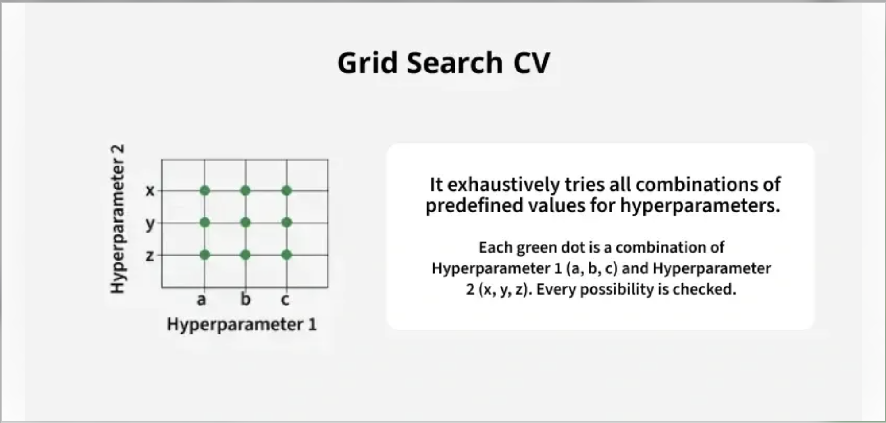
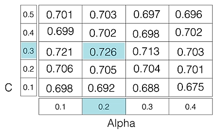

<h2 style="color:red;">✅ Hyperparameter Tuning</h2>

**Tuning the hyper-parameters of an estimator**

Hyper-parameters are parameters that are not directly learnt within estimators. In scikit-learn they are passed as arguments to the constructor of the estimator classes. Typical examples include ```C```, ```kernel``` and ```gamma``` for Support Vector Classifier, ```alpha``` for Lasso, etc.


- It is possible and recommended to search the hyper-parameter space for the best ```cross validation``` score.

Any parameter provided when constructing an estimator may be optimized in this manner. Specifically, to find the names and current values for all parameters for a given estimator, use:

```
estimator.get_params()
```

**What is an Estimator in Machine Learning?**

In **scikit-learn** (and generally in ML), an **estimator** is **any object that can learn from data**.

- It must implement at least the methods:

   - ```.fit(X, y)``` → learns from the data (training).

   - ```.predict(X)``` → makes predictions on new data.

👉 In simple words:

An **estimator = algorithm/model or transformer** in sklearn.


A search consists of:

- an estimator (regressor or classifier such as ```sklearn.svm.SVC()```);

- a parameter space;

- a method for searching or sampling candidates;

- a cross-validation scheme;

- a score function.

Two generic approaches to parameter search are provided in scikit-learn: for given values,

1. ```GridSearchCV``` exhaustively considers all parameter combinations.

2. ```RandomizedSearchCV``` can sample a given number of candidates from a parameter space with a specified distribution.

3. Both these tools have successive halving counterparts ```HalvingGridSearchCV``` and ```HalvingRandomSearchCV```, which can be much faster at finding a good parameter combination.


<h3 style="color:blue;">📌 What is Hyperparameter Tuning?</h3>

**Hyperparameter tuning** is the process of selecting the optimal values for a machine learning model's hyperparameters. These are typically set before the actual training process begins and control aspects of the learning process itself. They influence the model's performance its complexity and how fast it learns.

```For example the learning rate and number of neurons in a neural network in a neural network or the kernel size in a support vector machine can significantly impact how well the model trains and generalizes. The goal of hyperparameter tuning is to find the values that lead to the best performance on a given task.```

These settings can affect both the speed and quality of the model's performance.

- A **high learning rate** can cause the model to converge too quickly possibly skipping over the optimal solution.

- A **low learning rate** might lead to slower convergence and require more time and computational resources.


Different models have different hyperparameters and they need to be tuned accordingly.

<h3 style="color:blue;">📌 Techniques for Hyperparameter Tuning</h3>

Models can have many hyperparameters and finding the best combination of parameters can be treated as a search problem. The two best strategies for Hyperparameter tuning are:

<h3 style="color:blue;">📌 1. GridSearchCV </h3>



GridSearchCV is a brute-force technique for hyperparameter tuning. It trains the model using all possible combinations of specified hyperparameter values to find the best-performing setup. It is slow and uses a lot of computer power which makes it hard to use with big datasets or many settings. It works using below steps:

- Create a grid of potential values for each hyperparameter.

- Train the model for every combination in the grid.

- Evaluate each model using cross-validation.

- Select the combination that gives the highest score.

For example if we want to tune two hyperparameters C and Alpha for a Logistic Regression Classifier model with the following sets of values:

C = [0.1, 0.2, 0.3, 0.4, 0.5]
Alpha = [0.01, 0.1, 0.5, 1.0]




The grid search technique will construct multiple versions of the model with all possible combinations of C and Alpha, resulting in a total of 5 * 4 = 20 different models. The best-performing combination is then chosen.


**Example: Tuning Logistic Regression with GridSearchCV**

The following code illustrates how to use GridSearchCV . In this below code:

- We generate sample data using **make_classification**.
- We define a range of C values using logarithmic scale.
- GridSearchCV tries all combinations from **param_grid** and uses 5-fold cross-validation.
- It returns the best hyperparameter (C) and its corresponding validation score

```
from sklearn.linear_model import LogisticRegression
from sklearn.model_selection import GridSearchCV
import numpy as np
from sklearn.datasets import make_classification

X, y = make_classification(
    n_samples=1000, n_features=20, n_informative=10, n_classes=2, random_state=42)

c_space = np.logspace(-5, 8, 15)
param_grid = {'C': c_space}

logreg = LogisticRegression()

logreg_cv = GridSearchCV(logreg, param_grid, cv=5)

logreg_cv.fit(X, y)

print("Tuned Logistic Regression Parameters: {}".format(logreg_cv.best_params_))
print("Best score is {}".format(logreg_cv.best_score_))
```

**Output:**

```Tuned Logistic Regression Parameters: {'C': 0.006105402296585327} Best score is 0.853```

This represents the highest accuracy achieved by the model using the hyperparameter combination **C = 0.0061**.

The best score of **0.853** means the model achieved 85.3% accuracy on the validation data during the grid search process.


GridSearchCV is a method in scikit-learn that helps you find the best combination of hyperparameters for your model.

1. Takes a model and a set of hyperparameters to try (the "grid").

2. Trains the model with **all possible combinations** of those hyperparameters.

3. Uses **cross-validation** to evaluate each combination.

4. Selects the combination that gives the **best performance**.

**Why Use It?**

- Choosing hyperparameters manually can be guesswork.

- GridSearchCV ensures **systematic**, **exhaustive search** across given parameter ranges.

- Helps in **avoiding underfitting or overfitting** due to poor hyperparameter selection.

<h3 style="color:blue;">📌 3. Real-Time Example: Predicting Loan Default </h3>

Imagine you’re working in a **bank’s credit risk department**.

You want to predict whether a customer will default on their loan using a Random Forest Classifier.

The challenge:

- The model has multiple hyperparameters (```n_estimators, max_depth, min_samples_split```).

- You don’t know the best combination.

```
from sklearn.model_selection import GridSearchCV
from sklearn.ensemble import RandomForestClassifier
from sklearn.datasets import make_classification
from sklearn.model_selection import train_test_split
from sklearn.metrics import classification_report

# 1. Create synthetic dataset (Example: Loan Default)
X, y = make_classification(n_samples=1000, n_features=10, 
                           n_informative=5, n_classes=2, random_state=42)

# 2. Split into train & test
X_train, X_test, y_train, y_test = train_test_split(X, y, test_size=0.2, random_state=42)

# 3. Define model
rf = RandomForestClassifier(random_state=42)

# 4. Define parameter grid
param_grid = {
    'n_estimators': [50, 100, 200],
    'max_depth': [None, 5, 10],
    'min_samples_split': [2, 5, 10]
}

# 5. Setup GridSearchCV
grid_search = GridSearchCV(estimator=rf,
                           param_grid=param_grid,
                           cv=5,                # 5-fold cross-validation
                           scoring='accuracy', # Metric to evaluate
                           n_jobs=-1)          # Use all CPU cores

# 6. Fit model
grid_search.fit(X_train, y_train)

# 7. Print best parameters & score
print("Best Parameters:", grid_search.best_params_)
print("Best Cross-Validation Score:", grid_search.best_score_)

# 8. Evaluate on test data
best_model = grid_search.best_estimator_
y_pred = best_model.predict(X_test)
print(classification_report(y_test, y_pred))
```

**How it works in this example**

**Parameter Grid:**

```
n_estimators → [50, 100, 200]
max_depth → [None, 5, 10]
min_samples_split → [2, 5, 10]
```

**→ Total combinations** = 3 × 3 × 3 = 27 models.

**Cross-validation:**

For each combination, GridSearchCV:

  - Splits training data into **5 folds**.

  - Trains on 4 folds, validates on 1.

  - Repeats 5 times → averages accuracy.

**Selection:**

Picks the combination with the highest average validation accuracy.


<h3 style="color:blue;">📌 RandomizedSearchCV  </h3>

As the name suggests RandomizedSearchCV picks random combinations of hyperparameters from the given ranges instead of checking every single combination like GridSearchCV.

In each iteration it **tries a new random combination** of hyperparameter values.
It **records the model’s performance** for each combination.
After several attempts it **selects the best-performing set**.


**Example: Tuning Decision Tree with RandomizedSearchCV**

The following code illustrates how to use RandomizedSearchCV.In this example:

- We define a range of values for each hyperparameter e.g, **max_depth**, **min_samples_leaf** etc.

- Random combinations are picked and evaluated using 5-fold cross-validation.

- The best combination and score are printed.

```
import numpy as np
from sklearn.datasets import make_classification

X, y = make_classification(n_samples=1000, n_features=20, n_informative=10, n_classes=2, random_state=42)

from scipy.stats import randint
from sklearn.tree import DecisionTreeClassifier
from sklearn.model_selection import RandomizedSearchCV

param_dist = {
    "max_depth": [3, None],
    "max_features": randint(1, 9),
    "min_samples_leaf": randint(1, 9),
    "criterion": ["gini", "entropy"]
}

tree = DecisionTreeClassifier()
tree_cv = RandomizedSearchCV(tree, param_dist, cv=5)
tree_cv.fit(X, y)

print("Tuned Decision Tree Parameters: {}".format(tree_cv.best_params_))
print("Best score is {}".format(tree_cv.best_score_))
```

**Output:**

```Tuned Decision Tree Parameters: {'criterion': 'entropy', 'max_depth': None, 'max_features': 6, 'min_samples_leaf': 6} Best score is 0.8```

A score of 0.842 means the model performed with an accuracy of 84.2% on the validation set with following hyperparameters.


<h3 style="color:blue;">📌 Advantages of Hyperparameter tuning  </h3>

- **Improved Model Performance:** Finding the optimal combination of hyperparameters can significantly boost model accuracy and robustness.

- **Reduced Overfitting and Underfitting:** Tuning helps to prevent both overfitting and underfitting resulting in a well-balanced model.

- **Enhanced Model Generalizability:** By selecting hyperparameters that optimize performance on validation data the model is more likely to generalize well to unseen data.

- **Optimized Resource Utilization:** With careful tuning resources such as computation time and memory can be used more efficiently avoiding unnecessary work.

- **Improved Model Interpretability:** Properly tuned hyperparameters can make the model simpler and easier to interpret.


<h3 style="color:blue;">📌 Challenges in Hyperparameter Tuning  </h3>

- **Dealing with High-Dimensional Hyperparameter Spaces:** The larger the hyperparameter space the more combinations need to be explored. This makes the search process computationally expensive and time-consuming especially for complex models with many hyperparameters.

- **Handling Expensive Function Evaluations:** Evaluating a model's performance can be computationally expensive, particularly for models that require a lot of data or iterations.

- **Incorporating Domain Knowledge:** It can help guide the hyperparameter search, narrowing down the search space and making the process more efficient. Using insights from the problem context can improve both the efficiency and effectiveness of tuning.

- **Developing Adaptive Hyperparameter Tuning Methods:** Dynamic adjustment of hyperparameters during training such as learning rate schedules or early stopping can lead to better model performance.