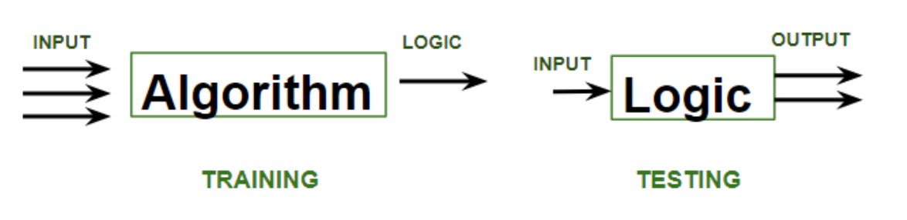
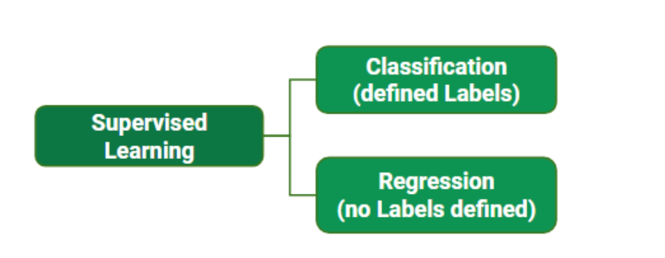
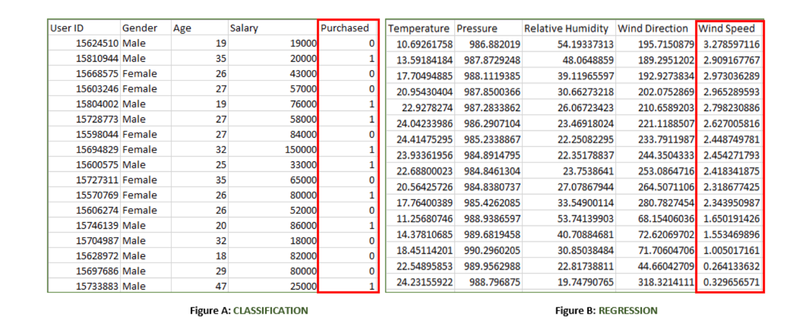
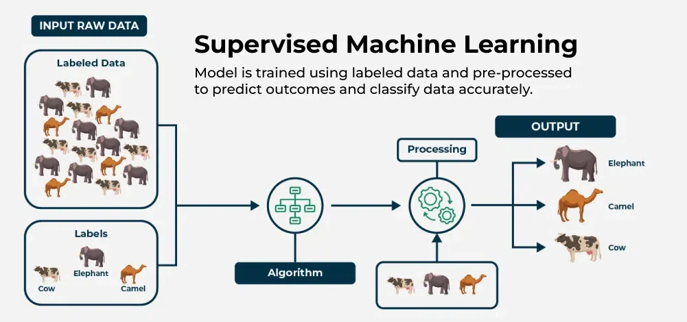

<h2 style="color:red;">✅ What is Supervised Machine Learning?</h2>

**supervised learning** is a type of machine learning where a model is trained on **labeled** data—meaning each input is paired with the correct output. the model learns by comparing its predictions with the actual answers provided in the training data. Over time, it adjusts itself to minimize errors and improve accuracy. The goal of supervised learning is to make accurate predictions when given new, unseen data.

Supervised learning can be applied in various forms, including supervised learning **classification** and supervised learning **regression**

<h3 style="color:blue;">📌 How Supervised Machine Learning Works?</h3>

Where **supervised learning algorithm** consists of **input features** and corresponding **output labels**.

The process works through the following stages:

- **Training Data:** The model is provided with a training dataset. This dataset is the foundation of the learning process and consists of:

    - **Input Features:** The variables or attributes used to make a prediction.

    - **Output Labels:** The correct answers or target variables corresponding to the input features.

- **Learning Process:** The supervised learning algorithm processes the training data to learn the relationship between the input features and the output labels. This is achieved by:

    - **Initialization:** The model's parameters are randomly initialized.

    - **Prediction:** The model makes a prediction for a given input.

    - **Error Calculation:** The model's prediction is compared to the actual label. The difference between these two is the error.

    - **Parameter Adjustment:** The model's parameters are adjusted to minimize this error. This process is repeated iteratively over the entire training dataset until the model's performance on the training data is optimized.
    
    
    
**Validation Data:** This is a crucial step to prevent overfitting. The validation set is a portion of the original data that is set 
aside and not used during the initial training process. It is used to tune the model's hyperparameters and assess its 
performance during the training phase. By evaluating the model on the validation data, we can see if it is learning 
generalized patterns or simply memorizing the training data.

**Test Data:** After the model has been trained and its hyperparameters have been tuned using the validation set, 
it is evaluated one last time using a separate, unseen test dataset. The test dataset is the ultimate measure of the model’s 
accuracy and performance. Because the model has never seen this data before, the results on the test set 
provide an unbiased estimate of how the model will perform on new, real-world data.

**Training** phase involves feeding the algorithm labeled data, where each data point is paired with its correct output. 
The algorithm learns to identify patterns and relationships between the input and output data.

**Testing** phase involves feeding the algorithm new, unseen data and evaluating its ability to predict the correct output 
based on the learned patterns.

<h3 style="color:blue;">📌 Types of Supervised Learning in Machine Learning?</h3>

1. **Classification:** Where the output is a categorical variable (e.g., spam vs. non-spam emails, yes vs. no).

2. **Regression:** Where the output is a continuous variable (e.g., predicting house prices, stock prices).

- While training the model, data is usually **split in the ratio of 80:20** i.e. **80% as training data** and 
the **rest 20% as testing data**. In training data, we feed input as well as output for 80% of data. 
The model learns from training data only.

Understand the **classification** and **regression** data

Both the above figures have labelled data set as follows:

**Figure A:** It is a dataset of a shopping store that is useful in predicting whether a customer will purchase a particular product under consideration or not based on his/ her gender, age, and salary.

- **Input:** Gender, Age, Salary

- **Output:** Purchased i.e. **0** or **1**; 1 means yes the customer will purchase and 0 means that the customer won't purchase it.

**Figure B:** It is a Meteorological dataset that serves the purpose of predicting wind speed based on different parameters.

- **Input:** Dew Point, Temperature, Pressure, Relative Humidity, Wind Direction

- **Output:** Wind Speed

<h3 style="color:blue;">📌 Supervised Machine Learning Algorithms</h3>

1. **Linear Regression:** Linear regression is a type of supervised learning regression algorithm that is used to predict a continuous output value. It is one of the simplest and most widely used algorithms in supervised learning.

2. **Logistic Regression:** Logistic regression is a type of supervised learning classification algorithm that is used to predict a binary output variable.

3. **Decision Trees:** Decision tree is a tree-like structure that is used to model decisions and their possible consequences. Each internal node in the tree represents a decision, while each leaf node represents a possible outcome.

4. **Random Forests:** Random forests again are made up of multiple decision trees that work together to make predictions. Each tree in the forest is trained on a different subset of the input features and data. The final prediction is made by aggregating the predictions of all the trees in the forest.

5. **Support Vector Machine(SVM):** The SVM algorithm creates a hyperplane to segregate n-dimensional space into classes and identify the correct category of new data points. The extreme cases that help create the hyperplane are called support vectors, hence the name Support Vector Machine.

6. **K-Nearest Neighbors (KNN):** KNN works by finding k training examples closest to a given input and then predicts the class or value based on the majority class or average value of these neighbors. The performance of KNN can be influenced by the choice of k and the distance metric used to measure proximity.

7. **Gradient Boosting:** Gradient Boosting combines weak learners, like decision trees, to create a strong model. It iteratively builds new models that correct errors made by previous ones.

8. **Naive Bayes Algorithm:** The Naive Bayes algorithm is a supervised machine learning algorithm based on applying Bayes' Theorem with the “naive” assumption that features are independent of each other given the class label.

<h3 style="color:blue;">📌 Training a Supervised Learning Model Key Steps:</h3>

1. **Data Collection and Preprocessing(cleaning, feature engineering):** Gather a labeled dataset consisting of input features and target output labels. Clean the data, handle missing values, and scale features as needed to ensure high quality for supervised learning algorithms.

2. **Exploratory Data Analysis(EDA):** EDA (Exploratory Data Analysis) is the first step in the data analysis process. It involves visualizing and summarizing the main characteristics of a dataset to understand its structure, spot anomalies, test hypotheses, and check assumptions.

3. **Splitting the Data:** Divide the data into training set (80%) and the test set (20%).

4. **Choosing the Model:** Select appropriate algorithms based on the problem type. This step is crucial for effective supervised learning in AI.

5. **Training the Model:** Feed the model input data and output labels, allowing it to learn patterns by adjusting internal parameters.

6. **Evaluating the Model:** Test the trained model on the unseen test set and assess its performance using various metrics.

7. **Hyperparameter Tuning:** Adjust settings that control the training process (e.g., learning rate) using techniques like grid search and cross-validation.

8. **Final Testing:** Retrain the model on the complete dataset using the best hyperparameters testing its performance on the test set to ensure readiness for deployment.

9. **Model Deployment:** Deploy the validated model to make predictions on new, unseen data.

<h3 style="color:blue;">📌 Advantages of Supervised Learning:</h3>

The power of supervised learning lies in its ability to accurately predict patterns and make data-driven decisions across a variety of applications. Here are some advantages of **supervised learning** listed below:

- **Supervised learning** excels in accurately predicting patterns and making data-driven decisions.

- **Labeled training data** is crucial for enabling supervised learning models to learn input-output relationships effectively.

- **Supervised machine learning** encompasses tasks such as **supervised learning classification** and **supervised learning regression**.

- Applications include complex problems like image recognition and natural language processing.

- Established evaluation metrics (**accuracy, precision, recall, F1-score**) are essential for assessing **supervised learning model** performance.

- Advantages of **supervised learning** include creating complex models for accurate predictions on new data.

<h3 style="color:blue;">📌 Disadvantages of Supervised Learning:</h3>

Despite the benefits of **supervised learning methods**, there are notable **disadvantages of supervised learning**:

1. **Overfitting:** Models can overfit training data, leading to poor performance on new data due to capturing noise in **supervised machine learning**.

2. **Feature Engineering:** Extracting relevant features is crucial but can be time-consuming and requires domain expertise in **supervised learning applications**.

3. **Bias in Models:** Bias in the training data may result in unfair predictions in **supervised learning algorithms**.

4. **Dependence on Labeled Data:** Supervised learning relies heavily on labeled training data, which can be costly and time-consuming to obtain, posing a challenge for supervised learning techniques.

<h3 style="color:blue;">📌 Conclusion:</h3>

Supervised learning is a powerful branch of machine learning that revolves around learning a class from examples provided during training. By using supervised learning algorithms, models can be trained to make predictions based on labeled data. The effectiveness of supervised machine learning lies in its ability to generalize from the training data to new, unseen data, making it invaluable for a variety of applications, from image recognition to financial forecasting.

Understanding the types of supervised learning algorithms and the dimensions of supervised machine learning is essential for choosing the appropriate algorithm to solve specific problems. As we continue to explore the different types of supervised learning and refine these supervised learning techniques, the impact of supervised learning in machine learning will only grow, playing a critical role in advancing AI-driven solutions.

**Supervised machine learning algorithms in table:**

<table border="1" style="border-collapse: collapse; text-align: left;">
<tr style="background-color:#f2f2f2;">
<th>Algorithm</th>
<th>Regression / Classification</th>
<th>Purpose</th>
<th>Method</th>
<th>Use Cases</th>
</tr>

<tr style="background-color:#e6f7ff;">
<td><b>Linear Regression</b></td>
<td>Regression</td>
<td>Predict continuous output values</td>
<td>Linear equation minimizing sum of squares of residuals</td>
<td>Predicting continuous values (e.g., house prices, sales forecasting)</td>
</tr>

<tr style="background-color:#fff2e6;">
<td><b>Logistic Regression</b></td>
<td>Classification</td>
<td>Predict binary output variable</td>
<td>Logistic function transforming linear relationship</td>
<td>Binary classification tasks (e.g., spam detection, disease prediction)</td>
</tr>

<tr style="background-color:#f9f9f9;">
<td><b>Decision Trees</b></td>
<td>Both</td>
<td>Model decisions and outcomes</td>
<td>Tree-like structure with decisions and outcomes</td>
<td>Classification and regression tasks</td>
</tr>

<tr style="background-color:#e6ffe6;">
<td><b>Random Forests</b></td>
<td>Both</td>
<td>Improve classification and regression accuracy</td>
<td>Combining multiple decision trees</td>
<td>Reducing overfitting, improving prediction accuracy</td>
</tr>

<tr style="background-color:#e6f7ff;">
<td><b>SVM</b></td>
<td>Both</td>
<td>Create hyperplane for classification or predict continuous values</td>
<td>Maximizing margin between classes or predicting continuous values</td>
<td>Classification and regression tasks (e.g., image recognition, stock prediction)</td>
</tr>

<tr style="background-color:#fff2e6;">
<td><b>KNN</b></td>
<td>Both</td>
<td>Predict class or value based on k closest neighbors</td>
<td>Finding k closest neighbors and predicting based on majority or average</td>
<td>Classification and regression tasks; sensitive to noisy data</td>
</tr>

<tr style="background-color:#f9f9f9;">
<td><b>Gradient Boosting</b></td>
<td>Both</td>
<td>Combine weak learners to create strong model</td>
<td>Iteratively correcting errors with new models</td>
<td>Classification and regression tasks to improve prediction accuracy</td>
</tr>

<tr style="background-color:#e6ffe6;">
<td><b>Naive Bayes</b></td>
<td>Classification</td>
<td>Predict class based on feature independence assumption</td>
<td>Bayes' theorem with feature independence assumption</td>
<td>Text classification, spam filtering, sentiment analysis, medical diagnosis</td>
</tr>
</table>
