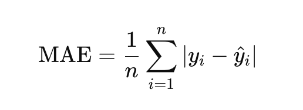
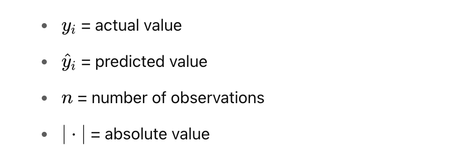
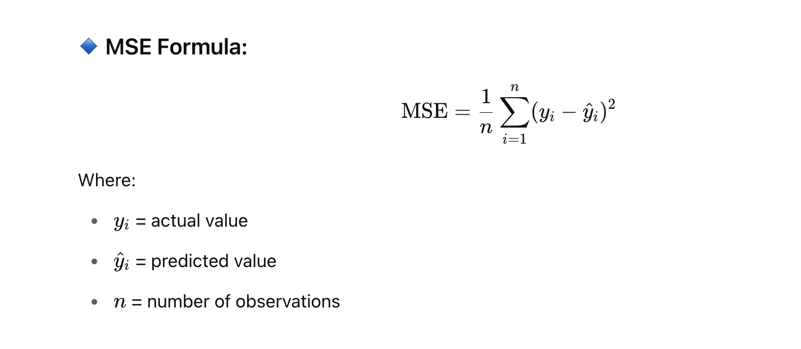
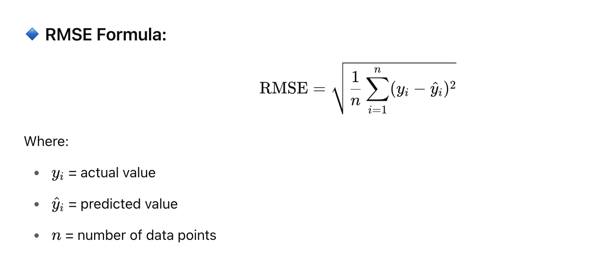
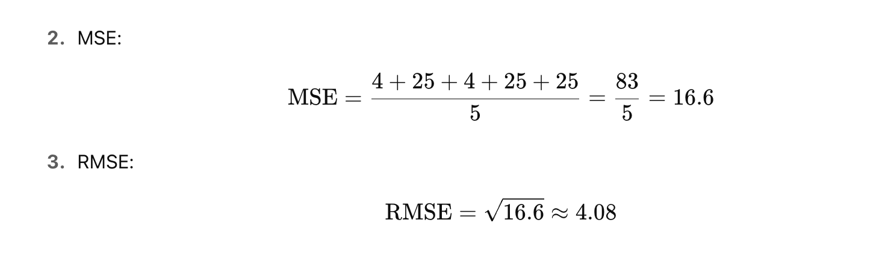
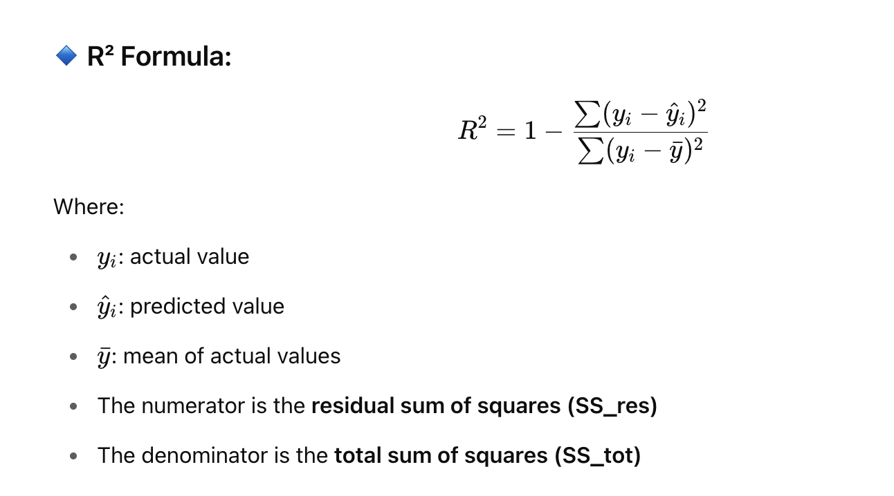
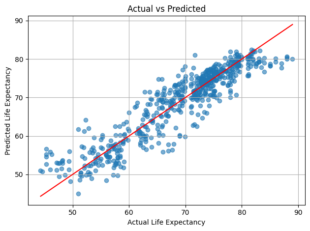
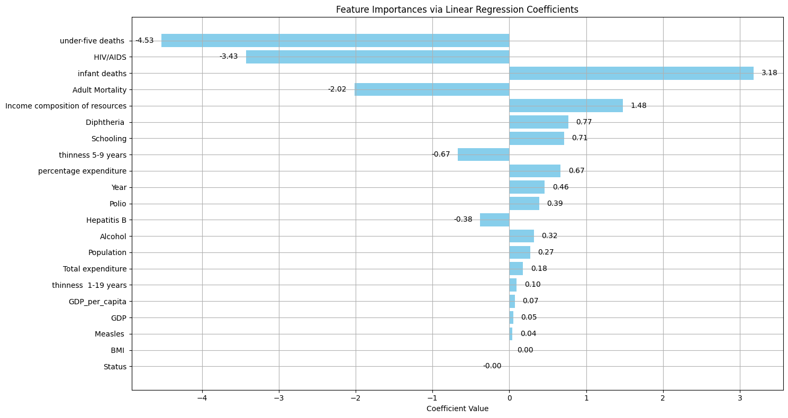
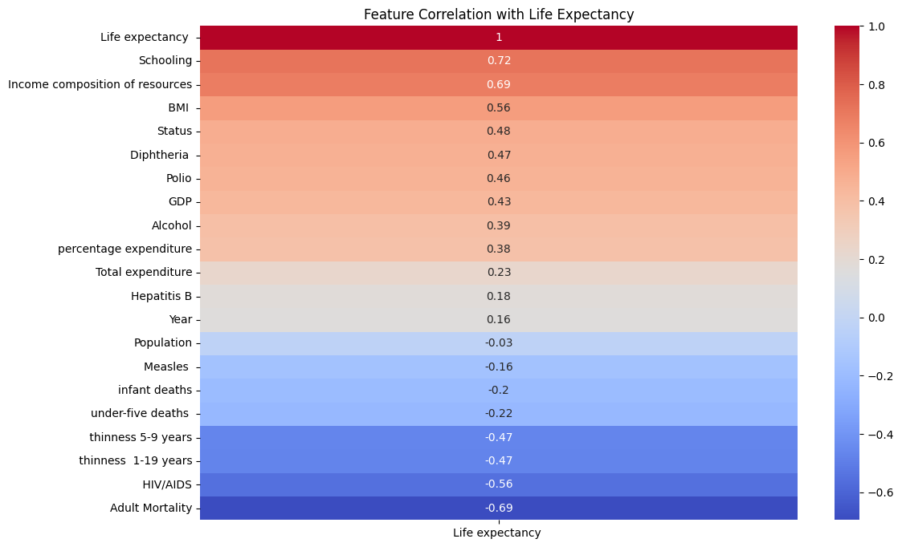

<h2 style="color:red;">✅ Regression</h2>

Regression in machine learning refers to a supervised learning technique where the goal is to predict a continuous numerical value based on one or more independent features. It finds relationships between variables so that predictions can be made. we have two types of variables present in regression:

- **Dependent Variable (Target):** The variable we are trying to predict e.g house price.

- **Independent Variables (Features):** The input variables that influence the prediction e.g locality, number of rooms.

Regression analysis problem works with if output variable is a real or continuous value such as “salary” or “weight”. Many different regression models can be used but the simplest model in them is linear regression.


<h3 style="color:blue;">📌 Types of Regression</h3>

Regression can be classified into different types based on the number of predictor variables and the nature of the relationship between variables:

<h3 style="color:blue;">1. Simple Linear Regression</h3>

**Linear regression** is one of the simplest and most widely used statistical models. This assumes that there is a linear relationship between the independent and dependent variables. This means that the change in the dependent variable is proportional to the change in the independent variables. For example predicting the price of a house based on its size.

<h3 style="color:blue;">2. Multiple Linear Regression</h3>

**Multiple linear regression** extends simple linear regression by using multiple independent variables to predict target variable. For example predicting the price of a house based on multiple features such as size, location, number of rooms, etc.

<h3 style="color:blue;">3. Polynomial Regression</h3>

Polynomial regression is used to model with non-linear relationships between the dependent variable and the independent variables. It adds polynomial terms to the linear regression model to capture more complex relationships. For example when we want to predict a non-linear trend like population growth over time we use polynomial regression.

<h3 style="color:blue;">4. Ridge & Lasso Regression</h3>

Ridge & lasso regression are regularized versions of linear regression that help avoid overfitting by penalizing large coefficients. When there’s a risk of overfitting due to too many features we use these type of regression algorithms.

<h3 style="color:blue;">5. Support Vector Regression (SVR)</h3>

SVR is a type of regression algorithm that is based on the Support Vector Machine (SVM) algorithm. SVM is a type of algorithm that is used for classification tasks but it can also be used for regression tasks. SVR works by finding a hyperplane that minimizes the sum of the squared residuals between the predicted and actual values.

<h3 style="color:blue;">6. Decision Tree Regression</h3>

Decision tree Uses a tree-like structure to make decisions where each branch of tree represents a decision and leaves represent outcomes. For example predicting customer behavior based on features like age, income, etc there we use decison tree regression.

<h3 style="color:blue;">7. Random Forest Regression</h3>

Random Forest is a ensemble method that builds multiple decision trees and each tree is trained on a different subset of the training data. The final prediction is made by averaging the predictions of all of the trees. For example customer churn or sales data using this.


<h3 style="color:blue;">📌 Regression Evaluation Metrics</h3>

Evaluation in machine learning measures the performance of a model. Here are some popular evaluation metrics for regression:

- **Mean Absolute Error (MAE):** The average absolute difference between the predicted and actual values of the target variable.

- **Mean Squared Error (MSE):** The average squared difference between the predicted and actual values of the target variable.

- **Root Mean Squared Error (RMSE):** Square root of the mean squared error.

- **R2 – Score:** Higher values indicate better fit ranging from 0 to 1.


<h3 style="color:blue;">📌 What is Mean Absolute Error (MAE)?</h3>

Mean Absolute Error calculates the average difference between the calculated values and actual values. It is also known as scale-dependent accuracy as it calculates error in observations taken on the same scale used to predict the accuracy of the machine learning model.

**MAE Formula:**






<h3 style="color:blue;">✅ Real-Life Example</h3>

Suppose we are predicting house prices.

You have the **actual prices** and **predicted prices** for 5 houses:

| House | Actual Price (in Lakhs) | Predicted Price (in Lakhs) |
| ----- | ----------------------- | -------------------------- |
| A     | 50                      | 48                         |
| B     | 60                      | 65                         |
| C     | 55                      | 53                         |
| D     | 70                      | 75                         |
| E     | 65                      | 60                         |


<h3 style="color:blue;">🧮 Step-by-Step Calculation</h3>

Calculate the **absolute error** for each:

|50 - 48| = 2  
|60 - 65| = 5  
|55 - 53| = 2  
|70 - 75| = 5  
|65 - 60| = 5  


**Sum of absolute errors:**

2 + 5 + 2 + 5 + 5 = 19

**Number of predictions** = 5

**Calculate MAE:**

MAE= 19/5 = 3.8

**Interpretation:**

The MAE = **3.8 Lakhs**

On average, your model’s predictions are **off by 3.8 Lakhs** from the actual prices.


<h3 style="color:blue;">📌 Python Code Example:</h3>

```
from sklearn.metrics import mean_absolute_error

actual = [50, 60, 55, 70, 65]
predicted = [48, 65, 53, 75, 60]

mae = mean_absolute_error(actual, predicted)
print("MAE:", mae)
```

<h3 style="color:blue;">📌 What is Mean Squared Error (MSE)?</h3>

Mean Squared Error (MSE) is a commonly used regression error metric that measures the average squared difference between the actual values and the predicted values.



<h3 style="color:blue;">✅ Real-Life Example</h3>

| House | Actual Price (Lakhs) | Predicted Price (Lakhs) |
| ----- | -------------------- | ----------------------- |
| A     | 50                   | 48                      |
| B     | 60                   | 65                      |
| C     | 55                   | 53                      |
| D     | 70                   | 75                      |
| E     | 65                   | 60                      |


<h3 style="color:blue;">🧮 Step-by-Step Calculation</h3>

**Calculate squared errors:**

(50 - 48)^2 = 4  
(60 - 65)^2 = 25  
(55 - 53)^2 = 4  
(70 - 75)^2 = 25  
(65 - 60)^2 = 25  


**Sum of squared errors:**

4 + 25 + 4 + 25 + 25 = 83


**Number of samples** = 5

**Calculate MSE:**

MSE = 83/5 = 16.6

**Interpretation:**

- MSE = **16.6**

- On average, the squared difference between predicted and actual values is 16.6.

- **Higher errors are penalized more** because the error is squared.

**Python Code**

```
from sklearn.metrics import mean_squared_error

# Actual and Predicted values
actual = [50, 60, 55, 70, 65]
predicted = [48, 65, 53, 75, 60]

# Calculate MSE using scikit-learn
mse = mean_squared_error(actual, predicted)
print("Mean Squared Error (MSE):", mse)
```


<h3 style="color:blue;">📌 What is Root Mean Squared Error (RMSE)?</h3>

**Root Mean Squared Error (RMSE)** is a **standard regression metric** that measures the **square root of the average squared differences** between predicted and actual values.

It is the **square root of Mean Squared Error (MSE)** and brings the error back to the same unit as the target variable, making it easier to interpret.




<h3 style="color:blue;">✅ Real-Life Example</h3>

| House | Actual Price (Lakhs) | Predicted Price (Lakhs) |
| ----- | -------------------- | ----------------------- |
| A     | 50                   | 48                      |
| B     | 60                   | 65                      |
| C     | 55                   | 53                      |
| D     | 70                   | 75                      |
| E     | 65                   | 60                      |


<h3 style="color:blue;">🧮 Step-by-Step Calculation</h3>

(50 - 48)^2 = 4  
(60 - 65)^2 = 25  
(55 - 53)^2 = 4  
(70 - 75)^2 = 25  
(65 - 60)^2 = 25  



**Interpretation**

- RMSE = 4.08 Lakhs

- On average, your model's predictions are off by about 4.08 Lakhs.

- Since RMSE penalizes larger errors more heavily (due to squaring), it's useful when large errors are especially undesirable.


**Python Code**

```
from sklearn.metrics import mean_squared_error
import numpy as np

actual = [50, 60, 55, 70, 65]
predicted = [48, 65, 53, 75, 60]

mse = mean_squared_error(actual, predicted)
rmse = np.sqrt(mse)

print("RMSE:", rmse)
```

**Manual MSE Calculation (without library)**

```
# Manual MSE calculation
errors = [(a - p) ** 2 for a, p in zip(actual, predicted)]
mse_manual = sum(errors) / len(errors)
print("Manual MSE:", mse_manual)
```


<h3 style="color:blue;">📌 What is R2 – Score?</h3>

**R² Score** (also called the **coefficient of determination**) is a metric that shows how well your regression model fits the data.

It tells you the **proportion of the variance in the dependent variable** that is **predictable from the independent variables**.




**Interpretation of R²:**

| R² Value | Meaning                                           |
| -------- | ------------------------------------------------- |
| 1.0      | Perfect fit (model explains 100% of the variance) |
| 0.9      | Very good fit                                     |
| 0.5      | Moderate fit                                      |
| 0        | Model does no better than the mean                |
| < 0      | Model is worse than just predicting the mean      |


<h3 style="color:blue;">✅ Real-Life Example</h3>

```
from sklearn.metrics import r2_score

actual = [50, 60, 55, 70, 65]
predicted = [48, 65, 53, 75, 60]

r2 = r2_score(actual, predicted)
print("R² Score:", r2)
```


<h3 style="color:blue;">📌 Summary:</h3>

| Metric | What it Tells                            |
| ------ | ---------------------------------------- |
| MAE    | Average error in same units as target    |
| MSE    | Penalizes large errors more              |
| RMSE   | Similar to MAE, but penalizes big errors |
| R²     | How well the model explains variability  |


<h3 style="color:blue;">📌 Comparison of Common Error Metrics:</h3>

| Metric                             | Description                          | Sensitive to Outliers? | Units?                | Use When...                                                                     |
| ---------------------------------- | ------------------------------------ | ---------------------- | --------------------- | ------------------------------------------------------------------------------- |
| **MAE** (Mean Absolute Error)      | Average of absolute errors           | ❌ No                   | Same as target        | You want a **simple, robust** metric. Errors should be equally weighted.        |
| **MSE** (Mean Squared Error)       | Average of squared errors            | ✅ Yes                  | Squared units         | You want to **penalize large errors more heavily**. Often used in optimization. |
| **RMSE** (Root Mean Squared Error) | Square root of MSE                   | ✅ Yes                  | Same as target        | Similar to MSE, but easier to interpret (in original units).                    |
| **R² Score**                       | % of variance explained by the model | ➖                      | Ratio (0 to 1 or < 0) | You want to know how **well your model explains** the outcome.                  |


<h3 style="color:blue;">📌 Quick Guide:</h3>


✅ **Use MAE when**:

- Interpretability is important

- You want to treat all errors equally

- Data has outliers and you don’t want to punish them too much

✅ **Use MSE or RMSE when**:

- Large errors matter a lot (e.g., in finance, healthcare)

- You're training a model and want a smooth, differentiable loss function (MSE is widely used in optimization)

✅ **Use R² Score when**:

- You want to evaluate how well the model explains the data

- It’s okay to have a relative performance measure (e.g., comparing models)

<h3 style="color:blue;">📌 Life Expectancy (WHO):</h3>

[life-expectancy-who](https://www.kaggle.com/datasets/kumarajarshi/life-expectancy-who)

```
import pandas as pd
import numpy as np
import matplotlib.pyplot as plt
import seaborn as sns
from sklearn.impute import SimpleImputer
from sklearn.preprocessing import StandardScaler
from sklearn.model_selection import train_test_split
from sklearn.linear_model import LinearRegression
from sklearn.metrics import mean_squared_error, mean_absolute_error, r2_score

# Load dataset
df = pd.read_csv("Life Expectancy Data.csv")

# Map 'Status' to numeric
df['Status'] = df['Status'].map({'Developing': 0, 'Developed': 1})

# Drop rows where target is missing
df = df[df['Life expectancy '].notnull()]

# Box plot for Life Expectancy
plt.figure(figsize=(8, 5))
sns.boxplot(x=df['Life expectancy '])
plt.title('Box Plot of Life Expectancy')
plt.xlabel('Life Expectancy')
plt.show()

# Box plots for all numeric columns
numeric_cols = df.select_dtypes(include='number').columns
plt.figure(figsize=(14, 8))
df[numeric_cols].boxplot(rot=90)
plt.title('Box Plots for Numeric Features')
plt.xticks(rotation=45)
plt.tight_layout()
plt.show()

# Outlier detection for target column
Q1 = df['Life expectancy '].quantile(0.25)
Q3 = df['Life expectancy '].quantile(0.75)
IQR = Q3 - Q1
lower_bound = Q1 - 1.5 * IQR
upper_bound = Q3 + 1.5 * IQR
df = df[(df['Life expectancy '] >= lower_bound) & (df['Life expectancy '] <= upper_bound)]

# Impute missing values using median
df.fillna(df.median(numeric_only=True), inplace=True)

# Drop non-feature columns
X = df.drop(columns=['Country', 'Life expectancy '])
y = df['Life expectancy ']

# Optional: Check outlier stats
def find_outliers_iqr(data, feature):
    Q1 = data[feature].quantile(0.25)
    Q3 = data[feature].quantile(0.75)
    IQR = Q3 - Q1
    lower_bound = Q1 - 1.5 * IQR
    upper_bound = Q3 + 1.5 * IQR
    outliers = data[(data[feature] < lower_bound) | (data[feature] > upper_bound)]
    return outliers

outlier_stats = {}
for col in X.columns:
    outliers = find_outliers_iqr(X, col)
    count = len(outliers)
    percent = (count / len(X)) * 100
    outlier_stats[col] = {'count': count, 'percent': percent}
sorted_outlier_stats = dict(sorted(outlier_stats.items(), key=lambda x: x[1]['count'], reverse=True))

print("Top 10 features with most outliers:")
for col, stats in list(sorted_outlier_stats.items())[:10]:
    print(f"{col}: {stats['count']} outliers ({stats['percent']:.2f}%)")

# Cap outliers using IQR
def cap_outliers_iqr(data, column):
    Q1 = data[column].quantile(0.25)
    Q3 = data[column].quantile(0.75)
    IQR = Q3 - Q1
    lower = Q1 - 1.5 * IQR
    upper = Q3 + 1.5 * IQR
    data[column] = data[column].clip(lower, upper)
    return data

for col in X.columns:
    X = cap_outliers_iqr(X, col)

# Feature Engineering: Add GDP per capita
X['GDP_per_capita'] = df['GDP'] / df['Population']

# Feature Scaling
scaler = StandardScaler()
X_scaled = scaler.fit_transform(X)

# Train-test split
X_train, X_test, y_train, y_test = train_test_split(X_scaled, y, test_size=0.2, random_state=42)

# Linear Regression Model
model = LinearRegression()
model.fit(X_train, y_train)
y_pred = model.predict(X_test)

# Evaluation Metrics
mse = mean_squared_error(y_test, y_pred)
mae = mean_absolute_error(y_test, y_pred)
rmse = mse ** 0.5
r2 = r2_score(y_test, y_pred)

print("\n✅ Model Evaluation Metrics:")
print(f"Mean Squared Error (MSE): {mse:.2f}")
print(f"Mean Absolute Error (MAE): {mae:.2f}")
print(f"Root Mean Squared Error (RMSE): {rmse:.2f}")
print(f"R² Score: {r2:.2f}")

# Scatter plot: Actual vs Predicted
plt.scatter(y_test, y_pred, alpha=0.6)
plt.xlabel("Actual Life Expectancy")
plt.ylabel("Predicted Life Expectancy")
plt.title("Actual vs Predicted")
plt.plot([y_test.min(), y_test.max()], [y_test.min(), y_test.max()], color='red')
plt.grid(True)
plt.tight_layout()
plt.show()

# Correlation heatmap
corr_matrix = df.corr(numeric_only=True)
plt.figure(figsize=(12, 8))
sns.heatmap(corr_matrix[['Life expectancy ']].sort_values(by='Life expectancy ', ascending=False), annot=True, cmap='coolwarm')
plt.title("Feature Correlation with Life Expectancy")
plt.show()

# ✅ Plot feature importances
coefficients = model.coef_
features = X.columns
importance_df = pd.DataFrame({'Feature': features, 'Coefficient': coefficients})
importance_df['Absolute Coefficient'] = importance_df['Coefficient'].abs()
importance_df = importance_df.sort_values(by='Absolute Coefficient', ascending=True)

# Plot with value annotations
plt.figure(figsize=(15, 8))
bars = plt.barh(importance_df['Feature'], importance_df['Coefficient'], color='skyblue')
plt.xlabel('Coefficient Value')
plt.title('Feature Importances via Linear Regression Coefficients')
plt.grid(True)

# Annotate each bar with the coefficient value
for bar in bars:
    width = bar.get_width()
    plt.text(width + 0.1 if width >= 0 else width - 0.1,  # offset based on sign
             bar.get_y() + bar.get_height()/2,
             f'{width:.2f}',
             va='center',
             ha='left' if width >= 0 else 'right')

plt.tight_layout()
plt.show()
```

✅ Model Evaluation Metrics:

Mean Squared Error (MSE): 13.99

Mean Absolute Error (MAE): 2.79

Root Mean Squared Error (RMSE): 3.74

R² Score: 0.85




<h3 style="color:blue;">📌 Coefficient (β) in Linear Regression:</h3>

- **Definition:** It is the weight assigned to each feature by the regression model.

- **Meaning:** Shows the **magnitude and direction** of impact that a feature (independent variable) has on the target (dependent variable), assuming all other variables are held constant.

- **Units:** It is in the units of the target variable per unit of the feature.

- **Interpretation:**

    - Positive → as feature increases, the target tends to increase.

    - Negative → as feature increases, the target tends to decrease.

- **Use:** Used after training a model.

**📌 Example:**

```
If β(Income) = 0.3, it means a 1 unit increase in income increases the prediction by 0.3 units, assuming other features are constant.
```



<h3 style="color:blue;">📌 Correlation:</h3>

- **Definition:** A statistical measure that describes the linear relationship between two variables.

- **Range:** Always between -1 and +1:

    - +1 → perfect positive linear relationship

    - -1 → perfect negative linear relationship

    - 0 → no linear relationship

- **Symmetric:** corr(X, Y) = corr(Y, X)

- **Use:** Used during **EDA** to understand variable relationships.

**📌 Example:**

```
If corr(Income, LifeExpectancy) = 0.85, it means Income and LifeExpectancy are strongly positively related.
```



<h3 style="color:blue;">📌 Summary of What Was Done:</h3>

✅ Data Cleaning

 - Missing values filled using median – robust to outliers.

 - 'Status' encoded from categorical to numeric.

 - Dropped 'Country' since it's a string and not helpful in raw form.

✅ Feature Engineering

 - Encoded categorical columns.

 - Removed irrelevant or hard-to-encode non-numeric data.

✅ Best Predictors

 - Use the top 5 features from coefficients.head(5). Likely candidates based on previous work are:

 - Adult Mortality

 - HIV/AIDS

 - Schooling

 - BMI

 - Income composition of resources

✅ Model Evaluation

 - R² Score: 0.85 → 85% of the variance in life expectancy is explained.

 - MAE: 2.79 → On average, predictions are off by ~2.79 years.

 - RMSE: 3.74 → Standard deviation of prediction error.

✅ Conclusion

 - The model is reasonably accurate for a first iteration.

 - R² = 0.85 indicates good performance.

 - Further improvement possible with feature selection, outlier handling, or non-linear models like Random Forest or Gradient Boosting.