<h2 style="color:red;">✅ Decision Tree Regression</h2>


<h3 style="color:blue;">📌 What is Decision Tree Regression?</h3>

A Decision Tree helps us to make decisions by mapping out different choices and their possible outcomes.It’s used in machine learning for tasks like classification and prediction.


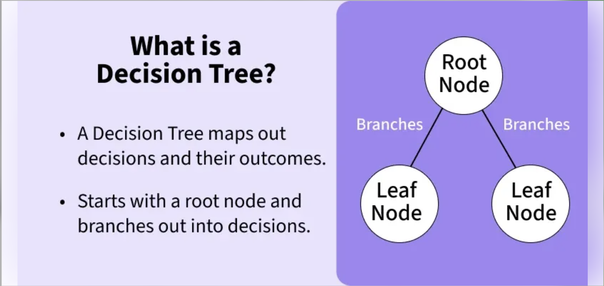


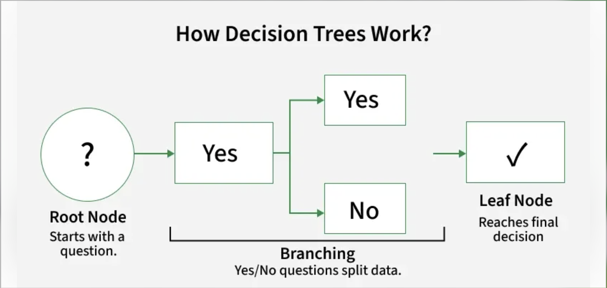


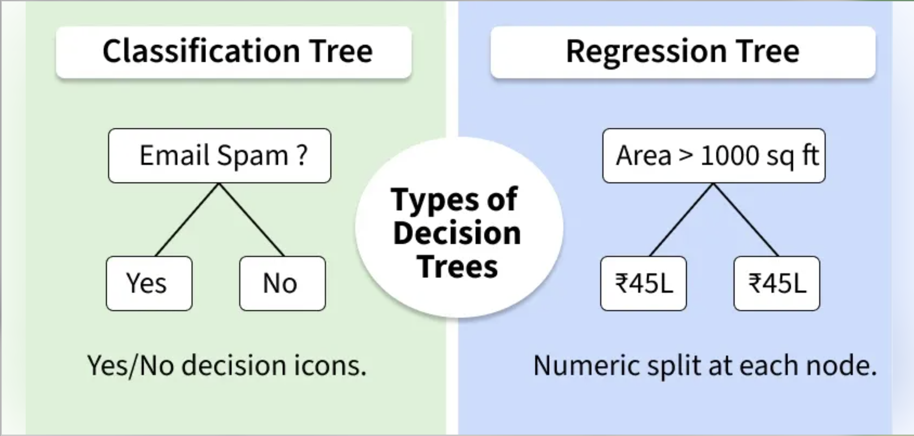


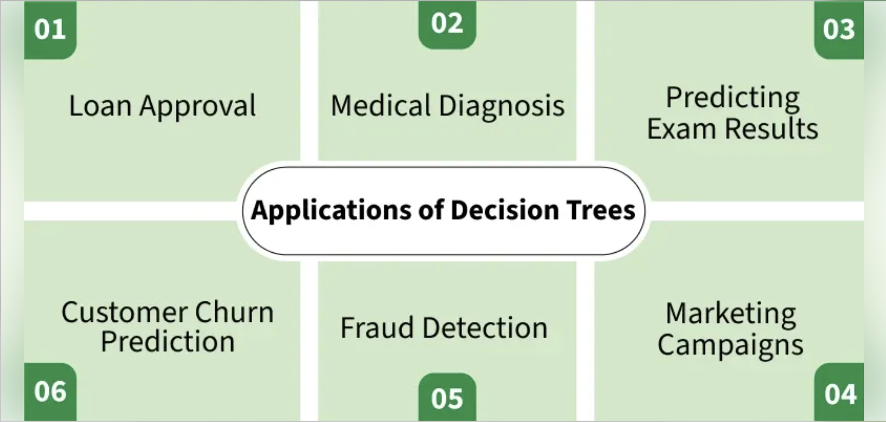

A Decision Tree helps us make decisions by showing different options and how they are related. It has a tree-like structure that starts with one main question called the root node which represents the entire dataset. From there, the tree branches out into different possibilities based on features in the data.

- **Root Node:** Starting point representing the whole dataset.

- **Branches:** Lines connecting nodes showing the flow from one decision to another.

- **Internal Nodes:** Points where decisions are made based on data features.

- **Leaf Nodes:** End points of the tree where the final decision or prediction is made.


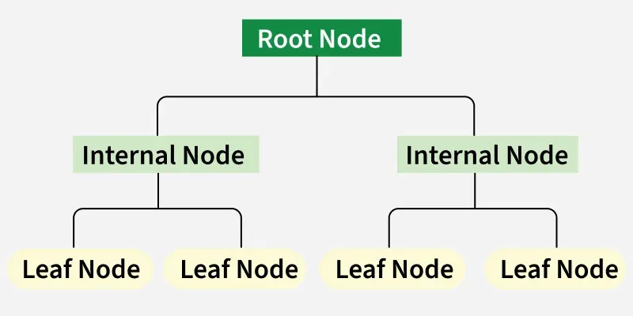

A Decision Tree also helps with decision-making by showing possible outcomes clearly. By looking at the "branches" we can quickly compare options and figure out the best choice.

There are mainly two types of Decision Trees based on the target variable:


1. **Classification Trees:** Used for predicting categorical outcomes like spam or not spam. These trees split the data based on features to classify data into predefined categories.

2. **Regression Trees:** Used for predicting continuous outcomes like predicting house prices. Instead of assigning categories, it provides numerical predictions based on the input features.


<h3 style="color:blue;">📌 How Decision Trees Work?</h3>

1. **1. Start with the Root Node:** It begins with a main question at the root node which is derived from the dataset’s features.

**2. Ask Yes/No Questions:** From the root, the tree asks a series of yes/no questions to split the data into subsets based on specific attributes.

**3. Branching Based on Answers:** Each question leads to different branches:

- If the answer is yes, the tree follows one path.

- If the answer is no, the tree follows another path.

**4. Continue Splitting:** This branching continues through further decisions helps in reducing the data down step-by-step.

**5. Reach the Leaf Node:** The process ends when there are no more useful questions to ask leading to the leaf node where the final decision or prediction is made.


Let’s look at a simple example to understand how it works. Imagine we need to decide whether to drink coffee based on the time of day and how tired we feel. The tree first checks the time:


**1. In the morning: It asks “Tired?”**

- If yes, the tree suggests drinking coffee.

- If no, it says no coffee is needed.

2. In the afternoon: It asks again “Tired?”

- If yes, it suggests drinking coffee.

- If no, no coffee is needed.


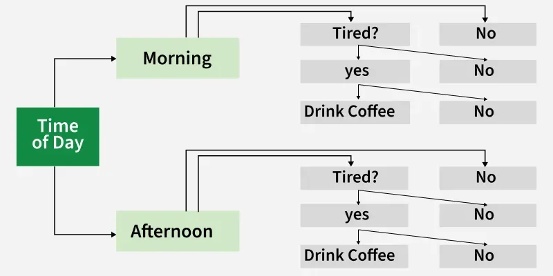


<h3 style="color:blue;">📌 Splitting Criteria in Decision Trees</h3>

In a Decision Tree, the process of splitting data at each node is important. The splitting criteria finds the best feature to split the data on. Common splitting criteria include **Gini Impurity** and **Entropy**.

- **Gini Impurity:** This criterion measures how "impure" a node is. The **lower the Gini Impurity** the better the feature splits the data into distinct categories.

- **Entropy:** This measures the amount of uncertainty or disorder in the data. The tree tries to reduce the entropy by splitting the data on features that provide the most information about the target variable.

These criteria help decide which features are useful for making the best split at each decision point in the tree.


<h3 style="color:blue;">📌 Gini Impurity and Entropy in Decision Tree</h3>

**Gini Index**

- The **Gini Index** is the additional approach to dividing a decision tree.

- **Purity** and **impurity** in a junction are the primary focus of the Entropy and Information Gain framework.

- The Gini Index, also known as Impurity, calculates the likelihood that somehow a randomly picked instance would be erroneously cataloged. 


**1. Gini Impurity**

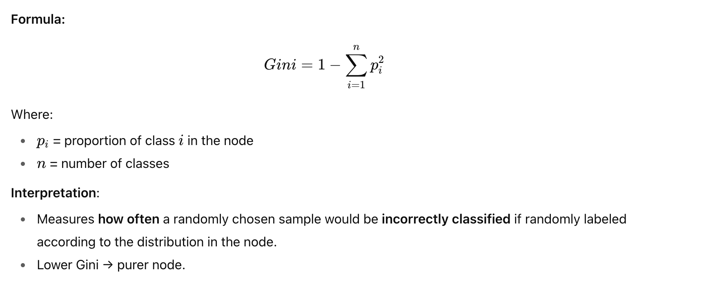


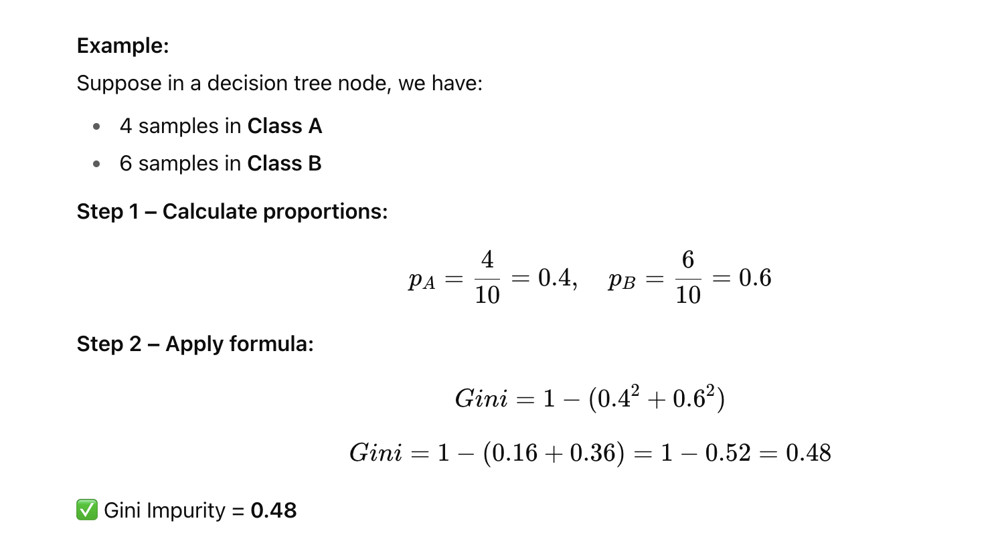


**2. Entropy (Information Gain)**

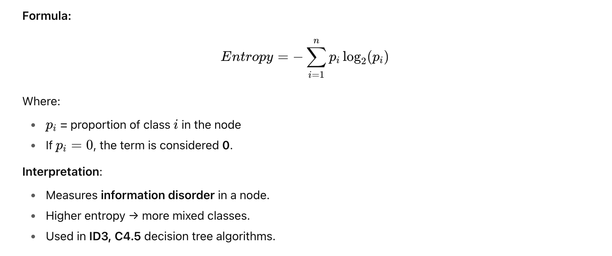


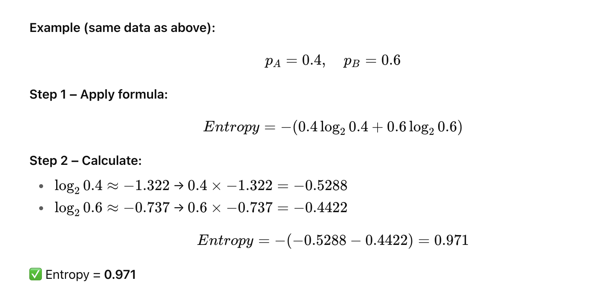


**3. Comparison**

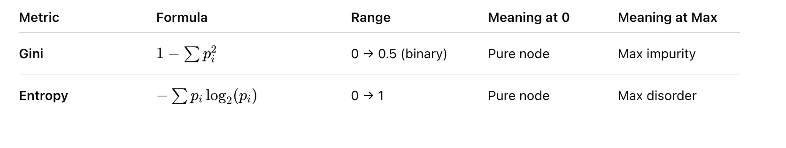


<h3 style="color:blue;">📌 Example Dataset: Weather & Play Tennis</h3>

| ID | Outlook  | PlayTennis |
| -- | -------- | ---------- |
| 1  | Sunny    | No         |
| 2  | Sunny    | No         |
| 3  | Overcast | Yes        |
| 4  | Rain     | Yes        |
| 5  | Rain     | Yes        |
| 6  | Rain     | No         |
| 7  | Overcast | Yes        |
| 8  | Sunny    | No         |
| 9  | Sunny    | Yes        |
| 10 | Rain     | Yes        |
| 11 | Sunny    | Yes        |
| 12 | Overcast | Yes        |
| 13 | Overcast | Yes        |
| 14 | Rain     | No         |


**Step 1 – Parent Node Calculation (Before Split)**

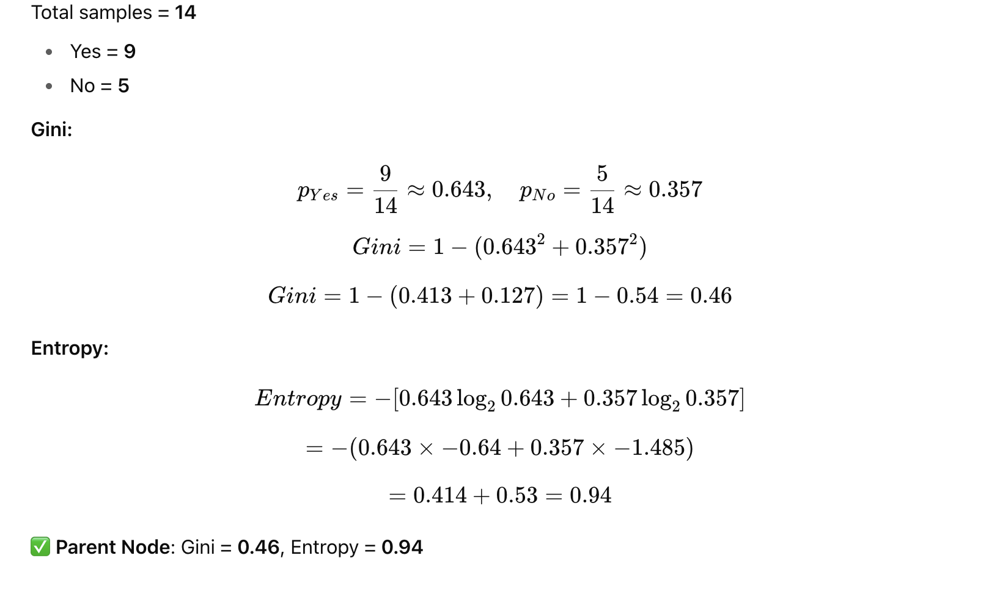


**Step 2 – Split on "Outlook"**

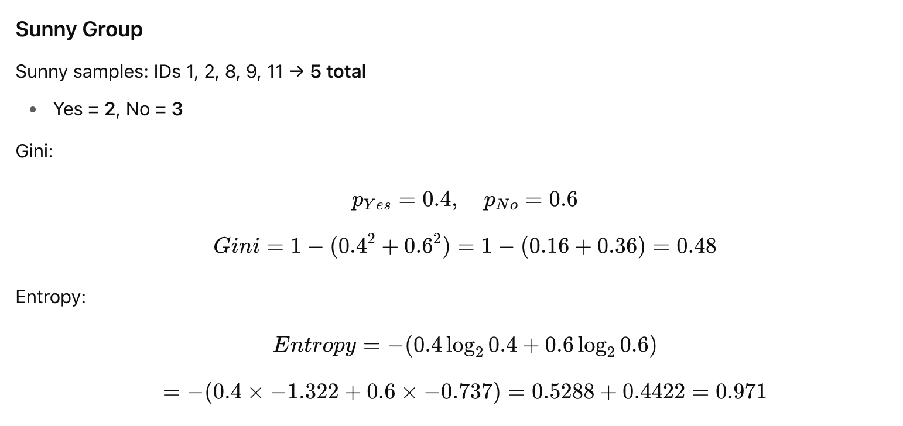


**Overcast Group**

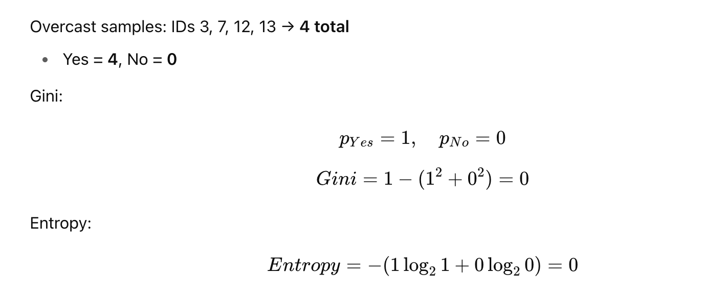

**Rain Group**

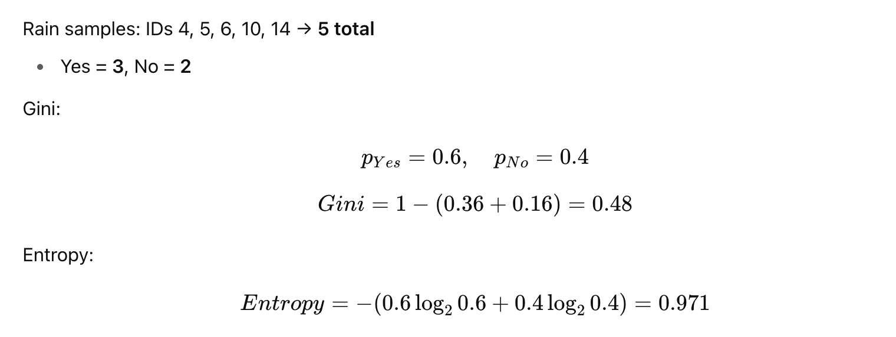


**Step 3 – Weighted Average After Split**

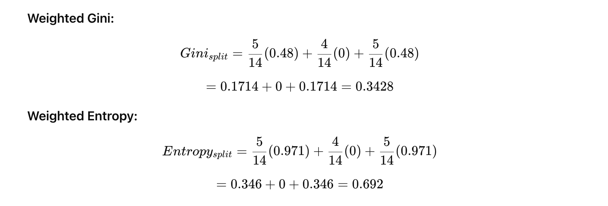


**Step 4 – Information Gain (for Entropy)**


**Step 4 – Information Gain (for Entropy)**


**✅ Summary Table**

| Group            | Yes | No | Gini  | Entropy |
| ---------------- | --- | -- | ----- | ------- |
| Parent           | 9   | 5  | 0.46  | 0.94    |
| Sunny            | 2   | 3  | 0.48  | 0.971   |
| Overcast         | 4   | 0  | 0.00  | 0.000   |
| Rain             | 3   | 2  | 0.48  | 0.971   |
| **Weighted Avg** | —   | —  | 0.343 | 0.692   |


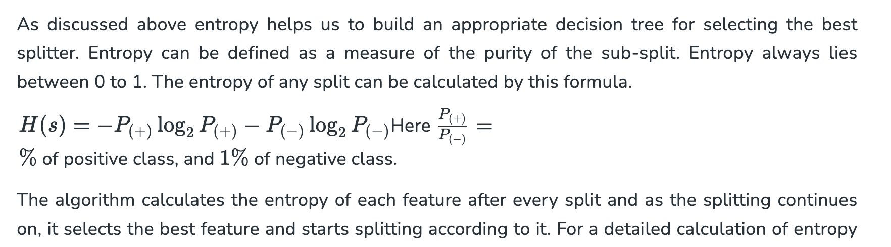


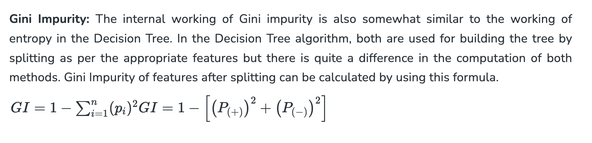


**Entropy v/s Gini Impurity:** Now we have learned about Gini Impurity and Entropy and how it actually works. Also, we have seen how we can calculate Gini Impurity/Entropy for a split/feature. But the major question that arises here is why do we need to have both methods for computation and which is better. 


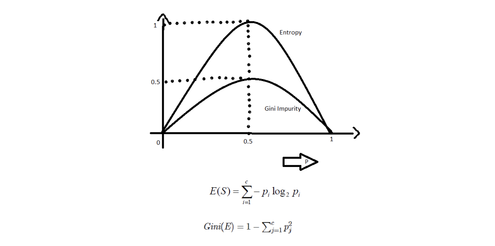

The internal workings of both methods are similar, as they are used for computing the impurity of features after each split. **However, Gini Impurity is generally more computationally efficient than entropy. The graph of entropy increases up to 1 and then starts decreasing, while Gini Impurity only goes up to 0.5 before decreasing, thus requiring less computational power. The range of entropy is from 0 to (log2C), whereas the range of Gini Impurity is from 0 to 0.5 (for binary classification)**.

```
Note: The range of Gini Impurity [0,0.5] is in case of a binary classification problem. In case of multi-class classification, you can calculate range using this method:
```

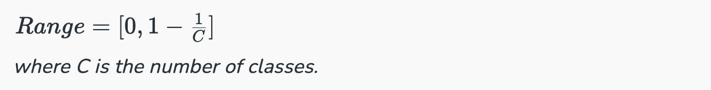

However, the main reason for Gini Impurity's computational advantage is that it does not involve logarithmic functions, which are more computationally intensive. Therefore, Gini Impurity is often considered more efficient compared to entropy for selecting the best features.


**Pruning in Decision Trees**

- Pruning is an important technique used to prevent overfitting in Decision Trees. Overfitting occurs when a tree becomes too deep and starts to memorize the training data rather than learning general patterns. This leads to poor performance on new, unseen data.

- This technique reduces the complexity of the tree by removing branches that have little predictive power. It improves model performance by helping the tree generalize better to new data. It also makes the model simpler and faster to deploy.

- It is useful when a Decision Tree is too deep and starts to capture noise in the data.

**Advantages of Decision Trees**

- **Easy to Understand:** Decision Trees are visual which makes it easy to follow the decision-making process.

- **Versatility:** Can be used for both classification and regression problems.

- **No Need for Feature Scaling:** Unlike many machine learning models, it don’t require us to scale or normalize our data.

- **Handles Non-linear Relationships:** It capture complex, non-linear relationships between features and outcomes effectively.

- **Interpretability:** The tree structure is easy to interpret helps in allowing users to understand the reasoning behind each decision.

- **Handles Missing Data:** It can handle missing values by using strategies like assigning the most common value or ignoring missing data during splits.


**Disadvantages of Decision Trees**

- **Overfitting:** They can overfit the training data if they are too deep which means they memorize the data instead of learning general patterns. This leads to poor performance on unseen data.

- **Instability:** It can be unstable which means that small changes in the data may lead to significant differences in the tree structure and predictions.

- **Bias towards Features with Many Categories:** It can become biased toward features with many distinct values which focuses too much on them and potentially missing other important features which can reduce prediction accuracy.

- **Difficulty in Capturing Complex Interactions:** Decision Trees may struggle to capture complex interactions between features which helps in making them less effective for certain types of data.

- **Computationally Expensive for Large Datasets:** For large datasets, building and pruning a Decision Tree can be computationally intensive, especially as the tree depth increases.


**Applications of Decision Trees**

Decision Trees are used across various fields due to their simplicity, interpretability and versatility lets see some key applications:

1. **Loan Approval in Banking:** Banks use Decision Trees to assess whether a loan application should be approved. The decision is based on factors like credit score, income, employment status and loan history. This helps predict approval or rejection helps in enabling quick and reliable decisions.

2. **Medical Diagnosis:** In healthcare they assist in diagnosing diseases. For example, they can predict whether a patient has diabetes based on clinical data like glucose levels, BMI and blood pressure. This helps classify patients into diabetic or non-diabetic categories, supporting early diagnosis and treatment.

3. **Predicting Exam Results in Education:** Educational institutions use to predict whether a student will pass or fail based on factors like attendance, study time and past grades. This helps teachers identify at-risk students and offer targeted support.

4. **Customer Churn Prediction:** Companies use Decision Trees to predict whether a customer will leave or stay based on behavior patterns, purchase history, and interactions. This allows businesses to take proactive steps to retain customers.

5. **Fraud Detection:** In finance, Decision Trees are used to detect fraudulent activities, such as credit card fraud. By analyzing past transaction data and patterns, Decision Trees can identify suspicious activities and flag them for further investigation.


**Example:**

```
# Import necessary libraries
import numpy as np
import pandas as pd
import matplotlib.pyplot as plt
import seaborn as sns
from sklearn.model_selection import train_test_split, cross_val_score, GridSearchCV
from sklearn.tree import DecisionTreeRegressor, plot_tree
from sklearn.metrics import mean_squared_error, r2_score, mean_absolute_error
from sklearn.preprocessing import StandardScaler
from sklearn.datasets import fetch_california_housing
import warnings
warnings.filterwarnings('ignore')

# Set random seed for reproducibility
np.random.seed(42)

print("=== Decision Tree Regression Implementation ===\n")

# 1. LOAD AND EXPLORE DATASET
print("1. Loading California Housing Dataset...")
# Load the California housing dataset - perfect for regression
california_housing = fetch_california_housing()
X = pd.DataFrame(california_housing.data, columns=california_housing.feature_names)
y = pd.Series(california_housing.target, name='MedHouseValue')

print(f"Dataset shape: {X.shape}")
print(f"Target variable range: ${y.min():.2f} - ${y.max():.2f} (in hundreds of thousands)")

# Manually define feature descriptions to avoid parsing issues
feature_info = {
    'MedInc': 'Median income in block group (in tens of thousands of USD)',
    'HouseAge': 'Median house age in years',
    'AveRooms': 'Average number of rooms per household',
    'AveBedrms': 'Average number of bedrooms per household',
    'Population': 'Population of the block group',
    'AveOccup': 'Average number of household members',
    'Latitude': 'Block group latitude',
    'Longitude': 'Block group longitude'
}

print("\nFeature descriptions:")
for feature, description in feature_info.items():
    print(f"- {feature}: {description}")


# Display basic statistics
print("\nDataset Info:")
print(X.describe().round(2))
print(f"\nTarget variable statistics:")
print(y.describe().round(2))

# 2. DATA PREPROCESSING
print("\n2. Data Preprocessing...")

# Check for missing values
print(f"Missing values in features: {X.isnull().sum().sum()}")
print(f"Missing values in target: {y.isnull().sum()}")

# Feature correlation analysis
print("\nFeature correlation with target:")
correlations = X.corrwith(y).sort_values(ascending=False)
print(correlations.round(3))

# 3. TRAIN-TEST SPLIT
print("\n3. Splitting data into train and test sets...")
X_train, X_test, y_train, y_test = train_test_split(
    X, y, test_size=0.2, random_state=42, shuffle=True
)

print(f"Training set size: {X_train.shape[0]} samples")
print(f"Test set size: {X_test.shape[0]} samples")

# 4. MODEL TRAINING WITH HYPERPARAMETER TUNING
print("\n4. Training Decision Tree Regressor with Hyperparameter Tuning...")

# Define hyperparameter grid for optimization
param_grid = {
    'max_depth': [3, 5, 7, 10, 15, None],
    'min_samples_split': [2, 5, 10, 20],
    'min_samples_leaf': [1, 2, 5, 10],
    'max_features': ['sqrt', 'log2', None] # 'auto' was removed in recent sklearn versions
}

# Initialize the regressor
dt_regressor = DecisionTreeRegressor(random_state=42)

# Perform grid search with cross-validation
print("Performing Grid Search with 5-fold Cross Validation...")
grid_search = GridSearchCV(
    estimator=dt_regressor,
    param_grid=param_grid,
    cv=5,
    scoring='neg_mean_squared_error',
    n_jobs=-1,
    verbose=0
)

# Fit the grid search
grid_search.fit(X_train, y_train)

# Get the best model
best_dt = grid_search.best_estimator_
print(f"Best parameters: {grid_search.best_params_}")
print(f"Best cross-validation score (negative MSE): {grid_search.best_score_:.4f}")

# Train a simple model for comparison
simple_dt = DecisionTreeRegressor(max_depth=5, random_state=42)
simple_dt.fit(X_train, y_train)

# 5. MODEL EVALUATION
print("\n5. Model Evaluation...")

# Make predictions
y_train_pred_best = best_dt.predict(X_train)
y_test_pred_best = best_dt.predict(X_test)
y_train_pred_simple = simple_dt.predict(X_train)
y_test_pred_simple = simple_dt.predict(X_test)

# Calculate metrics for both models
def calculate_metrics(y_true, y_pred, model_name, dataset_type):
    mse = mean_squared_error(y_true, y_pred)
    rmse = np.sqrt(mse)
    mae = mean_absolute_error(y_true, y_pred)
    r2 = r2_score(y_true, y_pred)

    print(f"\n{model_name} - {dataset_type} Set Metrics:")
    print(f"  Mean Squared Error (MSE): {mse:.4f}")
    print(f"  Root Mean Squared Error (RMSE): {rmse:.4f}")
    print(f"  Mean Absolute Error (MAE): {mae:.4f}")
    print(f"  R² Score: {r2:.4f}")

    return mse, rmse, mae, r2

# Evaluate both models
calculate_metrics(y_train, y_train_pred_best, "Best Tuned Model", "Training")
calculate_metrics(y_test, y_test_pred_best, "Best Tuned Model", "Test")
calculate_metrics(y_train, y_train_pred_simple, "Simple Model", "Training")
calculate_metrics(y_test, y_test_pred_simple, "Simple Model", "Test")

# Cross-validation scores
cv_scores_best = cross_val_score(best_dt, X_train, y_train, cv=5, scoring='neg_mean_squared_error')
cv_scores_simple = cross_val_score(simple_dt, X_train, y_train, cv=5, scoring='neg_mean_squared_error')

print(f"\nCross-validation RMSE (Best Model): {np.sqrt(-cv_scores_best.mean()):.4f} (+/- {np.sqrt(cv_scores_best.std() * 2):.4f})")
print(f"Cross-validation RMSE (Simple Model): {np.sqrt(-cv_scores_simple.mean()):.4f} (+/- {np.sqrt(cv_scores_simple.std() * 2):.4f})")

# 6. FEATURE IMPORTANCE ANALYSIS
print("\n6. Feature Importance Analysis...")
feature_importance = pd.DataFrame({
    'feature': X.columns,
    'importance_best': best_dt.feature_importances_,
    'importance_simple': simple_dt.feature_importances_
}).sort_values('importance_best', ascending=False)

print("Top 5 Most Important Features (Best Model):")
print(feature_importance.head())

# 7. VISUALIZATIONS
print("\n7. Generating Visualizations...")

# Set up the plotting style
plt.style.use('default')
fig = plt.figure(figsize=(20, 15))

# Plot 1: Actual vs Predicted (Best Model)
plt.subplot(3, 3, 1)
plt.scatter(y_test, y_test_pred_best, alpha=0.6, color='blue', s=30)
plt.plot([y_test.min(), y_test.max()], [y_test.min(), y_test.max()], 'r--', linewidth=2)
plt.xlabel('Actual Values')
plt.ylabel('Predicted Values')
plt.title('Actual vs Predicted Values (Best Model)')
plt.grid(True, alpha=0.3)

# Plot 2: Residuals Plot (Best Model)
plt.subplot(3, 3, 2)
residuals = y_test - y_test_pred_best
plt.scatter(y_test_pred_best, residuals, alpha=0.6, color='green', s=30)
plt.axhline(y=0, color='red', linestyle='--', linewidth=2)
plt.xlabel('Predicted Values')
plt.ylabel('Residuals')
plt.title('Residuals Plot (Best Model)')
plt.grid(True, alpha=0.3)

# Plot 3: Feature Importance
plt.subplot(3, 3, 3)
plt.barh(feature_importance['feature'], feature_importance['importance_best'], color='skyblue')
plt.xlabel('Importance')
plt.title('Feature Importance (Best Model)')
plt.gca().invert_yaxis()

# Plot 4: Prediction Distribution
plt.subplot(3, 3, 4)
plt.hist(y_test, bins=30, alpha=0.7, label='Actual', color='blue', edgecolor='black')
plt.hist(y_test_pred_best, bins=30, alpha=0.7, label='Predicted', color='red', edgecolor='black')
plt.xlabel('House Value')
plt.ylabel('Frequency')
plt.title('Distribution: Actual vs Predicted')
plt.legend()
plt.grid(True, alpha=0.3)

# Plot 5: Model Comparison (MSE)
plt.subplot(3, 3, 5)
models = ['Simple Model\n(max_depth=5)', 'Best Tuned Model']
train_mse = [mean_squared_error(y_train, y_train_pred_simple), mean_squared_error(y_train, y_train_pred_best)]
test_mse = [mean_squared_error(y_test, y_test_pred_simple), mean_squared_error(y_test, y_test_pred_best)]

x = np.arange(len(models))
width = 0.35

plt.bar(x - width/2, train_mse, width, label='Train MSE', color='lightblue', edgecolor='black')
plt.bar(x + width/2, test_mse, width, label='Test MSE', color='lightcoral', edgecolor='black')

plt.xlabel('Model')
plt.ylabel('Mean Squared Error')
plt.title('Model Comparison: MSE')
plt.xticks(x, models)
plt.legend()
plt.grid(True, alpha=0.3)

# Plot 6: Learning Curve (Tree Depth)
plt.subplot(3, 3, 6)
depths = range(1, 21)
train_scores = []
test_scores = []

for depth in depths:
    dt_temp = DecisionTreeRegressor(max_depth=depth, random_state=42)
    dt_temp.fit(X_train, y_train)
    train_scores.append(mean_squared_error(y_train, dt_temp.predict(X_train)))
    test_scores.append(mean_squared_error(y_test, dt_temp.predict(X_test)))

plt.plot(depths, train_scores, 'o-', color='blue', label='Training MSE', linewidth=2)
plt.plot(depths, test_scores, 'o-', color='red', label='Test MSE', linewidth=2)
plt.xlabel('Tree Depth')
plt.ylabel('Mean Squared Error')
plt.title('Learning Curve: Effect of Tree Depth')
plt.legend()
plt.grid(True, alpha=0.3)

# Plot 7: Correlation Heatmap
plt.subplot(3, 3, 7)
correlation_matrix = X.corr()
sns.heatmap(correlation_matrix, annot=True, cmap='coolwarm', center=0, square=True, fmt='.2f')
plt.title('Feature Correlation Heatmap')

# Plot 8: Cross-validation Scores
plt.subplot(3, 3, 8)
cv_results = pd.DataFrame({
    'Fold': range(1, 6),
    'Best Model': -cv_scores_best,
    'Simple Model': -cv_scores_simple
})

plt.plot(cv_results['Fold'], cv_results['Best Model'], 'o-', label='Best Model', linewidth=2, markersize=8)
plt.plot(cv_results['Fold'], cv_results['Simple Model'], 's-', label='Simple Model', linewidth=2, markersize=8)
plt.xlabel('CV Fold')
plt.ylabel('Mean Squared Error')
plt.title('Cross-Validation Performance')
plt.legend()
plt.grid(True, alpha=0.3)

# Plot 9: Tree Visualization (Simple Model)
plt.subplot(3, 3, 9)
plot_tree(simple_dt, max_depth=3, feature_names=X.columns, filled=True, fontsize=8)
plt.title('Decision Tree Structure (Simplified View)')

plt.tight_layout()
plt.show()

# 8. DETAILED ANALYSIS AND INSIGHTS
print("\n8. Model Analysis and Insights...")

# Analyze overfitting
train_r2_best = r2_score(y_train, y_train_pred_best)
test_r2_best = r2_score(y_test, y_test_pred_best)
train_r2_simple = r2_score(y_train, y_train_pred_simple)
test_r2_simple = r2_score(y_test, y_test_pred_simple)

print(f"\nOverfitting Analysis:")
print(f"Best Model - Train R²: {train_r2_best:.4f}, Test R²: {test_r2_best:.4f}")
print(f"Simple Model - Train R²: {train_r2_simple:.4f}, Test R²: {test_r2_simple:.4f}")

overfitting_best = train_r2_best - test_r2_best
overfitting_simple = train_r2_simple - test_r2_simple
print(f"Overfitting Gap (Best): {overfitting_best:.4f}")
print(f"Overfitting Gap (Simple): {overfitting_simple:.4f}")

# Model complexity analysis
print(f"\nModel Complexity:")
print(f"Best Model - Tree Depth: {best_dt.get_depth()}, Leaves: {best_dt.get_n_leaves()}")
print(f"Simple Model - Tree Depth: {simple_dt.get_depth()}, Leaves: {simple_dt.get_n_leaves()}")

# Feature importance insights
print(f"\nKey Insights:")
print(f"• Most important feature: {feature_importance.iloc[0]['feature']} ({feature_importance.iloc[0]['importance_best']:.3f})")
print(f"• Least important feature: {feature_importance.iloc[-1]['feature']} ({feature_importance.iloc[-1]['importance_best']:.3f})")

# Performance summary
print(f"\nFinal Model Performance Summary:")
print(f"• Best model RMSE on test set: ${np.sqrt(mean_squared_error(y_test, y_test_pred_best)):.2f} (hundreds of thousands)")
print(f"• This represents an average prediction error of ~${np.sqrt(mean_squared_error(y_test, y_test_pred_best))*100000:.0f}")
print(f"• Model explains {test_r2_best:.1%} of the variance in house prices")

print("\n=== Analysis Complete ===")
```
