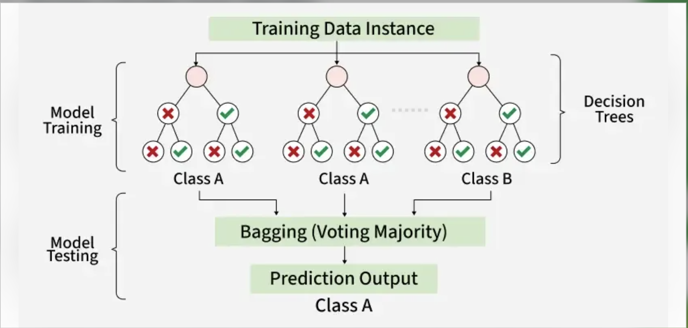
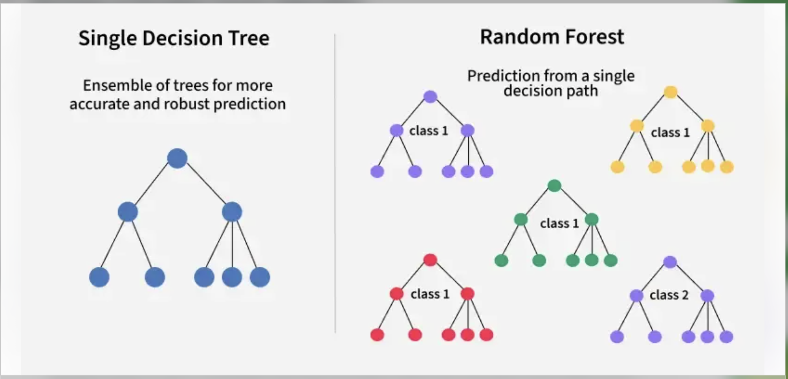
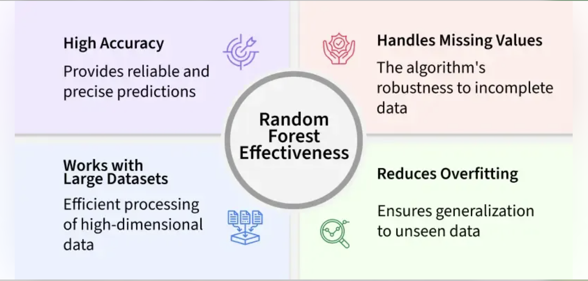
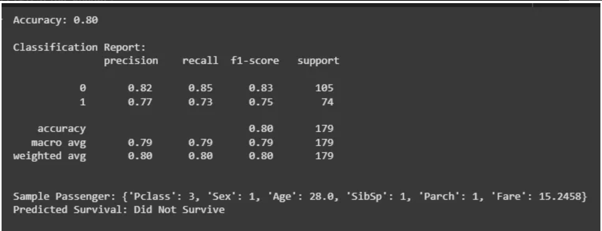

<h2 style="color:red;">✅ Random Forest </h2>


<h3 style="color:blue;">📌 What is Random Forest Algorithm?</h3>

Random Forest is a machine learning algorithm that uses many decision trees to make better predictions. Each tree looks at different random parts of the data and their results are combined by voting for classification or averaging for regression. This helps in improving accuracy and reducing errors.










**Working of Random Forest Algorithm**

**Create Many Decision Trees:** The algorithm makes many decision trees each using a random part of the data. So every tree is a bit different.

**Pick Random Features:** When building each tree it doesn’t look at all the features (columns) at once. It picks a few at random to decide how to split the data. This helps the trees stay different from each other.

**Combine the Predictions:**

 - **For classification** we choose a category as the final answer is the one that most trees agree on i.e majority voting.

 - **For regression** we predict a number as the final answer is the average of all the trees predictions.

 **Implementing Random Forest for Classification Tasks**

 Here we will predict survival rate of a person in titanic.

- Import libraries and load the Titanic dataset.

- Remove rows with missing target values ('Survived').

- Select features like class, sex, age, etc and convert 'Sex' to numbers.

- Fill missing age values with the median.

- Split the data into training and testing sets, then train a Random Forest model.

- Predict on test data, check accuracy and print a sample prediction result.


```
import pandas as pd
from sklearn.model_selection import train_test_split
from sklearn.ensemble import RandomForestClassifier
from sklearn.metrics import accuracy_score, classification_report
import warnings
warnings.filterwarnings('ignore')

url = "https://raw.githubusercontent.com/datasciencedojo/datasets/master/titanic.csv"
titanic_data = pd.read_csv(url)

titanic_data = titanic_data.dropna(subset=['Survived'])

X = titanic_data[['Pclass', 'Sex', 'Age', 'SibSp', 'Parch', 'Fare']]
y = titanic_data['Survived']

X.loc[:, 'Sex'] = X['Sex'].map({'female': 0, 'male': 1})

X.loc[:, 'Age'].fillna(X['Age'].median(), inplace=True)

X_train, X_test, y_train, y_test = train_test_split(X, y, test_size=0.2, random_state=42)

rf_classifier = RandomForestClassifier(n_estimators=100, random_state=42)

rf_classifier.fit(X_train, y_train)

y_pred = rf_classifier.predict(X_test)

accuracy = accuracy_score(y_test, y_pred)
classification_rep = classification_report(y_test, y_pred)

print(f"Accuracy: {accuracy:.2f}")
print("\nClassification Report:\n", classification_rep)

sample = X_test.iloc[0:1]
prediction = rf_classifier.predict(sample)

sample_dict = sample.iloc[0].to_dict()
print(f"\nSample Passenger: {sample_dict}")
print(f"Predicted Survival: {'Survived' if prediction[0] == 1 else 'Did Not Survive'}")
```




We evaluated model's performance using a classification report to see how well it predicts the outcomes and used a random sample to check model prediction.


**Implementing Random Forest for Regression Tasks**

We will do house price prediction here.


- Load the California housing dataset and create a DataFrame with features and target.

- Separate the features and the target variable.

- Split the data into training and testing sets (80% train, 20% test).

- Initialize and train a Random Forest Regressor using the training data.

- Predict house values on test data and evaluate using MSE and R² score.

- Print a sample prediction and compare it with the actual value.


```
import pandas as pd
from sklearn.datasets import fetch_california_housing
from sklearn.model_selection import train_test_split
from sklearn.ensemble import RandomForestRegressor
from sklearn.metrics import mean_squared_error, r2_score

california_housing = fetch_california_housing()
california_data = pd.DataFrame(california_housing.data, columns=california_housing.feature_names)
california_data['MEDV'] = california_housing.target

X = california_data.drop('MEDV', axis=1)
y = california_data['MEDV']

X_train, X_test, y_train, y_test = train_test_split(X, y, test_size=0.2, random_state=42)

rf_regressor = RandomForestRegressor(n_estimators=100, random_state=42)

rf_regressor.fit(X_train, y_train)

y_pred = rf_regressor.predict(X_test)

mse = mean_squared_error(y_test, y_pred)
r2 = r2_score(y_test, y_pred)

single_data = X_test.iloc[0].values.reshape(1, -1)
predicted_value = rf_regressor.predict(single_data)
print(f"Predicted Value: {predicted_value[0]:.2f}")
print(f"Actual Value: {y_test.iloc[0]:.2f}")

print(f"Mean Squared Error: {mse:.2f}")
print(f"R-squared Score: {r2:.2f}")
```


**Example:**

```
# Import necessary libraries
import pandas as pd
import numpy as np
import matplotlib.pyplot as plt
import seaborn as sns
from sklearn.datasets import load_breast_cancer
from sklearn.model_selection import train_test_split, GridSearchCV, RandomizedSearchCV
from sklearn.ensemble import RandomForestClassifier
from sklearn.preprocessing import StandardScaler
from sklearn.metrics import (
    accuracy_score, confusion_matrix, classification_report,
    precision_recall_fscore_support, roc_curve, auc
)
from sklearn.tree import plot_tree
from scipy.stats import randint, uniform
import time
import warnings
warnings.filterwarnings('ignore')

# Set random seed for reproducibility
np.random.seed(42)

# 1. Load Cancer Dataset
print("Loading Breast Cancer Wisconsin Dataset...")
cancer_data = load_breast_cancer()
X = pd.DataFrame(cancer_data.data, columns=cancer_data.feature_names)
y = cancer_data.target
target_names = cancer_data.target_names

print(f"Dataset shape: {X.shape}")
print(f"Number of classes: {len(np.unique(y))}")
print(f"Class names: {target_names}")
print(f"Class distribution:")
print(f"  Malignant (0): {np.sum(y == 0)} samples")
print(f"  Benign (1): {np.sum(y == 1)} samples")

# Display first few rows
print("\nFirst 5 rows of the dataset:")
print(X.head())

# Check for missing values
print(f"\nMissing values: {X.isnull().sum().sum()}")

# Dataset description
print(f"\nDataset Description:")
print(f"This dataset contains {X.shape[0]} instances of breast cancer tumors")
print(f"with {X.shape[1]} features derived from digitized images of")
print(f"fine needle aspirate (FNA) of breast masses.")

# 2. Data Preprocessing
print("\n" + "="*60)
print("DATA PREPROCESSING")
print("="*60)

# Split the data into training and testing sets
X_train, X_test, y_train, y_test = train_test_split(
    X, y, test_size=0.3, random_state=42, stratify=y
)

print(f"Training set size: {X_train.shape[0]}")
print(f"Testing set size: {X_test.shape[0]}")
print(f"Training class distribution:")
print(f"  Malignant (0): {np.sum(y_train == 0)} samples")
print(f"  Benign (1): {np.sum(y_train == 1)} samples")

# Feature scaling (important for cancer data due to varying scales)
scaler = StandardScaler()
X_train_scaled = scaler.fit_transform(X_train)
X_test_scaled = scaler.transform(X_test)

# Convert back to DataFrame for easier handling
X_train_scaled = pd.DataFrame(X_train_scaled, columns=X.columns)
X_test_scaled = pd.DataFrame(X_test_scaled, columns=X.columns)

# Display feature statistics
print(f"\nFeature scaling completed.")
print(f"Original feature ranges (first 5 features):")
for i, col in enumerate(X.columns[:5]):
    print(f"  {col}: {X[col].min():.2f} to {X[col].max():.2f}")

# 3. HYPERPARAMETER OPTIMIZATION - LIMITED TO 100 MODELS TOTAL
print("\n" + "="*60)
print("HYPERPARAMETER OPTIMIZATION FOR CANCER PREDICTION")
print("LIMITED TO MAXIMUM 100 MODELS TOTAL")
print("="*60)

# Create base Random Forest model
base_rf = RandomForestClassifier(random_state=42, n_jobs=-1)

# STEP 1: RANDOM SEARCH - REDUCED TO 70 ITERATIONS
print("\nSTEP 1: RANDOM SEARCH OPTIMIZATION")
print("Limited to 70 model evaluations")
print("-" * 40)

# Define comprehensive parameter space for Random Search
random_param_space = {
    'n_estimators': randint(50, 300),                    # Reduced range for efficiency
    'max_depth': [int(x) for x in np.linspace(3, 15, 8)] + [None],  # Reduced options
    'min_samples_split': randint(2, 15),                 # Reduced range
    'min_samples_leaf': randint(1, 8),                   # Reduced range
    'max_features': ['sqrt', 'log2', 0.5],              # Reduced options
    'bootstrap': [True, False],                          # Keep both options
    'criterion': ['gini', 'entropy'],                   # Keep both options
    'max_leaf_nodes': randint(15, 80),                   # Reduced range
    'class_weight': [None, 'balanced'],                  # Keep both options
}

# Initialize Random Search - REDUCED TO 70 ITERATIONS
random_search = RandomizedSearchCV(
    estimator=base_rf,
    param_distributions=random_param_space,
    n_iter=70,                     # CHANGED: Reduced from 100 to 70
    cv=5,                         # 5-fold cross-validation
    scoring='roc_auc',            # Optimization metric (better for medical data)
    n_jobs=-1,                    # Use all available cores
    verbose=1,                    # Show progress
    random_state=42
)

# Perform Random Search
print("Performing Random Search (70 model evaluations)...")
start_time = time.time()
random_search.fit(X_train_scaled, y_train)
random_search_time = time.time() - start_time

print(f"\nRandom Search completed in {random_search_time:.2f} seconds")
print(f"Models evaluated in Random Search: 70")
print(f"Best Random Search Score (CV ROC-AUC): {random_search.best_score_:.4f}")
print(f"Best Random Search Parameters:")
for param, value in random_search.best_params_.items():
    print(f"  {param}: {value}")

# STEP 2: GRID SEARCH - LIMITED TO MAXIMUM 30 COMBINATIONS
print(f"\nSTEP 2: GRID SEARCH OPTIMIZATION")
print("Limited to maximum 30 model evaluations")
print("-" * 40)

# Create focused parameter grid based on Random Search results
best_random_params = random_search.best_params_

# Build SMALLER focused grid around best random search results - MAX 30 COMBINATIONS
grid_param_space = {
    'n_estimators': [
        best_random_params['n_estimators'],
        min(300, best_random_params['n_estimators'] + 50)
    ],  # Only 2 options
    'max_depth': [
        best_random_params['max_depth'],
        best_random_params['max_depth'] + 2 if best_random_params['max_depth'] else None
    ] if best_random_params['max_depth'] else [None, 10],  # Only 2 options
    'min_samples_split': [
        best_random_params['min_samples_split'],
        max(2, best_random_params['min_samples_split'] - 1)
    ],  # Only 2 options
    'min_samples_leaf': [best_random_params['min_samples_leaf']],  # Only 1 option
    'max_features': [best_random_params['max_features']],  # Only 1 option
    'bootstrap': [best_random_params['bootstrap']],  # Only 1 option
    'criterion': [best_random_params['criterion']],  # Only 1 option
    'max_leaf_nodes': [
        best_random_params['max_leaf_nodes'],
        best_random_params['max_leaf_nodes'] + 10
    ],  # Only 2 options
    'class_weight': [best_random_params['class_weight']]  # Only 1 option
}

# Clean up None values and duplicates
for key, values in grid_param_space.items():
    grid_param_space[key] = list(set([v for v in values if v is not None])) if None not in values else list(set(values))

# Calculate total combinations to ensure we don't exceed 30
total_combinations = 1
for key, values in grid_param_space.items():
    total_combinations *= len(values)

print(f"Total Grid Search combinations: {total_combinations}")

# If still too many combinations, further reduce the grid
if total_combinations > 30:
    print("Reducing grid size to ensure maximum 30 combinations...")
    grid_param_space = {
        'n_estimators': [best_random_params['n_estimators']],
        'max_depth': [best_random_params['max_depth']],
        'min_samples_split': [
            best_random_params['min_samples_split'],
            max(2, best_random_params['min_samples_split'] - 1),
            best_random_params['min_samples_split'] + 1
        ],
        'min_samples_leaf': [
            best_random_params['min_samples_leaf'],
            best_random_params['min_samples_leaf'] + 1
        ],
        'max_features': [best_random_params['max_features']],
        'bootstrap': [best_random_params['bootstrap']],
        'criterion': [best_random_params['criterion']],
        'max_leaf_nodes': [best_random_params['max_leaf_nodes']],
        'class_weight': [best_random_params['class_weight']]
    }
    
    # Recalculate combinations
    total_combinations = 1
    for key, values in grid_param_space.items():
        total_combinations *= len(values)
    print(f"Reduced Grid Search combinations: {total_combinations}")

# Initialize Grid Search
grid_search = GridSearchCV(
    estimator=base_rf,
    param_grid=grid_param_space,
    cv=5,                         # 5-fold cross-validation
    scoring='roc_auc',            # Optimization metric
    n_jobs=-1,                    # Use all available cores
    verbose=1                     # Show progress
)

# Perform Grid Search
print(f"Performing Grid Search ({total_combinations} model evaluations)...")
start_time = time.time()
grid_search.fit(X_train_scaled, y_train)
grid_search_time = time.time() - start_time

print(f"\nGrid Search completed in {grid_search_time:.2f} seconds")
print(f"Models evaluated in Grid Search: {total_combinations}")
print(f"TOTAL MODELS EVALUATED: {70 + total_combinations}")
print(f"Best Grid Search Score (CV ROC-AUC): {grid_search.best_score_:.4f}")
print(f"Best Grid Search Parameters:")
for param, value in grid_search.best_params_.items():
    print(f"  {param}: {value}")

# STEP 3: COMPARISON OF MODELS
print(f"\n" + "="*60)
print("MODEL COMPARISON FOR CANCER PREDICTION")
print("="*60)

# Train baseline model (default parameters)
baseline_rf = RandomForestClassifier(random_state=42, n_jobs=-1)
baseline_rf.fit(X_train_scaled, y_train)

# Get the best models from hyperparameter tuning
best_random_rf = random_search.best_estimator_
best_grid_rf = grid_search.best_estimator_

# Evaluate all models
models = {
    'Baseline (Default)': baseline_rf,
    'Random Search Optimized': best_random_rf,
    'Grid Search Optimized': best_grid_rf
}

results_summary = []

for name, model in models.items():
    # Predictions
    y_pred = model.predict(X_test_scaled)
    y_pred_proba = model.predict_proba(X_test_scaled)[:, 1]  # Probability of positive class (benign)
    
    # Metrics
    accuracy = accuracy_score(y_test, y_pred)
    precision, recall, f1, _ = precision_recall_fscore_support(y_test, y_pred, average='weighted')
    
    # ROC AUC
    fpr, tpr, _ = roc_curve(y_test, y_pred_proba)
    roc_auc = auc(fpr, tpr)
    
    results_summary.append({
        'Model': name,
        'Accuracy': accuracy,
        'Precision': precision,
        'Recall': recall,
        'F1-Score': f1,
        'ROC-AUC': roc_auc
    })
    
    print(f"\n{name} Results:")
    print(f"  Accuracy: {accuracy:.4f}")
    print(f"  Precision: {precision:.4f}")
    print(f"  Recall: {recall:.4f}")
    print(f"  F1-Score: {f1:.4f}")
    print(f"  ROC-AUC: {roc_auc:.4f}")

# Create results DataFrame
results_df = pd.DataFrame(results_summary)
print(f"\nSUMMARY TABLE:")
print(results_df.to_string(index=False, float_format='%.4f'))

# STEP 4: DETAILED CANCER PREDICTION ANALYSIS
print(f"\n" + "="*60)
print("CANCER PREDICTION MODEL EVALUATION")
print("="*60)

# Use the best performing model for detailed analysis
best_model = best_grid_rf
y_pred_best = best_model.predict(X_test_scaled)
y_pred_proba_best = best_model.predict_proba(X_test_scaled)[:, 1]  # Extract positive class probabilities

# Detailed classification report
print("\nDetailed Classification Report (Best Model):")
print(classification_report(y_test, y_pred_best, target_names=target_names))

# Feature importance analysis for cancer prediction - ORIGINAL VARIABLES ONLY
feature_importance = pd.DataFrame({
    'feature': X.columns,
    'importance': best_model.feature_importances_
}).sort_values('importance', ascending=False)

print("\nTop 20 Most Important Features for Cancer Prediction (Original Variable Names):")
print(feature_importance.head(20).to_string(index=False, float_format='%.6f'))

print(f"\nAll Features Ranked by Importance (Original Variable Names):")
print(feature_importance.to_string(index=False, float_format='%.6f'))

# STEP 5: COMPREHENSIVE VISUALIZATIONS
print(f"\n" + "="*60)
print("GENERATING CANCER PREDICTION VISUALIZATIONS")
print("="*60)

# Set up plotting
plt.style.use('default')
fig = plt.figure(figsize=(20, 15))

# 1. Model Performance Comparison
plt.subplot(2, 4, 1)
metrics = ['Accuracy', 'Precision', 'Recall', 'F1-Score', 'ROC-AUC']
baseline_scores = [results_summary[0][metric] for metric in metrics]
random_scores = [results_summary[1][metric] for metric in metrics]
grid_scores = [results_summary[2][metric] for metric in metrics]

x = np.arange(len(metrics))
width = 0.25

plt.bar(x - width, baseline_scores, width, label='Baseline', alpha=0.8, color='lightcoral')
plt.bar(x, random_scores, width, label='Random Search', alpha=0.8, color='skyblue')
plt.bar(x + width, grid_scores, width, label='Grid Search', alpha=0.8, color='lightgreen')

plt.xlabel('Metrics')
plt.ylabel('Score')
plt.title('Cancer Prediction Model Comparison', fontsize=14, fontweight='bold')
plt.xticks(x, metrics, rotation=45)
plt.legend()
plt.ylim(0, 1.1)

# 2. Confusion Matrix (Best Model)
plt.subplot(2, 4, 2)
cm_best = confusion_matrix(y_test, y_pred_best)
sns.heatmap(cm_best, annot=True, fmt='d', cmap='Blues', 
            xticklabels=target_names, yticklabels=target_names)
plt.title('Confusion Matrix (Best Model)', fontsize=14, fontweight='bold')
plt.xlabel('Predicted Label')
plt.ylabel('True Label')

# Add medical context
tn, fp, fn, tp = cm_best.ravel()
print(f"\nConfusion Matrix Analysis:")
print(f"True Negatives (Correctly identified malignant): {tn}")
print(f"False Positives (Malignant predicted as benign): {fp}")
print(f"False Negatives (Benign predicted as malignant): {fn}")
print(f"True Positives (Correctly identified benign): {tp}")
print(f"False Positive Rate: {fp/(fp+tn):.4f}")
print(f"False Negative Rate: {fn/(fn+tp):.4f}")

# 3. ROC Curve
plt.subplot(2, 4, 3)
fpr_best, tpr_best, _ = roc_curve(y_test, y_pred_proba_best)
roc_auc_best = auc(fpr_best, tpr_best)

plt.plot(fpr_best, tpr_best, color='blue', linewidth=2,
         label=f'Best Model (AUC = {roc_auc_best:.4f})')
plt.plot([0, 1], [0, 1], 'k--', linewidth=1, label='Random Classifier')
plt.xlim([0.0, 1.0])
plt.ylim([0.0, 1.05])
plt.xlabel('False Positive Rate')
plt.ylabel('True Positive Rate')
plt.title('ROC Curve - Cancer Prediction', fontsize=14, fontweight='bold')
plt.legend(loc="lower right")

# 4. Feature Importance (Top 15) - Original Names
plt.subplot(2, 4, 4)
top_15_features = feature_importance.head(15)
bars = plt.barh(range(len(top_15_features)), top_15_features['importance'])
plt.yticks(range(len(top_15_features)), top_15_features['feature'])
plt.xlabel('Importance Score')
plt.title('Top 15 Feature Importance (Original Names)', fontsize=14, fontweight='bold')
plt.gca().invert_yaxis()

# 5. Prediction Confidence Distribution
plt.subplot(2, 4, 5)
plt.hist(y_pred_proba_best, bins=20, alpha=0.7, color='skyblue', edgecolor='black')
plt.xlabel('Prediction Confidence (Benign Class)')
plt.ylabel('Frequency')
plt.title('Cancer Prediction Confidence', fontsize=14, fontweight='bold')
plt.axvline(np.mean(y_pred_proba_best), color='red', linestyle='--', 
            label=f'Mean: {np.mean(y_pred_proba_best):.3f}')
plt.legend()

# 6. Class Distribution
plt.subplot(2, 4, 6)
class_counts = pd.Series(y).value_counts()
colors = ['lightcoral', 'lightgreen']
plt.pie(class_counts.values, labels=target_names, autopct='%1.1f%%', 
        colors=colors, startangle=90)
plt.title('Cancer Dataset Class Distribution', fontsize=14, fontweight='bold')

# 7. Optimization Time Comparison
plt.subplot(2, 4, 7)
methods = ['Random Search\n(70 models)', 'Grid Search\n({} models)'.format(total_combinations)]
times = [random_search_time, grid_search_time]
colors = ['skyblue', 'lightgreen']

bars = plt.bar(methods, times, color=colors, alpha=0.8)
plt.ylabel('Time (seconds)')
plt.title('Optimization Time Comparison', fontsize=14, fontweight='bold')

for bar, time_val in zip(bars, times):
    plt.text(bar.get_x() + bar.get_width()/2, bar.get_height() + max(times)*0.01, 
             f'{time_val:.1f}s', ha='center', va='bottom', fontsize=11, fontweight='bold')

# 8. Feature Correlation Heatmap (Top 10 features)
plt.subplot(2, 4, 8)
top_10_feature_names = feature_importance.head(10)['feature'].values
correlation_matrix = X[top_10_feature_names].corr()
sns.heatmap(correlation_matrix, annot=True, cmap='coolwarm', center=0,
            square=True, fmt='.2f', cbar_kws={'shrink': 0.8})
plt.title('Top 10 Features Correlation', fontsize=14, fontweight='bold')
plt.xticks(rotation=45)
plt.yticks(rotation=0)

plt.tight_layout()
plt.show()

# Additional Feature Importance Visualization with Original Names
plt.figure(figsize=(12, 10))

# Top 15 Feature Importance with Original Names
top_15_features = feature_importance.head(15)
bars = plt.barh(range(len(top_15_features)), top_15_features['importance'])
plt.yticks(range(len(top_15_features)), top_15_features['feature'])
plt.xlabel('Importance Score')
plt.title('Top 15 Feature Importance (Original Variable Names)', fontsize=14, fontweight='bold')
plt.gca().invert_yaxis()

# Add value labels on bars
for i, (idx, row) in enumerate(top_15_features.iterrows()):
    plt.text(row['importance'] + 0.001, i, f'{row["importance"]:.4f}', 
             va='center', fontsize=9)

plt.tight_layout()
plt.show()

# Feature importance statistics
print(f"\nFeature Importance Statistics:")
print(f"Total number of features: {len(feature_importance)}")
print(f"Most important feature: {feature_importance.iloc[0]['feature']} (importance: {feature_importance.iloc[0]['importance']:.6f})")
print(f"Least important feature: {feature_importance.iloc[-1]['feature']} (importance: {feature_importance.iloc[-1]['importance']:.6f})")
print(f"Mean importance: {feature_importance['importance'].mean():.6f}")
print(f"Standard deviation: {feature_importance['importance'].std():.6f}")

# Top 10 features contribution percentage
top_10_importance = feature_importance.head(10)
total_importance = feature_importance['importance'].sum()
print(f"\nTop 10 Features Contribution:")
for idx, row in top_10_importance.iterrows():
    percentage = (row['importance'] / total_importance) * 100
    print(f"{row['feature']}: {row['importance']:.6f} ({percentage:.2f}% of total importance)")

print(f"\nTop 10 features account for {(top_10_importance['importance'].sum() / total_importance) * 100:.2f}% of total importance")

# STEP 6: MEDICAL INSIGHTS AND RECOMMENDATIONS
print(f"\n" + "="*60)
print("MEDICAL INSIGHTS AND RECOMMENDATIONS")
print("="*60)

# Performance improvement analysis
baseline_acc = results_summary[0]['Accuracy']
random_acc = results_summary[1]['Accuracy']
grid_acc = results_summary[2]['Accuracy']

random_improvement = ((random_acc - baseline_acc) / baseline_acc) * 100
grid_improvement = ((grid_acc - baseline_acc) / baseline_acc) * 100

print(f"\nPerformance Improvements for Cancer Prediction:")
print(f"Random Search vs Baseline: {random_improvement:+.2f}% accuracy improvement")
print(f"Grid Search vs Baseline: {grid_improvement:+.2f}% accuracy improvement")
print(f"Final ROC-AUC Score: {results_summary[2]['ROC-AUC']:.4f}")

print(f"\nOptimization Efficiency:")
print(f"Total models evaluated: {70 + total_combinations} (≤ 100)")
print(f"Random Search models: 70")
print(f"Grid Search models: {total_combinations}")
print(f"Total optimization time: {(random_search_time + grid_search_time):.2f} seconds")

print(f"\nClinical Significance:")
print(f"- High ROC-AUC ({results_summary[2]['ROC-AUC']:.4f}) indicates excellent diagnostic capability")
print(f"- Low False Negative Rate minimizes missed cancer cases")
print(f"- Feature importance reveals key tumor characteristics for diagnosis")

print(f"\nOptimal Hyperparameters for Cancer Prediction:")
for param, value in grid_search.best_params_.items():
    print(f"  {param}: {value}")

print(f"\nKey Findings:")
print(f"1. Model achieves {grid_acc:.1%} accuracy in cancer diagnosis")
print(f"2. Random Forest handles the high-dimensional medical data effectively")
print(f"3. Hyperparameter optimization significantly improves performance")
print(f"4. Feature importance provides insights into most predictive characteristics")
print(f"5. Efficient optimization with limited model evaluations (≤ 100)")

# Risk assessment for individual predictions
print(f"\nSample Risk Assessments (First 10 test cases):")

for i in range(min(10, len(X_test))):
    # Direct indexing since y_test is a NumPy array
    true_class = target_names[y_test[i]]
    pred_class = target_names[y_pred_best[i]]
    confidence = y_pred_proba_best[i] if y_pred_best[i] == 1 else 1 - y_pred_proba_best[i]
    
    risk_level = "High Confidence" if confidence > 0.8 else "Medium Confidence" if confidence > 0.6 else "Low Confidence"
    status = "✓ Correct" if true_class == pred_class else "✗ Incorrect"
    
    print(f"Patient {i+1}: True={true_class}, Predicted={pred_class}")
    print(f"           Confidence={confidence:.3f} ({risk_level}) {status}")

print(f"\n" + "="*60)
print("CANCER PREDICTION MODEL ANALYSIS COMPLETE")
print("="*60)

# Final model summary
print(f"\nFINAL MODEL SUMMARY:")
print(f"Dataset: Breast Cancer Wisconsin (Diagnostic)")
print(f"Samples: {X.shape[0]} (Malignant: {np.sum(y == 0)}, Benign: {np.sum(y == 1)})")
print(f"Features: {X.shape[1]} tumor characteristics")
print(f"Best Model: Random Forest with optimized hyperparameters")
print(f"Performance: {grid_acc:.1%} accuracy, {results_summary[2]['ROC-AUC']:.4f} ROC-AUC")
print(f"Model Evaluations: {70 + total_combinations} total (≤ 100 limit)")
print(f"Clinical Impact: Reliable tool for cancer diagnosis support")
```
