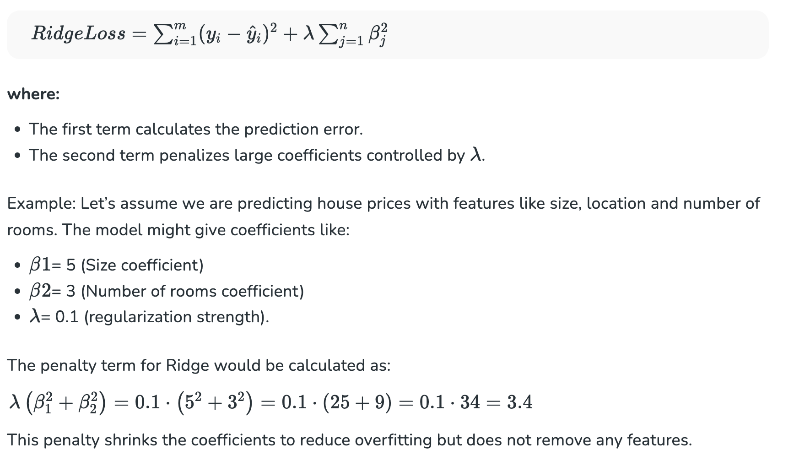
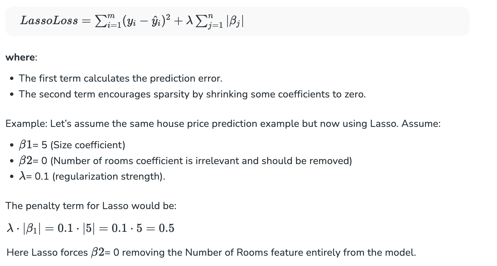
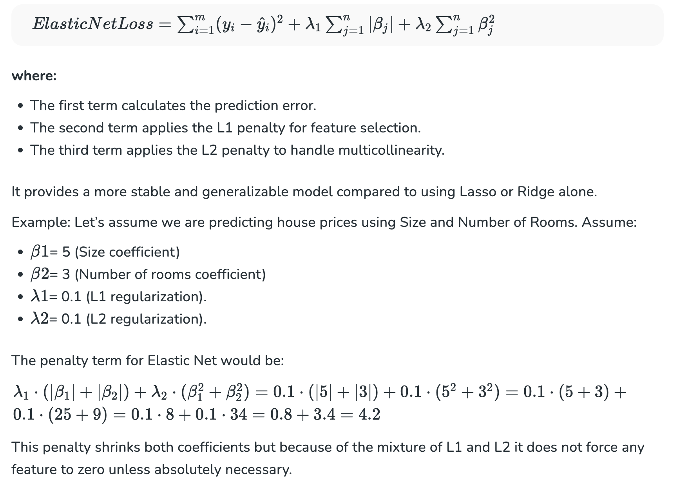

<h2 style="color:red;">✅ Lasso vs Ridge vs Elastic Net </h2>

Regularization methods like Lasso, Ridge and Elastic Net help improve linear regression models by preventing overfitting which address multicollinearity and helps in feature selection. These techniques increase the model’s accuracy and stability.

<h3 style="color:blue;">📌 What is Ridge Regression (L2 Regularization)?</h3>

Ridge regression is a technique used to address overfitting by adding a penalty to the model's complexity. It introduces an L2 penalty (also called L2 regularization) which is the sum of the squares of the model's coefficients. This penalty term reduces the size of large coefficients but keeps all features in the model. This prevents overfitting with correlated features.

**Formula for Ridge Regression:**




<h3 style="color:blue;">📌 Lasso Regression (L1 Regularization)?</h3>

Lasso regression addresses overfitting by adding an L1 penalty i.e sum of absolute coefficients to the model's loss function. This encourages some coefficients to become exactly zero helps in effectively removing less important features. It also helps to simplify the model by selecting only the key features.


**Formula for Lasso Regression:**




<h3 style="color:blue;">📌 Elastic Net Regression (L1 + L2 Regularization)?</h3>

Elastic Net regression combines both L1 (Lasso) and L2 (Ridge) penalties to perform feature selection, manage multicollinearity and balancing coefficient shrinkage. This works well when there are many correlated features helps in avoiding the problem where Lasso might randomly pick one and ignore others.

**Formula for Elastic Net Regression:**




**Lasso vs Ridge vs Elastic Net**

<table border="1" style="border-collapse: collapse; text-align: left; width: 100%;">
<tr style="background-color:#f2f2f2;">
<th>Features</th>
<th style="background-color:#fff2e6;">Lasso Regression</th>
<th style="background-color:#e6f7ff;">Ridge Regression</th>
<th style="background-color:#e6ffe6;">Elastic Net Regression</th>
</tr>

<tr>
<td><b>Penalty Type</b></td>
<td style="background-color:#fff2e6;">L1 Penalty: Uses absolute values of coefficients.</td>
<td style="background-color:#e6f7ff;">L2 Penalty: Uses the square of the coefficients.</td>
<td style="background-color:#e6ffe6;">L1 + L2 Penalty: Combines absolute and square penalties.</td>
</tr>

<tr>
<td><b>Effect on Coefficients</b></td>
<td style="background-color:#fff2e6;">Completely removes unnecessary features by setting coefficients to zero.</td>
<td style="background-color:#e6f7ff;">Makes all coefficients smaller but does not set them to zero.</td>
<td style="background-color:#e6ffe6;">Removes some features and reduces others by balancing both.</td>
</tr>

<tr>
<td><b>Best Use Case</b></td>
<td style="background-color:#fff2e6;">Best when we want to remove irrelevant features.</td>
<td style="background-color:#e6f7ff;">Best when all features matter but their impact should be reduced.</td>
<td style="background-color:#e6ffe6;">Best when features are correlated and feature selection is needed.</td>
</tr>

<tr>
<td><b>Hyperparameters Involved</b></td>
<td style="background-color:#fff2e6;">Alpha: Controls regularization strength (higher alpha = more shrinkage).</td>
<td style="background-color:#e6f7ff;">Alpha: Same as Lasso for controlling regularization strength.</td>
<td style="background-color:#e6ffe6;">Alpha + L1_ratio: Alpha controls strength; L1_ratio balances Lasso & Ridge.</td>
</tr>

<tr>
<td><b>Bias and Variance</b></td>
<td style="background-color:#fff2e6;">High bias, low variance.</td>
<td style="background-color:#e6f7ff;">Low bias, high variance.</td>
<td style="background-color:#e6ffe6;">Balanced bias and variance.</td>
</tr>

<tr>
<td><b>Strengths</b></td>
<td style="background-color:#fff2e6;">Automatically chooses important features.</td>
<td style="background-color:#e6f7ff;">Works well when features are related but shouldn’t be completely removed.</td>
<td style="background-color:#e6ffe6;">Combines Lasso’s feature selection with Ridge’s handling of correlations.</td>
</tr>

<tr>
<td><b>Weaknesses</b></td>
<td style="background-color:#fff2e6;">May remove useful features if not tuned well.</td>
<td style="background-color:#e6f7ff;">Keeps all features, which may not help in high-dimensional irrelevant data.</td>
<td style="background-color:#e6ffe6;">Harder to tune due to having two parameters.</td>
</tr>

<tr>
<td><b>Example</b></td>
<td style="background-color:#fff2e6;">With 100 features to predict house prices, sets irrelevant features (like house color) to zero.</td>
<td style="background-color:#e6f7ff;">With 100 features, reduces the impact of all features but doesn’t remove any.</td>
<td style="background-color:#e6ffe6;">If “size” and “rooms” are similar, removes one and shrinks the other.</td>
</tr>

</table>


**Example:**

```
# Import necessary libraries
from sklearn.linear_model import LinearRegression, Lasso, Ridge, ElasticNet
from sklearn.model_selection import GridSearchCV, train_test_split
from sklearn.metrics import mean_squared_error, mean_absolute_error, r2_score
from sklearn.datasets import fetch_california_housing
from sklearn.preprocessing import StandardScaler
import pandas as pd
import numpy as np
import matplotlib.pyplot as plt
import seaborn as sns

# Load the California Housing dataset
data = fetch_california_housing(as_frame=True)
df = data.frame

# Preprocess the data
X = df.drop(columns=['MedHouseVal'])
y = df['MedHouseVal']
scaler = StandardScaler()
X_scaled = scaler.fit_transform(X)

# Split the data into training and testing sets
X_train, X_test, y_train, y_test = train_test_split(X_scaled, y, test_size=0.2, random_state=42)

# Fit Linear Regression model
linear_model = LinearRegression()
linear_model.fit(X_train, y_train)
y_pred_linear = linear_model.predict(X_test)

# Fit Lasso Regression model with hyperparameter tuning
lasso_params = {'alpha': [0.01, 0.1, 1, 10, 100]}
lasso_model = GridSearchCV(Lasso(), lasso_params, cv=5, scoring='r2')
lasso_model.fit(X_train, y_train)
y_pred_lasso = lasso_model.best_estimator_.predict(X_test)

# Fit Ridge Regression model with hyperparameter tuning
ridge_params = {'alpha': [0.01, 0.1, 1, 10, 100]}
ridge_model = GridSearchCV(Ridge(), ridge_params, cv=5, scoring='r2')
ridge_model.fit(X_train, y_train)
y_pred_ridge = ridge_model.best_estimator_.predict(X_test)

# Fit Elastic Net Regression model with hyperparameter tuning
elastic_params = {'alpha': [0.01, 0.1, 1, 10, 100], 'l1_ratio': [0.1, 0.5, 0.9]}
elastic_model = GridSearchCV(ElasticNet(), elastic_params, cv=5, scoring='r2')
elastic_model.fit(X_train, y_train)
y_pred_elastic = elastic_model.best_estimator_.predict(X_test)

# Evaluate models
results = pd.DataFrame({
    'Model': ['Linear', 'Lasso', 'Ridge', 'Elastic Net'],
    'MSE': [mean_squared_error(y_test, y_pred_linear),
            mean_squared_error(y_test, y_pred_lasso),
            mean_squared_error(y_test, y_pred_ridge),
            mean_squared_error(y_test, y_pred_elastic)],
    'MAE': [mean_absolute_error(y_test, y_pred_linear),
            mean_absolute_error(y_test, y_pred_lasso),
            mean_absolute_error(y_test, y_pred_ridge),
            mean_absolute_error(y_test, y_pred_elastic)],
    'R²': [r2_score(y_test, y_pred_linear),
           r2_score(y_test, y_pred_lasso),
           r2_score(y_test, y_pred_ridge),
           r2_score(y_test, y_pred_elastic)]
})
print(results)

# Plot model performance
results.set_index('Model').plot(kind='bar', figsize=(10, 6))
plt.title('Model Performance Comparison')
plt.ylabel('Metric Value')
plt.show()
```
