<h2 style="color:red;">✅ Clustering</h2>


<h3 style="color:blue;">📌 What is K means Clustering?</h3>

K-Means Clustering is an Unsupervised Machine Learning algorithm which groups unlabeled dataset into different clusters. It is used to organize data into **groups based on their similarity**.


<h3 style="color:blue;">📌 Understanding K-means Clustering</h3>

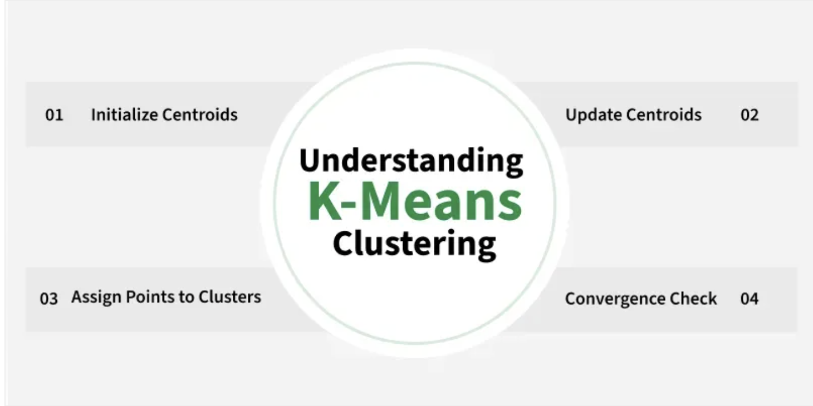

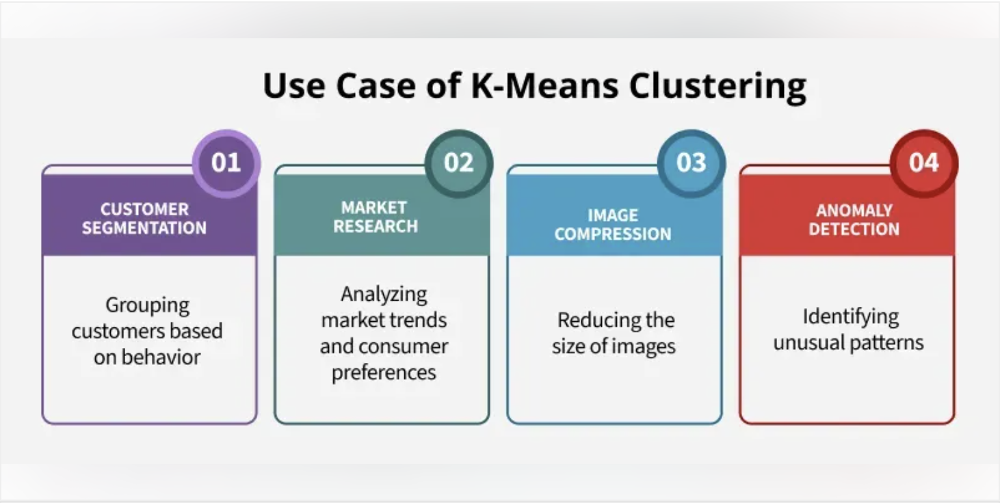

For example online store uses K-Means to group customers based on purchase frequency and spending creating segments like Budget Shoppers, Frequent Buyers and Big Spenders for personalised marketing.

- The algorithm works by first randomly picking some central points called centroids and each data point is then assigned to the closest centroid forming a cluster.

- After all the points are assigned to a cluster the centroids are updated by finding the average position of the points in each cluster.

- This process repeats until the centroids stop changing forming clusters.

- The goal of clustering is to divide the data points into clusters so that similar data points belong to same group.

<h3 style="color:blue;">📌 How k-means clustering works?</h3>

We are given a data set of items with certain features and values for these features like a vector.

The task is to categorize those items into groups. To achieve this we will use the K-means algorithm. 'K' in the name of the algorithm represents the number of groups/clusters we want to classify our items into.


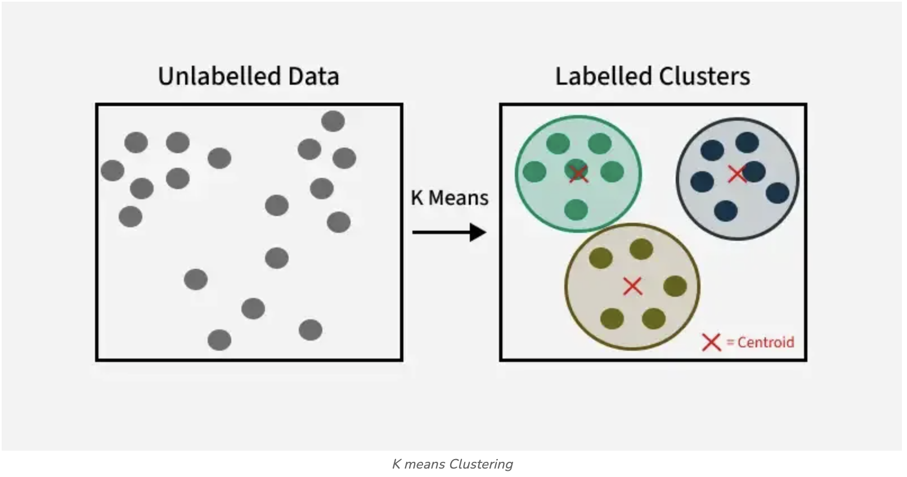

The algorithm will categorize the items into k groups or clusters of similarity.To calculate that similarity we will use the **Euclidean distance** as a measurement. The algorithm works as follows:  

1. First we randomly initialize **k points** called **means** or **cluster centroids**.

2. We categorize each item to its **closest mean** and we **update the mean's coordinates**, which are the **averages of the items categorized in that cluster** so far.

3. We repeat the process for a **given number of iterations** and at the end, we have our clusters.

**In K-Means:**

- You start with **some initial cluster centers (means)**.

- These **means are just points in your feature space**.

- There are **two common ways** to choose them:

    1. Pick random **data points** as means.

    2. Pick random **values** within the **range of the dataset**.

**Suppose you have this dataset:**

| Customer ID | Age (x1) | Income (x2 in \$K) |
| ----------- | -------- | ------------------ |
| 1           | 25       | 40                 |
| 2           | 30       | 45                 |
| 3           | 35       | 50                 |
| 4           | 60       | 100                |
| 5           | 65       | 105                |


This is a **2D dataset** (Age and Income).

✅ **Method 1: Initialize means using random data points**

We randomly choose **k=2** actual rows as our initial centers:

- Mean 1 = (25, 40)

- Mean 2 = (60, 100)

These are **real customers**, just chosen as starting points.


✅ **Method 2: Initialize means using random values within feature ranges**

Here, we use the **min and max** of each feature:

- **Age:** min = 25, max = 65 ⇒ range = [25, 65]

- **Income:** min = 40, max = 105 ⇒ range = [40, 105]

Now randomly generate any values within this box:

- **Mean 1** = (30.5, 80.2) ← random numbers between 25–65 and 40–105

- **Mean 2** = (58.3, 45.0)

🤔 **Why do we need different ways?**

- **Random points from the dataset:** safer, avoids outliers.

- **Random values in the feature space:** more flexible, but risky if the range has irrelevant areas (e.g., outliers can skew the range).


🔁 **After Initialization**

No matter how you initialize:

- K-Means will **iteratively adjust the means** by:

    - Assigning each point to the nearest mean.

    - Recomputing each mean as the **average of its assigned points**.

- The algorithm stops when the means stop changing significantly.


**Summary:**

| Method                      | Example                    | Notes                      |
| --------------------------- | -------------------------- | -------------------------- |
| Pick random data points     | (25, 40), (60, 100)        | Easy, safe                 |
| Pick random values in range | (30.5, 80.2), (58.3, 45.0) | More flexible, but riskier |


<h3 style="color:blue;">📌 Example: K-Means Initialization Methods with Visualization</h3>

```
import numpy as np
import matplotlib.pyplot as plt
import random

# Sample dataset: [Age, Income]
data = np.array([
    [25, 40],
    [30, 45],
    [35, 50],
    [60, 100],
    [65, 105]
])

# Function to initialize centroids using method 1 (random points from data)
def init_random_points(data, k=2):
    indices = random.sample(range(len(data)), k)
    return data[indices]

# Function to initialize centroids using method 2 (random values within range)
def init_random_values(data, k=2):
    mins = data.min(axis=0)
    maxs = data.max(axis=0)
    return np.array([np.random.uniform(mins, maxs) for _ in range(k)])

# Initialize
np.random.seed(42)  # for reproducibility
k = 2
means_method1 = init_random_points(data, k)
means_method2 = init_random_values(data, k)

# Plotting
plt.figure(figsize=(8, 6))
plt.scatter(data[:, 0], data[:, 1], c='blue', label='Data Points')
plt.scatter(means_method1[:, 0], means_method1[:, 1], c='green', marker='X', s=200, label='Method 1: Data Points')
plt.scatter(means_method2[:, 0], means_method2[:, 1], c='red', marker='P', s=200, label='Method 2: Random Values')
plt.xlabel("Age")
plt.ylabel("Income ($K)")
plt.title("K-Means Initialization Methods")
plt.legend()
plt.grid(True)
plt.show()
```

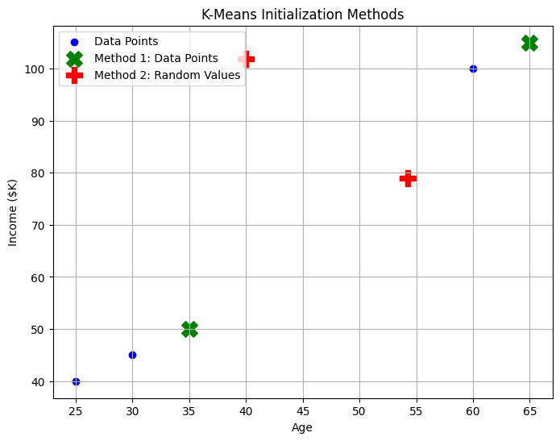

📊 **What You'll See:**

- **Blue dots** = original customer data (Age vs. Income)

- **Green 'X' markers** = initial means chosen from actual data points

- **Red 'P' markers** = initial means from **random values inside feature range**

This will help you visually compare how these two initialization strategies place the cluster centers.


<h3 style="color:blue;">📌 Euclidean Distance</h3>

**Euclidean Distance** is defined as the distance between two points in Euclidean space.To find the distance between two points, the length of the line segment that connects the two points should be measured.

Euclidean distance is like **measuring the straightest and shortest path between two points**.

Imagine you have a string and you stretch it tight between two points on a map; the length of that string is the Euclidean distance. It tells you how far apart the two points are without any turns or bends, just like a bird would fly directly from one spot to another.

This metric is based on the **Pythagorean theorem** and is widely utilized in various fields such as machine learning, data analysis, computer vision, and more.


**Euclidean Distance Formula**

Consider two points (x1, y1) and (x2, y2) in a 2-dimensional space; the Euclidean Distance between them is given by using the formula:

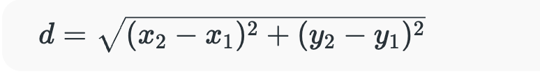

Where,

- d is Euclidean Distance,

- (x1, y1) is the Coordinate of the first point,

- (x2, y2) is the Coordinate of the second point.

**Euclidean Distance in 3D**

If the two points (x1, y1, z1) and (x2, y2, z2) are in a 3-dimensional space, the Euclidean Distance between them is given by using the formula:

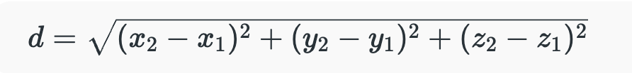

Where,

- d is Euclidean Distance,

- (x1, y1, z1) is the Coordinate of the first point,

- (x2, y2, z2) is the Coordinate of the second point.


**Euclidean Distance in nD**

In general, the Euclidean Distance formula between two points (x11, x12, x13, ...., x1n) and (x21, x22, x23, ...., x2n) in an n-dimensional space is given by the formula:

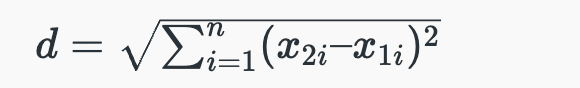


Where,

- i Ranges from 1 to n,

- d is Euclidean distance,

- (x11, x12, x13, ...., x1n) is the Coordinate of the First Point,

- (x21, x22, x23, ...., x2n) is the Coordinate of the Second Point.

**Euclidean Distance Formula Derivation**

Euclidean Distance Formula is derived by following the steps added below:

- **Step 1:** Let us consider two points, A (x1, y1) and B (x2, y2), and d is the distance between the two points.

- **Step 2:** Join the points using a straight line (AB).

- **Step 3:** Now, let us construct a right-angled triangle whose hypotenuse is AB, as shown in the figure below.

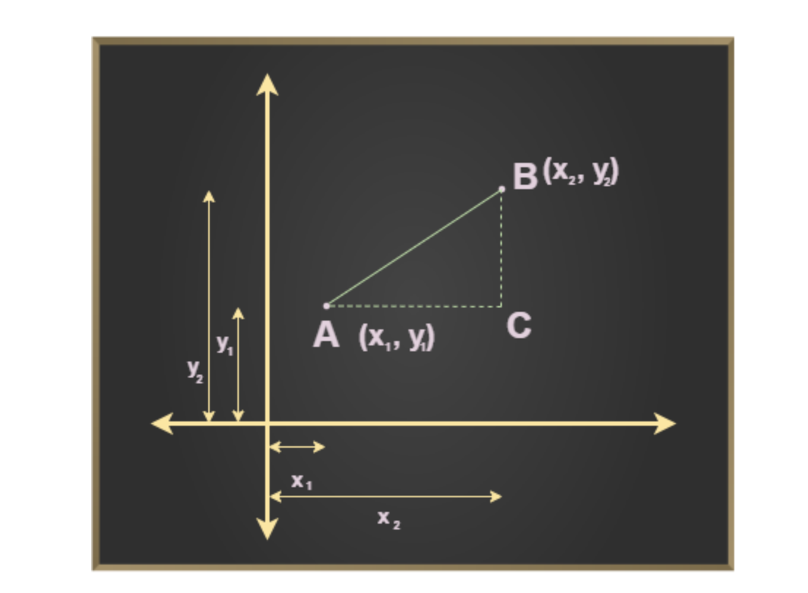


**Step 4:** Now, using Pythagoras theorem we know that,

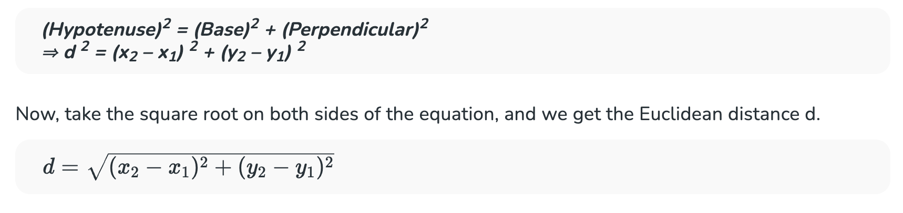


**Note:**
Selecting the right number of clusters is important for meaningful segmentation to do this we use **Elbow Method for optimal value of k in KMeans** which is a graphical tool used to determine the optimal number of clusters (k) in K-means.


<h3 style="color:blue;">📌 Elbow Method for optimal value of k in KMeans</h3>

Choosing the optimal number of clusters is a crucial step in any unsupervised learning algorithm.

Since we don’t have predefined cluster counts in unsupervised learning, we need a systematic approach to determine the best k value. The **Elbow Method** is a popular technique used for this purpose in K-Means clustering.


<h3 style="color:blue;">📌 Elbow Method in K-Means Clustering</h3>

In K-Means clustering, we start by randomly initializing k clusters and iteratively adjusting these clusters until they stabilize at an equilibrium point. However, before we can do this, we need to decide how many clusters (k) we should use.

The Elbow Method helps us find this optimal k value. Here’s how it works:

1. We iterate over a range of k values, typically from 1 to n (where n is a hyper-parameter you choose).

2. For each k, we calculate the **Within-Cluster Sum of Squares (WCSS)**.

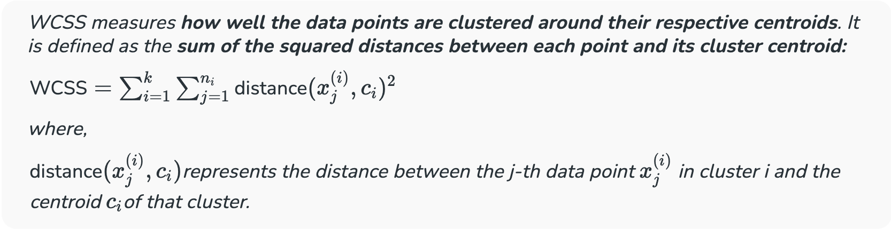


**The Elbow Point: Optimal k Value**

The Elbow Method works in below steps:

- **We calculate a distance measure called WCSS (Within-Cluster Sum of Squares)**. This tells us how spread out the data points are within each cluster.

- **We try different k values (number of clusters).** For each k, we run KMeans and calculate the WCSS.

- **We plot a graph with k on the X-axis and WCSS on the Y-axis.**

- **Identifying the Elbow Point:** As we increase kkk, the WCSS typically decreases because we're creating more clusters, which tend to capture more data variations. However, there comes a point where adding more clusters results in only a marginal decrease in WCSS. This is where we observe an "elbow" shape in the graph.

    - **Before the elbow:** Increasing kkk significantly reduces WCSS, indicating that new clusters effectively capture more of the data's variability.

    - **After the elbow:** Adding more clusters results in a minimal reduction in WCSS, suggesting that these extra clusters may not be necessary and could lead to overfitting.


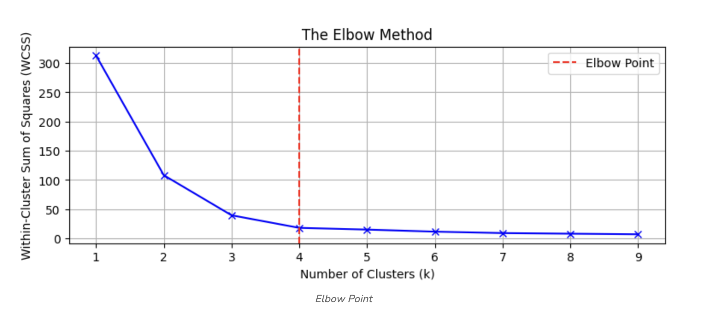


The goal is to identify the point where the rate of decrease in WCSS sharply changes, indicating that adding more clusters (beyond this point) yields diminishing returns. This "elbow" point suggests the optimal number of clusters.


<h3 style="color:blue;">📌 Understanding Distortion and Inertia in K-Means Clustering</h3>

In K-Means clustering, we aim to group similar data points together. To evaluate the quality of these groupings, we use two key metrics: **Distortion** and **Inertia**.

**1. Distortion**

Distortion measures the average squared distance between each data point and its assigned cluster center. It's a measure of how well the clusters represent the data. A lower distortion value indicates better clustering.


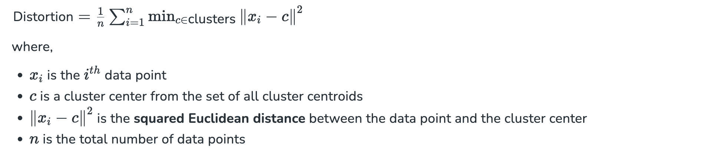

**2. Inertia**

Inertia is the sum of squared distances of each data point to its closest cluster center. It's essentially the total squared error of the clustering. Like distortion, a lower inertia value suggests better clustering.

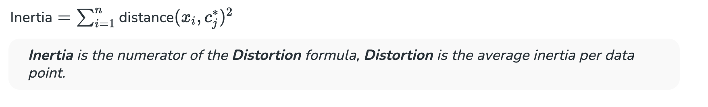

In the Elbow Method, we calculate the distortion or inertia for different values of k (number of clusters). We then plot these values to identify the "elbow point", where the rate of decrease in distortion or inertia starts to slow down. This elbow point often indicates the optimal number of clusters.


**A Lower Distortion or Inertia is Generally Better**

**A lower distortion or inertia implies that the data points are more closely grouped around their respective cluster centers.** However, it's important to balance this with the number of clusters. Too few clusters might not capture the underlying structure of the data, while too many clusters can lead to overfitting.

By understanding distortion and inertia, we can effectively evaluate the quality of K-Means clustering and select the optimal number of clusters.

<h3 style="color:blue;">📌 Implementation of Elbow Method</h3>

In this section, we will demonstrate how to implement the Elbow Method to determine the optimal number of clusters (k) using Python's Scikit-learn library. We will create a random dataset, apply K-means clustering, calculate the Within-Cluster Sum of Squares (WCSS) for different values of k, and visualize the results to determine the optimal number of clusters.


<h3 style="color:blue;">📌 Step 1: Importing the required libraries</h3>

```
from sklearn.cluster import KMeans
from sklearn import metrics
from scipy.spatial.distance import cdist
import numpy as np
import matplotlib.pyplot as plt
```

<h3 style="color:blue;">📌 Step 2: Creating and Visualizing the data</h3>

We will create a random array and visualize its distribution

```
# Creating the dataset
x1 = np.array([3, 1, 1, 2, 1, 6, 6, 6, 5, 6,
               7, 8, 9, 8, 9, 9, 8, 4, 4, 5, 4])
x2 = np.array([5, 4, 5, 6, 5, 8, 6, 7, 6, 7,
               1, 2, 1, 2, 3, 2, 3, 9, 10, 9, 10])
X = np.array(list(zip(x1, x2))).reshape(len(x1), 2)

# Visualizing the data
plt.scatter(x1, x2, marker='o')
plt.xlim([0, 10])
plt.ylim([0, 10])
plt.title('Dataset Visualization')
plt.xlabel('Feature 1')
plt.ylabel('Feature 2')
plt.show()
```

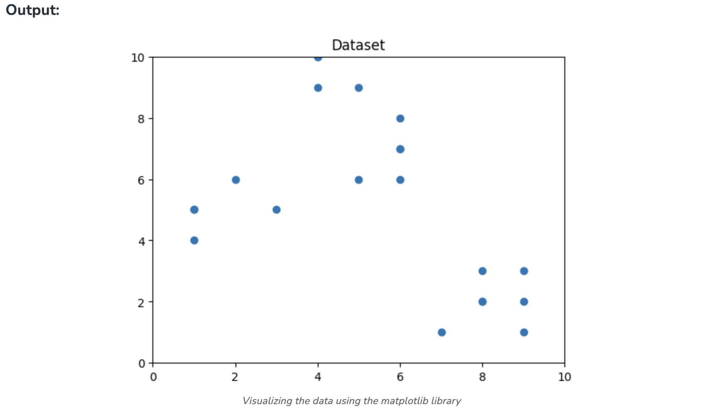


From the above visualization, we can see that the optimal number of clusters should be around 3. But visualizing the data alone cannot always give the right answer. Hence we demonstrate the following steps.


<h3 style="color:blue;">📌 Step 3: Building the Clustering Model and Calculating Distortion and Inertia</h3>

In this step, we will fit the K-means model for different values of k (number of clusters) and calculate both the distortion and inertia for each value.

```
distortions = []
inertias = []
mapping1 = {}
mapping2 = {}
K = range(1, 10)

for k in K:
    kmeanModel = KMeans(n_clusters=k, random_state=42).fit(X)
    
    distortions.append(sum(np.min(cdist(X, kmeanModel.cluster_centers_, 'euclidean'), axis=1)**2) / X.shape[0])
    
    inertias.append(kmeanModel.inertia_)
    
    mapping1[k] = distortions[-1]
    mapping2[k] = inertias[-1]
```

<h3 style="color:blue;">📌 Step 4: Tabulating and Visualizing the Results</h3>

**a) Displaying Distortion Values**

```
print("Distortion values:")
for key, val in mapping1.items():
    print(f'{key} : {val}')

plt.plot(K, distortions, 'bx-')
plt.xlabel('Number of Clusters (k)')
plt.ylabel('Distortion')
plt.title('The Elbow Method using Distortion')
plt.show()
```

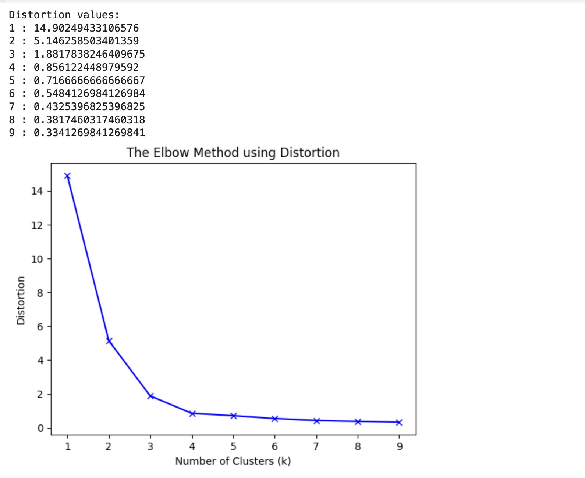


**b) Displaying Inertia Values:**

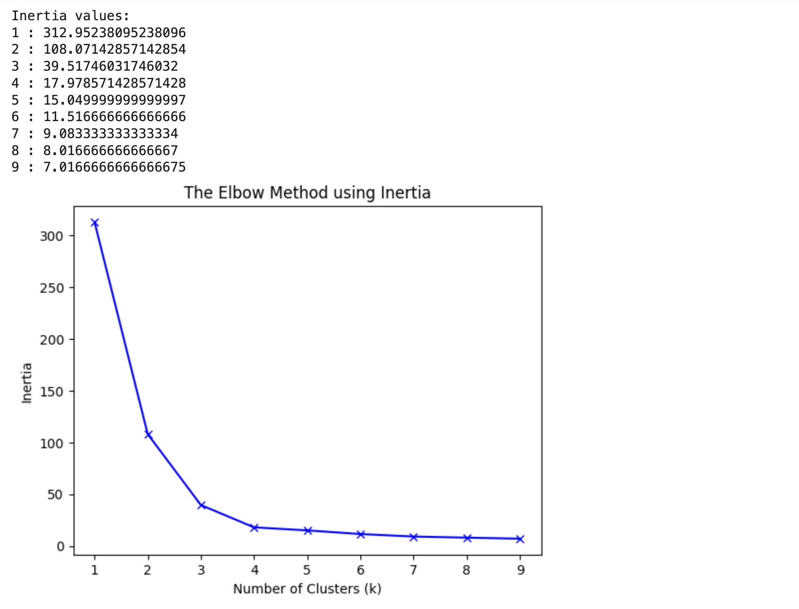


<h3 style="color:blue;">📌 Step 5: Clustered Data Points For Different k Values</h3>

We will plot images of data points clustered for different values of k. For this, we will apply the k-means algorithm on the dataset by iterating on a range of k values.


```
k_range = range(1, 5)

for k in k_range:
    kmeans = KMeans(n_clusters=k, init='k-means++', random_state=42)
    y_kmeans = kmeans.fit_predict(X)
    
    plt.scatter(X[:, 0], X[:, 1], c=y_kmeans, cmap='viridis', marker='o', edgecolor='k', s=100)
    plt.scatter(kmeans.cluster_centers_[:, 0], kmeans.cluster_centers_[:, 1],
                s=300, c='red', label='Centroids', edgecolor='k')
    plt.title(f'K-means Clustering (k={k})')
    plt.xlabel('Feature 1')
    plt.ylabel('Feature 2')
    plt.legend()
    plt.grid()
    plt.show()
```

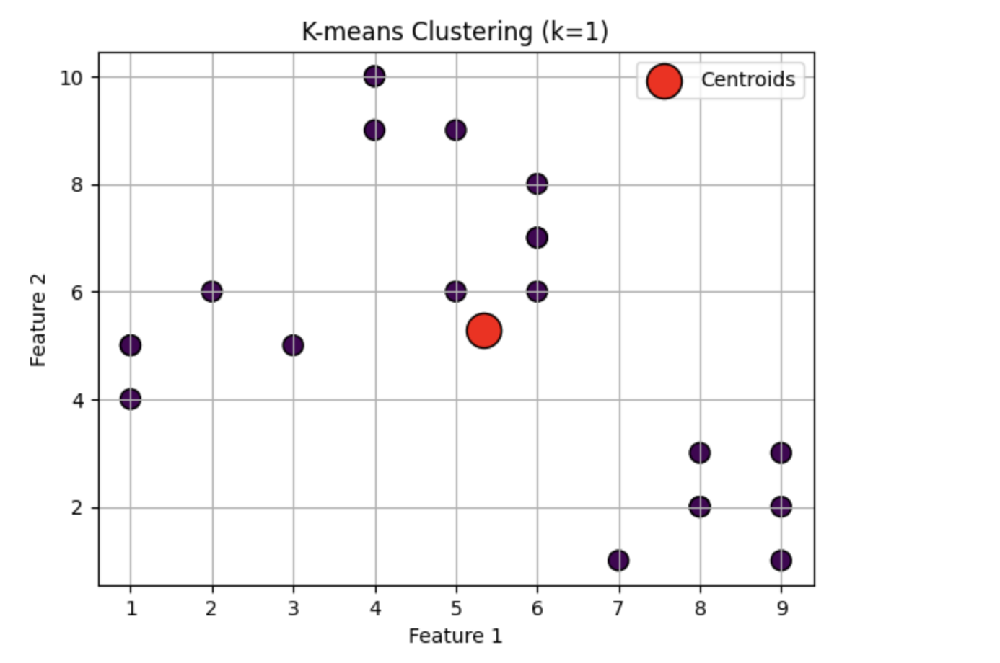

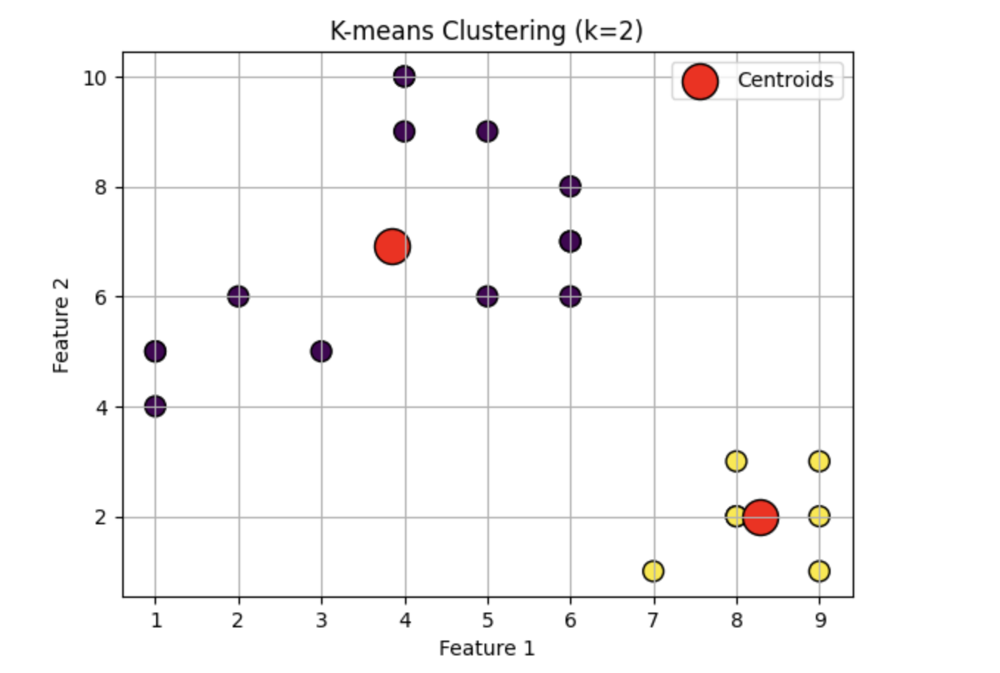

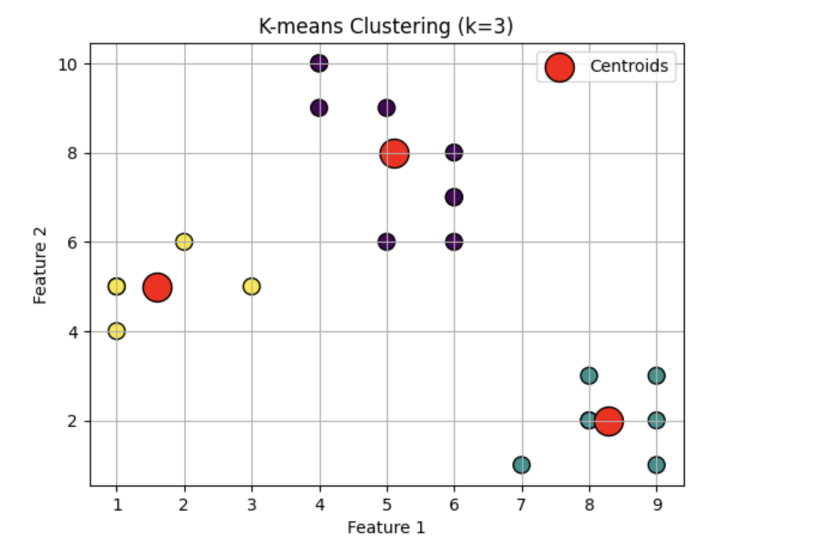

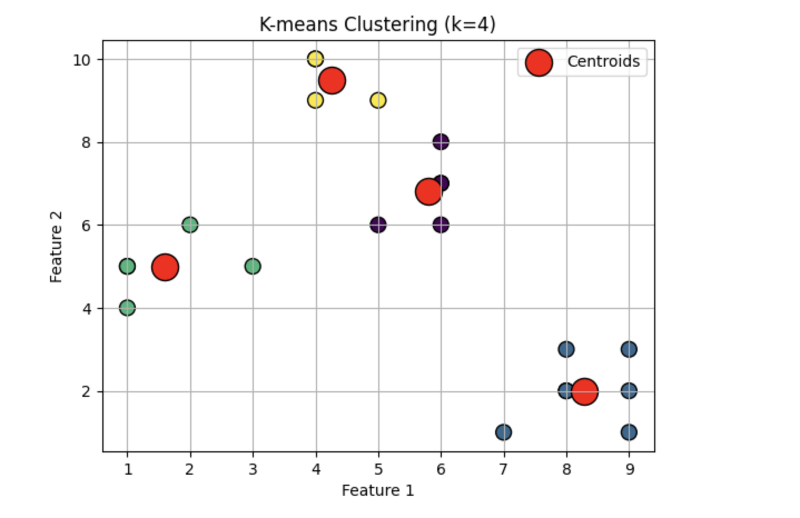


**Key Takeaways**

- The Elbow Method helps you choose the optimal number of clusters (k) in KMeans clustering.

- It analyzes how adding more clusters (increasing k) affects the spread of data points within each cluster (WCSS).

- The k value corresponding to the "elbow" in the WCSS vs k graph is considered the optimal choice.

- The Elbow Method provides a good starting point, but consider your specific data and goals when finalizing k.


<h3 style="color:blue;">📊 Use Case: Customer Segmentation for Marketing</h3>


🎯 **Objective**

A retail company wants to segment its customers based on purchasing behavior so that it can:

- Run personalized marketing campaigns,

- Identify high-value customers,

- Improve customer retention.


📁 **Dataset**

[Kaggle][https://www.kaggle.com/datasets/imakash3011/customer-personality-analysis]

📘 **Dataset Overview**

This dataset, available at Kaggle as Customer Personality Analysis by imakash3011, includes **2,240 customer records** with **29 features**, covering demographic info, household characteristics, spending on products, and campaign responses


**Key feature groups:**

- **People:** ```ID, Year_Birth, Education, Marital_Status, Income, Kidhome, Teenhome, Dt_Customer, Recency, Complain```

- **Product Purchases (last 2 years):** ```MntWines, MntFruits, MntMeatProducts, MntFishProducts, MntSweetProducts, MntGoldProds```

- **Promotion Behavior:** ```NumDealsPurchases, AcceptedCmp1–AcceptedCmp5, Response```

- **Purchasing Channels:** ```NumWebPurchases, NumCatalogPurchases, NumStorePurchases, NumWebVisitsMonth```

**🧠 Step-by-Step: Build K-Means Real-world Model**

**1. Load & Clean Data**

```
import pandas as pd

df = pd.read_csv('marketing_campaign.csv', sep='\t')
# Handle missing income values by median or capping
df['Income'].fillna(df['Income'].median(), inplace=True)
```

**2. Feature Engineering**

```
from datetime import datetime
df['Age'] = datetime.now().year - df['Year_Birth']
df['Total_Expenses'] = df[['MntWines', 'MntFruits', 'MntMeatProducts',
                            'MntFishProducts', 'MntSweetProducts', 'MntGoldProds']].sum(axis=1)
df['Total_Accepted_Cmp'] = df[['AcceptedCmp1','AcceptedCmp2','AcceptedCmp3','AcceptedCmp4','AcceptedCmp5','Response']].sum(axis=1)
```

**3. Select and Scale Features**

Choose relevant variables for segmentation:

```
features = ['Income', 'Age', 'Recency', 'Total_Expenses', 'Total_Accepted_Cmp', 'NumWebPurchases', 'NumStorePurchases']
X = df[features]
from sklearn.preprocessing import StandardScaler
X_scaled = StandardScaler().fit_transform(X)
```

**4. Determine Number of Clusters**

Plot the Elbow Curve or compute silhouette scores to choose optimal k, typically k=2 to 4


**5. Run K-Means Clustering**

**✅ Real-Time Use Case: Customer Segmentation using K-Means**

**Business Scenario:**

A retail company wants to segment its customers based on demographics, spending behavior, and tenure to run personalized marketing campaigns.


```
# Step 1: Install required packages
!pip install -q seaborn

# Step 2: Import libraries
import pandas as pd
import numpy as np
import matplotlib.pyplot as plt
import seaborn as sns
from sklearn.cluster import KMeans
from sklearn.preprocessing import StandardScaler
from sklearn.impute import SimpleImputer

# Step 3: Load data
df = pd.read_csv("marketing_campaign.csv", sep='\t')

# Step 4: Preprocess
df['Dt_Customer'] = pd.to_datetime(df['Dt_Customer'], dayfirst=True)
df['Customer_Tenure'] = (pd.Timestamp("2025-01-01") - df['Dt_Customer']).dt.days

# Drop unnecessary columns
df = df.drop(columns=['ID', 'Dt_Customer', 'Z_CostContact', 'Z_Revenue'])

# One-hot encode categorical
df = pd.get_dummies(df, columns=['Education', 'Marital_Status'], drop_first=True)

# Handle missing values
imputer = SimpleImputer(strategy="median")
df_imputed = pd.DataFrame(imputer.fit_transform(df), columns=df.columns)

# Standardize features
scaler = StandardScaler()
X_scaled = scaler.fit_transform(df_imputed)

# Step 5: Fit K-Means
kmeans = KMeans(n_clusters=4, init='k-means++', random_state=42)
df_imputed['Cluster'] = kmeans.fit_predict(X_scaled)

# Step 6: Label clusters (optional & domain-driven)
cluster_labels = {
    0: 'High Income, High Spend',
    1: 'Low Income, Less Spend',
    2: 'Middle Income, Average Spend',
    3: 'Senior Customers'
}
df_imputed['Segment_Label'] = df_imputed['Cluster'].map(cluster_labels)

# Step 7: Visualize clusters
plt.figure(figsize=(10, 6))
sns.scatterplot(
    x=df_imputed['Income'],
    y=df_imputed['MntWines'],
    hue=df_imputed['Segment_Label'],
    palette='Set2'
)
plt.title("Customer Segmentation using K-Means")
plt.xlabel("Annual Income")
plt.ylabel("Wine Spend")
plt.legend()
plt.grid(True)
plt.show()
```


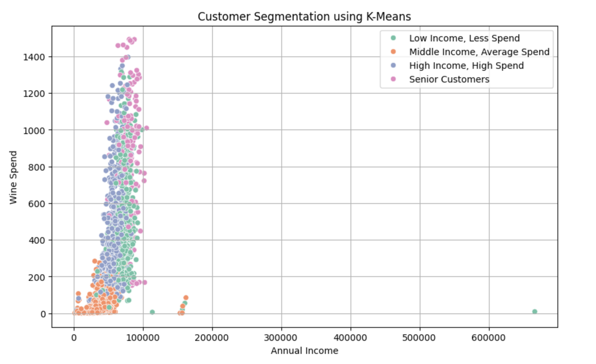

**🧠 Insights You Can Derive:**

- **High Income, High Spend:** Likely premium customers to upsell.

- **Low Income, Less Spend:** Might benefit from discount-based offers.

- **Middle Income:** Core customer base with moderate loyalty.

- **Senior Customers:** Segment by age and target with legacy brand values.