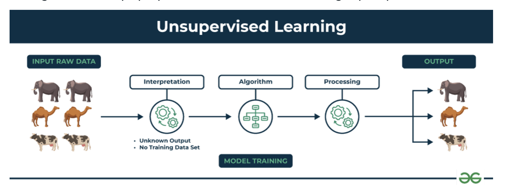

<h2 style="color:red;">✅ Unsupervised Learning?</h2>

<h3 style="color:blue;">📌 What is Unsupervised Learning?</h3>

**Unsupervised Learning** is a type of machine learning where the algorithm learns patterns from **unlabeled data**, meaning there are **no predefined outputs or target variables**. i.e., **we don't give output to our model**. **The training model has only input parameter values and discovers the groups or patterns on its own**.

**Key Concept:**

The goal of unsupervised learning is to discover **hidden patterns, structures**, or **relationships** in the data **without** any human guidance.

**The image shows set of animals:** elephants, camels, and cows that represents raw data that the unsupervised learning algorithm will process.

- The "Interpretation" stage signifies that the algorithm doesn't have predefined labels or categories for the data. It needs to figure out how to group or organize the data based on inherent patterns.

- **Algorithm** represents the core of unsupervised learning process using techniques like clustering, dimensionality reduction, or anomaly detection to identify patterns and structures in the data.

- **Processing** stage shows the algorithm working on the data.

The output shows the results of the unsupervised learning process. In this case, the algorithm might have grouped the animals into clusters based on their species (elephants, camels, cows).

<h3 style="color:blue;">📌 How does unsupervised learning work?</h3>

Unsupervised learning works by analyzing unlabeled data to identify patterns and relationships. The data is not labeled with any predefined categories or outcomes, so the algorithm must find these patterns and relationships on its own. 

- The model tries to find **similarities, clusters,** or **distributions** in the data.

- It **does not** know in advance what the output should be.

- It **learns from the structure** or **distribution of the data itself**.

<h3 style="color:blue;">📌 Common Techniques:</h3>

| Technique                    | Description                                          | Example Use Case                              |
| ---------------------------- | ---------------------------------------------------- | --------------------------------------------- |
| **Clustering**               | Group similar data points together.                  | Customer segmentation (e.g., K-Means)         |
| **Dimensionality Reduction** | Reduce number of features while preserving variance. | Visualizing high-dimensional data (e.g., PCA) |
| **Anomaly Detection**        | Detect unusual data points.                          | Fraud detection, network intrusion detection  |
| **Association Rules**        | Find rules showing relationships between variables.  | Market basket analysis (e.g., Apriori)        |

📦 **Example:**

**Input Data:**

Age    Income
25     40K
27     42K
50     150K
52     160K

**Output:**

The algorithm (e.g., K-Means) may group the people into below group Without being told these categories in advance.

- **Group 1:** Younger, lower income

- **Group 2:** Older, higher income

✅ Applications:

- Customer segmentation

- Recommendation systems (e.g., Netflix, Amazon)

- Anomaly/fraud detection

- Document or image clustering

**Summary:**

Unsupervised learning helps machines discover the unknown in data, making it especially powerful for exploratory analysis and feature discovery.

<h3 style="color:blue;">📌 Challenges of Unsupervised Learning:</h3>

**1. No Ground Truth (No Labels)**

- **Why it's hard:** There’s no “correct” answer to evaluate against.

- **Impact:** Difficult to measure accuracy or performance objectively.

**2. Choosing the Right Algorithm**

- **Why it's hard:** Many algorithms (K-Means, DBSCAN, PCA, etc.) work well on specific types of data.

- **Impact:** Poor algorithm choice can lead to meaningless results.

**3. Determining the Number of Clusters or Components**

- **Why it's hard:** You often don’t know how many groups (e.g., clusters) are in the data.

- **Example:** How many customer segments exist in a marketing dataset?

**4. High Dimensionality**

- **Why it's hard:** More features (dimensions) make it harder to find meaningful patterns due to the **curse of dimensionality**.

- **Solution:** Dimensionality reduction (e.g., PCA, t-SNE) — but this adds complexity.

**5. Interpreting Results**

- **Why it's hard:** Outputs like clusters or embeddings are abstract and not always clearly interpretable.

- **Impact:** Hard for stakeholders to understand or validate findings.

**6. Sensitivity to Noise and Outliers**

- **Why it's hard:** Unsupervised algorithms may group noise or outliers into their own cluster or distort existing ones.

- **Example:** K-Means can be pulled off-center by outliers.

**7. Scalability and Computation**

- **Why it's hard:** Large datasets with high dimensions can make clustering and similarity computations slow or memory-intensive.

**8. Initialization Sensitivity**

- **Why it's hard:** Some algorithms (e.g., K-Means) rely on random initialization, which can lead to different results each time.

**9. Lack of Objective Evaluation Metrics**

- **Why it's hard:** No standard metrics like accuracy or precision.

- **Alternatives:** Use metrics like Silhouette Score, Davies–Bouldin Index, or visualizations — but they're approximate.