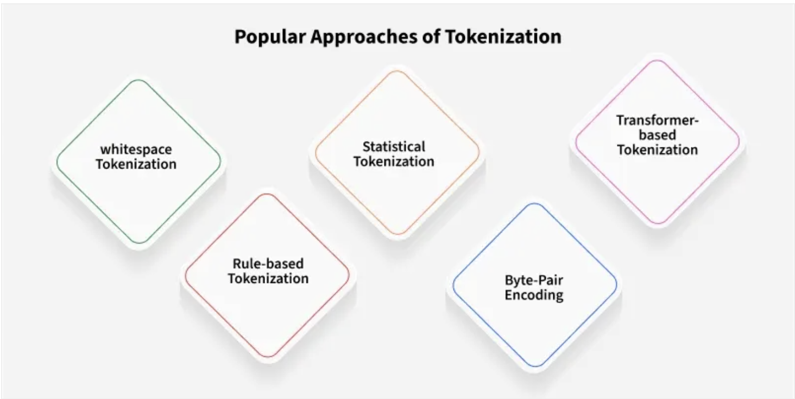

<h2 style="color:red;">✅ Natural Language Processing (NLP)</h2>


<h3 style="color:blue;">📌 Architecture Details Explanation </h3>

# End-to-End NLP Text Classification Pipeline

**Project**: End-to-End NLP Text Classification (Preprocessing → Training → Deployment)

**Purpose**: A production-oriented pipeline for building, evaluating, and deploying text classification models. This repository includes preprocessing pipelines, model training with cross-validation and hyperparameter tuning, model serialization, and a simple inference API.

---

<h3 style="color:blue;">📌 Table of Contents </h3>

- [Architecture Overview](#architecture-overview)
- [Features](#features)
- [Folder Structure](#folder-structure)
- [Requirements](#requirements)
- [Quickstart](#quickstart)
- [Data Preprocessing Steps](#data-preprocessing-steps)
- [Model Training & Evaluation](#model-training--evaluation)
- [Deployment & Inference](#deployment--inference)
- [Model Monitoring & MLOps](#model-monitoring--mlops)
- [Best Practices](#best-practices)
- [License](#license)

---

<h3 style="color:blue;">📌 Architecture Overview </h3>

The pipeline consists of:
1. **Data ingestion & EDA** — ingest raw text, visualize (word clouds), and inspect class balance.  
2. **Preprocessing** — lowercasing, URL/email removal, tokenization, punctuation/digit handling, stopword removal, lemmatization/stemming.  
3. **Feature extraction** — TF-IDF/BoW with n-gram support or contextual embeddings (BERT).  
4. **Model training** — classifiers with StratifiedKFold CV and hyperparameter search.  
5. **Evaluation** — accuracy, precision, recall, F1 (macro/weighted), ROC-AUC, PR-AUC, MCC.  
6. **Deployment** — packaged pipeline served via FastAPI (ensures same preprocessing).  
7. **Monitoring** — model versioning (MLflow/DVC), drift detection, performance tracking.

---

<h3 style="color:blue;">📌 Features </h3>

- Reproducible preprocessing pipeline
- TF-IDF and n-gram support
- Stratified K-Fold cross-validation
- Grid/Randomized hyperparameter search
- Model serialization and simple API for inference
- Guidance for monitoring and model versioning

---

<h3 style="color:blue;">📌 Folder Structure </h3>

```
.
├── data/
│   ├── raw/                 # raw datasets (do not edit)
│   └── processed/           # processed datasets
├── notebooks/               # EDA and experiments
├── src/
│   ├── preprocess.py        # cleaning, tokenizer, lemmatizer
│   ├── features.py          # vectorizers, feature selection
│   ├── models.py            # model training and CV
│   └── serve.py             # FastAPI app for inference
├── models/                  # saved model artifacts (.pkl, ONNX)
├── requirements.txt
├── Dockerfile               # optional containerization
├── README.md
└── tests/                   # unit tests
```

---

<h3 style="color:blue;">📌 Requirements </h3>

Create a virtual environment and install dependencies:

```bash
python -m venv venv
source venv/bin/activate
pip install -r requirements.txt
```

`requirements.txt` should include:
```
scikit-learn
pandas
numpy
nltk
joblib
fastapi
uvicorn
wordcloud
matplotlib
imblearn
xgboost
lightgbm
shap
mlflow
```

---


<h3 style="color:blue;">📌 Quickstart </h3>

1. **Prepare data**: put `train.csv` into `data/raw/` with columns `id`, `text`, `label`.
2. **Run preprocessing + feature build**:
```bash
python src/preprocess.py --input data/raw/train.csv --output data/processed/train_clean.csv
```
3. **Train model**:
```bash
python src/models.py --train data/processed/train_clean.csv --model-out models/best_model.pkl
```
4. **Serve model (local)**:
```bash
uvicorn src.serve:app --host 0.0.0.0 --port 8000
# POST to http://localhost:8000/predict with {"text": "your text here"}
```

---

<h3 style="color:blue;">📌 Data Preprocessing Steps </h3>

1. Lowercase
2. Remove URLs, emails, mentions
3. Remove non-alphanumeric characters (configurable)
4. Tokenize
5. Remove stopwords (configurable language)
6. Lemmatize (preferred) or stem
7. Optional: numeric/emoji special handling, class balancing (SMOTE for embeddings)
8. Save processed data to `data/processed/`

---

<h3 style="color:blue;">📌 Model Training & Evaluation </h3>

- Use `StratifiedKFold(n_splits=5, shuffle=True)` to split data.
- Use `Pipeline` from `sklearn` to chain preprocess → vectorize → classifier.
- Use `GridSearchCV` or `RandomizedSearchCV` with scoring `f1_weighted` (or domain-specific metric).
- Log runs and artifacts to MLflow:
```python
import mlflow
mlflow.start_run()
mlflow.log_param('model', 'logistic_regression')
mlflow.log_metric('f1', 0.92)
mlflow.sklearn.log_model(pipeline, 'model')
mlflow.end_run()
```

---

<h3 style="color:blue;">📌 Deployment & Inference </h3>

- Ensure the **same pipeline** used in training is saved and served.
- Example using FastAPI: `src/serve.py` loads `models/best_model.pkl` and exposes `/predict`.
- Consider containerizing:
```bash
docker build -t nlp-classifier:latest .
docker run -p 8000:8000 nlp-classifier:latest
```

---

<h3 style="color:blue;">📌 Model Monitoring & MLOps </h3>

- Track model versions and datasets with MLflow / DVC.
- Monitor:
  - Prediction distribution (class drift)
  - Input feature drift
  - Model performance on a labeled validation set
- Set alerts for drift thresholds; trigger retraining pipeline.

---

<h3 style="color:blue;">📌 Best Practices </h3>

- Use Pipelines to avoid leakage.
- Keep preprocessing deterministic and versioned.
- For heavy models, choose batch inference for non-critical latency tasks.
- Use feature selection if TF-IDF dims explode.
- Use SHAP for model explainability.


<h3 style="color:blue;">📌 Text Normalization</h3>
Steps Required for Text normalization.

   - Input text String

   - Convert all letters of the string to one case(either lower or upper case)

   - If numbers are essential to convert to words else remove all numbers

   - Remove punctuations, other formalities of grammar

   - Remove white spaces

   - Remove stop words

   - And any other computations

Text normalization with above-mentioned steps, every step can be done in some ways. So we will discuss each and everything in this whole process.

**Text String**

```
# input string 
string = "       Python 3.0, released in 2008, was a major revision of the language that is not completely backward compatible and much Python 2 code does not run unmodified on Python 3. With Python 2's end-of-life, only Python 3.6.x[30] and later are supported, with older versions still supporting e.g. Windows 7 (and old installers not restricted to 64-bit Windows)."
print(string)
```

**Case Conversion (Lower Case)**

```
# convert to lower case
lower_string = string.lower()
print(lower_string)
```

**Removing Numbers**
Remove numbers if they're not relevant to your analyses. Usually, regular expressions are used to remove numbers.


```
# import regex
import re

# input string 
string = "       Python 3.0, released in 2008, was a major revision of the language that is not completely backward compatible and much Python 2 code does not run unmodified on Python 3. With Python 2's end-of-life, only Python 3.6.x[30] and later are supported, with older versions still supporting e.g. Windows 7 (and old installers not restricted to 64-bit Windows)."

# convert to lower case
lower_string = string.lower()

# remove numbers
no_number_string = re.sub(r'\d+','',lower_string)
print(no_number_string)
```

**Removing punctuation**

```
# import regex
import re

# input string 
string = "       Python 3.0, released in 2008, was a major revision of the language that is not completely backward compatible and much Python 2 code does not run unmodified on Python 3. With Python 2's end-of-life, only Python 3.6.x[30] and later are supported, with older versions still supporting e.g. Windows 7 (and old installers not restricted to 64-bit Windows)."

# convert to lower case
lower_string = string.lower()

# remove numbers
no_number_string = re.sub(r'\d+','',lower_string)

# remove all punctuation except words and space
no_punc_string = re.sub(r'[^\w\s]','', no_number_string) 
print(no_punc_string)
```

**Removing White space**

```
# import regex
import re

# input string 
string = "       Python 3.0, released in 2008, was a major revision of the language that is not completely backward compatible and much Python 2 code does not run unmodified on Python 3. With Python 2's end-of-life, only Python 3.6.x[30] and later are supported, with older versions still supporting e.g. Windows 7 (and old installers not restricted to 64-bit Windows)."

# convert to lower case
lower_string = string.lower()

# remove numbers
no_number_string = re.sub(r'\d+','',lower_string)

# remove all punctuation except words and space
no_punc_string = re.sub(r'[^\w\s]','', no_number_string) 

# remove white spaces
no_wspace_string = no_punc_string.strip()
print(no_wspace_string)
```

**Removing Stop Words**

Stop words” are the foremost common words during a language like “the”, “a”, “on”, “is”, “all”. These words don't carry important meaning and are usually faraway from texts. It is possible to get rid of stop words using tongue Toolkit (NLTK), a set of libraries and programs for symbolic and statistical tongue processing.

```
# download stopwords
import nltk
nltk.download('stopwords')

# import nltk for stopwords
from nltk.corpus import stopwords
stop_words = set(stopwords.words('english'))
print(stop_words)

# assign string
no_wspace_string='python  released in  was a major revision of the language that is not completely backward compatible and much python  code does not run unmodified on python  with python s endoflife only python x and later are supported with older versions still supporting eg windows  and old installers not restricted to bit windows'

# convert string to list of words
lst_string = [no_wspace_string][0].split()
print(lst_string)

# remove stopwords
no_stpwords_string=""
for i in lst_string:
    if not i in stop_words:
        no_stpwords_string += i+' '
        
# removing last space
no_stpwords_string = no_stpwords_string[:-1]
print(no_stpwords_string)
```

```
# import regex
import re

# download stopwords
import nltk
nltk.download('stopwords')

# import nltk for stopwords
from nltk.corpus import stopwords
stop_words = set(stopwords.words('english'))


# input string 
string = "       Python 3.0, released in 2008, was a major revision of the language that is not completely backward compatible and much Python 2 code does not run unmodified on Python 3. With Python 2's end-of-life, only Python 3.6.x[30] and later are supported, with older versions still supporting e.g. Windows 7 (and old installers not restricted to 64-bit Windows)."

# convert to lower case
lower_string = string.lower()

# remove numbers
no_number_string = re.sub(r'\d+','',lower_string)

# remove all punctuation except words and space
no_punc_string = re.sub(r'[^\w\s]','', no_number_string) 

# remove white spaces
no_wspace_string = no_punc_string.strip()
no_wspace_string

# convert string to list of words
lst_string = [no_wspace_string][0].split()
print(lst_string)

# remove stopwords
no_stpwords_string=""
for i in lst_string:
    if not i in stop_words:
        no_stpwords_string += i+' '
        
# removing last space
no_stpwords_string = no_stpwords_string[:-1]

# output
print(no_stpwords_string)
```


<h3 style="color:blue;">📌 Tokenization</h3>
Tokenization is a process of splitting text into smaller units called tokens.

Tokenization is a fundamental process in Natural Language Processing (NLP) that involves breaking down a stream of text into smaller units called tokens. These tokens can range from individual characters to full words or phrases, Based on how detailed it needs to be. By converting text into these manageable chunks, machines can more effectively analyze and understand human language.




<h3 style="color:blue;">📌 Types of Tokenization</h3>


   - **Word Tokenization:**This is the most common method where text is divided into individual words. It works well for languages with clear word boundaries, like English.

   - **Character Tokenization:**In this method, text is split into individual characters. This is particularly useful for languages without clear word boundaries or for tasks that require a detailed analysis, such as spelling correction.

   - **Subword Tokenization:**Sub-word tokenization strikes a balance between word and character tokenization by breaking down text into units that are larger than a single character but smaller than a full word.

   - **SentenceTokenization:** Sentence tokenization is also a common technique used to make a division of paragraphs or large set of sentences into separated sentences as tokens.

   - **N-gram Tokenization**N-gram tokenization splits words into fixed-sized chunks (size = n) of data

<h3 style="color:blue;">📌 Tokenization Challenges</h3>


**Implementing Tokenization**

   - NLTK (Natural Language Toolkit)

   - SpaCy

   - BERT Tokenizer

   - Byte-Pair Encoding (BPE)

   - Sentence Piece


<h3 style="color:blue;">📌 Lemmatization</h3>
Lemmatization reduces words to their base or root form.

Lemmatization is an important text pre-processing technique in Natural Language Processing (NLP) that reduces words to their base form known as a "lemma." For example, the lemma of "running" is "run" and "better" becomes "good." Unlike stemming which simply removes prefixes or suffixes, it considers the word's meaning and part of speech (POS) and ensures that the base form is a valid word. This makes lemmatization more accurate as it avoids generating non-dictionary words.


It is used for:

- **Improves accuracy:** It ensures words with similar meanings like "running" and "ran" are treated as the same.

- **Reduced Data Redundancy:** By reducing words to their base forms, it reduces redundancy in the dataset. This leads to smaller datasets which makes it easier to handle and process large amounts of text for analysis or training machine learning models.

- **Better NLP Model Performance:** By treating all similar word as same, it improves the performance of NLP models by making text more consistent. For example, treating "running," "ran" and "runs" as the same word improves the model's understanding of context and meaning.

<h3 style="color:blue;">📌 Lemmatization Techniques</h3>

There are different techniques to perform lemmatization each with its own advantages and use cases:

**1. Rule Based Lemmatization**

In rule-based lemmatization, predefined rules are applied to a word to remove suffixes and get the root form. This approach works well for regular words but may not handle irregularities well.

**For example:**

**Rule:** 
```
For regular verbs ending in "-ed," remove the "-ed" suffix.

Example: "walked" -> "walk"
```

While this method is simple and interpretable, it doesn't account for irregular word forms like "better" which should be lemmatized to "good".

**2. Dictionary-Based Lemmatization**

It uses a predefined dictionary or lexicon such as WordNet to look up the base form of a word. This method is more accurate than rule-based lemmatization because it accounts for exceptions and irregular words.

**For example:**

 - 'running' -> 'run'
 - 'better' -> 'good'
 - 'went' -> 'go

"I was running to become a better athlete and then I went home," -> "I was run to become a good athlete and then I go home."

By using dictionaries like WordNet this method can handle a range of words effectively, especially in languages with well-established dictionaries.


**3. Machine Learning-Based Lemmatization**

It uses algorithms trained on large datasets to automatically identify the base form of words. This approach is highly flexible and can handle irregular words and linguistic nuances better than the rule-based and dictionary-based methods.

**For example:**

A trained model may deduce that “went” corresponds to “go” even though the suffix removal rule doesn’t apply. Similarly, for 'happier' the model deduces 'happy' as the lemma. 

Machine learning-based lemmatizers are more adaptive and can generalize across different word forms which makes them ideal for complex tasks involving diverse vocabularies.

**Step 1: Installing NLTK and Downloading Necessary Resources**

In Python, the NLTK library provides an easy and efficient way to implement lemmatization. First, we need to install the NLTK library and download the necessary datasets like WordNet and the punkt tokenizer.

```
!pip install nltk
```

Now lets import the library and download the necessary datasets.

```
import nltk
nltk.download('punkt_tab')      
nltk.download('wordnet')    
nltk.download('omw-1.4') 
nltk.download('averaged_perceptron_tagger_eng')
```

**Step 2: Lemmatizing Text with NLTK**

Now we can tokenize the text and apply lemmatization using NLTK's WordNetLemmatizer.

```
from nltk.tokenize import word_tokenize
from nltk.stem import WordNetLemmatizer

lemmatizer = WordNetLemmatizer()

text = "The cats were running faster than the dogs."

tokens = word_tokenize(text)

lemmatized_words = [lemmatizer.lemmatize(word) for word in tokens]

print(f"Original Text: {text}")
print(f"Lemmatized Words: {lemmatized_words}")
```

**Step 3: Improving Lemmatization with Part of Speech (POS) Tagging**

To improve the accuracy of lemmatization, it’s important to specify the correct Part of Speech (POS) for each word. By default, NLTK assumes that words are nouns when no POS tag is provided. However, it can be more accurate if we specify the correct POS tag for each word.

**For example:**

- "running" (as a verb) should be lemmatized to "run".

- "better" (as an adjective) should be lemmatized to "good".

```
from nltk.tokenize import word_tokenize
from nltk import pos_tag
from nltk.stem import WordNetLemmatizer

lemmatizer = WordNetLemmatizer()

sentence = "The children are running towards a better place."

tokens = word_tokenize(sentence)

tagged_tokens = pos_tag(tokens)

def get_wordnet_pos(tag):
    if tag.startswith('J'):  
        return 'a'
    elif tag.startswith('V'):  
        return 'v'
    elif tag.startswith('N'):  
        return 'n'
    elif tag.startswith('R'):  
        return 'r'
    else:
        return 'n'  

lemmatized_sentence = []

for word, tag in tagged_tokens:
    if word.lower() == 'are' or word.lower() in ['is', 'am']:
        lemmatized_sentence.append(word)  
    else:
        lemmatized_sentence.append(lemmatizer.lemmatize(word, get_wordnet_pos(tag)))

print("Original Sentence: ", sentence)
print("Lemmatized Sentence: ", ' '.join(lemmatized_sentence))
```

<h3 style="color:blue;">📌 Stemming</h3>
Stemming reduces works to their root by removing suffixes. Types of stemmers include:

Stemming is an important text-processing technique that reduces words to their base or root form by removing prefixes and suffixes. This process standardizes words which helps to improve the efficiency and effectiveness of various natural language processing (NLP) tasks.


In NLP, stemming simplifies words to their most basic form, making it easier to analyze and process text. For example, "chocolates" becomes "chocolate" and "retrieval" becomes "retrieve". This is important in the early stages of NLP tasks where words are extracted from a document and tokenized (broken into individual words).


It helps in tasks such as ```text classification```, ```information retrieval``` and ```text summarization``` by reducing words to a base form. While it is effective, it can sometimes introduce drawbacks including potential inaccuracies and a reduction in text readability.

Examples of stemming for the word "like":

```
"likes" → "like"
"liked" → "like"
"likely" → "like"
"liking" → "like"
```

   - **Porter Stemmer**
   Porter's Stemmer is one of the most popular and widely used stemming algorithms. Proposed in 1980 by Martin Porter, this stemmer works by applying a series of rules to remove common suffixes from English words. It is well-known for its simplicity, speed and reliability. However, the stemmed output is not guaranteed to be a meaningful word and its applications are limited to the English language.

   **Example:**

   - 'agreed' → 'agree'

   - **Rule:** If the word has a suffix **EED** (with at least one vowel and consonant) remove the suffix and change it to **EE**.

   **Advantages:**

   - Very fast and efficient.

   - Commonly used for tasks like information retrieval and text mining.

   **Limitations:**

   - Outputs may not always be real words.

   - Limited to English words.

```   
from nltk.stem import PorterStemmer

porter_stemmer = PorterStemmer()

words = ["running", "jumps", "happily", "running", "happily"]

stemmed_words = [porter_stemmer.stem(word) for word in words]

print("Original words:", words)
print("Stemmed words:", stemmed_words)
```

   - **Snowball Stemmer**
   The Snowball Stemmer is an enhanced version of the Porter Stemmer which was introduced by Martin Porter as well. It is referred to as Porter2 and is faster and more aggressive than its predecessor. One of the key advantages of this is that it supports multiple languages, making it a multilingual stemmer.

   **Example:**

   - 'running' → 'run'

   - 'quickly' → 'quick'

   **Advantages:**

   - More efficient than Porter Stemmer.

   - Supports multiple languages.

```
from nltk.stem import SnowballStemmer

stemmer = SnowballStemmer(language='english')

words_to_stem = ['running', 'jumped', 'happily', 'quickly', 'foxes']

stemmed_words = [stemmer.stem(word) for word in words_to_stem]

print("Original words:", words_to_stem)
print("Stemmed words:", stemmed_words)
```

<h3 style="color:blue;">📌 Stopword removal</h3>
Stopword removal is a process to remove common words from the document.
Natural language processing tasks often involve filtering out commonly occurring words that provide no or very little semantic value to text analysis. These words are known as stopwords include articles, prepositions and pronouns like "the", "and", "is" and "in". While they seem insignificant, proper stopword handling can dramatically impact the performance and accuracy of NLP applications.


**When to Remove Stopwords**
The decision to remove stopwords depends heavily on the specific NLP task at hand:

**Tasks that benefit from stopword removal:**

- Text classification and sentiment analysis

- Information retrieval and search engines

- Topic modelling and clustering

- Keyword extraction

**Tasks that require preserving stopwords:**

- Machine translation (maintains grammatical structure)

- Text summarization (preserves sentence coherence)

- Question-answering systems (syntactic relationships matter)

- Grammar checking and parsing

```
import nltk
from nltk.corpus import stopwords
from nltk.tokenize import word_tokenize

nltk.download('stopwords')
nltk.download('punkt')

# Sample text
text = "This is a sample sentence showing stopword removal."

# Get English stopwords and tokenize
stop_words = set(stopwords.words('english'))
tokens = word_tokenize(text.lower())

# Remove stopwords
filtered_tokens = [word for word in tokens if word not in stop_words]

print("Original:", tokens)
print("Filtered:", filtered_tokens)
```


<h3 style="color:blue;">📌 Parts of Speech (POS) Tagging</h3>
Parts of Speech (POS) Tagging assigns a part of speech to each word in sentence based on definition and context.

   - **Parts of Speech (POS) Tagging**


<h2 style="color:red;">✅ Text representation Techniques</h2>
It converts textual data into numerical vectors that are processed by the following methods:

<h3 style="color:blue;">📌 Parts of Speech (POS) Tagging</h3>

- **One-Hot Encoding**

- **Bag of Words (BOW)**

In Natural Language Processing (NLP) text data needs to be converted into numbers so that machine learning algorithms can understand it. One common method to do this is Bag of Words (BoW) model. It turns text like sentence, paragraph or document into a collection of words and counts how often each word appears but ignoring the order of the words. It does not consider the order of the words or their grammar but focuses on counting how often each word appears in the text.

This makes it useful for tasks like text classification, sentiment analysis and clustering.

**Key Components of BoW**

- **Vocabulary:** It is a list of all unique words from the entire dataset. Each word in the vocabulary corresponds to a feature in the model.

- **Document Representation:** Each document is represented as a vector where each element shows the frequency of the words from the vocabulary in that document. The frequency of each word is used as a feature for the model.

<h3 style="color:blue;">📌 Steps to Implement the Bag of Words (BoW) Model</h3>

**Step 1: Preprocessing the Text**

Before applying the BoW model, we need to preprocess the text. This includes:

- Converting the text to lowercase

- Removing non-word characters

- Removing extra spaces

Lets consider a sample text for this implementation:

```
Beans. I was trying to explain to somebody as we were flying in, that's corn. That's beans. And they were very impressed at my agricultural knowledge. Please give it up for Amaury once again for that outstanding introduction. I have a bunch of good friends here today, including somebody who I served with, who is one of the finest senators in the country and we're lucky to have him, your Senator, Dick Durbin is here. I also noticed, by the way, former Governor Edgar here, who I haven't seen in a long time and somehow he has not aged and I have. And it's great to see you, Governor. I want to thank President Killeen and everybody at the U of I System for making it possible for me to be here today. And I am deeply honored at the Paul Douglas Award that is being given to me. He is somebody who set the path for so much outstanding public service here in Illinois. Now, I want to start by addressing the elephant in the room. I know people are still wondering why I didn't speak at the commencement.
```


```
import nltk
import re

text = """Beans. I was trying to explain to somebody as we were flying in, that's corn.  That's beans. And they were very impressed at my agricultural knowledge. Please give it up for Amaury once again for that outstanding introduction. I have a bunch of good friends here today, including somebody who I served with, who is one of the finest senators in the country, and we're lucky to have him, your Senator, Dick Durbin is here. I also noticed, by the way, former Governor Edgar here, who I haven't seen in a long time, and somehow he has not aged and I have. And it's great to see you, Governor. I want to thank President Killeen and everybody at the U of I System for making it possible for me to be here today. And I am deeply honored at the Paul Douglas Award that is being given to me. He is somebody who set the path for so much outstanding public service here in Illinois. Now, I want to start by addressing the elephant in the room. I know people are still wondering why I didn't speak at the commencement."""

dataset = nltk.sent_tokenize(text)

for i in range(len(dataset)):
    dataset[i] = dataset[i].lower()
    dataset[i] = re.sub(r'\W', ' ', dataset[i])
    dataset[i] = re.sub(r'\s+', ' ', dataset[i])

for i, sentence in enumerate(dataset):
    print(f"Sentence {i+1}: {sentence}")
```


**Step 2: Counting Word Frequencies**

In this step, we count the frequency of each word in the preprocessed text. We will store these counts in a pandas DataFrame to view them easily in a tabular format.

- We initialize a dictionary to hold our word counts.

- Then, we tokenize each sentence into words.

- For each word, we check if it exists in our dictionary. If it does, we increment its count. If it doesn’t, we add it to the dictionary with a count of 1.

```
word2count = {}

for data in dataset:
    words = nltk.word_tokenize(data)
    for word in words:
        if word not in word2count:
            word2count[word] = 1
        else:
            word2count[word] += 1

stop_words = set(stopwords.words('english'))

filtered_word2count = {word: count for word, count in word2count.items() if word not in stop_words}

word_freq_df = pd.DataFrame(list(filtered_word2count.items()), columns=['Word', 'Frequency'])

word_freq_df = word_freq_df.sort_values(by='Frequency', ascending=False)

print(word_freq_df)
```


**Step 3: Selecting the Most Frequent Words**

Now that we have counted the word frequencies, we will select the top N most frequent words (e.g top 10) to be used in the BoW model. We can visualize these frequent words using a bar chart to understand the distribution of words in our dataset.

```
import heapq
import matplotlib.pyplot as plt

freq_words = heapq.nlargest(10, word2count, key=word2count.get)

print(f"Top 10 frequent words: {freq_words}")

top_words = sorted(word2count.items(), key=lambda x: x[1], reverse=True)[:10]
words, counts = zip(*top_words)

plt.figure(figsize=(10, 6))
plt.bar(words, counts, color='skyblue')
plt.xticks(rotation=45)
plt.title('Top 10 Most Frequent Words')
plt.xlabel('Words')
plt.ylabel('Frequency')
plt.show()
```

**Step 4: Building the Bag of Words (BoW) Model**
Now we will build the Bag of Words (BoW) model. This model is represented as a binary matrix where each row corresponds to a sentence and each column represents one of the top N frequent words. A 1 in the matrix shows that the word is present in the sentence and a 0 shows its absence.

We will use a heatmap to visualize this binary matrix where green shows the presence of a word (1) and red shows its absence (0).

```
import numpy as np
import seaborn as sns

X = []

for data in dataset:
    vector = []
    for word in freq_words:
        if word in nltk.word_tokenize(data):
            vector.append(1)
        else:
            vector.append(0)
    X.append(vector)

X = np.asarray(X)

plt.figure(figsize=(10, 6))
sns.heatmap(X, cmap='RdYlGn', cbar=False, annot=True, fmt="d", xticklabels=freq_words, yticklabels=[f"Sentence {i+1}" for i in range(len(dataset))])

plt.title('Bag of Words Matrix')
plt.xlabel('Frequent Words')
plt.ylabel('Sentences')
plt.show()
```

**Step 5: Visualizing Word Frequencies with a Word Cloud**

Finally, we can create a Word Cloud to visually represent the word frequencies. In a word cloud, the size of each word is proportional to its frequency which makes it easy to identify the most common words at a glance.


- **Term Frequency-Inverse Document Frequency (TF-IDF)**

TF-IDF (Term Frequency–Inverse Document Frequency) is a statistical method used in natural language processing and information retrieval to evaluate how important a word is to a document in relation to a larger collection of documents. TF-IDF combines two components:

**1. Term Frequency (TF):** Measures how often a word appears in a document. A higher frequency suggests greater importance. If a term appears frequently in a document, it is likely relevant to the document’s content.


**2. Inverse Document Frequency (IDF):** Reduces the weight of common words across multiple documents while increasing the weight of rare words. If a term appears in fewer documents, it is more likely to be meaningful and specific.


This balance allows TF-IDF to highlight terms that are both frequent within a specific document and distinctive across the text document, making it a useful tool for tasks like search ranking, text classification and keyword extraction.

**Converting Text into vectors with TF-IDF**

Let's take an example where we have a corpus (a collection of documents) with three documents and our goal is to calculate the TF-IDF score for specific terms in these documents.


1. **Document 1:** "The cat sat on the mat."
2. **Document 2:** "The dog played in the park."
3. **Document 3:** "Cats and dogs are great pets."


Our goal is to calculate the TF-IDF score for specific terms in these documents. Let’s focus on the word **"cat"** and see how TF-IDF evaluates its importance.

**Step 1: Calculate Term Frequency (TF)**

**For Document 1:**

- The word "cat" appears 1 time.

- The total number of terms in Document 1 is 6 ("the", "cat", "sat", "on", "the", "mat").

- So, TF(cat,Document 1) = 1/6

**For Document 2:**

- The word "cat" does not appear.

- So, TF(cat,Document 2)=0.

**For Document 3:**

- The word "cat" appears 1 time.

- The total number of terms in Document 3 is 6 ("cats", "and", "dogs", "are", "great", "pets").
So TF (cat,Document 3)=1/6


In Document 1 and Document 3 the word "cat" has the same TF score. This means it appears with the same relative frequency in both documents. In Document 2 the TF score is 0 because the word "cat" does not appear.

**Step 2: Calculate Inverse Document Frequency (IDF)**

- Total number of documents in the corpus (D): 3

- Number of documents containing the term "cat": 2 (Document 1 and Document 3).


**Step 3: Calculate TF-IDF**

The TF-IDF score for "cat" is 0.029 in Document 1 and Document 3 and 0 in Document 2 that reflects both the frequency of the term in the document (TF) and its rarity across the corpus (IDF).

The TF-IDF score is the product of TF and IDF:


<h3 style="color:blue;">📌 Implementing TF-IDF in Python</h3>

**Step 1: Import modules**

```
from sklearn.feature_extraction.text import TfidfVectorizer
```

**Step 2: Collect strings from documents and create a corpus**

```
d0 = 'Geeks for geeks'
d1 = 'Geeks'
d2 = 'r2j'
string = [d0, d1, d2]
```

**Step 3: Get TF-IDF values**

Here we are using TfidfVectorizer() from scikit learn to perform tf-idf and apply on our courpus using fit_transform.

```
tfidf = TfidfVectorizer()
result = tfidf.fit_transform(string)
```

**Step 4: Display IDF values**

```
print('\nidf values:')
for ele1, ele2 in zip(tfidf.get_feature_names_out(), tfidf.idf_):
    print(ele1, ':', ele2)
```


**Step 5: Display TF-IDF values along with indexing**

```
print('\nWord indexes:')
print(tfidf.vocabulary_)
print('\ntf-idf value:')
print(result)
print('\ntf-idf values in matrix form:')
print(result.toarray())
```


- **N-Gram Language Modeling with NLTK**

- **Latent Semantic Analysis (LSA)**

- **Latent Dirichlet Allocation (LDA)**


<h2 style="color:red;">✅ Text Embedding Techniques</h2>
It refers to methods that create dense vector representations of text, capturing semantic meaning including advanced approaches like:

<h3 style="color:blue;">📌 Word Embedding</h3>

   - **Word2Vec (SkipGram, Continuous Bag of Words - CBOW)**

   - **GloVe (Global Vectors for Word Representation)**

   - **fastText**


<h3 style="color:blue;">📌 Pre-Trained Embedding</h3>

   - **ELMo (Embeddings from Language Models)**

   - **BERT (Bidirectional Encoder Representations from Transformers)**

<h3 style="color:blue;">📌 Word Embedding</h3>

   - **Doc2Vec**

<h3 style="color:blue;">📌 Advanced Embeddings</h3>

   - **RoBERTa**

   - **DistilBERT**


