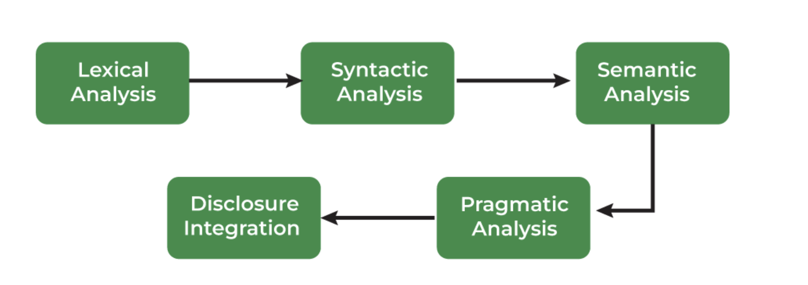

<h2 style="color:red;">✅ Natural Language Processing (NLP)</h2>

<h3 style="color:blue;">📌 What is Natural Language Processing (NLP)?</h3>

Natural Language Processing (NLP) is a branch of Artificial Intelligence (AI) that helps machines to understand and process human languages either in text or audio form. It is used across a variety of applications from speech recognition to language translation and text summarization.

<h3 style="color:blue;">📌 Natural Language Processing can be categorized into two components</h3>

1. **Natural Language Understanding(NLU)**: It involves interpreting the meaning of the text.

2. **Natural Language Generation(NLG)**: It involves generating human-like text based on processed data.

<h3 style="color:blue;">📌 Phases of Natural Language Processing</h3>

It involves a series of phases that work together to process and interpret language with each phase contributing to understanding its structure and meaning.

<h3 style="color:blue;">📌 Libraries for NLP</h3>

These are full-featured NLP libraries covering tokenization, tagging, parsing, embeddings, etc.

- **NLTK (Natural Language Toolkit)**

- **spaCy**

- **TextBlob**

- **Transformers (by Hugging Face)**

- **Gensim**

- **NLP Libraries in Python.**

<h3 style="color:blue;">📌 Normalizing Textual Data in NLP</h3>

Text Normalization transforms text into a consistent format improves the quality and makes it easier to process in NLP tasks.

1. **Regular Expressions (RE)** are sequences of characters that define search patterns.

    - **Text Normalization**

    - **Regular Expressions (RE)**

    - **How to write Regular Expressions?**

    - **Properties of Regular Expressions**

    - **Email Extraction using RE**

2. **Tokenization** is a process of splitting text into smaller units called tokens.

    - **Tokenization**

    - **Word Tokenization**

    - **Rule-based Tokenization**

    - **Subword Tokenization**

    - **Dictionary-Based Tokenization**

    - **Whitespace Tokenization**

    - **WordPiece Tokenization**

3. **Lemmatization** reduces words to their base or root form.

    - **Lemmatization**

4. **Stemming** reduces works to their root by removing suffixes. Types of stemmers include:

    - **Stemming**

    - **Porter Stemmer**

    - **Lancaster Stemmer**

    - **Snowball Stemmer**

    - **Rule-based Stemming**

5. **Stopword removal** is a process to remove common words from the document.

    - **Stopword removal**

6. **Parts of Speech (POS) Tagging** assigns a part of speech to each word in sentence based on definition and context.

    - **Parts of Speech (POS) Tagging**

<h3 style="color:blue;">📌 Text Representation and Embedding Techniques in NLP</h3>

**Text representation Techniques**

It converts textual data into numerical vectors that are processed by the following methods:

  - **One-Hot Encoding**

  - **Bag of Words (BOW)**

  - **Term Frequency-Inverse Document Frequency (TF-IDF)**

  - **N-Gram Language Modeling with NLTK**

  - **Latent Semantic Analysis (LSA)**

  - **Latent Dirichlet Allocation (LDA)**

<h3 style="color:blue;">📌 Text Embedding Techniques</h3>

It refers to methods that create dense vector representations of text, capturing semantic meaning including advanced approaches like:

1. **Word Embedding**

    - **Word2Vec (SkipGram, Continuous Bag of Words - CBOW)**

    - **GloVe (Global Vectors for Word Representation)**

    - **fastText**

2. **Pre-Trained Embedding**

    - **ELMo (Embeddings from Language Models)**

    - **BERT (Bidirectional Encoder Representations from Transformers)**

3. **Document Embedding**

    - **Doc2Vec**

4. **Advanced Embeddings**

    - **RoBERTa**

    - **DistilBERT**

<h3 style="color:blue;">📌 Deep Learning Techniques for NLP</h3>

Deep learning has revolutionized Natural Language Processing by helping models to automatically learn complex patterns from raw text.

Key deep learning techniques in NLP include:

   - **Deep learning**

   - **Artificial Neural Networks (ANNs)**

   - **Recurrent Neural Networks (RNNs)**

   - **Long Short-Term Memory (LSTM)**

   - **Gated Recurrent Unit (GRU)**

   - **Seq2Seq Models**

   - **Transformer Models**

<h3 style="color:blue;">📌 Pre-Trained Language Models</h3>

Pre-trained models can be fine-tuned for specific tasks:

   - **Pre-trained models**

   - **GPT (Generative Pre-trained Transformer)**

   - **Transformers XL**

   - **T5 (Text-to-Text Transfer Transformer)**

   - **Transfer Learning with Fine-tuning**

<h3 style="color:blue;">📌 Natural Language Processing Tasks</h3>

Core NLP tasks that help machines understand, interpret and generate human language.

1. **Text Classification**

    - **Dataset for Text Classification**

    - **Text Classification using Naive Bayes**

    - **Text Classification using Logistic Regression**

    - **Text Classification using RNNs**

    - **Text Classification using CNNs**

2. **Information Extraction**

    - **Named Entity Recognition (NER) using SpaCy**

    - **Named Entity Recognition (NER) using NLTK**

    - **Relationship Extraction**

3. **Sentiment Analysis**

    - **What is Sentiment Analysis?**

    - **Sentiment Analysis using VADER**

    - **Sentiment Analysis using Recurrent Neural Networks (RNN)**

4. **Machine Translation**

    - **Statistical Machine Translation of Language**

    - **Machine Translation with Transformer**

5. **Text Summarization**

    - **What is Text Summarization?**

    - **Text Summarizations using Hugging Face Model**

    - **Text Summarization using Sumy**

6. **Text Generation**

    - **Text Generation using Fnet**

    - **Text Generation using Recurrent Long Short Term Memory Network**

    - **Text2Text Generations using HuggingFace Model**

<h3 style="color:blue;">📌 Natural Language Processing Chatbots</h3>

NLP chatbots are computer programs designed to interact with users in natural language helps in seamless communication between humans and machines. By using NLP techniques, these chatbots understand, interpret and generate human language.

   - **What is Natural Language Processing (NLP) Chatbots?**

<h3 style="color:blue;">📌 Applications of NLP</h3>

1. **Voice Assistants:** Alexa, Siri and Google Assistant use NLP for voice recognition and interaction.

2. **Grammar and Text Analysis:** Tools like Grammarly, Microsoft Word and Google Docs apply NLP for grammar checking.

3. **Information Extraction:** Search engines like Google and DuckDuckGo use NLP to extract relevant information.

4. **Chatbots:** Website bots and customer support chatbots leverage NLP for automated conversations.

<h3 style="color:blue;">📌 Importance of NLP</h3>

Natural Language Processing (NLP) plays an important role in transforming how we interact with technology and understand data. Below are reasons why it’s so important:

1. **Information Extraction:** Extracts useful data from unstructured content.

2. **Sentiment Analysis:** Analyzes customer opinions for businesses.

3. **Automation:** Streamlines tasks like customer service and document processing.

4. **Language Translation:** Breaks down language barriers with tools like Google Translate.

5. **Healthcare:** Assists in analyzing medical records and research.

