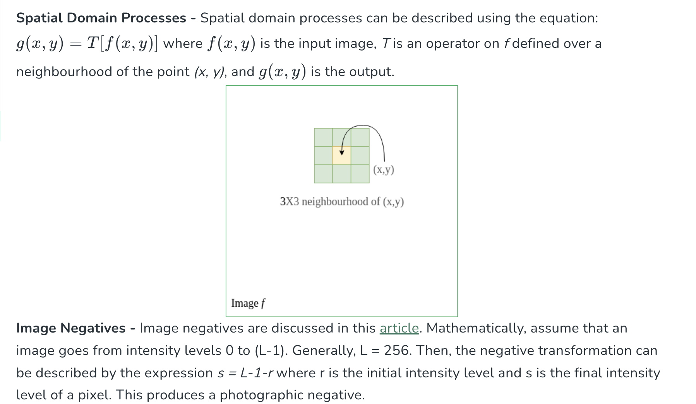
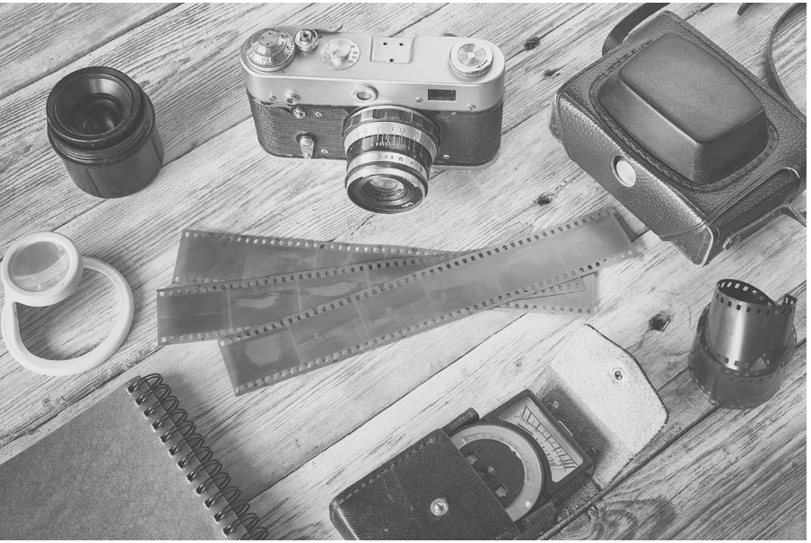
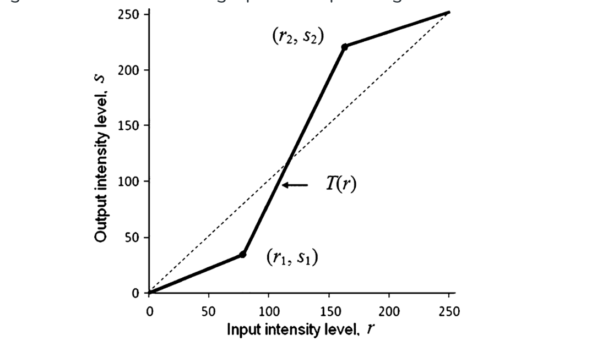

# OpenCV (Open Source Computer Vision Library)

OpenCV (Open Source Computer Vision Library) is an open-source computer vision and machine learning library. It allows us to process images and videos, detect objects, faces and even handwriting.

## Why OpenCV?

1. **Comprehensive Image Processing:** OpenCV has a range of functions to manipulate and analyze images helps in making it ideal for various applications.

2. **Real-Time Video Processing:** It supports video capture and real-time video processing.

3. **Cross-Platform:** Works on multiple platforms like Windows, Linux, macOS and Android.

4. **Open-Source:** It is free to use and has a large community support.

5. **Integration with Deep Learning:** It integrates with popular deep learning libraries like TensorFlow and PyTorch.

OpenCV is one of the most popular computer vision libraries.

## Important concepts of OpenCV

1. Reading an image
2. Extracting the RGB values of a pixel
3. Extracting the Region of Interest (ROI)
4. Resizing the Image
5. Rotating the Image
6. Drawing a Rectangle
7. Displaying text


**Install the OpenCV library using the following command:**

`pip install opencv-python`

## Reading an Image

First of all, we will import `cv2` module and then read the input image using cv2’s `imread()` method. Then extract the `height` and `width` of the image.


```
# Importing the OpenCV library
import cv2

# Reading the image using imread() function
image = cv2.imread('/content/road.jpg')

# Extracting the height and width of an image
h, w, c = image.shape[:3]

# Image shape
print(f"Image shape: {image.shape}")

# Displaying the height and width
print("Height = {}, Width = {}, Channels = {}".format(h, w, c))

# pixel values
print("Image pixel details: {}".format(image))
```

## Extracting the `RGB` Values of a `Pixel`

Now we will focus on extracting the `RGB values` of an `individual pixel`. `OpenCV arranges the channels in BGR order`. So the `0th` `value` will correspond to the `Blue pixel` and `not the Red`.

```
# Extracting RGB values.
# Here we have randomly chosen a pixel
# by passing in 100, 100 for height and width.

(B, G, R) = image[100, 100]

# Displaying the pixel values
print("R = {}, G = {}, B = {}".format(R, G, B))

# We can also pass the channel to extract
# the value for a specific channel
B = image[100, 100, 0]
G = image[100, 100, 1]
R = image[100, 100, 2]

print("B = {}".format(B))
print("G = {}".format(G))
print("R = {}".format(R))
```

## Extracting the `Region of Interest (ROI)`

Sometimes we want to extract a particular part or region of an image. This can be done by slicing the pixels of the image.

```
# We will calculate the region of interest
# by slicing the pixels of the image

from google.colab.patches import cv2_imshow

roi = image[100 : 500, 200 : 700]
cv2_imshow(roi)
cv2.waitKey(0)
```

# 📦 OpenCV (cv2) – Complete Functional Overview

## 1️⃣ Image & Video I/O
Used to read, write, display images/videos.

| Function                  | Description         |
| ------------------------- | ------------------- |
| `cv2.imread()`            | Read image          |
| `cv2.imwrite()`           | Save image          |
| `cv2.imshow()`            | Show image          |
| `cv2.waitKey()`           | Keyboard wait       |
| `cv2.destroyAllWindows()` | Close windows       |
| `cv2.VideoCapture()`      | Read video / webcam |
| `cv2.VideoWriter()`       | Save video          |


## 2️⃣ Image Properties & Pixel Operations
| Function               | Description      |
| ---------------------- | ---------------- |
| `image.shape`          | Image dimensions |
| `image.dtype`          | Data type        |
| `image.size`           | Total pixels     |
| `cv2.split()`          | Split channels   |
| `cv2.merge()`          | Merge channels   |
| `cv2.copyMakeBorder()` | Add padding      |


## 3️⃣ Color Space Conversions
| Conversion | Function                                |
| ---------- | --------------------------------------- |
| BGR → Gray | `cv2.cvtColor(img, cv2.COLOR_BGR2GRAY)` |
| BGR → RGB  | `cv2.COLOR_BGR2RGB`                     |
| BGR → HSV  | `cv2.COLOR_BGR2HSV`                     |
| BGR → LAB  | `cv2.COLOR_BGR2LAB`                     |
| Gray → BGR | `cv2.COLOR_GRAY2BGR`                    |


## 4️⃣ Image Resizing, Cropping & Geometry
| Function                    | Description           |
| --------------------------- | --------------------- |
| `cv2.resize()`              | Resize image          |
| `cv2.getRotationMatrix2D()` | Rotation matrix       |
| `cv2.warpAffine()`          | Rotate / translate    |
| `cv2.warpPerspective()`     | Perspective transform |
| `cv2.flip()`                | Flip image            |
| ROI slicing                 | `img[y1:y2, x1:x2]`   |


## 5️⃣ Image Filtering & Smoothing
| Function                | Description          |
| ----------------------- | -------------------- |
| `cv2.blur()`            | Average blur         |
| `cv2.GaussianBlur()`    | Gaussian blur        |
| `cv2.medianBlur()`      | Median filter        |
| `cv2.bilateralFilter()` | Edge-preserving blur |


## 6️⃣ Thresholding & Binarization
| Function                  | Description        |
| ------------------------- | ------------------ |
| `cv2.threshold()`         | Global threshold   |
| `cv2.adaptiveThreshold()` | Adaptive threshold |
| `cv2.THRESH_BINARY`       | Binary             |
| `cv2.THRESH_OTSU`         | Otsu’s method      |


## 7️⃣ Edge Detection
| Function          | Description        |
| ----------------- | ------------------ |
| `cv2.Canny()`     | Edge detection     |
| `cv2.Sobel()`     | Gradient edges     |
| `cv2.Laplacian()` | Second-order edges |


## 8️⃣ Morphological Operations
| Function             | Description    |
| -------------------- | -------------- |
| `cv2.erode()`        | Shrink objects |
| `cv2.dilate()`       | Expand objects |
| `cv2.morphologyEx()` | Advanced ops   |
| `cv2.MORPH_OPEN`     | Remove noise   |
| `cv2.MORPH_CLOSE`    | Fill holes     |

## 9️⃣ Contours & Shape Analysis
| Function             | Description     |
| -------------------- | --------------- |
| `cv2.findContours()` | Detect contours |
| `cv2.drawContours()` | Draw contours   |
| `cv2.contourArea()`  | Area            |
| `cv2.arcLength()`    | Perimeter       |
| `cv2.boundingRect()` | Bounding box    |
| `cv2.minAreaRect()`  | Rotated box     |
| `cv2.approxPolyDP()` | Polygon approx  |


## 🔟 Feature Detection & Matching
| Algorithm     | Function                           |
| ------------- | ---------------------------------- |
| Harris Corner | `cv2.cornerHarris()`               |
| ORB           | `cv2.ORB_create()`                 |
| SIFT          | `cv2.SIFT_create()`                |
| FAST          | `cv2.FastFeatureDetector_create()` |
| BF Matcher    | `cv2.BFMatcher()`                  |
| FLANN         | `cv2.FlannBasedMatcher()`          |

## 1️⃣1️⃣ Object Detection (Classical CV)

| Method            | Function                  |
| ----------------- | ------------------------- |
| Haar Cascade      | `cv2.CascadeClassifier()` |
| HOG Detector      | `cv2.HOGDescriptor()`     |
| Template Matching | `cv2.matchTemplate()`     |


## 1️⃣2️⃣ Background Subtraction & Motion
| Function                               | Description      |
| -------------------------------------- | ---------------- |
| `cv2.absdiff()`                        | Frame difference |
| `cv2.createBackgroundSubtractorMOG2()` | Motion detection |
| `cv2.calcOpticalFlowFarneback()`       | Optical flow     |


## 1️⃣3️⃣ Drawing Functions
| Function          | Description    |
| ----------------- | -------------- |
| `cv2.line()`      | Draw line      |
| `cv2.rectangle()` | Draw rectangle |
| `cv2.circle()`    | Draw circle    |
| `cv2.putText()`   | Write text     |
| `cv2.polylines()` | Draw polygons  |


## 1️⃣4️⃣ Histogram & Image Statistics
| Function             | Description    |
| -------------------- | -------------- |
| `cv2.calcHist()`     | Histogram      |
| `cv2.equalizeHist()` | Contrast       |
| `cv2.normalize()`    | Normalize data |


## 1️⃣5️⃣ Camera Calibration & Geometry
| Function                      | Description       |
| ----------------------------- | ----------------- |
| `cv2.findChessboardCorners()` | Calibration       |
| `cv2.calibrateCamera()`       | Camera params     |
| `cv2.undistort()`             | Remove distortion |


## 1️⃣6️⃣ Deep Learning (DNN Module)
| Function                    | Description |
| --------------------------- | ----------- |
| `cv2.dnn.readNet()`         | Load model  |
| `cv2.dnn.readNetFromONNX()` | ONNX        |
| `cv2.dnn.blobFromImage()`   | Preprocess  |
| `net.forward()`             | Inference   |


## 1️⃣7️⃣ Video Analysis Utilities
| Function                 | Description |
| ------------------------ | ----------- |
| `cv2.createTrackbar()`   | UI control  |
| `cv2.getTickCount()`     | FPS         |
| `cv2.getTickFrequency()` | Timing      |


## MOST USED FUNCTIONS (REAL PROJECTS)

```
cv2.imread
cv2.resize
cv2.cvtColor
cv2.GaussianBlur
cv2.Canny
cv2.findContours
cv2.boundingRect
cv2.putText
cv2.VideoCapture
cv2.dnn.readNet
```


# Image Processing and Enhancement

## Blurring an Image
Image blurring is a technique used in image processing to reduce sharpness and detail making an image appear smoother.

This is done by applying filters also called low-pass filters that reduce high-frequency noise and smooth finer details. Blurring is used for tasks like noise reduction, edge smoothing or creating artistic effects.

It works by averaging the pixel values around each pixel, softening the image in the process. It’s useful in scenarios where minimizing noise or reducing sharpness is necessary such as in preparing images for computer vision models or applying a soft, artistic effect.

## Types of Blurring

We can apply various blurring techniques based on the desired effect.

**1. Gaussian Blurring**

Gaussian blur works by applying a Gaussian function to an image, resulting in a smooth blur. It’s useful for noise reduction and detail reduction in images. It is used as a preprocessing step for machine learning and deep learning models.

`cv2.COLOR_BGR2RGB`

```
import cv2
from matplotlib import pyplot as plt

image_path = '/content/cats_dogs.jpg'
image = cv2.imread(image_path)
resized_image = cv2.resize(image, (1900, 800))
resized_image_rgb = cv2.cvtColor(resized_image, cv2.COLOR_BGR2RGB)
plt.imshow(resized_image_rgb)
plt.title('Original Image')
plt.axis('off')
plt.show()
```

`cv2.GaussianBlur`
`cv2.cvtColor(Gaussian, cv2.COLOR_BGR2RGB)`

```
Gaussian = cv2.GaussianBlur(resized_image, (15, 15), 0)  
Gaussian_rgb = cv2.cvtColor(Gaussian, cv2.COLOR_BGR2RGB)  
plt.imshow(Gaussian_rgb)
plt.title('Gaussian Blurred Image')
plt.axis('off')
plt.show()
```

**2. Median Blur**

Median blur is a non-linear filter which means it doesn't average the pixel values. Instead, it replaces each pixel with the median value of its neighboring pixels. This technique is useful for removing salt-and-pepper noise (random black and white pixels) while keeping the edges intact.

`cv2.medianBlur`
`cv2.cvtColor(median, cv2.COLOR_BGR2RGB)`

```
median = cv2.medianBlur(resized_image, 11)  
median_rgb = cv2.cvtColor(median, cv2.COLOR_BGR2RGB)  

plt.imshow(median_rgb)
plt.title('Median Blurred Image')
plt.axis('off')
plt.show()
```

## 3. Bilateral Blur

The bilateral filter is a more advanced technique that smooths the image while preserving edges. It calculates a weighted average based on both the spatial distance and the pixel intensity. This means that it will blur areas with similar colors and preserve sharp edges, making it useful for noise reduction without sacrificing important details.

`cv2.bilateralFilter`
`cv2.cvtColor(bilateral, cv2.COLOR_BGR2RGB)`

```
bilateral = cv2.bilateralFilter(resized_image, 15, 150, 150)  
bilateral_rgb = cv2.cvtColor(bilateral, cv2.COLOR_BGR2RGB)  

plt.imshow(bilateral_rgb)
plt.title('Bilateral Blurred Image')
plt.axis('off')
plt.show()
```

## Challenges of Image Blurring

1. **Loss of Detail:** While blurring can be useful, it may also blur important details in an image, reducing its overall clarity and making analysis difficult in certain contexts.

2. **Over-blurring:** Overuse of blurring techniques can lead to overly soft or unrealistic images, losing sharpness and making it harder to identify key elements.

3. **Computational Cost:** Advanced blurring methods such as bilateral filtering, may require significant computational resources, especially for large images or real-time applications.


# Grayscaling of Images using OpenCV
Grayscaling is the process of converting an image from other color spaces e.g. RGB, CMYK, HSV, etc. to shades of gray. It varies between complete black and complete white.

**Importance of grayscaling**

- **Fewer dimensions:** RGB images have three channels, while grayscale images have only one.

- **Simpler models:** Less input data reduces complexity and speeds up training.

- **Algorithm-ready:** Some methods, such as Canny edge detection, work only on grayscale images.


Let's learn the different image processing methods to convert a colored image into a grayscale image.

**Method 1: Using the `cv2.cvtColor()` function**


`cv2.COLOR_BGR2GRAY`
`cv2.cvtColor(image, cv2.COLOR_BGR2GRAY)`
`cv2.imshow('Grayscale', gray_image)`

```
import cv2

image = cv2.imread('tomatoes.jpg')

gray_image = cv2.cvtColor(image, cv2.COLOR_BGR2GRAY)

cv2.imshow('Grayscale', gray_image)
cv2.waitKey(0)  
cv2.destroyAllWindows()
```

**Explanation:**

- **cv2.imread():** Reads the image file (OpenCV loads color images as BGR by default).

- **cv2.cvtColor():** Converts color spaces; `cv2.COLOR_BGR2GRAY` produces a single-channel grayscale image.

- **cv2.imshow():** Opens a window to display the image.


**Method 2: Using the cv2.imread() function with flag=zero**

In this method, we can directly load an image in grayscale mode by passing the flag 0 to cv2.imread(). This saves us from having to convert the image separately after loading.

```
import cv2

img = cv2.imread('tomatoes.jpg', 0)

cv2.imshow('Grayscale Image', img)
cv2.waitKey(0)
cv2.destroyAllWindows()
```

**Explanation:**

- **cv2.imread(path, 0):** Reads the image directly in grayscale (single-channel).

- **cv2.imshow():** Displays the single-channel image.

- **cv2.waitKey() / cv2.destroyAllWindows():** Controls display lifetime.


**Method 3.1 Weighted Method (Recommended)**

This method uses standard luminance weights (0.2989R + 0.5870G + 0.1140B) to account for human visual sensitivity—more to green, less to red, least to blue. It produces a more realistic and visually accurate grayscale image.


```
import cv2

img_weighted = cv2.imread('tomatoes.jpg')
rows, cols = img_weighted.shape[:2]

for i in range(rows):
    for j in range(cols):
        gray = 0.2989 * img_weighted[i, j][2] + 0.5870 * img_weighted[i, j][1] + 0.1140 * img_weighted[i, j][0]
        img_weighted[i, j] = [gray, gray, gray]

cv2.imshow('Grayscale Image (Weighted)', img_weighted)
cv2.waitKey(0)
cv2.destroyAllWindows()
```

**Explanation:**

- **rows, cols = img_weighted.shape[:2]:** extracts image height (rows) and width (cols) from the shape.

- **Nested for loops are used to iterate over every pixel in the image.

- Weighted formula: Gray = 0.2989*R + 0.5870*G + 0.1140*B (indices: R=[2], G=[1], B=[0] in OpenCV).

- Assigning [gray, gray, gray] preserves a 3-channel image for display.

- This produces visually more accurate grayscale than simple averaging, but is still slower than OpenCV’s native conversions.


## Method 3.2: Using the pixel manipulation (Average method)

This method converts an image to grayscale by averaging the contributions of color channels (RGB). It’s a simple approach but not very accurate because it treats all colors equally, ignoring how the human eye perceives brightness.

```


import cv2

img = cv2.imread('C:\\Documents\\full_path\\tomatoes.jpg')
rows, cols = img.shape[:2]

for i in range(rows):
    for j in range(cols):
        gray = (img[i, j, 0] + img[i, j, 1] + img[i, j, 2]) / 3
        img[i, j] = [gray, gray, gray]

cv2.imshow('Grayscale Image (Average)', img)
cv2.waitKey(0)
cv2.destroyAllWindows()
```


## Image Processing in Python

**1. Image Resizing**

Image Resizing refers to the process of changing the dimensions of an image. This can involve either enlarging or reducing the size of an image while preserving its content. Resizing is often used in image processing to make images fit specific dimensions for display on different devices or for further analysis. The cv2.resize() function is used for this task. Here:

- `cv2.resize():` Resizes the image to new dimensions.
- `cv2.INTER_CUBIC:` Provides high-quality enlargement.
- `cv2.INTER_AREA:` Works best for downscaling.


```
import cv2
import numpy as np
import matplotlib.pyplot as plt

image = cv2.imread('Ganeshji.webp')
image_rgb = cv2.cvtColor(image, cv2.COLOR_BGR2RGB)
scale_factor_1 = 3.0  
scale_factor_2 = 1/3.0
height, width = image_rgb.shape[:2]
new_height = int(height * scale_factor_1)
new_width = int(width * scale_factor_1)

zoomed_image = cv2.resize(src =image_rgb, 
                          dsize=(new_width, new_height), 
                          interpolation=cv2.INTER_CUBIC)
                          
new_height1 = int(height * scale_factor_2)
new_width1 = int(width * scale_factor_2)
scaled_image = cv2.resize(src= image_rgb, 
                          dsize =(new_width1, new_height1), 
                          interpolation=cv2.INTER_AREA)

fig, axs = plt.subplots(1, 3, figsize=(10, 4))
axs[0].imshow(image_rgb)
axs[0].set_title('Original Image Shape:'+str(image_rgb.shape))
axs[1].imshow(zoomed_image)
axs[1].set_title('Zoomed Image Shape:'+str(zoomed_image.shape))
axs[2].imshow(scaled_image)
axs[2].set_title('Scaled Image Shape:'+str(scaled_image.shape))

for ax in axs:
    ax.set_xticks([])
    ax.set_yticks([])

plt.tight_layout()
plt.show()
```

**2. Image Rotation**
Images can be rotated to any degree clockwise or anticlockwise using image rotation. We just need to define rotation matrix listing rotation point, degree of rotation and the scaling factor. Here:

- `cv2.getRotationMatrix2D() :` generates the transformation matrix.
- `cv2.warpAffine() :` applies the rotation.
- A `positive angle` rotates the image clockwise; a `negative angle` rotates it counterclockwise.
- The `scale factor` adjusts the image size.

```
import cv2
import matplotlib.pyplot as plt
img = cv2.imread('Ganeshji.webp')
image_rgb = cv2.cvtColor(img, cv2.COLOR_BGR2RGB)
center = (image_rgb.shape[1] // 2, image_rgb.shape[0] // 2)
angle = 30
scale = 1
rotation_matrix = cv2.getRotationMatrix2D(center, angle, scale)
rotated_image = cv2.warpAffine(image_rgb, rotation_matrix, (img.shape[1], img.shape[0]))

fig, axs = plt.subplots(1, 2, figsize=(7, 4))
axs[0].imshow(image_rgb)
axs[0].set_title('Original Image')
axs[1].imshow(rotated_image)
axs[1].set_title('Image Rotation')
for ax in axs:
    ax.set_xticks([])
    ax.set_yticks([])
    
plt.tight_layout()
plt.show()
```

**3. Image Translation**
Image Translation is the process of moving an image from one position to another within a specified frame of reference. This shift can occur along the x-axis (horizontal movement) and y-axis (vertical movement) without altering the content or orientation of the image. Here:

- `cv2.warpAffine()` shifts the image based on translation values.
- `tx`, `ty` define the movement along the x and y axes.

```
import cv2
import matplotlib.pyplot as plt
import numpy as np

img = cv2.imread('Ganeshji.webp')
image_rgb = cv2.cvtColor(img, cv2.COLOR_BGR2RGB)
width, height = image_rgb.shape[1], image_rgb.shape[0]

tx, ty = 100, 70
translation_matrix = np.array([[1, 0, tx], [0, 1, ty]], dtype=np.float32)
translated_image = cv2.warpAffine(image_rgb, translation_matrix, (width, height))

fig, axs = plt.subplots(1, 2, figsize=(7, 4))
axs[0].imshow(image_rgb), axs[0].set_title('Original Image')
axs[1].imshow(translated_image), axs[1].set_title('Image Translation')

for ax in axs:
    ax.set_xticks([]), ax.set_yticks([])

plt.tight_layout()
plt.show()
```

**4. Image Shearing**

Image Shearing is a geometric transformation that distorts or skews an image along one or both axes. This operation slants the image creating a shear effect without changing its area or shape. Shearing can be applied to make the image appear as if it’s being stretched or compressed in a particular direction. Here:

- `shear_x`, `shear_y` control the degree of skewing.
- `cv2.warpAffine()` applies the transformation.

```
import cv2
import numpy as np
import matplotlib.pyplot as plt

image = cv2.imread('Ganeshji.webp')
image_rgb = cv2.cvtColor(image, cv2.COLOR_BGR2RGB)
width, height = image_rgb.shape[1], image_rgb.shape[0]

shearX, shearY = -0.15, 0
transformation_matrix = np.array([[1, shearX, 0], [0, 1, shearY]], dtype=np.float32)
sheared_image = cv2.warpAffine(image_rgb, transformation_matrix, (width, height))

fig, axs = plt.subplots(1, 2, figsize=(7, 4))
axs[0].imshow(image_rgb), axs[0].set_title('Original Image')
axs[1].imshow(sheared_image), axs[1].set_title('Sheared Image')

for ax in axs:
    ax.set_xticks([]), ax.set_yticks([])

plt.tight_layout()
plt.show()
```

**5. Image Normalization**
Image Normalization scales pixel values to a specific range to enhance image processing tasks. Here:

- `cv2.normalize():` Normalizes pixel values.
- `cv2.NORM_MINMAX:` Scales values between 0 and 1.
- `cv2.merge():` Combines separately normalized RGB channels.

```
import cv2
import numpy as np
import matplotlib.pyplot as plt

image = cv2.imread('Ganeshji.webp')
image_rgb = cv2.cvtColor(image, cv2.COLOR_BGR2RGB)
b, g, r = cv2.split(image_rgb)

b_normalized = cv2.normalize(b.astype('float'), None, 0, 1, cv2.NORM_MINMAX)
g_normalized = cv2.normalize(g.astype('float'), None, 0, 1, cv2.NORM_MINMAX)
r_normalized = cv2.normalize(r.astype('float'), None, 0, 1, cv2.NORM_MINMAX)

normalized_image = cv2.merge((b_normalized, g_normalized, r_normalized))
print(normalized_image[:, :, 0])

plt.imshow(normalized_image)
plt.xticks([]), 
plt.yticks([]), 
plt.title('Normalized Image')
plt.show()
```

**6. Edge detection of Image**
Edge detection is used to find sharp edges withing image to find different objects and boundaries within a image. Canny Edge Detection is a popular edge detection method. Here:

- `cv2.GaussianBlur():` Removes noise through Gaussian smoothing.
- `cv2.Sobel():` Computes the gradient of the image.
- `cv2.Canny():` Applies non-maximum suppression and hysteresis thresholding to detect edges.


```
import cv2
import numpy as np
import matplotlib.pyplot as plt

img = cv2.imread('Ganeshji.webp')
image_rgb = cv2.cvtColor(img, cv2.COLOR_BGR2RGB)
edges = cv2.Canny(image_rgb, 100, 700)

fig, axs = plt.subplots(1, 2, figsize=(7, 4))
axs[0].imshow(image_rgb), axs[0].set_title('Original Image')
axs[1].imshow(edges), axs[1].set_title('Image Edges')

for ax in axs:
    ax.set_xticks([]), ax.set_yticks([])

plt.tight_layout()
plt.show()
```

**7. Image Blurring**
Image Blurring reduces image detail by averaging pixel values. Here:

- `cv2.GaussianBlur():` Smooths using a Gaussian kernel.
- `cv2.medianBlur():` Replaces pixels with the median value in a neighborhood.
- `cv2.bilateralFilter():` Preserves edges while blurring.

```
import cv2
import numpy as np
import matplotlib.pyplot as plt

image = cv2.imread('Ganeshji.webp')
image_rgb = cv2.cvtColor(image, cv2.COLOR_BGR2RGB)
blurred = cv2.GaussianBlur(image, (3, 3), 0)
blurred_rgb = cv2.cvtColor(blurred, cv2.COLOR_BGR2RGB)

fig, axs = plt.subplots(1, 2, figsize=(7, 4))
axs[0].imshow(image_rgb), axs[0].set_title('Original Image')
axs[1].imshow(blurred_rgb), axs[1].set_title('Blurred Image')

for ax in axs:
    ax.set_xticks([]), ax.set_yticks([])

plt.tight_layout()
plt.show()
```

**8. Morphological Image Processing**
Morphological Image Processing involves techniques that process the structure or shape of objects in an image. It focuses on operations like dilation, erosion, opening and closing which modify the image's geometric features. These operations work by examining the image’s pixels in relation to their neighbors usually with a small mask or kernel.Here:

- `cv2.dilate():` Expands object boundaries.
- `cv2.erode():` Shrinks object boundaries.
- `cv2.morphologyEx()` with `cv2.MORPH_OPEN:` Removes small noise.
- `cv2.morphologyEx()` with `cv2.MORPH_CLOSE:` Fills small holes.

```
import cv2
import numpy as np
import matplotlib.pyplot as plt

image = cv2.imread('Ganeshji.webp')
image_gray = cv2.cvtColor(image, cv2.COLOR_BGR2GRAY)
kernel = np.ones((3, 3), np.uint8)

dilated = cv2.dilate(image_gray, kernel, iterations=2)
eroded = cv2.erode(image_gray, kernel, iterations=2)
opening = cv2.morphologyEx(image_gray, cv2.MORPH_OPEN, kernel)
closing = cv2.morphologyEx(image_gray, cv2.MORPH_CLOSE, kernel)

fig, axs = plt.subplots(2, 2, figsize=(7, 7))
axs[0, 0].imshow(dilated, cmap='Greys'), axs[0, 0].set_title('Dilated Image')
axs[0, 1].imshow(eroded, cmap='Greys'), axs[0, 1].set_title('Eroded Image')
axs[1, 0].imshow(opening, cmap='Greys'), axs[1, 0].set_title('Opening')
axs[1, 1].imshow(closing, cmap='Greys'), axs[1, 1].set_title('Closing')

for ax in axs.flatten():
    ax.set_xticks([]), ax.set_yticks([])

plt.tight_layout()
plt.show()
```

## Intensity Transformation Operations on Images
Intensity transformations are applied on images for contrast manipulation or image thresholding.
These are in the spatial domain, i.e. they are performed directly on the pixels of the image at hand, as opposed to being performed on the Fourier transform of the image. The following are commonly used intensity transformations:

1. **Image Negatives (Linear)**
2. **Log Transformations**
3. **Power-Law (Gamma) Transformations**
4. **Piecewise-Linear Transformation Functions**


Spatial Domain Processes - Spatial domain processes can be described using the equation:



**Log Transformations -**
Mathematically, log transformations can be expressed as s = clog(1+r). Here, s is the output intensity, r>=0 is the input intensity of the pixel, and c is a scaling constant. c is given by 255/(log (1 + m)), where m is the maximum pixel value in the image. It is done to ensure that the final pixel value does not exceed (L-1), or 255. Practically, log transformation maps a narrow range of low-intensity input values to a wide range of output values. Consider the following input image.

```
import cv2
import numpy as np

# Open the image.
img = cv2.imread('sample.jpg')

# Apply log transform.
c = 255/(np.log(1 + np.max(img)))
log_transformed = c * np.log(1 + img)

# Specify the data type.
log_transformed = np.array(log_transformed, dtype = np.uint8)

# Save the output.
cv2.imwrite('log_transformed.jpg', log_transformed)
```

**Power-Law (Gamma) Transformation -**
Power-law (gamma) transformations can be mathematically expressed as s=crγ . Gamma correction is important for displaying images on a screen correctly, to prevent bleaching or darkening of images when viewed from different types of monitors with different display settings. This is done because our eyes perceive images in a gamma-shaped curve, whereas cameras capture images in a linear fashion.

```
import cv2
import numpy as np

# Open the image.
img = cv2.imread('sample.jpg')

# Trying 4 gamma values.
for gamma in [0.1, 0.5, 1.2, 2.2]:
    
    # Apply gamma correction.
    gamma_corrected = np.array(255*(img / 255) ** gamma, dtype = 'uint8')

    # Save edited images.
    cv2.imwrite('gamma_transformed'+str(gamma)+'.jpg', gamma_corrected)
```

Below are the gamma-corrected outputs for different values of gamma. 

**Gamma = 0.1:**


**Gamma = 0.5:**



**Gamma = 1.2:**


**Gamma = 2.2:**


As can be observed from the outputs as well as the graph, gamma>1 (indicated by the curve corresponding to 'nth power' label on the graph), the intensity of pixels decreases i.e. the image becomes darker. On the other hand, gamma<1 (indicated by the curve corresponding to 'nth root' label on the graph), the intensity increases i.e. the image becomes lighter.


**Piecewise-Linear Transformation Functions -**

These functions, as the name suggests, are not entirely linear in nature. However, they are linear between certain x-intervals. One of the most commonly used piecewise-linear transformation functions is contrast stretching. Contrast can be defined as:

`Contrast =  (I_max - I_min)/(I_max + I_min)`

This process expands the range of intensity levels in an image so that it spans the full intensity of the camera/display. The figure below shows the graph corresponding to the contrast stretching.



With (r1, s1), (r2, s2) as parameters, the function stretches the intensity levels by essentially decreasing the intensity of the dark pixels and increasing the intensity of the light pixels. If r1 = s1 = 0 and r2 = s2 = L-1, the function becomes a straight dotted line in the graph (which gives no effect). The function is monotonically increasing so that the order of intensity levels between pixels is preserved. Below is the Python code to perform contrast stretching.

```
import cv2
import numpy as np

# Function to map each intensity level to output intensity level.
def pixelVal(pix, r1, s1, r2, s2):
    if (0 <= pix and pix <= r1):
        return (s1 / r1)*pix
    elif (r1 < pix and pix <= r2):
        return ((s2 - s1)/(r2 - r1)) * (pix - r1) + s1
    else:
        return ((255 - s2)/(255 - r2)) * (pix - r2) + s2

# Open the image.
img = cv2.imread('sample.jpg')

# Define parameters.
r1 = 70
s1 = 0
r2 = 140
s2 = 255

# Vectorize the function to apply it to each value in the Numpy array.
pixelVal_vec = np.vectorize(pixelVal)

# Apply contrast stretching.
contrast_stretched = pixelVal_vec(img, r1, s1, r2, s2)

# Save edited image.
cv2.imwrite('contrast_stretch.jpg', contrast_stretched)
```

## Image Translation using OpenCV
Image translation is the process of shifting an image from one position to another. We simply move the entire image by a fixed number of pixels, either horizontally (along the x-axis) or vertically (along the y-axis). This technique is important in various computer vision tasks such as object tracking, image alignment and creating animations. We achieve this by using a transformation matrix which helps shift the image without distorting its content. In this article, we'll see image translation, how to perform it and other core concepts.

**Key Concepts in Image Translation**
Let's see key concepts in Image Translation which are as follows:

**1. Translation Matrix**

The translation matrix is used to define how much an image should be shifted. It is a 2x3 matrix that specifies the amount of horizontal and vertical shifts. The matrix looks like this:


**where:**

- Tx is the horizontal shift (in pixels).
- Ty is the vertical shift (in pixels).

This matrix is used to move every pixel in the image by the specified amount without distorting its content.


**2. OpenCV Function**
OpenCV provides the `cv2.wrapAffine()` function to apply affine transformations like translation. This function uses the translation matrix to shift the image by the specified values of Tx and Ty.


Syntax:

`cv2.warpAffine(img, M, (w, h))`

**Parameters:**

- `img:` Image to be shifted.
- `M:` The translation matrix that defines how the image will be moved.
- `(w, h):` Width and height of the image after translation.


```
Note: A positive value for tx will shift the image to the right, while a negative value for tx will shift the image to the left and a positive value for ty will shift the image down, while a negative value for ty will shift the image up.
```

**Example 1: Translating the Image Right and Down**

- `height`, `width` = `image.shape[:2]: image.shape[:2]` gives the height and width of the image. These values are stored in height and width variables.

- `quarter_height`, `quarter_width` = `height / 4, width / 4:` This calculates one-quarter of the image's height and width which will be used as the translation distance (in pixels).

- `img_translation` = `cv2.warpAffine(image, T, (width, height)):` The image is shifted by the defined values using the matrix T. The resulting translated image is stored in img_translation.


```
import cv2
import numpy as np
from google.colab.patches import cv2_imshow

image = cv2.imread('/content/retriver.webp')

height, width = image.shape[:2]
quarter_height, quarter_width = height / 4, width / 4

T = np.float32([[1, 0, quarter_width], [0, 1, quarter_height]])

img_translation = cv2.warpAffine(image, T, (width, height))

cv2_imshow(image) 
cv2_imshow(img_translation)
```

**Example 2: Performing Multiple Translations**
In this example, we perform four different translations on the same image: left, right, top and bottom.

- `rows`, `cols`,` _` = `img.shape:` This extracts the number of rows (height) and columns (width) from the image's shape. The third value `(_)` represents the number of color channels.

```
import cv2
import numpy as np
import matplotlib.pyplot as plt

img = cv2.imread('/content/retriver.webp')
rows, cols, _ = img.shape

M_left = np.float32([[1, 0, -50], [0, 1, 0]])
M_right = np.float32([[1, 0, 50], [0, 1, 0]])
M_top = np.float32([[1, 0, 0], [0, 1, 50]])
M_bottom = np.float32([[1, 0, 0], [0, 1, -50]])

img_left = cv2.warpAffine(img, M_left, (cols, rows))
img_right = cv2.warpAffine(img, M_right, (cols, rows))
img_top = cv2.warpAffine(img, M_top, (cols, rows))
img_bottom = cv2.warpAffine(img, M_bottom, (cols, rows))

plt.subplot(221), plt.imshow(img_left), plt.title('Left')
plt.subplot(222), plt.imshow(img_right), plt.title('Right')
plt.subplot(223), plt.imshow(img_top), plt.title('Top')
plt.subplot(224), plt.imshow(img_bottom), plt.title('Bottom')
plt.show()
```

- First image shows the translation to the left by 50px.
- Second image shows the translation to the right by 50px.
- Third image shows the translation to the top by 50px.
- Fourth image shows the translation to the bottom by 50px.

## Real-World Applications of Image Translation

1. **Object Tracking:** It helps track moving objects in video frames by shifting the image based on the object's position, important for surveillance and motion analysis.

2. **Image Stitching:** It helps align parts of images when creating panoramic views, making sure that they blend seamlessly.

3. **Augmented Reality (AR):** It is used to move virtual objects within real-world environments in AR applications, helping them interact naturally with the surroundings.

4. **Image Animation:** It is used to create smooth animations by shifting parts of the image step by step, simulating motion or transitions.


## Advantages of Image Translation

Let's see some common advantages of Image Translation:

1. **Simple Implementation:** Image translation is easy to implement with basic transformation matrices, making it an accessible tool for many applications.

2. **Preserves Image Integrity:** Unlike other transformations, it shifts the image without distorting or altering its content, keeping the original data intact.

3. **Improves Image Alignment:** It helps align images or objects in tasks like stitching, ensuring smoother integration between different visual elements.

4. **Efficient for Image Cropping:** It allows precise cropping by shifting the image to focus on the desired portion, making it ideal for creating zoomed-in or focused views.


## Limitations of Image Translation

1. **Loss of Image Quality:** Large translations can cause pixelation or blurriness, reducing image clarity, especially when shifting significant portions.

2. **Handling Large Translations:** Shifting an image too far may crop or distort parts, losing important content or causing visual issues.

3. **Difficulty in Alignment:** In tasks like stitching or tracking, translation may not perfectly align images or objects with different perspectives, leading to mismatches.

4. **Limited Real-Time Application:** In real-time systems like AR or object tracking, translation can be computationally demanding, causing delays or misalignment.


## cv2.cvtColor() method

cv2.cvtColor() is an OpenCV function that converts an image from one color space to another.

It supports over 150 color conversion methods, but in most cases, only a few (like BGR↔GRAY or BGR↔RGB) are used frequently in real-world projects.

**Reasons for Changing Color Spaces**

Different tasks require different representations of an image:

- **Grayscale:** Simplifies image analysis and reduces processing time.

- **HSV (Hue, Saturation, Value):** Useful for color-based segmentation and object tracking.

- **LAB, YCrCb, RGB, etc.:** Used in specialized applications like skin tone detection or advanced image enhancement.

**Syntax**

`cv2.cvtColor(src, code[, dst[, dstCn]])`

**Parameters:**

- **src:** input image whose color space is to be changed.
- **code:** color space conversion code (e.g., cv2.COLOR_BGR2GRAY).
- **dst(Optional):** Output image of the same size and depth as src.
- **dstCn(Optional):** Number of channels in destination image. If 0, it’s derived automatically.


**Key Points to Remember**

- OpenCV reads images in BGR format, not RGB.
- When displaying images using Matplotlib, you may need to convert BGR -> RGB for correct colors.
- Always choose a color conversion code that matches your source image format.


**Examples of cv2.cvtColor() method**

**Example 1: Convert BGR to Grayscale**

Here’s a simple Python code using OpenCV to read an image, convert it to grayscale and display it in a window.

```
import cv2
src = cv2.imread(r'logo.png')  # Read the image

# Convert to Grayscale
gray_image = cv2.cvtColor(src, cv2.COLOR_BGR2GRAY)

# Display
cv2.imshow("Grayscale Image", gray_image)
cv2.waitKey(0)
cv2.destroyAllWindows()
```

**Explanation:**

- **cv2.cvtColor(src, cv2.COLOR_BGR2GRAY):** Converts image to grayscale.
- **cv2.imshow("Grayscale Image", gray_image):** Displays grayscale image in a window.
- **cv2.waitKey(0):** Waits for a key press to keep window open.
- **cv2.destroyAllWindows():** Closes all OpenCV windows.


**Example 2: Convert BGR to HSV**
Here’s a simple Python code using OpenCV to read an image, convert it from BGR to HSV color space and display the result.

```
import cv2
src = cv2.imread(r'logo.png')

# Convert to HSV
hsv_image = cv2.cvtColor(src, cv2.COLOR_BGR2HSV)

cv2.imshow("HSV Image", hsv_image)
cv2.waitKey(0)
cv2.destroyAllWindows()
```

**Explanation:**

- `cv2.cvtColor(src, cv2.COLOR_BGR2HSV):` Converts BGR image to HSV color space.
- `cv2.imshow("HSV Image", hsv_image):` Displays HSV image in a window titled "HSV Image".

**Example 3: Convert BGR to RGB (For Matplotlib)**

This Python code reads an image using OpenCV, converts it from BGR to RGB color format and then displays it using Matplotlib.

```
import cv2
import matplotlib.pyplot as plt
src = cv2.imread(r'logo.png')

# Convert from BGR to RGB
rgb_image = cv2.cvtColor(src, cv2.COLOR_BGR2RGB)

# Display with Matplotlib
plt.imshow(rgb_image)
plt.title("RGB Image for Matplotlib")
plt.axis('off')
plt.show()
```

**Explanation:**

- `cv2.cvtColor(src, cv2.COLOR_BGR2RGB):` Converts image from BGR to RGB format for correct color display in Matplotlib.
- `plt.imshow(rgb_image):` Displays the RGB image using Matplotlib.
- `plt.axis('off'):` Hides the axis for a cleaner view.


## Common Conversion Codes

Let’s see some of the most commonly used OpenCV color conversion codes:

- `cv2.COLOR_BGR2GRAY BGR:` Grayscale
- `cv2.COLOR_BGR2RGB BGR:` RGB
- `cv2.COLOR_BGR2HSV BGR:` HSV
- `cv2.COLOR_BGR2LAB BGR:` LAB color space
- `cv2.COLOR_BGR2YCrCb BGR:` YCrCb (used in compression & skin detection)


## Real-World Applications
Different color spaces are preferred for specific computer vision tasks because they highlight certain image features better. Let’s see some real-world applications of these conversions:

- `Grayscale:` Face detection, OCR (text recognition)
- `HSV:` Object tracking (e.g., detecting a colored ball)
- `LAB:` Color enhancement, skin tone detection
- `YCrCb:` Video compression, human skin detection


