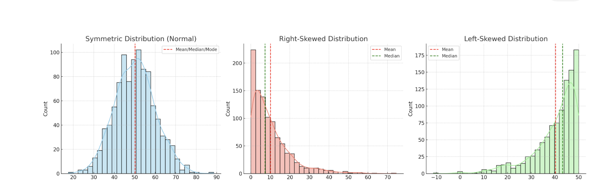
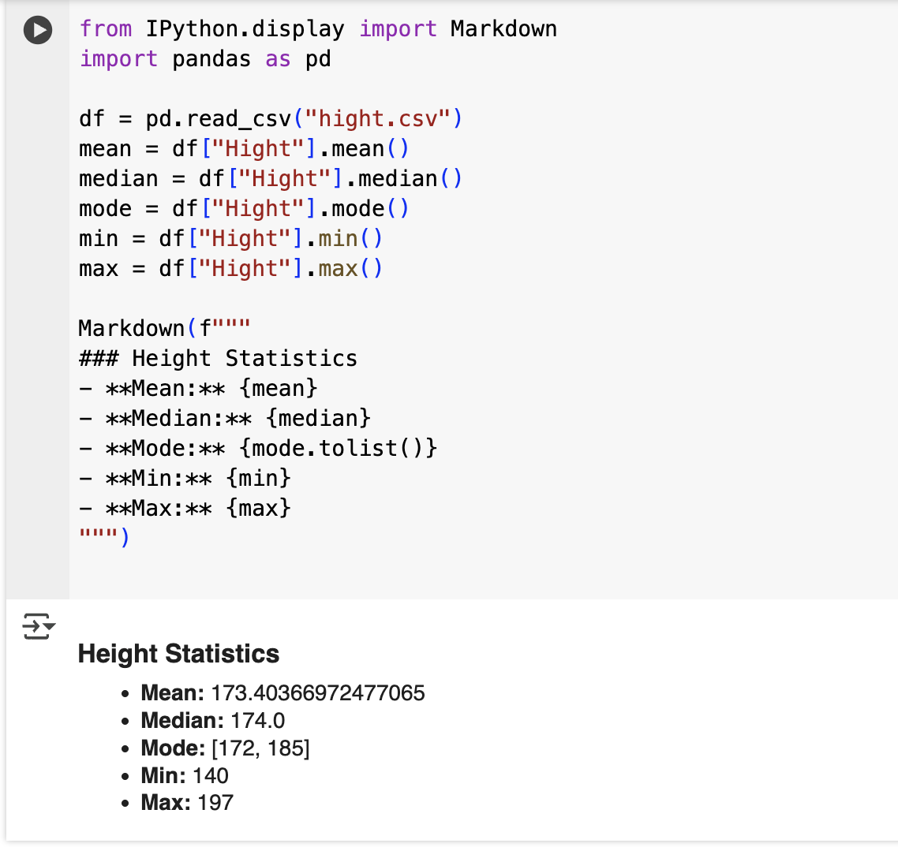
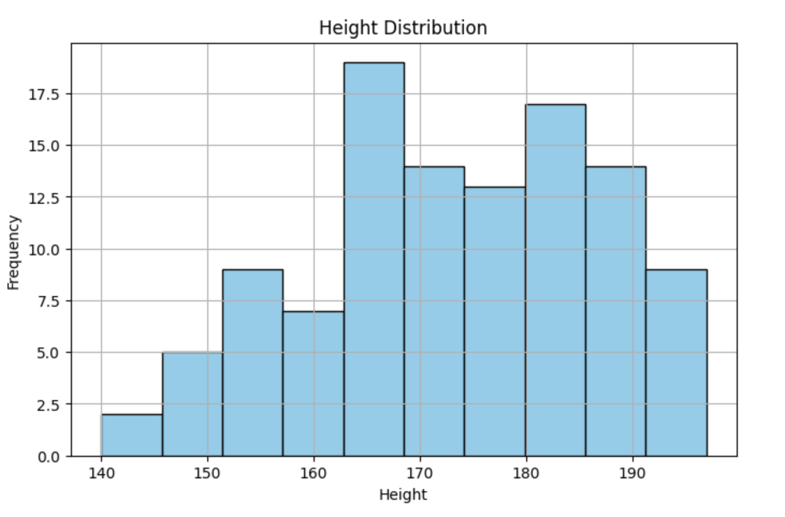
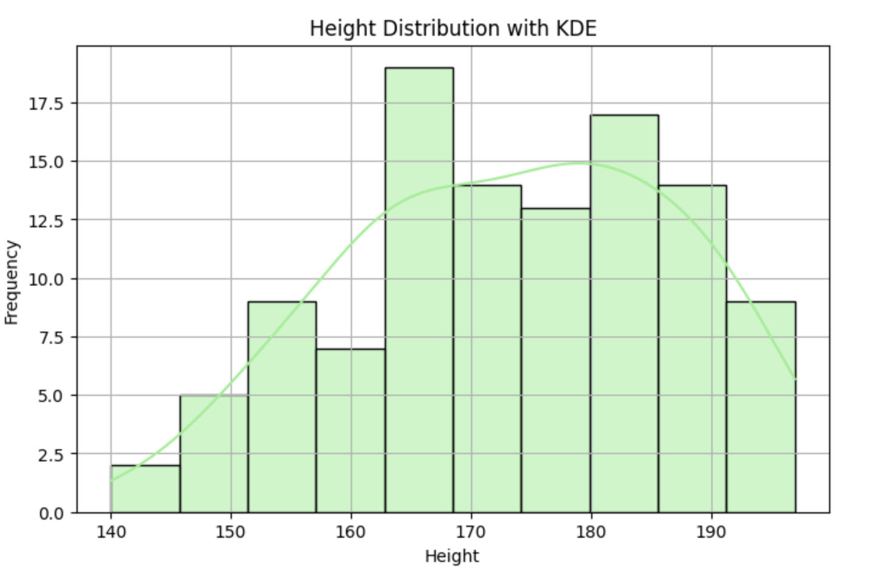
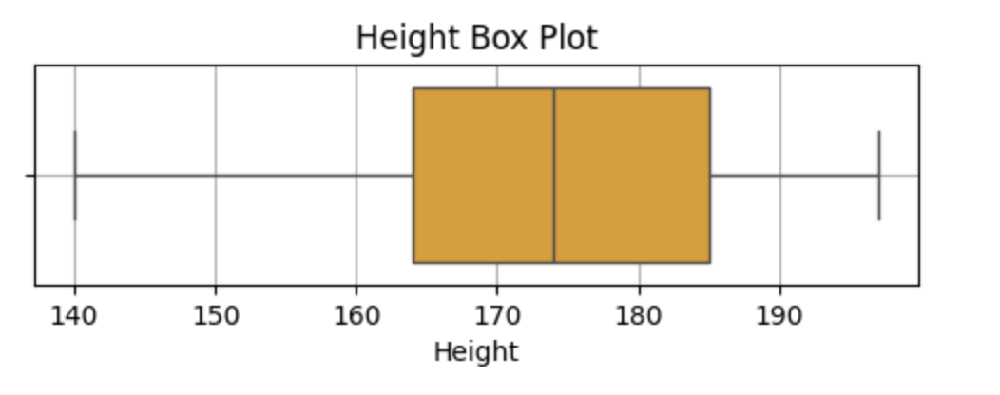
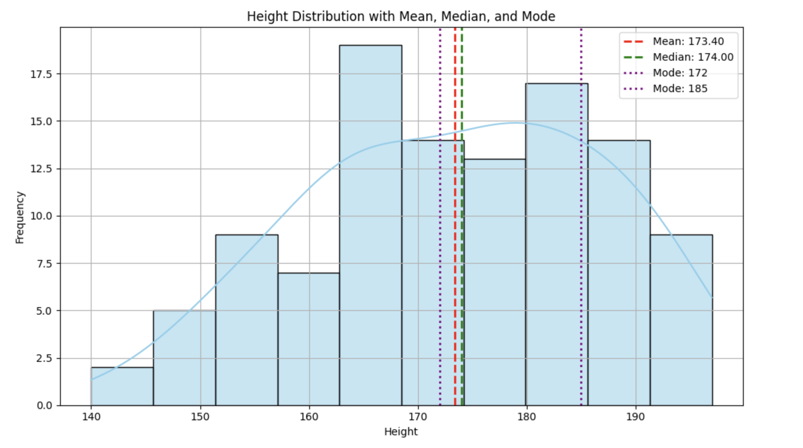
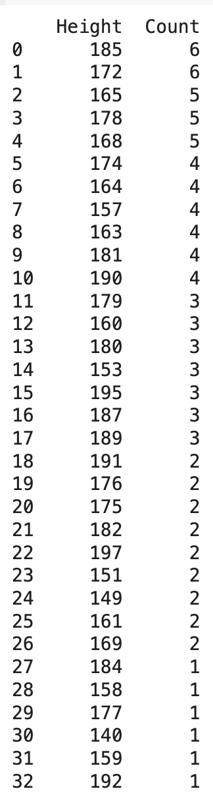

<h2 style="color:red;">✅ Mean (Arithmetic Mean)</h2>


<h3 style="color:blue;">📌 What is Mean?</h3>
The **mean** is the **average** of a set of numbers. It’s a **measure of central tendency**, used to represent the **typical value** in a dataset.

<h3 style="color:blue;">🔢 Formula:</h3>
Mean = Sum of all values / Number of values

## 🧠 Real-Time Example: Retail Sales

Suppose you're a retail manager tracking daily sales for a week.

| Day       | Sales (₹) |
| --------- | --------- |
| Monday    | 10,000    |
| Tuesday   | 12,000    |
| Wednesday | 9,000     |
| Thursday  | 11,000    |
| Friday    | 10,000    |
| Saturday  | 20,000    |
| Sunday    | 18,000    |


**➕ Step 1: Sum of sales**

Total Sales = 10,000+12,000+9,000+11,000+10,000+20,000+18,000=₹90,000

**➗ Step 2: Number of days = 7**

**📊 Step 3: Calculate Mean**

Mean Sales = ₹90,000 / 7 = ₹12,857.14

**📘 Interpretation:**

On average, your store made ₹12,857.14 per day during the week.

## ⚠️ When Mean Can Be Misleading

If one day had an unusually high or low sale, it would affect the mean significantly.

For example, if Saturday = ₹100,000, the mean would rise sharply, even though it's not typical for the week.

**✅ When to Use Mean**

| Use Case                   | Use Mean?    | Why?                              |
| -------------------------- | ------------ | --------------------------------- |
| Data without outliers      | ✅ Yes        | Accurately reflects central value |
| Symmetric distribution     | ✅ Yes        | Mean = Median ≈ Mode              |
| Data with outliers or skew | ❌ Use Median | Mean may be distorted             |

**✅ What is a Symmetric Distribution?(Normal/Bell Curve)**

A symmetric distribution is a type of probability distribution where the left and right sides are mirror images of each other when plotted on a graph.


        |
        |               *
        |             *   *
        |           *       *
        |         *           *
        |       *               *
        |     *                   *
        |---*-----------------------*---
        |<--------CENTER----------->|
            Mean = Median = Mode

**🔹 Characteristics:**

- The peak is in the center, and the tails decrease equally on both sides.

- Perfect mirror image on both sides.

- **Mean** = **Median** = **Mode** all at the center.

## 🧠 Key Characteristics

| Feature                  | Description                                   |
| ------------------------ | --------------------------------------------- |
| **Mirror-like shape**    | Left side ≈ Right side                        |
| **Mean = Median = Mode** | All measures of central tendency are equal    |
| **No skew**              | Skewness = 0 (perfect symmetry)               |
| **Bell-shaped (often)**  | Many symmetric distributions look like a bell |


## 🟢 Example of Symmetric Distributions

**1. Normal Distribution (Gaussian)**

- Classic example of symmetry
- Appears in real-world data like heights, IQ scores, blood pressure

**2. Uniform Distribution**

- All values equally likely, so symmetry exists across the range

## 📊 Real-Time Example: Human Heights

Suppose you measure the heights of 10,000 adult men:

- Most are around **5'9" (175 cm)**
- Fewer are below 5'6" or above 6'2"
- The distribution looks like a bell curve

➤ That’s a symmetric distribution centered at the average height.

**🚫 Not Symmetric? → It’s Skewed**

| Type                        | Description                         |
| --------------------------- | ----------------------------------- |
| **Left-skewed** (negative)  | Tail longer on left; mean < median  |
| **Right-skewed** (positive) | Tail longer on right; mean > median |


**✅ Why Symmetric Distributions Matter**

- Make statistical modeling easier
- Help justify using the mean as a reliable average
- Used in many algorithms (e.g., z-scores, standardization)

**🔶 2. Right-Skewed Distribution (Positively Skewed)**

        |
        |           *
        |         *  *
        |        *    *
        |       *      *
        |     *         *
        |  *             *
        |*------------------*-----
        |<---|----CENTER---->
            Mode < Median < Mean


**🔹 Characteristics:**

- **Long tail to the right** (higher values).
- **Mean is pulled right** by outliers.
- Examples: income, housing prices, website load time.

**🔷 3. Left-Skewed Distribution (Negatively Skewed)**

        |
        |              *
        |             * *
        |            *   *
        |           *     *
        |         *        *
        |       *           *
        |-----*----------------*---
        |        CENTER---->--->
           Mean < Median < Mode


**🔹 Characteristics:**

- **Long tail to the left** (lower values).
- **Mean is pulled left** by small outliers.
- Examples: age at retirement, exam scores in easy tests.

**🧠 Summary Table**

| Type         | Shape                       | Order of Mean, Median, Mode |
| ------------ | --------------------------- | --------------------------- |
| Symmetric    | Bell-shaped / Equal tails   | Mean = Median = Mode        |
| Right-skewed | Tail on right (high values) | Mean > Median > Mode        |
| Left-skewed  | Tail on left (low values)   | Mean < Median < Mode        |




Here's a visual comparison of three types of distributions:

1. **Symmetric (Normal Distribution)** – Mean, Median, and Mode overlap at the center.

2. **Right-Skewed** – Tail extends to the right; Mean > Median.

3. **Left-Skewed** – Tail extends to the left; Mean < Median.


## Example

**Dataset of people's height, weight and shoe size**

```
from IPython.display import Markdown
import pandas as pd

df = pd.read_csv("hight.csv")
mean = df["Hight"].mean()
median = df["Hight"].median()
mode = df["Hight"].mode()
min = df["Hight"].min()
max = df["Hight"].max()

Markdown(f"""
### Height Statistics
- **Mean:** {mean}
- **Median:** {median}
- **Mode:** {mode.tolist()}
- **Min:** {min}
- **Max:** {max}
""")
```



**✅ Option 1: Histogram (Basic Distribution)**

```
import pandas as pd
import matplotlib.pyplot as plt

df = pd.read_csv("hight.csv")

plt.figure(figsize=(8, 5))
plt.hist(df["Hight"], bins=10, color='skyblue', edgecolor='black')
plt.title("Height Distribution")
plt.xlabel("Height")
plt.ylabel("Frequency")
plt.grid(True)
plt.show()
```




**✅ Option 2: Histogram + KDE (Smoothed Curve)**

```
import seaborn as sns
import matplotlib.pyplot as plt
import pandas as pd

df = pd.read_csv("hight.csv")

plt.figure(figsize=(8, 5))
sns.histplot(df["Hight"], bins=10, kde=True, color='lightgreen', edgecolor='black')
plt.title("Height Distribution with KDE")
plt.xlabel("Height")
plt.ylabel("Frequency")
plt.grid(True)
plt.show()
```



**✅ Option 3: Box Plot (to see Outliers & Spread)**

```
plt.figure(figsize=(6, 1.5))
sns.boxplot(x=df["Hight"], color='orange')
plt.title("Height Box Plot")
plt.xlabel("Height")
plt.grid(True)
plt.show()
```



**✅ Histogram + KDE + Mean, Median & Mode Lines**

```
import pandas as pd
import seaborn as sns
import matplotlib.pyplot as plt

# Load the data
df = pd.read_csv("hight.csv")

# Calculate statistics
mean = df["Hight"].mean()
median = df["Hight"].median()

# Create the plot
plt.figure(figsize=(10, 6))
sns.histplot(df["Hight"], bins=10, kde=True, color='skyblue', edgecolor='black')

# Add mean and median lines
plt.axvline(mean, color='red', linestyle='--', linewidth=2, label=f'Mean: {mean:.2f}')
plt.axvline(median, color='green', linestyle='--', linewidth=2, label=f'Median: {median:.2f}')

# Customize plot
plt.title("Height Distribution with Mean and Median")
plt.xlabel("Height")
plt.ylabel("Frequency")
plt.legend()
plt.grid(True)
plt.tight_layout()
plt.show()
```




## 📊 Height Distribution with Mean, Median, and Mode

**✅ 1. Histogram (Blue Bars)**

- This shows the **frequency distribution** of height values in dataset.

- The **x-axis** represents height values.

- The **y-axis** represents how many times each range of height values occurs (frequency).

**✅ 2. KDE Line (Blue Smooth Curve)**

- This is a **Kernel Density Estimate**: a smoothed version of the histogram.

- It gives an idea of the **probability density** of the height distribution.

- Helps you visually assess **normality** and **skewness**.

**✅ 3. Mean Line (Red, Dashed)**

- Vertical red dashed line at **173.40**.

- Represents the **average** height in the dataset.

- In symmetric distributions, the mean aligns with median and mode.

**✅ 4. Median Line (Green, Dashed)**

- Vertical green dashed line at **174.00.**

- Represents the **middle value** when all heights are sorted.

- It's very close to the mean, indicating the data is **fairly symmetric**.

**✅ 5. Mode Lines (Purple, Dotted)**

- Two purple dotted lines at **172** and **185**.

- These are the most frequently occurring height values (multi-modal).

- Because both occur with the same highest frequency, have 2 modes.

- This is common in **bimodal distributions** (2 peaks or groups in data).

**Key Insights:**

| Metric     | Value    | Interpretation                                                       |
| ---------- | -------- | -------------------------------------------------------------------- |
| **Mean**   | 173.40   | Central average of all values                                        |
| **Median** | 174.00   | Middle value — very close to the mean                                |
| **Modes**  | 172, 185 | Most frequent heights — suggests **2 groups** (bimodal distribution) |


**🧠 Conclusion:**

- Height data is approximately symmetric.

- However, the presence of **two modes** hints that your dataset might have **two dominant clusters or groups**, possibly due to different categories (e.g., gender, age groups, etc.).


**Mod**

```
import pandas as pd

# Load data
df = pd.read_csv("hight.csv")

# Group by height and count occurrences
height_counts = df["Hight"].value_counts().sort_values(ascending=False)


# Display as DataFrame
height_distribution = height_counts.reset_index()
height_distribution.columns = ['Height', 'Count']
print(height_distribution)
```



**It's clearly tell two mod with same value(172 & 185) max count=6**


## ✅ 1. Mean (Average)

**📌 Use When:** 

- Data is **symmetric** (normally distributed)

- You want the overall average or total divided by number

- Outliers are not significant


**⚠️ Avoid When:**

- There are **extreme values** (outliers), which can distort the mean

