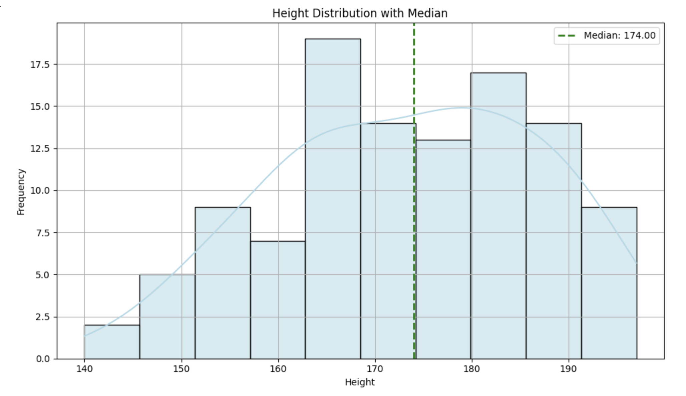

<h2 style="color:red;">✅ Median (Arithmetic Median)</h2>


<h3 style="color:blue;">📌 What is Median?</h3>
The median is the middle value in a sorted list of numbers.


**📊 Example 1 (Odd Count):**

Heights: [160, 165, 170, 175, 180]  
→ Median = 170 (the middle value)


**📊 Example 2 (Even Count):**

Heights: [160, 165, 170, 175, 180, 185]  
→ Median = (170 + 175) / 2 = 172.5


## ✅ Visualize Median on a Histogram

```
import pandas as pd
import matplotlib.pyplot as plt
import seaborn as sns

# Load data
df = pd.read_csv("hight.csv")

# Calculate the median
median = df["Hight"].median()

# Plot histogram
plt.figure(figsize=(10, 6))
sns.histplot(df["Hight"], bins=10, kde=True, color='lightblue', edgecolor='black')

# Add median line
plt.axvline(median, color='green', linestyle='--', linewidth=2, label=f'Median: {median:.2f}')

# Customize the plot
plt.title("Height Distribution with Median")
plt.xlabel("Height")
plt.ylabel("Frequency")
plt.legend()
plt.grid(True)
plt.tight_layout()
plt.show()
```




## ✅ 2. Median (Middle Value)

**📌 Use When:**

- Data is **skewed** (has outliers or long tail)

- You want a **resistant** measure of central tendency

- You're dealing with **income, real estate prices, or medical costs**


**🧠 Example:**

Median house price, median income — better than mean when there's a few very high values.

