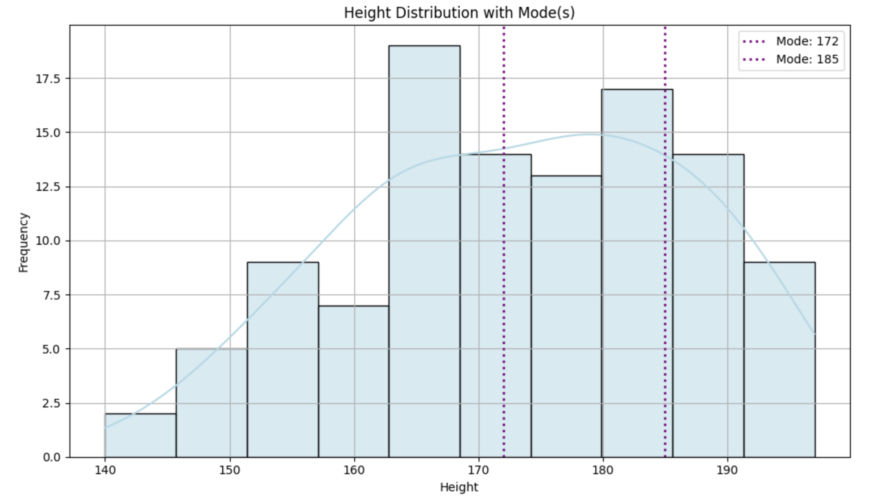

<h2 style="color:red;">✅ Mode (Arithmetic Mode)</h2>


<h3 style="color:blue;">📌 What is Mode?</h3>
The mode is the value (or values) that appear most frequently in a dataset.


**✅ Definition:**

Mode = the most common value in the data.

**A dataset can have:**

- **One mode** → Unimodal

- **Two modes** → Bimodal

- **Three or more modes** → Multimodal

- **No mode** → if all values occur only once


**📊 Example 1: One Mode**

Heights = [160, 162, 170, 172, 172, 175, 180]
→ Mode = 172 (occurs twice, others once)


**📊 Example 2: Two Modes**

Heights = [160, 172, 172, 175, 185, 185]
→ Mode = [172, 185] (both occur twice)


**📊 Example 3: No Mode**

Heights = [160, 165, 170, 175, 180]
→ All values are unique → No mode


## 🧠 Why Mode Matters:

- It tells us what value is **most typical or popular**.

- Useful in **categorical data** and **discrete numerical data**.

- In some cases (e.g., shoe size, T-shirt size), **mode** is more useful than mean or median.


```
# Load data
df = pd.read_csv("hight.csv")

mode = df["Hight"].mode()
print(f"Mode: {mode.tolist()}")
```

```
Mode: [172, 185]
```

## ✅ Histogram + KDE + Mode Line(s)

```
import pandas as pd
import matplotlib.pyplot as plt
import seaborn as sns

# Load data
df = pd.read_csv("hight.csv")

# Calculate mode(s)
modes = df["Hight"].mode()

# Plot histogram
plt.figure(figsize=(10, 6))
sns.histplot(df["Hight"], bins=10, kde=True, color='lightblue', edgecolor='black')

# Add mode line(s)
for mode_value in modes:
    plt.axvline(mode_value, color='purple', linestyle=':', linewidth=2, label=f'Mode: {mode_value}')

# Handle duplicate labels
handles, labels = plt.gca().get_legend_handles_labels()
unique_labels = dict(zip(labels, handles))
plt.legend(unique_labels.values(), unique_labels.keys())

# Customize plot
plt.title("Height Distribution with Mode(s)")
plt.xlabel("Height")
plt.ylabel("Frequency")
plt.grid(True)
plt.tight_layout()
plt.show()
```




## ✅ 3. Mode (Most Frequent Value)

**📌 Use When:**

- You need to find the **most common** value

- You're working with categorical or discrete data (e.g., shoe size, T-shirt size)

- Data may have multiple peaks (multi-modal)

**🧠 Example:**

Most common shoe size sold, most popular blood group, most frequent height

