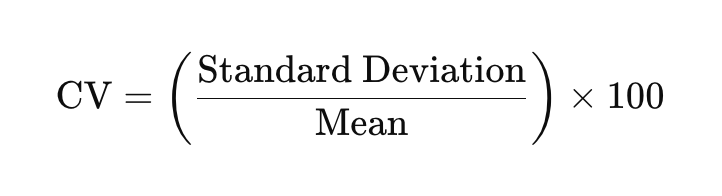
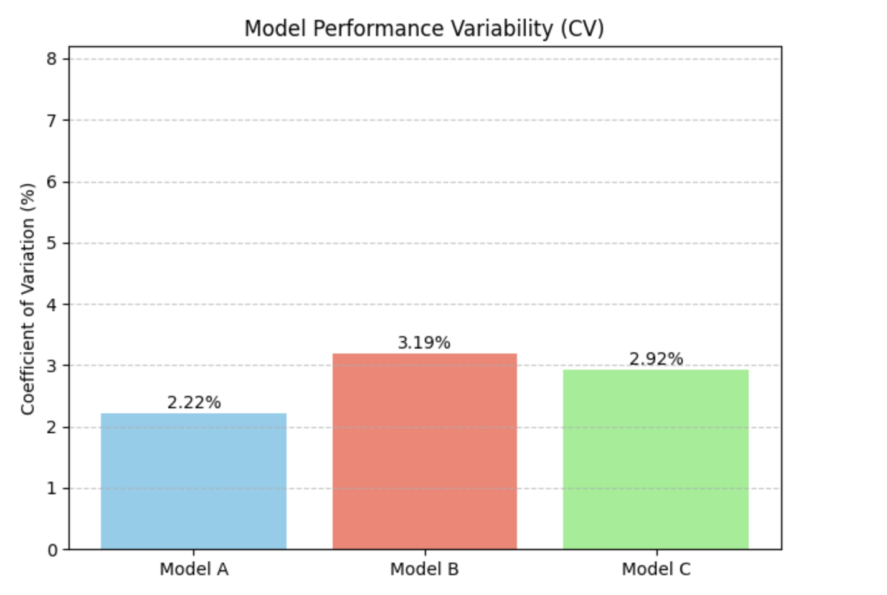
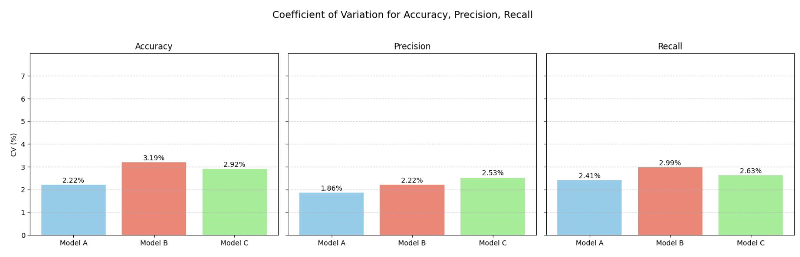

<h2 style="color:red;">✅ Coefficient of Variation (CV)</h2>

<h3 style="color:blue;">📌 What is Coefficient of Variation (CV)?</h3>
The **Coefficient of Variation (CV)** is a **standardized measure of dispersion** of a dataset, expressed as a **percentage**. It tells you **how much variability** exists in relation to the **mean**.

**📌 Formula:**



**✅ When to Use:**

- To **compare variability** between datasets with **different units** or **different means**.

- Useful in **risk analysis, finance, biology**, and **machine learning model comparison**.

**🎯 Real-life Example (ML Context):**

Imagine you are comparing the performance of two ML models across different datasets:

- **Model A:**

    - Mean Accuracy = 90%

    - Std Dev = 2%

    - CV = (2 / 90) × 100 = 2.22%

- **Model B:**

    - Mean Accuracy = 70%

    - Std Dev = 5%

    - CV = (5 / 70) × 100 = 7.14%

🧠 **Conclusion**: Model A is more consistent (lower CV) than Model B.

**📊 Python Code to Compute CV:**

```
import numpy as np

# Sample data (e.g., model accuracies)
data = [88, 91, 89, 92, 90, 87, 93]

mean = np.mean(data)
std_dev = np.std(data)
cv = (std_dev / mean) * 100

print(f"Mean: {mean:.2f}")
print(f"Standard Deviation: {std_dev:.2f}")
print(f"Coefficient of Variation (CV): {cv:.2f}%")
```

Mean: 90.00
Standard Deviation: 2.00
Coefficient of Variation (CV): 2.22%

**When NOT to Use CV:**

- When the **mean is near zero** (as CV becomes unstable or undefined).

- For **negative values** where the context doesn’t allow meaningful interpretation (like temperature in °C or °F).


**📊 Python Code to Visualize CV Comparison**

```
import numpy as np
import matplotlib.pyplot as plt

# Example: Accuracies of 3 ML models
model_names = ['Model A', 'Model B', 'Model C']
data = [
    [88, 91, 89, 92, 90, 87, 93],  # Model A
    [68, 72, 70, 69, 71, 66, 73],  # Model B
    [82, 80, 81, 79, 85, 78, 84],  # Model C
]

means = [np.mean(d) for d in data]
stds = [np.std(d) for d in data]
cvs = [(std / mean) * 100 for std, mean in zip(stds, means)]

# Plotting
fig, ax = plt.subplots()
bars = ax.bar(model_names, cvs, color=['skyblue', 'salmon', 'lightgreen'])

# Annotate CV values on top of bars
for bar, cv in zip(bars, cvs):
    height = bar.get_height()
    ax.annotate(f'{cv:.2f}%', xy=(bar.get_x() + bar.get_width() / 2, height),
                xytext=(0, 3), textcoords='offset points', ha='center', fontsize=10)

# Labels and title
ax.set_ylabel('Coefficient of Variation (%)')
ax.set_title('Model Performance Variability (CV)')
plt.ylim(0, max(cvs) + 5)
plt.grid(axis='y', linestyle='--', alpha=0.7)
plt.tight_layout()
plt.show()
```



**🧠 Interpretation:**

- Lower CV → More consistent model.

- Higher CV → More variation in performance.


**📊 Python Code: CV for Accuracy, Precision, and Recall**

```
import numpy as np
import matplotlib.pyplot as plt

# Sample model performance scores
model_metrics = {
    "Accuracy": {
        "Model A": [88, 91, 89, 92, 90, 87, 93],
        "Model B": [68, 72, 70, 69, 71, 66, 73],
        "Model C": [82, 80, 81, 79, 85, 78, 84]
    },
    "Precision": {
        "Model A": [85, 86, 84, 87, 83, 88, 85],
        "Model B": [72, 74, 70, 71, 73, 69, 72],
        "Model C": [79, 78, 77, 81, 80, 76, 82]
    },
    "Recall": {
        "Model A": [82, 84, 81, 83, 85, 80, 86],
        "Model B": [66, 68, 65, 69, 67, 64, 70],
        "Model C": [76, 78, 75, 77, 74, 79, 73]
    }
}

# Plotting CV for each metric
fig, axs = plt.subplots(1, 3, figsize=(16, 5), sharey=True)
fig.suptitle("Coefficient of Variation for Accuracy, Precision, Recall", fontsize=14)

for idx, (metric_name, scores) in enumerate(model_metrics.items()):
    means = [np.mean(scores[model]) for model in scores]
    stds = [np.std(scores[model]) for model in scores]
    cvs = [(std / mean) * 100 for std, mean in zip(stds, means)]

    bars = axs[idx].bar(scores.keys(), cvs, color=['skyblue', 'salmon', 'lightgreen'])

    for bar, cv in zip(bars, cvs):
        axs[idx].annotate(f'{cv:.2f}%', 
                          xy=(bar.get_x() + bar.get_width() / 2, bar.get_height()), 
                          xytext=(0, 3), textcoords='offset points', ha='center', fontsize=10)

    axs[idx].set_title(f"{metric_name}")
    axs[idx].set_ylabel("CV (%)" if idx == 0 else "")
    axs[idx].set_ylim(0, max(cvs) + 5)
    axs[idx].grid(axis='y', linestyle='--', alpha=0.7)

plt.tight_layout(rect=[0, 0, 1, 0.95])
plt.show()
```



**✅ Insights:**

- This allows you to compare **consistency of models** across **multiple performance metrics**.

- Helps in model selection: Even if two models have similar average precision, the one with **lower CV** is more reliable.


