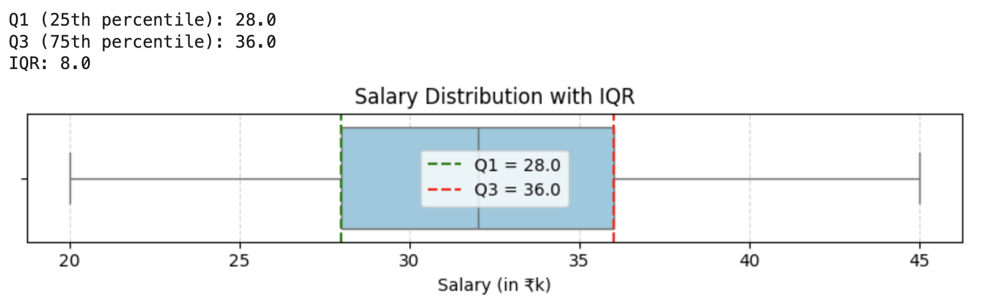

<h2 style="color:red;">✅ Interquartile Range (IQR)</h2>


<h3 style="color:blue;">📌 What is Interquartile Range (IQR)?</h3>
The **Interquartile Range (IQR)** is a **measure of statistical dispersion** — it tells us how spread out the **middle 50%** of a dataset is.

**🧮 Definition:**

IQR=Q3−Q1

- **Q1 (1st Quartile)**: The 25th percentile — 25% of data falls below this point.

- **Q3 (3rd Quartile)**: The 75th percentile — 75% of data falls below this point.

- The **middle 50%** of the data lies between Q1 and Q3.

**✅ Why is IQR useful?**

- It is resistant to outliers, unlike the full range.

- Helps identify data concentration and detect outliers using the 1.5 × IQR rule.

**📦 Real-world example (Salary):**


| Employee | Salary (₹k) |
| -------- | ----------- |
| A        | 20          |
| B        | 25          |
| C        | 28          |
| D        | 30          |
| E        | 32          |
| F        | 35          |
| G        | 36          |
| H        | 40          |
| I        | 45          |


- Sorted: 20, 25, 28, 30, 32, 35, 36, 40, 45

- Q1 = 28, Q3 = 36

- IQR = Q3(36) - Q1(28) = 8

So, the middle 50% of employee salaries lie between ₹28k and ₹36k.


```
import numpy as np
import matplotlib.pyplot as plt
import seaborn as sns

# Salary data (in thousands)
salaries = [20, 25, 28, 30, 32, 35, 36, 40, 45]

# Calculate Q1, Q3 and IQR
Q1 = np.percentile(salaries, 25)
Q3 = np.percentile(salaries, 75)
IQR = Q3 - Q1

print(f"Q1 (25th percentile): {Q1}")
print(f"Q3 (75th percentile): {Q3}")
print(f"IQR: {IQR}")

# Create a box plot
plt.figure(figsize=(8, 2))
sns.boxplot(x=salaries, color="skyblue")

# Add annotations
plt.axvline(Q1, color='green', linestyle='--', label=f'Q1 = {Q1}')
plt.axvline(Q3, color='red', linestyle='--', label=f'Q3 = {Q3}')
plt.title('Salary Distribution with IQR')
plt.xlabel('Salary (in ₹k)')
plt.legend()
plt.grid(True, axis='x', linestyle='--', alpha=0.5)

plt.tight_layout()
plt.show()
```



Q1 = np.percentile(data, 25) = 28.5

Q3 = np.percentile(data, 75) = 39.0

IQR = Q3 - Q1 = 10.5

# Determine bounds
lower_bound = Q1 - 1.5 * IQR
lower_bound = 28.5 - (1.5 * 10.5) = 12.75

upper_bound = Q3 + 1.5 * IQR
upper_bound = 39.0 + (1.5 * 10.5) = 54.75

Outliers: [70] . Because any value > 54.75 & < 12.75 should consider as Outliers.
