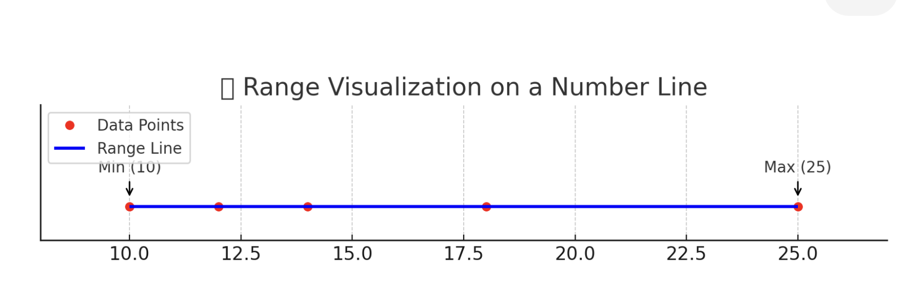

<h2 style="color:red;">✅ Range</h2>
Dispersion refers to how spread out the values in a dataset are. It helps you understand the variability in your data — beyond just the average.

<h3 style="color:blue;">📌 What is Range?</h3>
The **Range** is the **difference between the maximum and minimum values** in a dataset.

Range = Maximum Value − Minimum Value

**✅ Example:**
Consider the dataset:

data = [10, 12, 14, 18, 25]

- **Maximum value** = 25

- **Minimum value** = 10

- **Range** = 25 - 10 = 15

**📊 Visualization: Range on a Number Line**

Let’s visualize this using a simple number line:

10     12     14     16     18     20     22     24     25
 |------|------|------|------|------|------|------|------|
 ↑                                                 ↑
Min (10)                                       Max (25)

➡️  Range = Max - Min = 25 - 10 = **15 units**

- The **left arrow** points to 10 (Min)

- The **right arrow** correctly points to 25 (Max) now

- The total span from 10 to 25 is the range = 15

Here is the correct matplotlib visualization for Range on a Number Line:

- 🔴 Red dots = individual data points

- 🔵 Blue line = range (from Min = 10 to Max = 25)

- Arrows point to the Min (10) and Max (25)

- The total span (Range) = 25 - 10 = 15 units