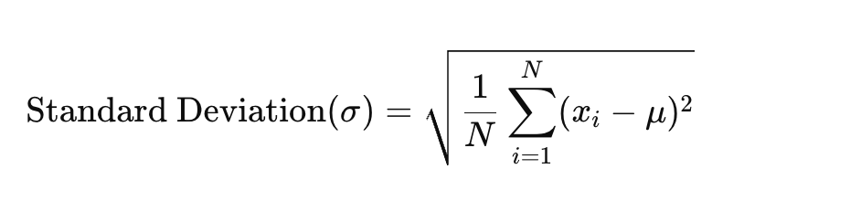
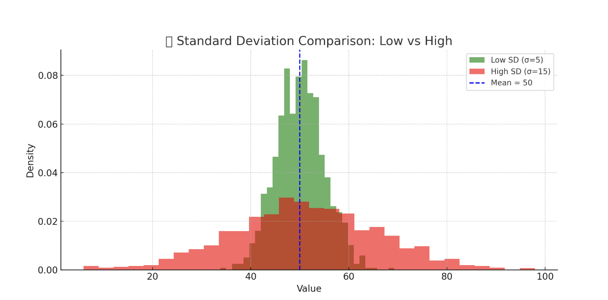

<h2 style="color:red;">✅ Standard Deviation</h2>


<h3 style="color:blue;">📌 What is Standard Deviation?</h3>
**Standard Deviation** is a statistical measure of the spread or dispersion of a set of data points relative to their **mean** (average).



Where:

- xi= each data point

- μ = mean of the dataset

- N = number of data points

It answers the question:

**"On average, how far are the data points from the mean?"**

**📌 Key Characteristics**

- **Low Standard Deviation(SD)** ⇒ Data points are close to the mean (less variability)

- **High Standard Deviation(SD)** ⇒ Data points are spread out (more variability)


**🧠 Real-Time Examples**

**1. 📦 Inventory Management**

- A company tracks daily sales of a product.

- If the SD is low, it can forecast inventory confidently.

- If SD is high, sales fluctuate a lot, so safety stock needs to be higher.

**2. 🩺 Healthcare**

- Standard Deviation(SD) of blood pressure readings across patients helps identify normal vs. abnormal variability.

- A low Standard Deviation(SD) in clinical trial data shows consistent drug response.

**3. 📈 Machine Learning: Model Evaluation**

- During cross-validation, SD of model accuracy across folds shows model stability.

- Low SD means consistent performance → robust model.

**4. 🎓 Student Scores**

- Class A: Mean = 80, SD = 2 → All students score close to 80

- Class B: Mean = 80, SD = 15 → Scores vary widely from student to student

**📅 When to Use Standard Deviation**

| Scenario                          | Use SD? | Why?                                               |
| --------------------------------- | ------- | -------------------------------------------------- |
| Understanding data variability    | ✅       | Measures how consistent the data is                |
| Comparing performance consistency | ✅       | E.g., which model/branch/store is more stable      |
| Outlier detection (with mean)     | ✅       | Points outside ±2 SD are potential outliers        |
| Normally distributed data         | ✅       | SD is most meaningful with symmetric distributions |
| Skewed distributions              | ⚠️      | Better to use **IQR** (less affected by outliers)  |


**🔁 Standard Deviation vs Other Measures**

| Measure                | Best Use Case                           |
| ---------------------- | --------------------------------------- |
| **Standard Deviation** | For normal-like distributions           |
| **IQR**                | For skewed/outlier-prone data           |
| **Range**              | Quick check for extreme spread          |
| **Variance**           | Square of SD, used in theoretical stats |




Here's a visual comparison of Standard Deviation:

- **🟢 Low SD (σ = 5):** The green curve is **narrower** — values are tightly clustered around the mean (50).

- **🔴 High SD (σ = 15):** The red curve is **wider** — values are more spread out from the mean.

- **🔵 Blue dashed line:** Indicates the mean (50) for both distributions.

**Interpretation:**

- A **smaller standard deviation** means more **consistency**.

- A **larger standard deviation** means more **variability or uncertainty**.

**✅ Python Code: Visualize Low vs High Standard Deviation**

```
import matplotlib.pyplot as plt
import numpy as np

# Set seed for reproducibility
np.random.seed(42)

# Generate synthetic data
low_sd = np.random.normal(loc=50, scale=5, size=1000)    # Mean=50, SD=5
high_sd = np.random.normal(loc=50, scale=15, size=1000)  # Mean=50, SD=15

# Create the plot
plt.figure(figsize=(10, 5))

# Plot histograms
plt.hist(low_sd, bins=30, alpha=0.6, label='Low SD (σ=5)', color='green', density=True)
plt.hist(high_sd, bins=30, alpha=0.6, label='High SD (σ=15)', color='red', density=True)

# Plot the mean line
plt.axvline(50, color='blue', linestyle='--', linewidth=2, label='Mean = 50')

# Add labels, title, legend
plt.title('📊 Standard Deviation Comparison: Low vs High')
plt.xlabel('Value')
plt.ylabel('Density')
plt.legend()
plt.grid(True)
plt.tight_layout()

# Show plot
plt.show()
```


