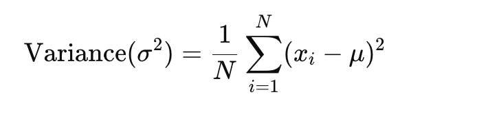
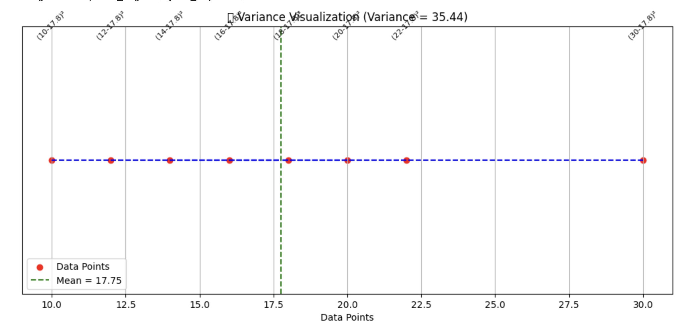
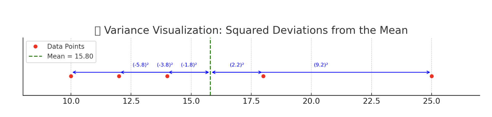
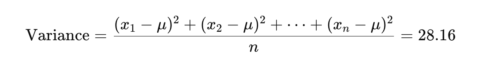

<h2 style="color:red;">✅ Variance</h2>

<h3 style="color:blue;">📌 What is Variance?</h3>
**Variance** is a statistical measure that tells us **how far data points are spread out from the mean**. It is the **average of the squared deviations** from the mean.



- xi: individual data point

- μ: mean of the dataset

- N: total number of data points

In simple terms: **Variance measures how much the values in a dataset "vary" from the mean**.

**📌 Key Concepts:**

- **Always non-negative**

- If all values are the same, variance is zero

- Units are squared (e.g., if values are in meters, variance is in square meters)

**🔁 Variance vs. Standard Deviation**

| Metric                 | Description                                  |
| ---------------------- | -------------------------------------------- |
| **Variance**           | Average of squared deviations                |
| **Standard Deviation** | Square root of variance (more interpretable) |


**🧠 Real-World Examples**

**1. 🎓 Student Scores**

- Two classes have the same average score (e.g., 80), but:
    
    - Class A has low variance: all students scored close to 80.

    - Class B has high variance: scores range from 50 to 100.

**2. 📈 Stock Market**

- Low variance: stable stock

- High variance: volatile stock

**3. 🧪 Medical Testing**

- Low variance in lab results = consistent equipment

- High variance = possible errors or patient variation

**📅 When to Use Variance**

| Use Case                  | Use Variance? | Reason                                                |
| ------------------------- | ------------- | ----------------------------------------------------- |
| Feature Selection in ML   | ✅             | Variance threshold to remove low-information features |
| Comparing model stability | ✅             | Variance of accuracy across folds                     |
| Data consistency check    | ✅             | Small variance = reliable system                      |


**🧮 Example Calculation**

data = [10, 12, 14, 18, 25]


1. Mean μ = (10+12+14+18+25)/5 =15.8

2. Squared deviations:

    - (10 - 15.8)² = 33.64

    - (12 - 15.8)² = 14.44

    - (14 - 15.8)² = 3.24

    - (18 - 15.8)² = 4.84

    - (25 - 15.8)² = 84.64

3. Sum = 140.8

4. Variance = 140.8 / 5 = 28.16

```
import numpy as np
import matplotlib.pyplot as plt

# Sample data
data = [10, 12, 14, 16, 18, 20, 22, 30]
mean = np.mean(data)
variance = np.var(data)

# Create plot
plt.figure(figsize=(10, 5))
plt.scatter(data, [1]*len(data), color='red', label='Data Points')

# Plot mean line
plt.axvline(mean, color='green', linestyle='--', label=f'Mean = {mean:.2f}')

# Annotate deviations
for x in data:
    plt.plot([x, mean], [1, 1], color='blue', linestyle='--')
    plt.text(x, 1.05, f'({x}-{mean:.1f})²', ha='center', fontsize=8, rotation=45)

# Labels and title
plt.yticks([])
plt.title(f'🔧 Variance Visualization (Variance = {variance:.2f})')
plt.xlabel('Data Points')
plt.legend()
plt.grid(True)
plt.tight_layout()
plt.show()
```





Here's a visual explanation of Variance:

- 🔴 **Red dots** = individual data points

- 🟢 **Green dashed line** = mean of the dataset

- 🔵 **Double-headed blue arrows** = distance from each point to the mean

- 📘 Each label (e.g., (x - mean)²) shows the squared deviation from the mean

**🧮 Summary:**

- The squared deviations are used to calculate the variance.

- Variance is the average of these squared deviations, which in this case is:




