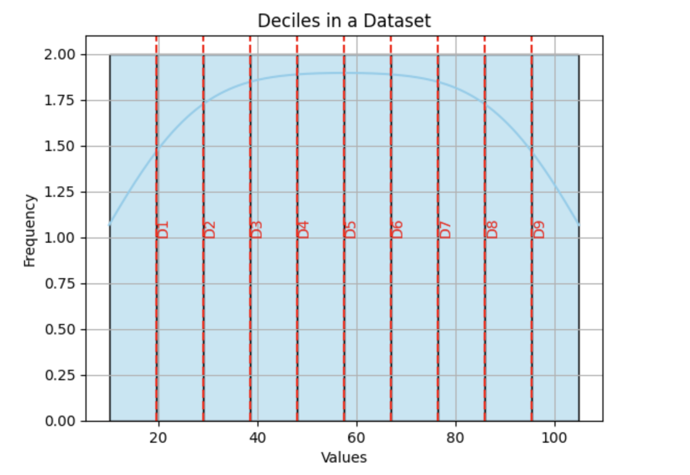

<h2 style="color:red;">✅ Deciles</h2>


<h3 style="color:blue;">📌 What Are Deciles?</h3>
**Deciles** are **statistical measures** that divide a dataset into **10 equal parts**, each containing **10%** of the data after sorting in ascending order.

- Deciles are **nine values (D₁ to D₉)** that split the data into **ten equal parts**.

- Each **decile** represents a **10% increment** in the distribution.

| Decile | Meaning                                      |
| ------ | -------------------------------------------- |
| D₁     | 10% of data is **below** this point          |
| D₂     | 20% of data is below this point              |
| D₅     | 50% of data is below this point → **Median** |
| D₉     | 90% of data is below this point              |


**🧮 Example**

Suppose we have the following sorted data of 20 students’ marks:

10, 15, 20, 25, 30, 35, 40, 45, 50, 55, 60, 65, 70, 75, 80, 85, 90, 95, 100, 105

- **D₁ (10%)** → 2nd value = **15**

- **D₂ (20%)** → 4th value = **25**

- **D₅ (50%)** → 10th value = **55 (Median)**

- **D₉ (90%)** → 18th value = **95**

**Note:** For more accurate results, you can use interpolation if percentiles fall between ranks.

**📊 Visualization using Seaborn**

```
import numpy as np
import matplotlib.pyplot as plt
import seaborn as sns

# Data
data = np.array([10, 15, 20, 25, 30, 35, 40, 45, 50, 55, 
                 60, 65, 70, 75, 80, 85, 90, 95, 100, 105])

# Calculate deciles
deciles = np.percentile(data, [10, 20, 30, 40, 50, 60, 70, 80, 90])

# Plot distribution
sns.histplot(data, bins=10, kde=True, color='skyblue')
for i, d in enumerate(deciles, start=1):
    plt.axvline(d, color='red', linestyle='--')
    plt.text(d, 1, f"D{i}", rotation=90, verticalalignment='bottom', color='red')
    
plt.title("Deciles in a Dataset")
plt.xlabel("Values")
plt.ylabel("Frequency")
plt.grid(True)
plt.show()
```



<h3 style="color:blue;">🧠 When to Use Deciles:</h3>

- In education, to rank students into top 10%, bottom 10%, etc.

- In income distribution, to understand how income is spread.

- In marketing, for customer segmentation based on spending or frequency.

