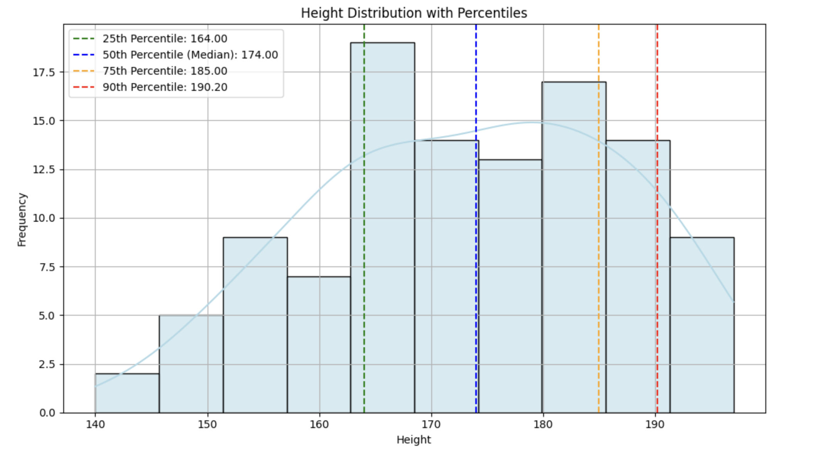
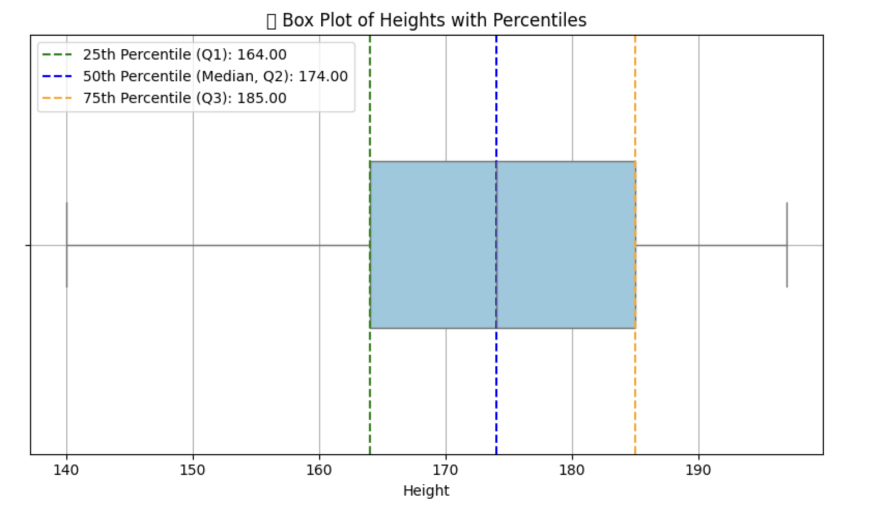
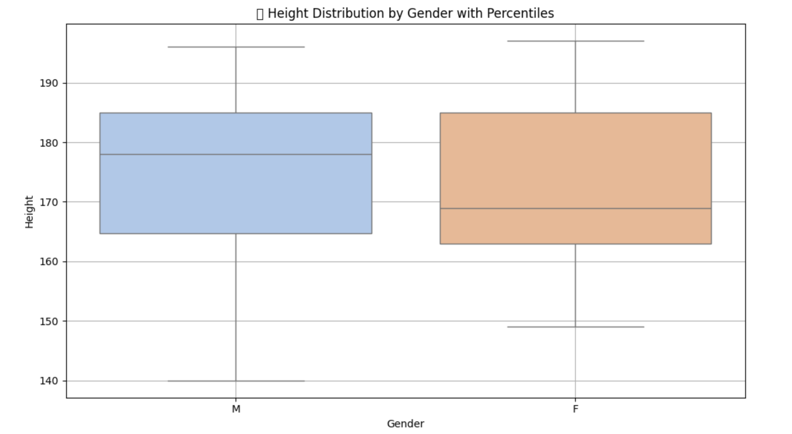
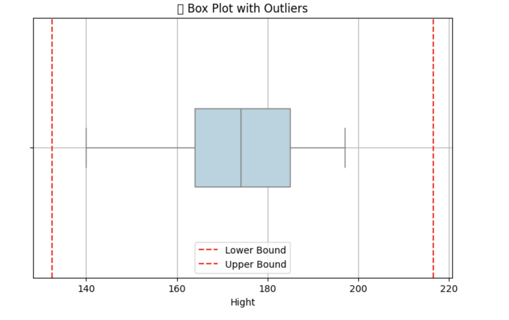

<h2 style="color:red;">✅ Percentiles</h2>


<h3 style="color:blue;">📌 What Are Percentiles?</h3>
Percentiles are **measures that divide a dataset into 100 equal parts**. Each percentile tells you the **relative position** of a value within the data distribution.

- The **k-th** percentile is the value below which k% of the data falls

**Example:**

- **25th percentile (P25)** → 25% of data is below this value.

- **50th percentile (P50)** → Median (middle value).

- **75th percentile (P75)** → 75% of data falls below this value.

- **90th percentile (P90)** → 90% of data falls below this value.

- **100th percentile (P100)** → 100% of data falls below this value.

<h3 style="color:blue;">🧠 Why Use Percentiles?:</h3>
Percentiles help answer:

- How **extreme or typical** a value is

- Where a value **stands relative** to others

- Useful for **outlier detection, ranking**, and **cut-off thresholds**

## 📦 Real-World Examples

**🏫 Exam Scores:**

- If your score is in the **90th percentile**, you did **better than 90%** of the students.

**🏥 Medical Growth Charts:**

- A baby in the **40th percentile for height** is taller than 40% of babies the same age.

**💻 Website Load Time:**

- "P95 latency = 3 seconds" means 95% of pages load faster than 3 seconds.


## ✅ How to Calculate Percentiles in Python (with Visualization)

```
import pandas as pd
import numpy as np
import matplotlib.pyplot as plt
import seaborn as sns

# Example dataset
df = pd.read_csv("hight.csv")
heights = df["Hight"]

# Calculate percentiles
p25 = np.percentile(heights, 25)
p50 = np.percentile(heights, 50)  # Median
p75 = np.percentile(heights, 75)
p90 = np.percentile(heights, 90)

# Plot
plt.figure(figsize=(10, 6))
sns.histplot(heights, bins=10, kde=True, color='lightblue', edgecolor='black')

# Draw percentile lines
plt.axvline(p25, color='green', linestyle='--', label=f'25th Percentile: {p25:.2f}')
plt.axvline(p50, color='blue', linestyle='--', label=f'50th Percentile (Median): {p50:.2f}')
plt.axvline(p75, color='orange', linestyle='--', label=f'75th Percentile: {p75:.2f}')
plt.axvline(p90, color='red', linestyle='--', label=f'90th Percentile: {p90:.2f}')

# Final touches
plt.title("Height Distribution with Percentiles")
plt.xlabel("Height")
plt.ylabel("Frequency")
plt.legend()
plt.grid(True)
plt.tight_layout()
plt.show()
```



**Output Interpretation:**

- **Left of P25:** 25% of heights

- **Between P25 and P75:** Middle 50% (interquartile range)

- **Above P90:** Top 10% tallest individuals — possibly outliers or elite group


## ✅ Box Plot to Visualize Percentiles (Q1, Q2, Q3)

```
import pandas as pd
import matplotlib.pyplot as plt
import seaborn as sns

# Load your dataset
df = pd.read_csv("hight.csv")
heights = df["Hight"]

# Plot
plt.figure(figsize=(8, 5))
sns.boxplot(x=heights, color="skyblue", width=0.4)

# Label percentiles
p25 = heights.quantile(0.25)
p50 = heights.median()
p75 = heights.quantile(0.75)

plt.axvline(p25, color='green', linestyle='--', label=f'25th Percentile (Q1): {p25:.2f}')
plt.axvline(p50, color='blue', linestyle='--', label=f'50th Percentile (Median, Q2): {p50:.2f}')
plt.axvline(p75, color='orange', linestyle='--', label=f'75th Percentile (Q3): {p75:.2f}')

# Title & Legend
plt.title("📦 Box Plot of Heights with Percentiles")
plt.xlabel("Height")
plt.legend()
plt.grid(True)
plt.tight_layout()
plt.show()
```



**📌 Interpretation of Box Plot:**

- **Left whisker:** Minimum value (excluding outliers)

- **Box start:** Q1 (25th percentile)

- **Line inside box:** Median (Q2 or 50th percentile)

- **Box end:** Q3 (75th percentile)

- **Right whisker:** Maximum value (excluding outliers)

- **Dots outside whiskers:** Outliers

## ✅ Grouped Box Plot (e.g., by Gender)

```
import pandas as pd
import matplotlib.pyplot as plt
import seaborn as sns

# Load data
df = pd.read_csv("hight.csv")

# Check if 'Gender' column exists
if 'Gender' in df.columns:
    plt.figure(figsize=(10, 6))
    sns.boxplot(x='Gender', y='Hight', data=df, palette='pastel')

    # Titles and labels
    plt.title('📊 Height Distribution by Gender with Percentiles')
    plt.xlabel('Gender')
    plt.ylabel('Height')
    plt.grid(True)
    plt.tight_layout()
    plt.show()
else:
    print("❌ 'Gender' column not found in the dataset. Please check your data.")
```




**📌 What You’ll See in This Plot:**

- **Each box** shows the distribution for one gender

- **Median line inside the box:** 50th percentile

- **Box edges:** 25th and 75th percentiles

- **Whiskers:** Range of typical values

- **Dots beyond whiskers:** Outliers

**ℹ️ Use Case Example:**

| Scenario                       | Best Metric                     |
| ------------------------------ | ------------------------------- |
| Comparing central value        | **Median** (robust to outliers) |
| Analyzing spread & shape       | **Box Plot** with percentiles   |
| Detecting outliers or skewness | **Box Plot** & Mode             |


## ✅ Step-by-Step: Outlier Detection Using IQR

**Formula:**

1. **IQR** = Q3 − Q1

2. **Lower Bound** = Q1 − 1.5 × IQR

3. **Upper Bound** = Q3 + 1.5 × IQR

4. **Outliers:** Any value < Lower Bound or > Upper Bound


## 🔢 Example: Calculate Outliers from Height Data

```
import pandas as pd

# Load your data
df = pd.read_csv("hight.csv")
heights = df["Hight"]

# Calculate Q1, Q3, and IQR
Q1 = heights.quantile(0.25)
Q3 = heights.quantile(0.75)
IQR = Q3 - Q1

# Calculate bounds
lower_bound = Q1 - 1.5 * IQR
upper_bound = Q3 + 1.5 * IQR

# Identify outliers
outliers = heights[(heights < lower_bound) | (heights > upper_bound)]

print("Q1 (25th percentile):", Q1)
print("Q3 (75th percentile):", Q3)
print("IQR:", IQR)
print("Lower Bound:", lower_bound)
print("Upper Bound:", upper_bound)
print("\n🚨 Outliers:\n", outliers)
```

Q1 (25th percentile): 164.0
Q3 (75th percentile): 185.0
IQR: 21.0
Lower Bound: 132.5
Upper Bound: 216.5

🚨 Outliers:
 Series([], Name: Hight, dtype: int64)


**📦 Visualization with Outliers**

```
import matplotlib.pyplot as plt
import seaborn as sns

plt.figure(figsize=(8, 5))
sns.boxplot(x=heights, color="lightblue", width=0.3)
plt.axvline(lower_bound, color='red', linestyle='--', label='Lower Bound')
plt.axvline(upper_bound, color='red', linestyle='--', label='Upper Bound')
plt.title("📦 Box Plot with Outliers")
plt.legend()
plt.grid(True)
plt.show()
```



## 🎯 Real-Time Use Case:
Imagine this is a **student height dataset** in school:

- Most students are between 130–160 cm (normal distribution)

- A few entries like 90 cm (too short) or 200 cm (too tall) would be flagged as outliers (maybe measurement errors or rare cases)
