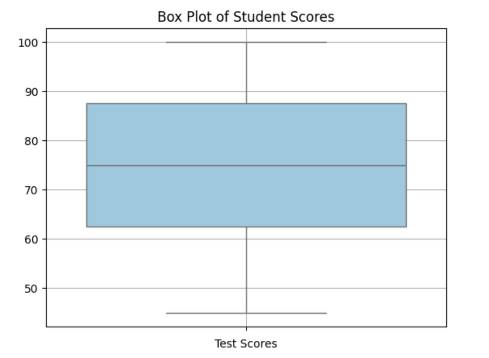

<h2 style="color:red;">✅ Quartiles</h2>


<h3 style="color:blue;">📌 What Are Quartiles?</h3>
**Quartiles** divide a dataset into **four equal parts**, each containing 25% of the data. They are key components of descriptive statistics and are often used in **box plots**.

<h3 style="color:blue;">🔢 Quartile Definitions:</h3>

- **Q1 (First Quartile / 25th percentile):** 25% of the data falls below this value.

- **Q2 (Second Quartile / Median / 50th percentile):** 50% of the data falls below this value.

- **Q3 (Third Quartile / 75th percentile):** 75% of the data falls below this value.


## 📦 Real-life Example: Heights of Students

Suppose you have the following heights (in cm):

[150, 152, 155, 157, 160, 162, 165, 168, 170, 172, 175, 178, 180, 182, 185, 188, 190, 192, 195, 200]


There are 20 values in total.

- **Q1 = 162** → 25% of students are **≤ 162 cm**

- **Q2 = 172** → 50% of students are **≤ 172 cm (Median)**

- **Q3 = 185** → 75% of students are **≤ 185 cm**

**📈 Visual: Box Plot**


**Box Plot of Heights**, which visually represents:

- **Q1 (25th percentile):** Left edge of the box

- **Q2 (50th percentile / Median):** Line inside the box

- **Q3 (75th percentile):** Right edge of the box

- **Whiskers:** Range of non-outlier values

- **Dots beyond whiskers:** Outliers (if any)


## 📊 Real-Time Example

Suppose you have the following sorted test scores of 11 students:

45, 55, 60, 65, 70, 75, 80, 85, 90, 95, 100


- **Q2 (Median)** = 75 (middle value)

- **Q1** = Median of the lower half → 45, 55, 60, 65, 70 → Q1 = 60

- **Q3** = Median of the upper half → 80, 85, 90, 95, 100 → Q3 = 90

**📈 Visualization – Box Plot**

```
import matplotlib.pyplot as plt
import seaborn as sns

# Data
data = [45, 55, 60, 65, 70, 75, 80, 85, 90, 95, 100]

# Create box plot
sns.boxplot(data=data, color="skyblue")
plt.title("Box Plot of Student Scores")
plt.xlabel("Test Scores")
plt.grid(True)
plt.show()
```



This will generate a Box Plot showing:

- The **box** from Q1 to Q3 (60 to 90)

- The **line in the box** at Q2 (75, median)

- The **whiskers** extending to min and max (45 to 100)

- Outliers (if any) shown as dots beyond whiskers

**📌 Key Uses of Quartiles**

- Identify **spread** and **skewness**

- Detect **outliers** using IQR (Interquartile Range):
  
  IQR=Q3−Q1

