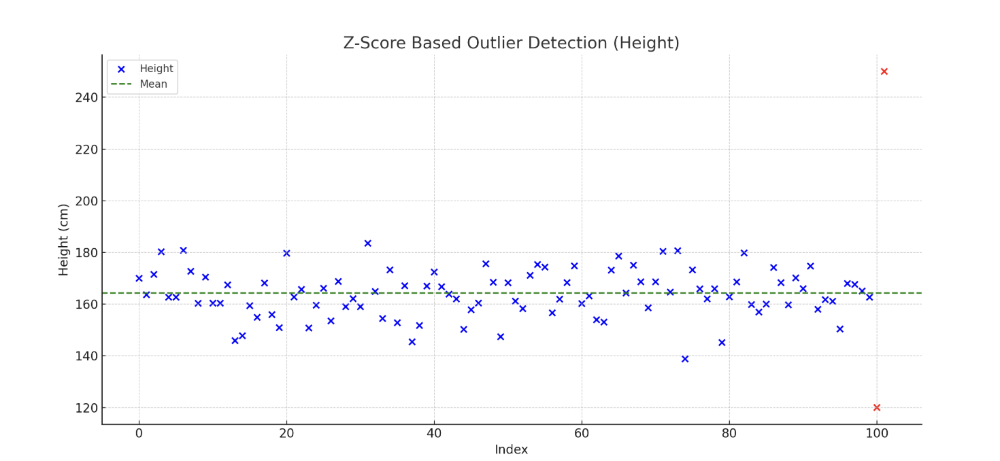

<h2 style="color:red;">✅ Z-Score</h2>


<h3 style="color:blue;">📌 What Are Z-Score?</h3>
The **Z-score** (also known as **standard score**) tells you **how many standard deviations** a data point is **from the mean** of a dataset.

## Z-Score Method (Standard Score Method)

**✅ When to Use:**

- When your data is **normally distributed**.

- Works well for **univariate** (single variable) analysis.

**📘 Formula:**

- X = individual value

- μ = mean of the dataset

- σ = standard deviation

- **Z = 0** → value is exactly the mean

- **Z > 0** → value is above the mean

- **Z < 0** → value is below the mean

- **Z > 3 or Z < -3** → considered an outlier (in many applications)

Z= (X−μ)/σ

- μ = mean of the data

- σ = standard deviation

- Z-score > 3 or < -3 is usually considered an outlier


## ✅ Real-Time Example:

Let’s say the average height of students in a class is 170 cm with a standard deviation of 5 cm. If a student is 180 cm tall:

Z=(180−170)/5 = 2

This means the student's height is **2 standard deviations above the average**.

**📊 Visualization:**

If you plot a bell-shaped curve (normal distribution):

- Most values lie between **Z = -1 and Z = +1**

- Around 95% of data lies between **Z = -2 and Z = +2**

- Extreme Z-scores (e.g., < -3 or > +3) indicate **potential outliers**

**🧠 When to Use:**

- To detect **outliers**

- To **standardize** different datasets

- To compare scores from **different distributions**

- In **machine learning** for feature scaling (standardization)


**📌 Example in Code (Height):**

```
from scipy.stats import zscore
import pandas as pd

# Load data
df = pd.read_csv("hight.csv")
df['Z_Score'] = zscore(df["Hight"])

# Identify outliers using Z-score threshold
outliers_z = df[df['Z_Score'].abs() > 3]

print("🚨 Z-Score Outliers:\n", outliers_z[['Hight', 'Z_Score']])
```

🚨 Z-Score Outliers:
 Empty DataFrame
Columns: [Hight, Z_Score]
Index: []



The plot above highlights **outliers in red** using the **Z-score method**:

**How Outliers Are Detected:**

- **Z-score** measures how far a value is from the mean in terms of standard deviations.

A common threshold is:

- **Z > 3 or Z < -3** ⇒ considered an outlier.

**📊 Example Insight:**

- Most heights cluster around the **mean (green dashed line)**.

- Two points far from this central cluster (e.g., **120 cm** and **250 cm**) are marked in **red** as outliers.


## 🔁 Mahalanobis Distance (for Multivariate Outliers)

​**✅ When to Use:**

- When you have **multiple features/columns** (multivariate data)

- Takes **correlation** between variables into account

**📌 Example with Multiple Features (e.g., Height & Weight):**

```
import pandas as pd
import numpy as np
from scipy.spatial.distance import mahalanobis
from numpy.linalg import inv

# Sample multivariate dataset
df = pd.read_csv("height_weight.csv")  # assume columns: Hight, Weight
data = df[['Hight', 'Weight']]

# Mean vector & Covariance matrix
mean_vec = data.mean().values
cov_matrix = np.cov(data.T)
inv_cov_matrix = inv(cov_matrix)

# Calculate Mahalanobis distance for each point
df['Mahalanobis'] = data.apply(lambda x: mahalanobis(x, mean_vec, inv_cov_matrix), axis=1)

# Set threshold (e.g., >3 or >5 based on degrees of freedom)
threshold = 3
outliers_maha = df[df['Mahalanobis'] > threshold]

print("🚨 Mahalanobis Outliers:\n", outliers_maha[['Hight', 'Weight', 'Mahalanobis']])
```

**🔬 Summary Table**

| Method          | Best For              | Multivariate | Assumes Normality | Threshold   |
| --------------- | --------------------- | ------------ | ----------------- | ----------- |
| **IQR**         | General use           | ❌            | ❌                 | 1.5×IQR     |
| **Z-score**     | Normal data           | ❌            | ✅                 | Z > 3       |
| **Mahalanobis** | Multivariate outliers | ✅            | ✅ (ideally)       | D² > 3 or 5 |


