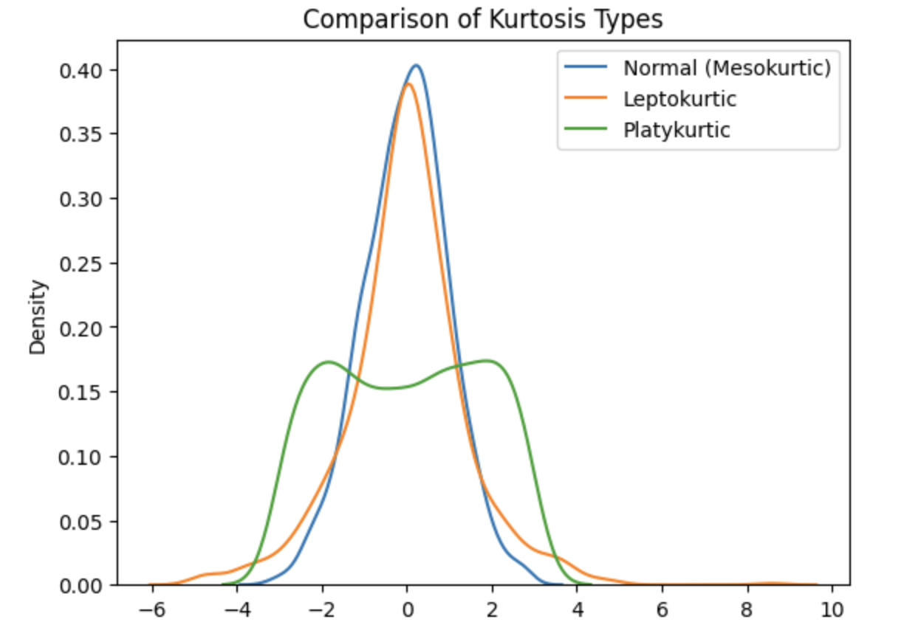

<h2 style="color:red;">✅ Kurtosis</h2>


<h3 style="color:blue;">📌 What is Kurtosis?</h3>
**Kurtosis** is a statistical measure that describes the **“tailedness”** of a data distribution — that is, how heavily the **tails** (extreme values) differ from a normal distribution.

**Definition**

Kurtosis tells us:

- How **peaked** the distribution is.

- How much data lies in the **tails** (outliers).

Mathematically, it's based on the fourth standardized moment about the mean.


**🧪 Types of Kurtosis**

| Type            | Description                                       | Visual Shape  |
| --------------- | ------------------------------------------------- | ------------- |
| **Mesokurtic**  | Normal distribution; moderate tails and peak.     | Bell-shaped   |
| **Leptokurtic** | High peak, **fat tails** → more extreme values.   | Tall and thin |
| **Platykurtic** | Flat peak, **thin tails** → fewer extreme values. | Wide and flat |


**📊 Visual Representation**

**1. Mesokurtic (Normal)**

        *
      *   *
    *       *
  *           *
 *             *


**2. Leptokurtic (Heavy tails)**

        *
        *
       * *
      *   *
     *     *
 *             *


**3. Platykurtic (Light tails)**

      *         *
   *     *   *     *
 *                   *


**📐 Kurtosis Value Interpretation**

- **Kurtosis ≈ 3** → Mesokurtic (normal)

- **Kurtosis > 3** → Leptokurtic (heavy tails, more outliers)

- **Kurtosis < 3** → Platykurtic (light tails, fewer outliers)

Some software (like Python’s scipy.stats.kurtosis) reports **“excess kurtosis”**, which subtracts 3:


| Excess Kurtosis | Shape       |
| --------------- | ----------- |
| 0               | Normal      |
| > 0             | Leptokurtic |
| < 0             | Platykurtic |


```
import numpy as np
import matplotlib.pyplot as plt
import seaborn as sns
from scipy.stats import kurtosis

# Sample distributions
normal = np.random.normal(0, 1, 1000)
lepto = np.random.laplace(0, 1, 1000)    # Heavy tails
platy = np.random.uniform(-3, 3, 1000)   # Light tails

# Calculate kurtosis
print("Normal Kurtosis:", kurtosis(normal))  # ~0
print("Leptokurtic Kurtosis:", kurtosis(lepto))  # > 0
print("Platykurtic Kurtosis:", kurtosis(platy))  # < 0

# Plot
sns.kdeplot(normal, label='Normal (Mesokurtic)')
sns.kdeplot(lepto, label='Leptokurtic')
sns.kdeplot(platy, label='Platykurtic')
plt.legend()
plt.title("Comparison of Kurtosis Types")
plt.show()
```



**✅ Why Kurtosis Matters**

- Helps **detect outliers** or **extreme risks** in finance, health data, etc.

- Important in **quality control, risk modeling**, and **machine learning** to understand distributions better.


