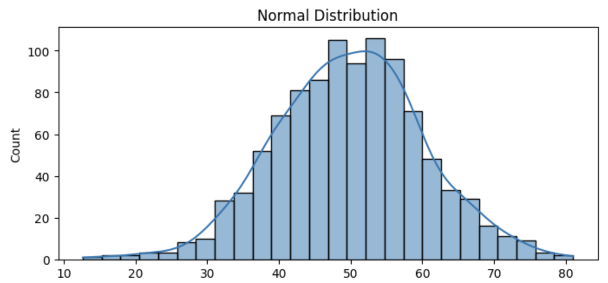
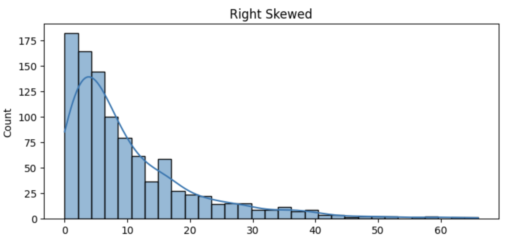
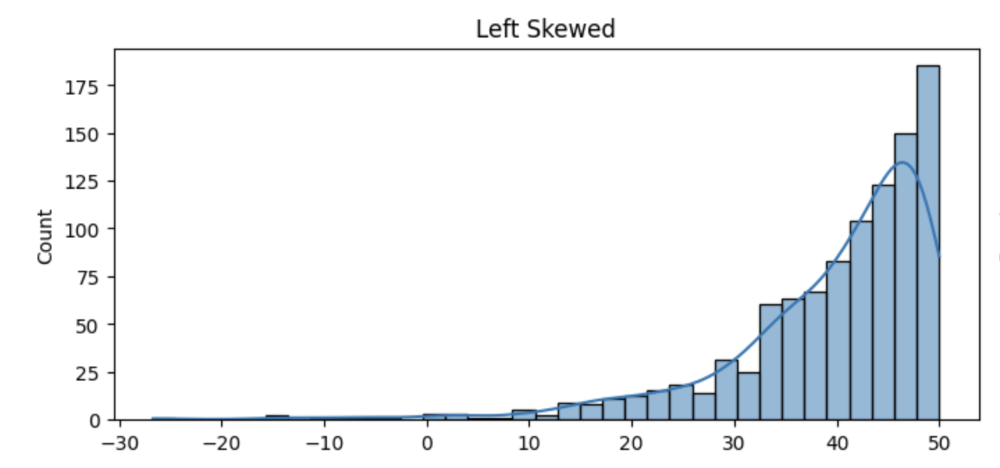
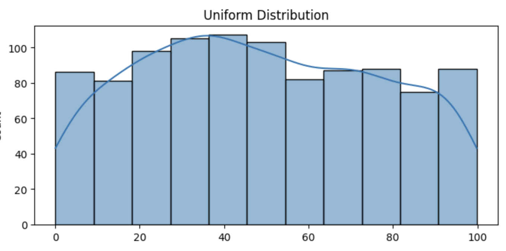
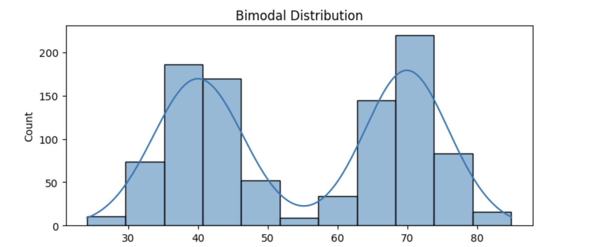

<h2 style="color:red;">✅ Shape of the Distribution in Statistics</h2>
The **shape of a distribution** describes how data is spread or clustered across a range of values. It gives insights into **central tendency, variability,** and **skewness**.

<h3 style="color:blue;">📌 Main Types of Distribution Shapes</h3>

1. **Symmetrical Distribution (Normal or Bell-shaped)**

2. **Skewed Distribution**

3. **Uniform Distribution**

4. **Bimodal Distribution**


1. **Symmetrical Distribution (Normal or Bell-shaped)**

- **Mean = Median = Mode**

- Both sides of the center are mirror images.

- Classic example: **Height, IQ scores**

**📈 Example:**

       *
     *   *
   *       *
 *           *
*             *


2. **Skewed Distribution**

**a. Right-Skewed (Positively Skewed)**

- Tail is **longer on the right**

- **Mean > Median > Mode**

- Examples: **Income, house prices**

**📈 Shape:**

*           
*         *
*       *  
*     *    
*   *      
* *        
*
             *
                *

**b. Left-Skewed (Negatively Skewed)**

- Tail is **longer on the left**

- **Mean < Median < Mode**

- Examples: **Retirement age, exam scores with most students scoring high**


**📈 Shape:**

              *
            *
          *
        *
      *
    *
  *
*  
*


3. **Uniform Distribution**

- All values have equal frequency.

- No peak.

**📈 Shape:**

* * * * * * * * * *


4. **Bimodal Distribution**

- Two clear peaks.

- Suggests two different subgroups in data.

**📈 Shape:**

    *       *
   * *     * *
  *   *   *   *
 *     * *     *
*       *       *


**📊 Python Code to Visualize**

```
import numpy as np
import matplotlib.pyplot as plt
import seaborn as sns

# Create sample data
normal = np.random.normal(loc=50, scale=10, size=1000)
right_skew = np.random.exponential(scale=10, size=1000)
left_skew = -np.random.exponential(scale=10, size=1000) + 50
uniform = np.random.uniform(0, 100, 1000)
bimodal = np.concatenate([np.random.normal(40, 5, 500), np.random.normal(70, 5, 500)])

# Plot
fig, axes = plt.subplots(3, 2, figsize=(14, 10))
sns.histplot(normal, kde=True, ax=axes[0, 0]).set(title='Normal Distribution')
sns.histplot(right_skew, kde=True, ax=axes[0, 1]).set(title='Right Skewed')
sns.histplot(left_skew, kde=True, ax=axes[1, 0]).set(title='Left Skewed')
sns.histplot(uniform, kde=True, ax=axes[1, 1]).set(title='Uniform Distribution')
sns.histplot(bimodal, kde=True, ax=axes[2, 0]).set(title='Bimodal Distribution')
axes[2, 1].axis('off')  # Hide the last empty plot

plt.tight_layout()
plt.show()
```


**Normal Distribution:**




**Right Skewed:**



**Left Skewed:**



**Uniform Distribution:**



**Bimodal Distribution:**


