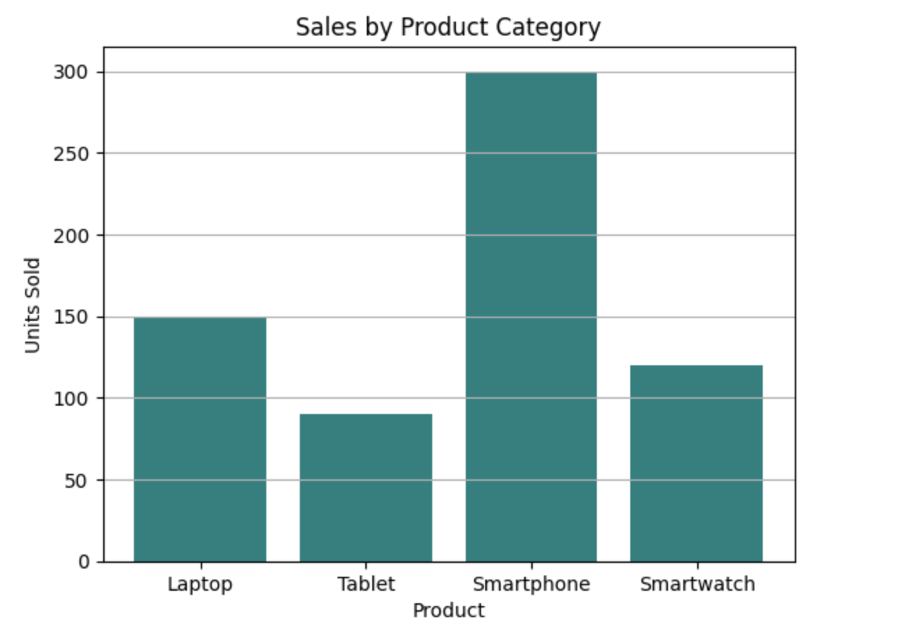
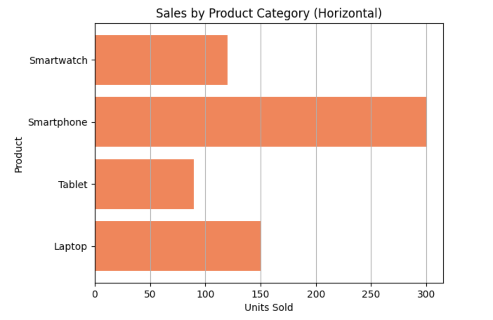

<h2 style="color:red;">✅ Bar Chart</h2>


<h3 style="color:blue;">📌 What is Bar Chart?</h3>
A **Bar Chart** is a visual representation used to **compare categories** of data using rectangular bars. Each bar's **length or height** is proportional to the value it represents.

**🧠 Key Features of a Bar Chart**

| Element         | Description                                       |
| --------------- | ------------------------------------------------- |
| **X-axis**      | Categories (e.g., Products, Departments, Genders) |
| **Y-axis**      | Numeric values (e.g., sales, counts)              |
| **Bars**        | Represent values of each category                 |
| **Orientation** | Vertical (default) or horizontal                  |


**📊 Bar Chart Example in Python**

```
import matplotlib.pyplot as plt

# Example: Sales of different products
products = ['Laptop', 'Tablet', 'Smartphone', 'Smartwatch']
sales = [150, 90, 300, 120]

# Create bar chart
plt.bar(products, sales, color='teal')
plt.title('Sales by Product Category')
plt.xlabel('Product')
plt.ylabel('Units Sold')
plt.grid(axis='y')
plt.show()
```




**🔄 Horizontal Bar Chart Example**

```
plt.barh(products, sales, color='coral')
plt.title('Sales by Product Category (Horizontal)')
plt.xlabel('Units Sold')
plt.ylabel('Product')
plt.grid(axis='x')
plt.show()
```




**📌 When to Use a Bar Chart**

- Comparing **discrete categories** (e.g., survey responses, department performance).

- Displaying **counts, frequencies,** or **aggregated data**.

- Showing **ranking** or **distribution** across categories.


**🆚 Bar Chart vs Histogram**

| Feature        | Bar Chart               | Histogram                            |
| -------------- | ----------------------- | ------------------------------------ |
| Data Type      | Categorical             | Continuous numeric                   |
| Bars Touching? | No (space between bars) | Yes (adjacent bars for intervals)    |
| Purpose        | Compare category values | Show data distribution (frequencies) |


## 📈 Example Use Cases

- 🏢 Number of employees per department

- 📱 App downloads by platform

- 🏆 Medal count by country

- 💬 Customer feedback categories

