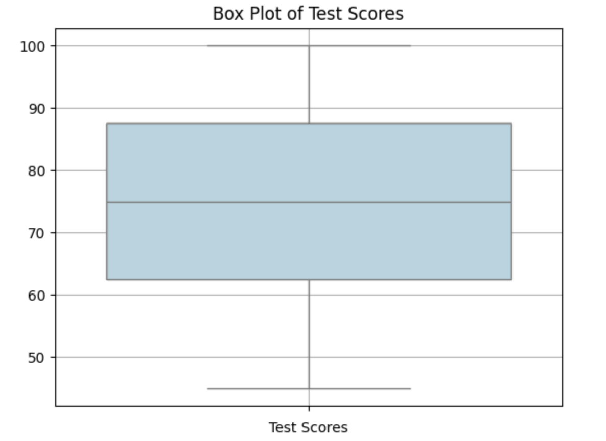
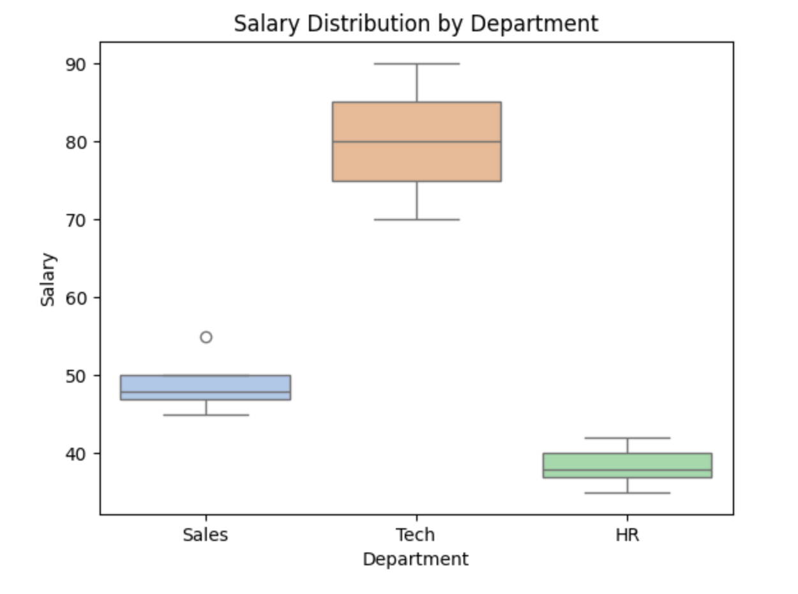

<h2 style="color:red;">✅ Box Plot</h2>


<h3 style="color:blue;">📌 What is Box Plot?</h3>
A **Box Plot** is a powerful visualization tool that summarizes the **distribution, central tendency**, and **variability** of a dataset using **five-number summary**:

**🧠 Five-Number Summary**

| Term            | Meaning                            |
| --------------- | ---------------------------------- |
| **Minimum**     | Lowest value (excluding outliers)  |
| **Q1**          | 1st Quartile (25th percentile)     |
| **Median (Q2)** | 2nd Quartile (50th percentile)     |
| **Q3**          | 3rd Quartile (75th percentile)     |
| **Maximum**     | Highest value (excluding outliers) |


**🔍 Box Plot Structure**

    |---------|=========|---------|
    min      Q1       Q2       Q3       max


- **Box:** From Q1 to Q3 → represents the **Interquartile Range (IQR)**

- **Line inside box:** Median (Q2)

- **Whiskers:** Extend to min and max (not including outliers)

- **Dots outside whiskers: Outliers**

**📈 Example: Box Plot in Python**

```
import matplotlib.pyplot as plt
import seaborn as sns

# Sample data: test scores
data = [45, 55, 60, 65, 70, 75, 80, 85, 90, 95, 100]

# Create box plot
sns.boxplot(data=data, color="lightblue")
plt.title("Box Plot of Test Scores")
plt.xlabel("Test Scores")
plt.grid(True)
plt.show()
```



**✅ What Can You Learn from a Box Plot?**

| Insight              | How to Spot it                 |
| -------------------- | ------------------------------ |
| **Central Tendency** | Median line in the box (Q2)    |
| **Spread (IQR)**     | Width of the box (Q3 - Q1)     |
| **Outliers**         | Points outside the whiskers    |
| **Skewness**         | Median not centered in the box |


**📌 When to Use a Box Plot**

- Comparing **distributions** across groups (e.g., salary by department)

- Detecting **outliers**

- Visualizing **data spread and symmetry**

- Excellent for **Exploratory Data Analysis (EDA)**

**📊 Example with Group Comparison**

```
import pandas as pd

# Example dataset
df = pd.DataFrame({
    "Department": ["Sales"]*5 + ["Tech"]*5 + ["HR"]*5,
    "Salary": [45, 50, 47, 48, 55, 75, 80, 85, 70, 90, 35, 40, 38, 42, 37]
})

# Box plot by group
sns.boxplot(x="Department", y="Salary", data=df, palette="pastel")
plt.title("Salary Distribution by Department")
plt.show()
```




