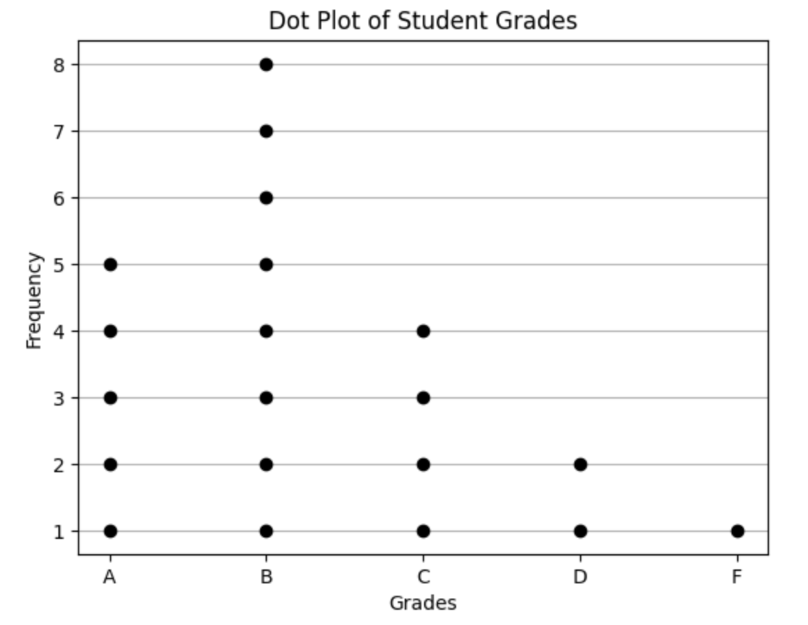

<h2 style="color:red;">✅ Dot Plot</h2>


<h3 style="color:blue;">📌 What is Dot Plot?</h3>
A **Dot Plot** is a graph used to display **discrete** data where **each dot represents one observation**. It’s particularly useful for **small datasets** or showing **frequencies** in a visually intuitive way.

**🧠 Key Characteristics**

| Feature       | Description                                           |
| ------------- | ----------------------------------------------------- |
| **Data Type** | Usually **categorical** or **discrete numeric**       |
| **X-axis**    | Categories or numeric values                          |
| **Dots**      | Each dot represents **one occurrence** or a **count** |
| **Stacking**  | Dots are stacked vertically when values repeat        |


**📈 Dot Plot Example in Python**

```
import matplotlib.pyplot as plt

# Example data: Number of students scoring each grade
grades = ['A', 'B', 'C', 'D', 'F']
counts = [5, 8, 4, 2, 1]

# Plot dot plot manually
for i in range(len(grades)):
    plt.plot([grades[i]] * counts[i], list(range(1, counts[i]+1)), 'ko')

plt.title("Dot Plot of Student Grades")
plt.xlabel("Grades")
plt.ylabel("Frequency")
plt.grid(True, axis='y')
plt.show()
```




**📌 When to Use a Dot Plot**

- To show **exact frequency counts** for a small dataset.

- To compare **individual values** without aggregating into bars (like bar chart).

- When **clarity** is more important than compactness.


**✅ Dot Plot vs Bar Chart**

| Feature        | Dot Plot             | Bar Chart                        |
| -------------- | -------------------- | -------------------------------- |
| Representation | Individual dots      | Bars representing total count    |
| Best for       | Small datasets       | Large categorical datasets       |
| Insight        | Exact count of items | Quick comparison of group totals |


**🧪 Example Use Cases**

- 👨‍🏫 Test scores in a small class

- 🧮 Number of items sold per day (if few days)

- 💬 Survey responses (agree/disagree/neutral)

