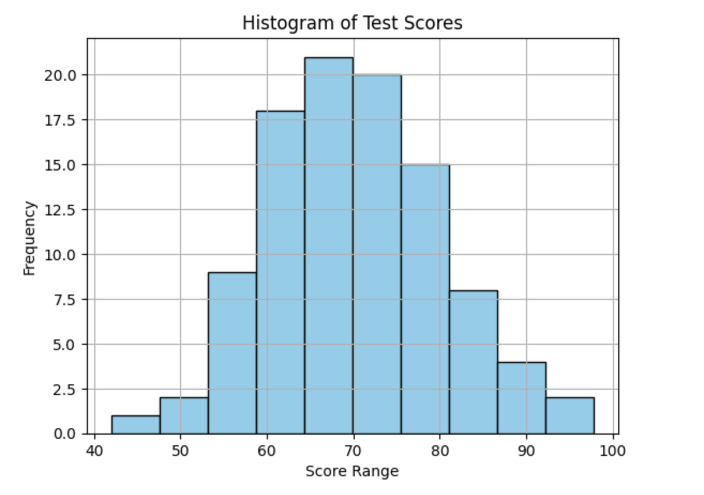

<h2 style="color:red;">✅ Histogram</h2>


<h3 style="color:blue;">📌 What is Histogram?</h3>
A **Histogram** is a graphical representation used to visualize the **distribution of numerical data**. It groups data into **intervals (bins)** and shows the **frequency** (count) of data points in each interval.

**🧠 Key Features of a Histogram**

| Element       | Description                                              |
| ------------- | -------------------------------------------------------- |
| **Bins**      | Intervals into which data is grouped (e.g., 0–10, 10–20) |
| **Frequency** | Number of data points in each bin                        |
| **X-axis**    | Data intervals (e.g., age, income)                       |
| **Y-axis**    | Frequency (how many times a value occurs)                |


**📈 Example Visualization in Python**

```
import numpy as np
import matplotlib.pyplot as plt

# Example: Random test scores of 100 students
data = np.random.normal(loc=70, scale=10, size=100)

# Plot histogram
plt.hist(data, bins=10, color='skyblue', edgecolor='black')
plt.title('Histogram of Test Scores')
plt.xlabel('Score Range')
plt.ylabel('Frequency')
plt.grid(True)
plt.show()
```



**What You Can Observe from a Histogram**

- **Shape of distribution** (e.g., normal, skewed, bimodal)

- **Spread of data**

- **Central tendency** (where most data is clustered)

- **Outliers** or gaps

**📌 When to Use a Histogram**

- Understanding the **distribution** of continuous data.

- Detecting **skewness** or **symmetry**.

- Identifying **mode(s)** (most frequent values).

- Performing **exploratory data analysis (EDA)** in ML/AI pipelines.

**📊 Histogram vs Bar Chart**

| Feature        | Histogram               | Bar Chart                        |
| -------------- | ----------------------- | -------------------------------- |
| Data Type      | Continuous (numerical)  | Categorical                      |
| Bars Touching? | Yes (bins are adjacent) | No (bars are separated)          |
| X-Axis         | Intervals or ranges     | Categories (e.g., Apple, Banana) |
