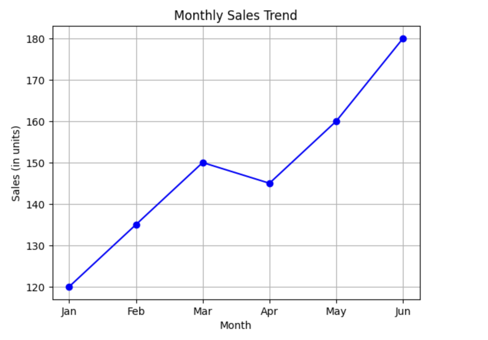
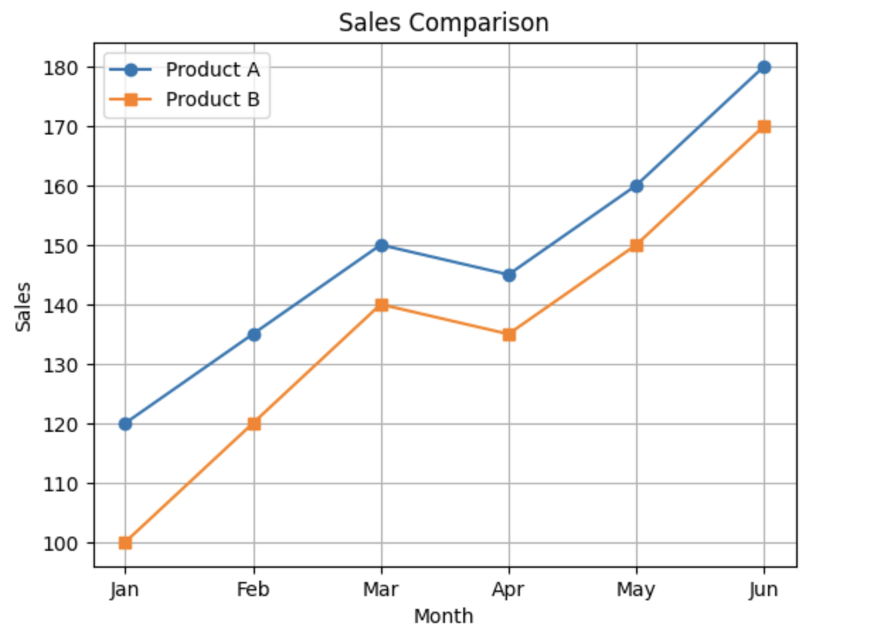

<h2 style="color:red;">✅ Line Plot</h2>


<h3 style="color:blue;">📌 What is Line Plot?</h3>
A **Line Plot** (or Line Graph) is used to show **changes over a continuous variable**, typically time. It connects data points with a line, making it ideal for spotting **trends, patterns**, and **fluctuations**.

**🧠 Key Features of a Line Plot**

| Element     | Description                                              |
| ----------- | -------------------------------------------------------- |
| **X-axis**  | Independent variable (usually time: days, months, years) |
| **Y-axis**  | Dependent variable (e.g., temperature, revenue, score)   |
| **Line**    | Connects data points to reveal trends or movement        |
| **Markers** | Optional dots to highlight data points                   |


**📊 Python Example – Line Plot with Matplotlib**

```
import matplotlib.pyplot as plt

# Example data: Monthly sales
months = ['Jan', 'Feb', 'Mar', 'Apr', 'May', 'Jun']
sales = [120, 135, 150, 145, 160, 180]

# Create line plot
plt.plot(months, sales, marker='o', linestyle='-', color='blue')
plt.title("Monthly Sales Trend")
plt.xlabel("Month")
plt.ylabel("Sales (in units)")
plt.grid(True)
plt.show()
```



**✅ What Can You Learn from a Line Plot?**

| Insight               | How to Interpret                      |
| --------------------- | ------------------------------------- |
| **Increasing trend**  | Line slopes upward                    |
| **Decreasing trend**  | Line slopes downward                  |
| **Fluctuations**      | Line goes up and down irregularly     |
| **Peaks and valleys** | Highest and lowest points on the line |


**📌 When to Use a Line Plot**

- To visualize **trends over time** (time series)

- To compare **multiple series** (e.g., different products or countries)

- To **forecast future trends** using models

**📈 Multi-Line Plot Example**

```
months = ['Jan', 'Feb', 'Mar', 'Apr', 'May', 'Jun']
product_A = [120, 135, 150, 145, 160, 180]
product_B = [100, 120, 140, 135, 150, 170]

plt.plot(months, product_A, marker='o', label='Product A')
plt.plot(months, product_B, marker='s', label='Product B')
plt.title("Sales Comparison")
plt.xlabel("Month")
plt.ylabel("Sales")
plt.legend()
plt.grid(True)
plt.show()
```




**📊 Use Cases for Line Plots**

- 📅 Stock prices over time

- 🌡️ Temperature variations per month

- 🧠 Model performance over training epochs

- 📈 Sales/Revenue trends