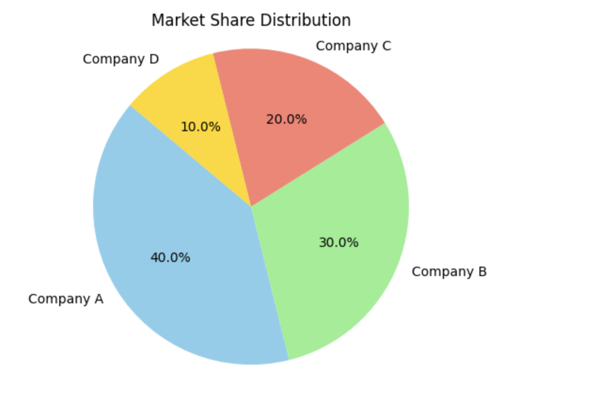

<h2 style="color:red;">✅ Pie Chart</h2>


<h3 style="color:blue;">📌 What is Pie Chart?</h3>
A Pie Chart displays data in a circular graph, where each slice represents a part of the whole. It’s ideal for showing percentage or proportional data.


**🧠 Key Features of a Pie Chart**

| Feature          | Description                                                  |
| ---------------- | ------------------------------------------------------------ |
| **Whole Circle** | Represents 100% of the data                                  |
| **Slices**       | Each slice shows the contribution of a category to the total |
| **Angle**        | Determined by the proportion of the category                 |
| **Labels**       | Often includes category names and percentages                |


**📊 Python Example – Simple Pie Chart**

```
import matplotlib.pyplot as plt

# Example data: Market share by company
labels = ['Company A', 'Company B', 'Company C', 'Company D']
sizes = [40, 30, 20, 10]
colors = ['skyblue', 'lightgreen', 'salmon', 'gold']

# Plot pie chart
plt.pie(sizes, labels=labels, colors=colors, autopct='%1.1f%%', startangle=140)
plt.title("Market Share Distribution")
plt.axis('equal')  # Equal aspect ratio makes the pie circular
plt.show()
```




**✅ What Can You Learn from a Pie Chart?**

| Insight                 | Example                               |
| ----------------------- | ------------------------------------- |
| **Largest share**       | The biggest slice (e.g., "Company A") |
| **Relative comparison** | How one category compares to another  |
| **Proportion**          | Exact percentage shown with `autopct` |


**⚠️ Limitations of Pie Charts**

- Not ideal for comparing many categories ( > 5 is hard to read).

- Less precise than bar charts for comparing exact values.

- Hard to read if the slices are similar in size.


**📌 When to Use a Pie Chart**

- You want to show composition or breakdown (e.g., budget allocation).

- Only a few categories to display.

- You want to highlight one dominant segment.


**🧪 Real-World Use Cases**

- 💰 Expense distribution (e.g., rent, food, travel)

- 👥 Population by religion/gender/region

- 🛒 Product sales by category

- 📧 Email open rates by device