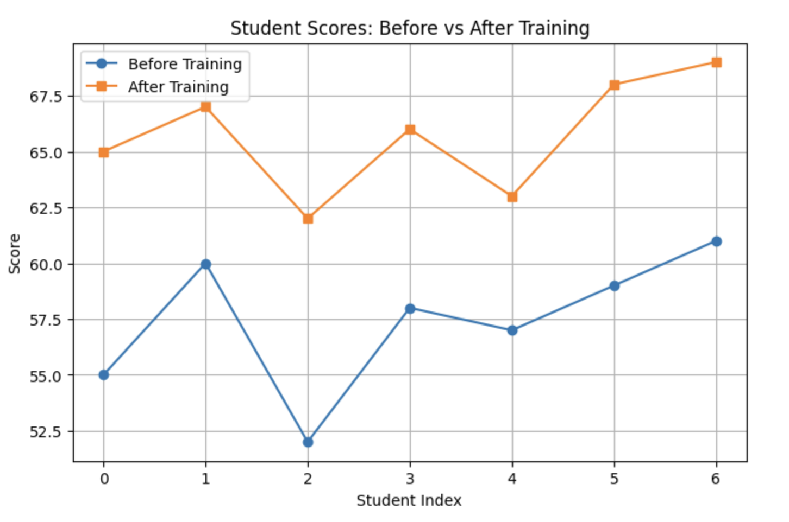

<h2 style="color:red;">✅ Hypothesis Testing</h2>

**Hypothesis Testing** is a statistical method used to **make inferences** or draw conclusions about a population based on sample data.

It helps determine whether there's enough evidence in a sample to support a specific claim about the population.

**🧪 Core Idea**

You begin with two competing hypotheses:

- **Null Hypothesis (H₀):** No effect, no difference, or status quo.

- **Alternative Hypothesis (H₁ or Hₐ):** There is an effect, a difference, or a change.

You collect data and use a statistical test to decide whether to reject H₀.

**Common Terminology**

| Term                   | Meaning                                                                |
| ---------------------- | ---------------------------------------------------------------------- |
| Null Hypothesis (H₀)   | Assumes no difference or effect.                                       |
| Alternative Hypothesis | What you aim to support — there is a difference or effect.             |
| p-value                | Probability of getting test results as extreme as observed if H₀ true. |
| Significance level (α) | Common threshold (e.g., 0.05) to decide whether to reject H₀.          |
| Reject H₀              | If p < α → statistically significant → support H₁.                     |


**🧠 Types of Hypothesis Tests**

| Test Type                | Purpose                                          | Assumptions/Use Case |
| ------------------------ | ------------------------------------------------ | -------------------- |
| **Z-Test**               | Test population mean (known variance)            | ✅ Parametric           |
| **T-Test**               | Test population mean (unknown variance)          | ✅ Parametric           |
| **ANOVA**                | Compare means of 3+ groups                       | ✅ Parametric           |
| **F-Test**               | Compare variances of two populations             | ✅ Parametric           |
| **Chi-Square Test**      | Test relationships between categorical variables | ❌ Non-Parametric       |
| **Mann-Whitney U**       | Compare two independent samples (ordinal/scale)  | ❌ Non-Parametric       |
| **Wilcoxon Signed-Rank** | Compare paired samples (ordinal/scale)           | ❌ Non-Parametric       |
| **Kruskal-Wallis Test**  | Compare 3+ groups without assuming normality     | ❌ Non-Parametric       |
| **Dunn's Test**          | Post-hoc for Kruskal-Wallis                      | ❌ Non-Parametric       |
| **Tukey’s HSD**          | Post-hoc for ANOVA                               | ✅ Parametric           |


**🎯 Real Example: Do Students Improve After Training?**

Let's say a group of students took a pre-test, attended a training course, then took a post-test.

```
import numpy as np
from scipy.stats import ttest_rel
import matplotlib.pyplot as plt

# Sample scores
before = np.array([55, 60, 52, 58, 57, 59, 61])
after = np.array([65, 67, 62, 66, 63, 68, 69])

# Perform paired t-test (parametric)
stat, p = ttest_rel(after, before)
print(f"T-statistic: {stat:.3f}")
print(f"P-value: {p:.3f}")

# Decision
alpha = 0.05
if p < alpha:
    print("✅ Significant improvement after training (reject H₀).")
else:
    print("❌ No significant improvement (fail to reject H₀).")
```

T-statistic: 14.653
P-value: 0.000
✅ Significant improvement after training (reject H₀).


**📊 Visualization**

```
plt.figure(figsize=(8,5))
plt.plot(before, label='Before Training', marker='o')
plt.plot(after, label='After Training', marker='s')
plt.title("Student Scores: Before vs After Training")
plt.xlabel("Student Index")
plt.ylabel("Score")
plt.legend()
plt.grid(True)
plt.show()
```




**🔄 Hypothesis Testing Process**

1. State the hypotheses (H₀ & H₁)

2. Choose significance level (α = 0.05)

3. Select the appropriate test (e.g., t-test, ANOVA)

4. Calculate test statistic & p-value

5. Compare p-value with α

6. Draw conclusion: reject or fail to reject H₀


**📌 Summary**

| Step          | Description                                          |
| ------------- | ---------------------------------------------------- |
| **H₀**        | No change (e.g., mean\_before = mean\_after)         |
| **H₁**        | There is a change (e.g., mean\_after > mean\_before) |
| **p < 0.05**  | Reject H₀ → statistically significant                |
| **p >= 0.05** | Fail to reject H₀                                    |


