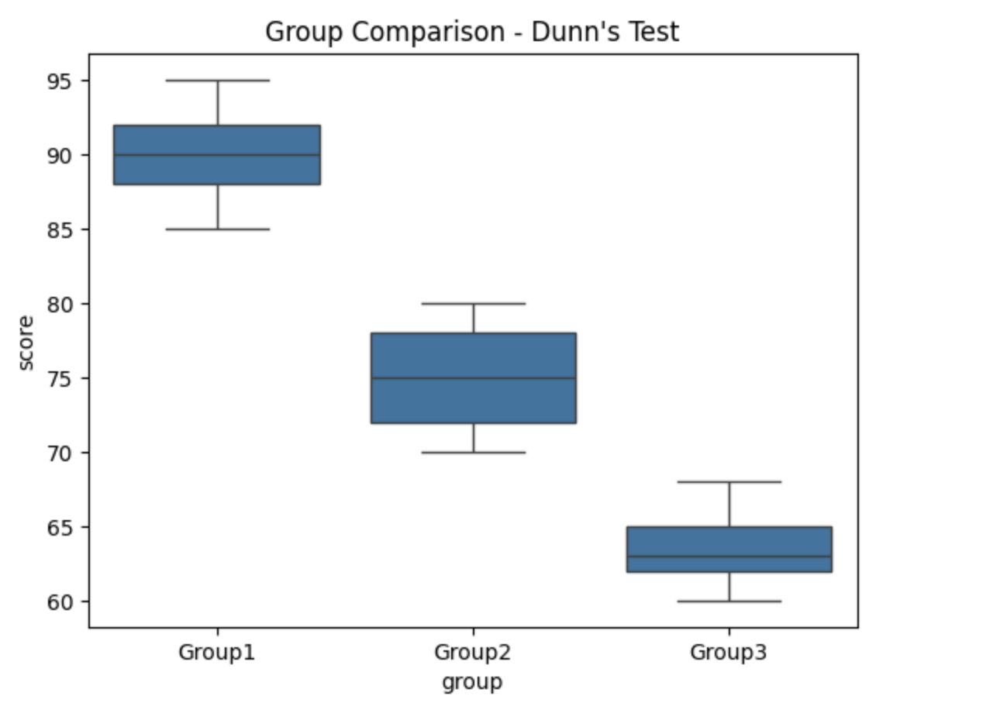

<h2 style="color:red;">✅ Kruskal–Wallis H Test</h2>

**📊 Real-Time Example 2: Kruskal–Wallis H Test**
Compare 3+ groups with non-normal distributions.

```
from scipy.stats import kruskal

group1 = [88, 90, 85, 95, 92]
group2 = [75, 78, 72, 70, 80]
group3 = [60, 65, 63, 62, 68]

stat, p = kruskal(group1, group2, group3)
print(f"H-Statistic: {stat}, p-value: {p:.3f}")
```


H-Statistic: 12.5, p-value: 0.002


## ✅ Dunn’s Test (Post-hoc for Kruskal-Wallis)

After running a Kruskal–Wallis test (non-parametric ANOVA) and finding a significant result, you can use Dunn’s test to figure out which specific groups differ.


**🧪 When to Use Dunn’s Test?**

- You’ve used **Kruskal–Wallis** to compare **3+ independent groups**

- You found a significant p-value

- Now you want to compare each pair of groups

**📊 Real-Time Example: Kruskal-Wallis + Dunn's Test**

```
import numpy as np
import scikit_posthocs as sp
import pandas as pd
from scipy.stats import kruskal

# Example scores from 3 groups
group1 = [88, 90, 85, 95, 92]
group2 = [75, 78, 72, 70, 80]
group3 = [60, 65, 63, 62, 68]

# Combine into a single array
data = group1 + group2 + group3
groups = (['Group1'] * len(group1)) + (['Group2'] * len(group2)) + (['Group3'] * len(group3))

# Kruskal-Wallis Test
stat, p = kruskal(group1, group2, group3)
print(f"Kruskal-Wallis H-statistic: {stat:.3f}, p-value: {p:.3f}")

# If significant, run Dunn’s post-hoc test
if p < 0.05:
    df = pd.DataFrame({'score': data, 'group': groups})
    dunn_result = sp.posthoc_dunn(df, val_col='score', group_col='group', p_adjust='bonferroni')
    print("\nDunn's Test Pairwise Comparisons:\n", dunn_result)
```


Kruskal-Wallis H-statistic: 12.500, p-value: 0.002

Dunn's Test Pairwise Comparisons:
           Group1  Group2    Group3
Group1  1.000000  0.2313  0.001221
Group2  0.231300  1.0000  0.231300
Group3  0.001221  0.2313  1.000000


**Visualization**

```
import seaborn as sns
import matplotlib.pyplot as plt

sns.boxplot(x="group", y="score", data=df)
plt.title("Group Comparison - Dunn's Test")
plt.show()
```




**📌 Notes:**

- p_adjust='bonferroni' is used to correct for multiple comparisons (you can also use 'holm', 'fdr_bh', etc.)

- Dunn’s test helps identify which group pairs differ significantly (like Tukey’s HSD in parametric ANOVA)

