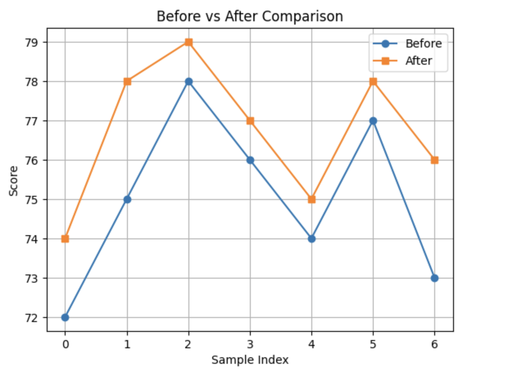

<h2 style="color:red;">✅ Wilcoxon Signed-Rank Test</h2>

The Wilcoxon Signed-Rank Test is a non-parametric alternative to the paired t-test.
It compares two related (paired/matched) samples to assess whether their population mean ranks differ.

**🧪 When to Use Wilcoxon Test?**

- You have two related groups (e.g., before and after treatment)

- Data is not normally distributed

- Alternative to the paired t-test


**📊 Real-Life Example (Python): Before vs After Scores**

```
import numpy as np
from scipy.stats import wilcoxon

# Paired sample data (before and after)
before = np.array([72, 75, 78, 76, 74, 77, 73])
after =  np.array([74, 78, 79, 77, 75, 78, 76])

# Wilcoxon Signed-Rank Test
stat, p = wilcoxon(before, after)
print(f"Wilcoxon statistic: {stat:.3f}")
print(f"p-value: {p:.3f}")

# Interpretation
if p < 0.05:
    print("✅ Statistically significant difference between paired samples.")
else:
    print("❌ No significant difference between paired samples.")
```

Wilcoxon statistic: 0.000
p-value: 0.016
✅ Statistically significant difference between paired samples.

**Visualization**

```
import matplotlib.pyplot as plt

plt.plot(before, label="Before", marker='o')
plt.plot(after, label="After", marker='s')
plt.title("Before vs After Comparison")
plt.xlabel("Sample Index")
plt.ylabel("Score")
plt.legend()
plt.grid(True)
plt.show()
```




**📌 Summary**

| Test         | Use Case               | Assumptions                |
| ------------ | ---------------------- | -------------------------- |
| **Wilcoxon** | Two **related** groups | Ordinal or continuous data |
| vs           |                        | Non-parametric alternative |
| **Paired t** | Assumes normality      |                            |


