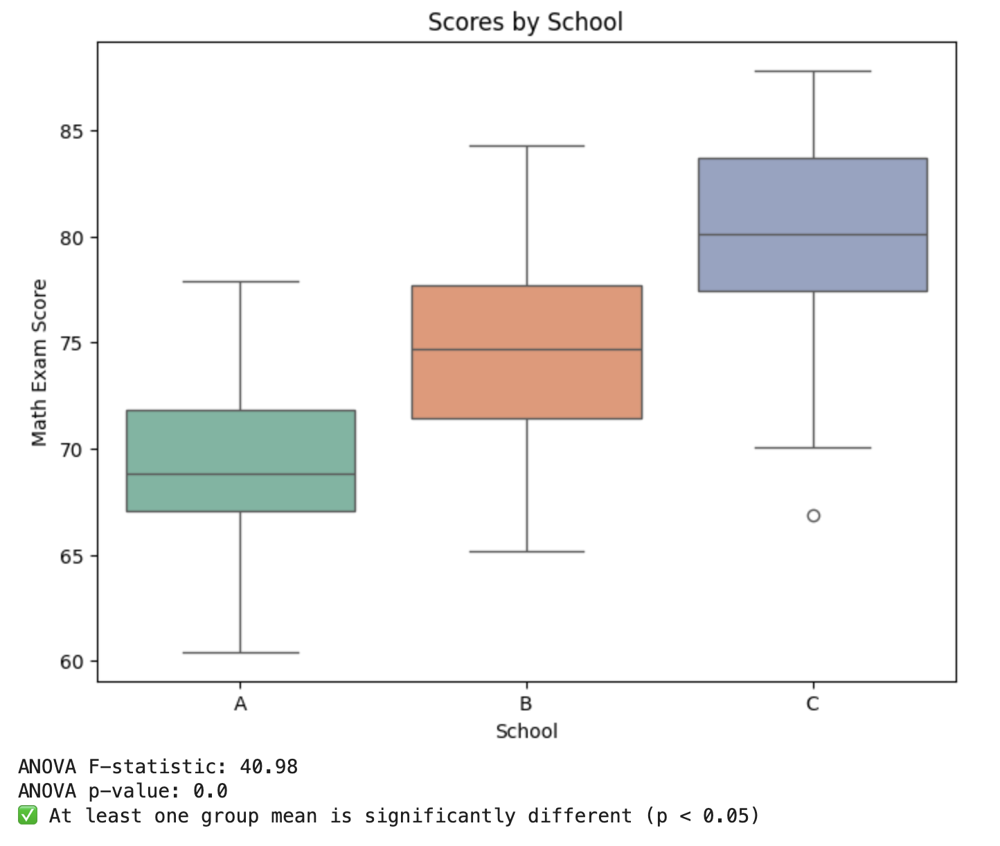
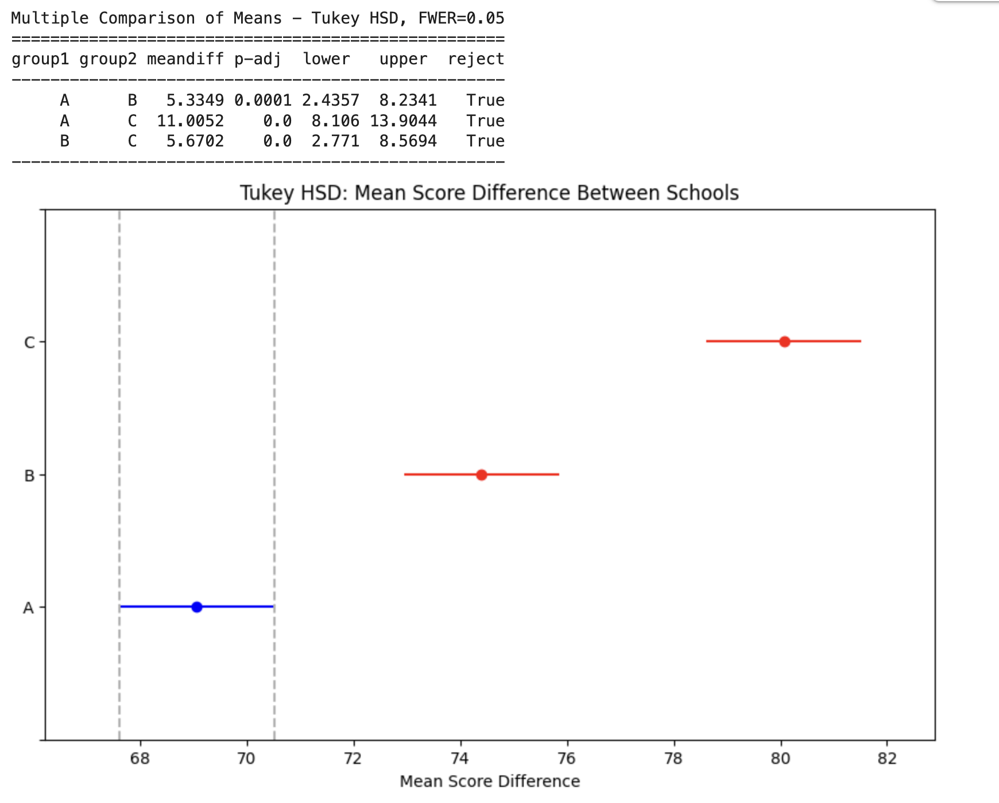

<h2 style="color:red;">✅ ANOVA (Analysis of Variance)</h2>


<h3 style="color:blue;">📌 What is ANOVA (Analysis of Variance)?</h3>
**ANOVA (Analysis of Variance)** is a **parametric test** used to compare the **means of three or more groups**
to determine if at least one group mean is significantly different from the others.

**📌 When to Use ANOVA:**

- Comparing **more than 2 groups** (e.g., test scores of students from 3 different schools).

- Data should be **normally distributed** and have **equal variances**.

- The independent variable is **categorical**, and the dependent variable is **continuous**.

**🔬 Real-Time Example:**

Suppose a researcher wants to test whether students from three different schools (A, B, and C) perform differently in a mathematics exam.

**🧪 Python Code with Graph**

```
import pandas as pd
import numpy as np
import matplotlib.pyplot as plt
import seaborn as sns
from scipy import stats

# Random seed for reproducibility
np.random.seed(42)

# Sample data for 3 schools
school_A = np.random.normal(loc=70, scale=5, size=30)
school_B = np.random.normal(loc=75, scale=5, size=30)
school_C = np.random.normal(loc=80, scale=5, size=30)

# Create DataFrame
data = pd.DataFrame({
    'Score': np.concatenate([school_A, school_B, school_C]),
    'School': ['A'] * 30 + ['B'] * 30 + ['C'] * 30
})

# 📊 Boxplot for Visualization
plt.figure(figsize=(8, 6))
sns.boxplot(x='School', y='Score', data=data, palette="Set2")
plt.title('Scores by School')
plt.ylabel('Math Exam Score')
plt.show()

# ⚗️ One-Way ANOVA Test
f_stat, p_val = stats.f_oneway(school_A, school_B, school_C)

# 📋 Results
print("ANOVA F-statistic:", round(f_stat, 2))
print("ANOVA p-value:", round(p_val, 4))

# 🔍 Interpretation
if p_val < 0.05:
    print("✅ At least one group mean is significantly different (p < 0.05)")
else:
    print("❌ No significant difference between group means (p ≥ 0.05)")
```



**✅ Summary:**

- **Test Used:** One-Way ANOVA

- **Goal:** Compare the mean scores of 3 different schools

- **Output:** F-statistic & p-value

- **Interpretation:** If p < 0.05, at least one group is different


## ✅ Tukey HSD Post-Hoc Test (After ANOVA)

After finding a **significant result in ANOVA**, you can run **Tukey’s Honest Significant Difference (HSD)** test to pinpoint **which groups are significantly different** from each other.

**📌 Why Use Tukey HSD?**

- ANOVA tells **if there is a difference** among groups.

- **Tukey HSD tells which specific groups differ.**

- It controls for **Type I** error across multiple comparisons.


**🧪 Real-Time Example (continued from ANOVA)**

```
from statsmodels.stats.multicomp import pairwise_tukeyhsd

# 🧪 Tukey HSD Test
tukey = pairwise_tukeyhsd(endog=data['Score'], groups=data['School'], alpha=0.05)

# 📋 Results
print(tukey)

# 📊 Visualization of Tukey Test
tukey.plot_simultaneous(comparison_name='A', xlabel='Mean Score Difference')
plt.title("Tukey HSD: Mean Score Difference Between Schools")
plt.show()
```



**📌 Interpretation:**

- ```meandiff:``` Difference in group means

- ```p-adj:``` Adjusted p-value (controls for multiple comparisons)

- ```reject:``` True means significant difference

- Example: School A vs School C → Significant difference (p < 0.05)

**📉 Visualization:**

The plot shows confidence intervals for group mean differences. If the CI doesn’t cross zero → significant difference.

**🧾 Summary:**

- Run **Tukey HSD after significant ANOVA**

- Helps identify **which pairs** are significantly different

- Visual and statistical output makes conclusions easier

