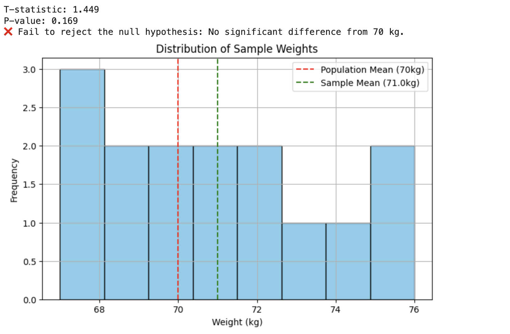
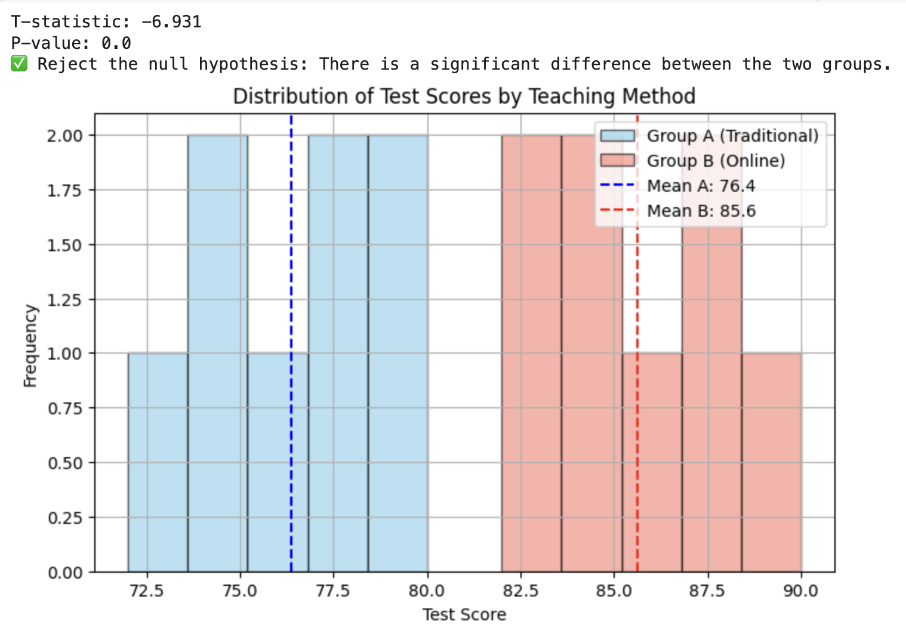
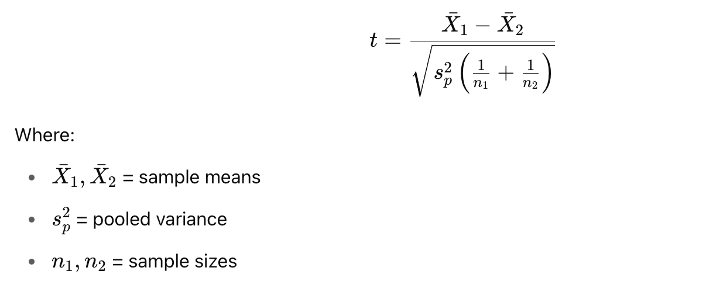
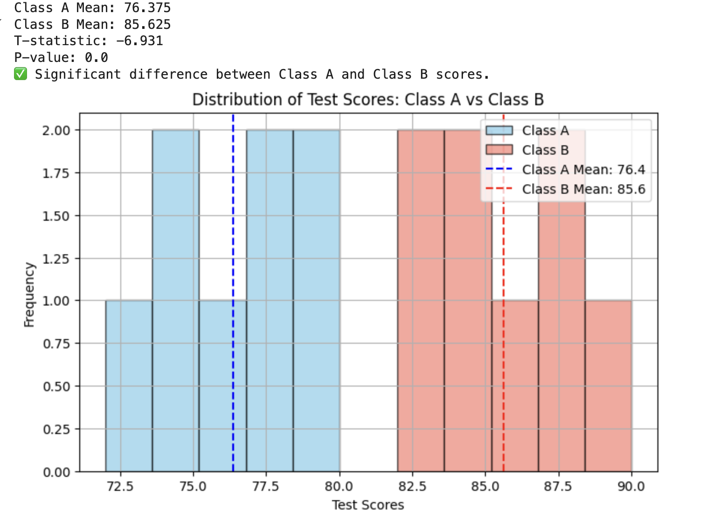

<h2 style="color:red;">✅ T-test</h2>

<h3 style="color:blue;">📌 What is T-test?</h3>
A t-test is a parametric statistical test used to compare means between groups and determine whether the difference is statistically significant.

**✅ When to Use a t-test?**
Use a t-test when:

- Your data is approximately **normally distributed**.

- You are comparing **means**.

- Your data is **interval** or **ratio scale**.

- You have **independent** or **paired** observations.


**🧪 Types of t-tests**

| **Type**                                | **Use Case**                                       | **Python Function** | **Example**                            |
| --------------------------------------- | -------------------------------------------------- | ------------------- | -------------------------------------- |
| **1. One-sample t-test**                | Compare sample mean to known/population mean       | `ttest_1samp()`     | Test if average height = 170cm         |
| **2. Two-sample (Independent) t-test**  | Compare means of two **independent** groups        | `ttest_ind()`       | Compare test scores of boys vs girls   |
| **3. Paired-sample (Dependent) t-test** | Compare means of **same group** at different times | `ttest_rel()`       | Compare weight before and after a diet |


**📌 1. One-Sample t-test**

A one-sample t-test is a statistical test used to determine whether the mean of a single sample is significantly different from a known or hypothesized population mean.

**📌 When to Use?**
Use it when:

- You have **one group of observations**.

- You want to compare its mean to a **specific known value**.

**💡 Real-Life Example Scenario**

Suppose a fitness coach claims that the **average weight of gym members is 70 kg**. You collect a sample of 15 members and want to **test if their average weight differs significantly** from 70 kg.


**🧮 Hypotheses**

- **Null Hypothesis (H₀)**: μ = 70 → Mean weight is 70 kg.

- **Alternative Hypothesis (H₁)**: μ ≠ 70 → Mean weight is not 70 kg.

```
import numpy as np
import matplotlib.pyplot as plt
from scipy import stats

# Sample weights of 15 gym members
sample_weights = [72, 69, 75, 71, 68, 74, 70, 73, 76, 68, 72, 69, 71, 67, 70]

# Known population mean (hypothesized mean)
population_mean = 70

# One-sample t-test
t_stat, p_value = stats.ttest_1samp(sample_weights, population_mean)

print("T-statistic:", round(t_stat, 3))
print("P-value:", round(p_value, 3))

# Interpretation
alpha = 0.05
if p_value < alpha:
    print("✅ Reject the null hypothesis: The average weight is significantly different from 70 kg.")
else:
    print("❌ Fail to reject the null hypothesis: No significant difference from 70 kg.")

# Visualization
plt.figure(figsize=(8, 5))
plt.hist(sample_weights, bins=8, color='skyblue', edgecolor='black')
plt.axvline(population_mean, color='red', linestyle='--', label='Population Mean (70kg)')
plt.axvline(np.mean(sample_weights), color='green', linestyle='--', label=f'Sample Mean ({round(np.mean(sample_weights),2)}kg)')
plt.title("Distribution of Sample Weights")
plt.xlabel("Weight (kg)")
plt.ylabel("Frequency")
plt.legend()
plt.grid(True)
plt.show()
```



**🧠 Conclusion**

Since the p-value is greater than 0.05, we do not have enough evidence to say the sample mean is significantly different from 70 kg.


**📌 2. Two-Sample t-test**

**📘 What is a Two-Sample T-Test?**

A two-sample t-test (also called independent t-test) compares the means of two independent groups to determine if they are significantly different from each other.

**📌 When to Use It?**

Use a two-sample t-test when:

   - You are comparing two different groups.
   - Each group is independent (no repeated measures or pairing).
   - Your variable is numerical and approximately normally distributed.

**💡 Real-Life Example Scenario**

A teacher wants to know if two different teaching methods result in different average test scores.
Group A used traditional methods, and Group B used online interactive methods.


```
import numpy as np
import matplotlib.pyplot as plt
from scipy import stats

# Sample test scores
group_A = [78, 74, 80, 79, 72, 77, 76, 75]
group_B = [82, 85, 88, 90, 84, 83, 87, 86]

# Two-sample (independent) t-test
t_stat, p_value = stats.ttest_ind(group_A, group_B)

print("T-statistic:", round(t_stat, 3))
print("P-value:", round(p_value, 3))

# Interpretation
alpha = 0.05
if p_value < alpha:
    print("✅ Reject the null hypothesis: There is a significant difference between the two groups.")
else:
    print("❌ Fail to reject the null hypothesis: No significant difference between the two groups.")

# Visualization
plt.figure(figsize=(8, 5))
plt.hist(group_A, bins=5, alpha=0.6, label='Group A (Traditional)', color='skyblue', edgecolor='black')
plt.hist(group_B, bins=5, alpha=0.6, label='Group B (Online)', color='salmon', edgecolor='black')
plt.axvline(np.mean(group_A), color='blue', linestyle='--', label=f'Mean A: {np.mean(group_A):.1f}')
plt.axvline(np.mean(group_B), color='red', linestyle='--', label=f'Mean B: {np.mean(group_B):.1f}')
plt.title("Distribution of Test Scores by Teaching Method")
plt.xlabel("Test Score")
plt.ylabel("Frequency")
plt.legend()
plt.grid(True)
plt.show()
```



**🧠 Conclusion**

Since the p-value < 0.05, the result is statistically significant — the average test scores differ between Group A and Group B.


## Two-sample t-test

A **two-sample t-test**, also known as an **independent t-test**, is a statistical method used to determine whether the **means of two independent groups** are **significantly different** from each other.

**Key Characteristics**

| Feature        | Description                                                 |
| -------------- | ----------------------------------------------------------- |
| 👫 Groups      | Two **independent** groups (e.g., Group A vs. Group B)      |
| 🎯 Goal        | Compare **means**                                           |
| 🔢 Data Type   | Continuous numerical data                                   |
| 🧠 Assumptions | Normal distribution, equal/unequal variance (can be tested) |


**📌 When to Use**

- Comparing **test scores** of students taught with two different teaching methods.

- Comparing **blood pressure** between two different drug groups.

- Comparing **customer satisfaction** between two branches of a store.


**🧮 Hypotheses**

**Null Hypothesis (H₀):**

- μ₁ = μ₂ → The means of the two groups are equal.

**Alternative Hypothesis (H₁):**

- μ₁ ≠ μ₂ → The means of the two groups are not equal.

- You can also do **one-tailed tests** if you expect one group to be higher/lower than the other.

**✅ Types of Two-Sample T-Test**

| Test Type                      | When to Use                                                          |
| ------------------------------ | -------------------------------------------------------------------- |
| **Equal Variance (pooled)**    | If both groups have **similar variance**                             |
| **Unequal Variance (Welch’s)** | If the variance between groups is **different** (default in `scipy`) |


**⚠️ Assumptions**

1. The two groups are **independent**.

2. The data in each group is normally distributed.

3. Variances of the two groups are either equal or unequal (handle using Welch's t-test).

**📊 Formula (for equal variances)**



**📈 Example Use Case**

A school wants to compare math scores between boys and girls in 10th grade.
If boys and girls are sampled **independently**, use a **two-sample t-test**.

**Example:**

We want to compare the average test scores of two classes (Class A and Class B) who were taught using different teaching methods.

**🐍 Python Code: Two-Sample T-Test with Visualization**

```
import numpy as np
import matplotlib.pyplot as plt
from scipy.stats import ttest_ind

# Sample test scores for two independent classes
class_A_scores = [78, 74, 80, 79, 72, 77, 76, 75]
class_B_scores = [82, 85, 88, 90, 84, 83, 87, 86]

# Perform two-sample (independent) t-test
t_stat, p_val = ttest_ind(class_A_scores, class_B_scores)

print("Class A Mean:", np.mean(class_A_scores))
print("Class B Mean:", np.mean(class_B_scores))
print("T-statistic:", round(t_stat, 3))
print("P-value:", round(p_val, 3))

# Interpretation
alpha = 0.05
if p_val < alpha:
    print("✅ Significant difference between Class A and Class B scores.")
else:
    print("❌ No significant difference between Class A and Class B scores.")

# 📊 Visualization
plt.figure(figsize=(8, 5))
plt.hist(class_A_scores, bins=5, alpha=0.7, label='Class A', color='skyblue', edgecolor='black')
plt.hist(class_B_scores, bins=5, alpha=0.7, label='Class B', color='salmon', edgecolor='black')
plt.axvline(np.mean(class_A_scores), color='blue', linestyle='--', label=f'Class A Mean: {np.mean(class_A_scores):.1f}')
plt.axvline(np.mean(class_B_scores), color='red', linestyle='--', label=f'Class B Mean: {np.mean(class_B_scores):.1f}')
plt.title("Distribution of Test Scores: Class A vs Class B")
plt.xlabel("Test Scores")
plt.ylabel("Frequency")
plt.legend()
plt.grid(True)
plt.show()
```




**🧠 Interpretation**
Since the **p-value < 0.05**, we **reject the null hypothesis**. This means:

📢 There is a **statistically significant difference** between the average scores of Class A and Class B.

## Paired T-Test
A paired t-test compares the means of two related (paired) samples, like:

- Before vs. After results from the same individuals.

- Two related measurements from the same subjects (e.g., left vs. right hand grip strength).

**🧮 Hypotheses:**

- **Null Hypothesis (H₀):**

The **mean difference** between the paired observations is zero.

- **Alternative Hypothesis (H₁):**

The **mean difference** is not zero.

**Real-Life Example Scenario**

A coach wants to check if a fitness training program improved the running speed of 10 athletes.
We have their running times before and after the training.

**🐍 Python Code with Visualization**

```
import numpy as np
import matplotlib.pyplot as plt
from scipy.stats import ttest_rel

# Running times (in seconds) before and after training for 10 athletes
before_training = [15.2, 14.8, 16.0, 15.5, 15.7, 16.1, 15.0, 14.9, 15.6, 16.3]
after_training =  [14.6, 14.4, 15.2, 15.0, 15.1, 15.4, 14.5, 14.2, 14.9, 15.7]

# Paired t-test
t_stat, p_val = ttest_rel(before_training, after_training)

print("T-statistic:", round(t_stat, 3))
print("P-value:", round(p_val, 3))

# Interpretation
alpha = 0.05
if p_val < alpha:
    print("✅ Training significantly changed running time.")
else:
    print("❌ No significant change in running time due to training.")

# Visualization of before vs after
x = np.arange(len(before_training))
width = 0.35

plt.figure(figsize=(10, 5))
plt.bar(x - width/2, before_training, width, label='Before', color='skyblue')
plt.bar(x + width/2, after_training, width, label='After', color='lightgreen')
plt.xticks(x, [f"Athlete {i+1}" for i in x])
plt.ylabel("Running Time (seconds)")
plt.title("Running Times Before and After Training")
plt.legend()
plt.grid(True, axis='y')
plt.tight_layout()
plt.show()
```


**🧠 Interpretation**

Since p-value < 0.05, we reject the null hypothesis.

The training program significantly improved the athletes' running times.

**🧾 Comparison: Types of T-Tests**

| Feature                  | ✅ **One-Sample T-Test**                        | ✅ **Two-Sample T-Test**                        | ✅ **Paired T-Test**                               |
| ------------------------ | ---------------------------------------------- | ---------------------------------------------- | ------------------------------------------------- |
| **Purpose**              | Compare sample mean to a known population mean | Compare means of **two independent** groups    | Compare means of **two related** (paired) samples |
| **Data Type**            | One group of numeric data                      | Two groups (independent) of numeric data       | Two sets of numeric data from same subjects       |
| **Sample Relationship**  | Single sample                                  | Independent samples                            | Dependent/paired samples                          |
| **Typical Use Case**     | Is average weight ≠ 70 kg?                     | Do male and female students score differently? | Did training improve the same person’s speed?     |
| **Null Hypothesis (H₀)** | μ = μ₀ (sample mean = known mean)              | μ₁ = μ₂ (group means are equal)                | μ\_d = 0 (mean of differences = 0)                |
| **Python Function**      | `ttest_1samp()`                                | `ttest_ind()`                                  | `ttest_rel()`                                     |
| **Real-Life Example**    | Compare avg. height of a class to 165 cm       | Compare test scores of two classes             | Compare BP before and after medication            |


**Visual Summary**

1️⃣ One-Sample:
    [Sample A]  vs  [Known Mean]

2️⃣ Two-Sample:
    [Group A]   vs  [Group B]     ← Independent

3️⃣ Paired:
    [Before]    vs  [After]       ← Same subject

