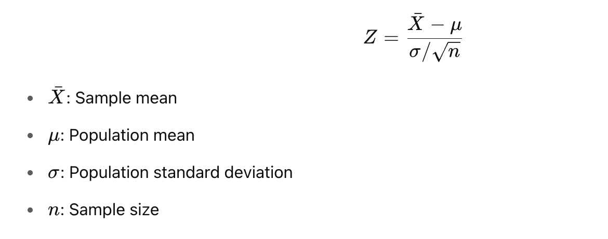

<h2 style="color:red;">✅ Z-Test</h2>

<h3 style="color:blue;">📌 What is Z-Test?</h3>
A **Z-test** is a **parametric statistical test** used to determine whether there is a significant difference between sample and population means (or between two sample means) **when the population variance is known and the sample size is large** (typically n > 30).

**When to Use a Z-Test?**

| Condition                                        | Description |
| ------------------------------------------------ | ----------- |
| ✅ Sample size is **large** (n > 30)              |             |
| ✅ Population standard deviation (σ) is **known** |             |
| ✅ Data follows a **normal distribution**         |             |


**📦 Types of Z-Test**

| Z-Test Type                | Purpose                                    |
| -------------------------- | ------------------------------------------ |
| **One-sample Z-test**      | Compare sample mean to population mean     |
| **Two-sample Z-test**      | Compare means from two independent samples |
| **Z-test for proportions** | Compare population proportions             |


**🧪 One-Sample Z-Test Formula**



**📊 Real-Life Example: Test if new teaching method improves scores**

Suppose:

- Population mean (μ) = 70

- Population std. deviation (σ) = 10

- Sample scores from new method: [72, 74, 69, 68, 71, 73, 75, 70]

**✅ Python Example:**

```
import numpy as np
from scipy.stats import norm

# Given
population_mean = 70
population_std = 10
sample = np.array([72, 74, 69, 68, 71, 73, 75, 70])
sample_mean = np.mean(sample)
n = len(sample)

# Z-statistic
z = (sample_mean - population_mean) / (population_std / np.sqrt(n))

# P-value (two-tailed)
p_value = 2 * (1 - norm.cdf(abs(z)))

print(f"Z-score: {z:.3f}")
print(f"P-value: {p_value:.3f}")
```

Z-score: 0.424
P-value: 0.671

- Since p > 0.05 → **Fail to reject null hypothesis**.
  Conclusion: The new teaching method does not significantly change scores.


**📌 Summary:**

| Aspect           | Value                    |
| ---------------- | ------------------------ |
| Test Type        | Parametric               |
| Use When         | σ is known, n > 30       |
| Distribution     | Normal                   |
| Test Statistic   | Z-score                  |
| Common Use Cases | A/B Testing, Proportions |


**two-sample z-test**

**z-test for proportions**


