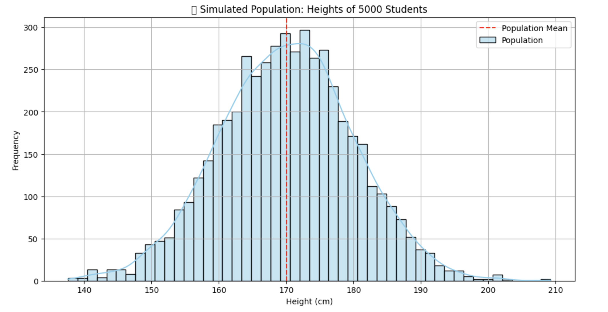

<h2 style="color:red;">✅ Population</h2>

<h3 style="color:blue;">📌 What is Population?</h3>
In statistics, a population refers to the entire set of individuals or items that you're interested in studying.

**Population** = The complete group of elements (people, objects, transactions, etc.) that have at least one characteristic in common.

**🧠 Real Example:**

Imagine you're analyzing the **heights of all students in a university**.

- **Population** = All 5,000 students in the university.

- But it's difficult to collect height data from all 5,000.

- So we collect data from **a smaller group (Sample)**, e.g., 100 students.

**🐍 Python Example with Visual Diagram**

**📈 What This Shows:**

- A **bell-shaped curve (normal distribution)** representing the **heights** of all 5,000 students (the entire population).

- The red dashed line indicates the mean height of the population.

**✅ When to Use Population Data**

- When you have access to the entire dataset.

- In small groups (e.g., all employees in a company).

- In census studies (like national population surveys).

