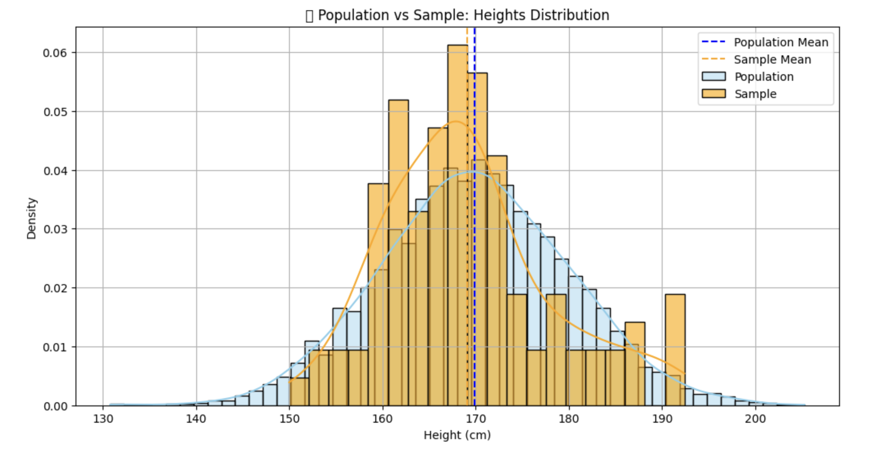

<h2 style="color:red;">✅ Sample</h2>


<h3 style="color:blue;">📌 What is Sample?</h3>
A sample is a subset of individuals, items, or data points selected from a population for analysis.

A sample represents a small part of the population, used to draw conclusions (inferences) about the whole.

**🧠 Why Use a Sample?**

- It is often **impractical or impossible** to measure the entire population.

- Sampling is **cheaper, faster,** and **more efficient**.

- If done correctly, a sample can provide **accurate insights** about the population.

**📌 Real-World Examples:**

| Study Goal                             | Population                    | Sample Example                     |
| -------------------------------------- | ----------------------------- | ---------------------------------- |
| Average income of people in India      | All Indian citizens           | 2,000 people randomly selected     |
| Satisfaction level of Amazon customers | All Amazon users              | 500 customers who recently ordered |
| Average height of university students  | All 5,000 university students | 100 randomly chosen students       |


**🐍 Python Example – Sampling from a Population**

Let’s build on the previous population of student heights, and now take a sample:

```
import numpy as np
import matplotlib.pyplot as plt
import seaborn as sns

# Assume previous population is already generated
population = np.random.normal(loc=170, scale=10, size=5000)

# Step 1: Draw a random sample from population (e.g., 100 students)
sample = np.random.choice(population, size=100, replace=False)

# Step 2: Plot both population and sample
plt.figure(figsize=(12, 6))

# Population histogram
sns.histplot(population, bins=50, kde=True, color='skyblue', label='Population', stat='density', alpha=0.4)

# Sample histogram
sns.histplot(sample, bins=20, kde=True, color='orange', label='Sample', stat='density', alpha=0.6)

# Mean lines
plt.axvline(np.mean(population), color='blue', linestyle='--', label='Population Mean')
plt.axvline(np.mean(sample), color='orange', linestyle='--', label='Sample Mean')

plt.title('📊 Population vs Sample: Heights Distribution')
plt.xlabel('Height (cm)')
plt.ylabel('Density')
plt.legend()
plt.grid(True)
plt.show()
```



**📊 Interpretation:**

- The **blue curve** shows the full **population**.

- The **orange curve** shows the sample drawn from the population.

- Both curves should have **similar shapes**, and the **sample mean** should be close to the **population mean**.

**🔁 Summary**

| Term       | Description                                   | Symbol |
| ---------- | --------------------------------------------- | ------ |
| Population | Entire group (e.g., all 5,000 students)       | `N`    |
| Sample     | Subset of the population (e.g., 100 students) | `n`    |

**🎯 Why Sampling Techniques Matter**

Choosing the right sampling method ensures that your sample:

- Represents the population fairly.

- Reduces bias.

- Improves accuracy of statistical inferences.

**📚 Types of Sampling Techniques**

**1. 🎲 Simple Random Sampling (SRS)**

Every member of the population has an equal chance of being selected.

**✅ When to Use:** When the population is homogeneous.

**📌 Python Example:**

```
sample_srs = np.random.choice(population, size=100, replace=False)
```

**2. 📊 Stratified Sampling**

The population is divided into strata (groups), and random samples are taken from each group.

**✅ When to Use:** When the population has distinct subgroups (e.g., gender, age group).

**📌 Python Example:**

```
# Simulate population with gender
import pandas as pd
population_df = pd.DataFrame({
    'height': population,
    'gender': np.random.choice(['Male', 'Female'], size=5000, p=[0.5, 0.5])
})

# Stratified sampling: 50 males and 50 females
sample_stratified = population_df.groupby('gender').sample(n=50, random_state=42)
```

**3. 🧾 Systematic Sampling**

Select every k-th element from a list after a random start.

**✅ When to Use:** When data is ordered or evenly distributed.

**📌 Python Example:**

```
k = 50  # Select every 50th person
start = np.random.randint(0, k)
sample_systematic = population[start::k][:100]
```

**4. 📍 Cluster Sampling**

The population is divided into clusters (e.g., schools, cities), and entire clusters are randomly selected.

**✅ When to Use:** When the population is naturally grouped and listing all elements is difficult.

**📌 Python-style Pseudocode:**

```
# Imagine schools as clusters and select few whole schools
# Not implemented without full data structure of clusters
```

## 📐 Estimating Population Parameters from a Sample

**1. 📏 Sample Mean ≈ Population Mean**

```
sample_mean = np.mean(sample)
population_mean = np.mean(population)
```

**2. 📊 Sample Standard Deviation**

Use ```ddof=1``` to get the unbiased estimate.

```
sample_std = np.std(sample, ddof=1)
```

**3. 📈 Confidence Interval for the Mean**

Estimate population mean using a **confidence interval** (e.g., 95%):

```
import scipy.stats as stats

confidence = 0.95
n = len(sample)
mean = np.mean(sample)
std_err = stats.sem(sample)  # Standard error
margin = stats.t.ppf((1 + confidence) / 2, df=n-1) * std_err

lower_bound = mean - margin
upper_bound = mean + margin

print(f"95% Confidence Interval for Population Mean: ({lower_bound:.2f}, {upper_bound:.2f})")
```

**✅ Summary Table**

| Technique     | Use Case                            | Bias Risk |
| ------------- | ----------------------------------- | --------- |
| Simple Random | Equal chance for all                | Low       |
| Stratified    | Population has meaningful subgroups | Very Low  |
| Systematic    | Regularly spaced selection          | Medium    |
| Cluster       | Population naturally in groups      | Higher    |
