<h2 style="color:red;">✅ Probability Distribution</h2>
A probability distribution describes how the probabilities are distributed over the values of a random variable.

- For **discrete variables**, it assigns probabilities to individual values.

- For **continuous variables**, it describes a probability **density** over a range of values.

**🔀 Classification of Probability Distributions**

| Type           | Description                   | Example             |
| -------------- | ----------------------------- | ------------------- |
| **Discrete**   | Finite/countable outcomes     | Binomial, Poisson   |
| **Continuous** | Infinite/uncountable outcomes | Normal, Exponential |


**🎲 Discrete Probability Distributions**

**1. Bernoulli Distribution**

- Use: Single trial with 2 outcomes (success/failure)

- PMF: 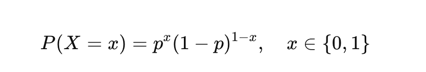

```
from scipy.stats import bernoulli
import matplotlib.pyplot as plt

p = 0.6
x = [0, 1]
pmf = bernoulli.pmf(x, p)

plt.bar(x, pmf)
plt.title('Bernoulli Distribution (p=0.6)')
plt.xlabel('Outcome')
plt.ylabel('Probability')
plt.show()
```

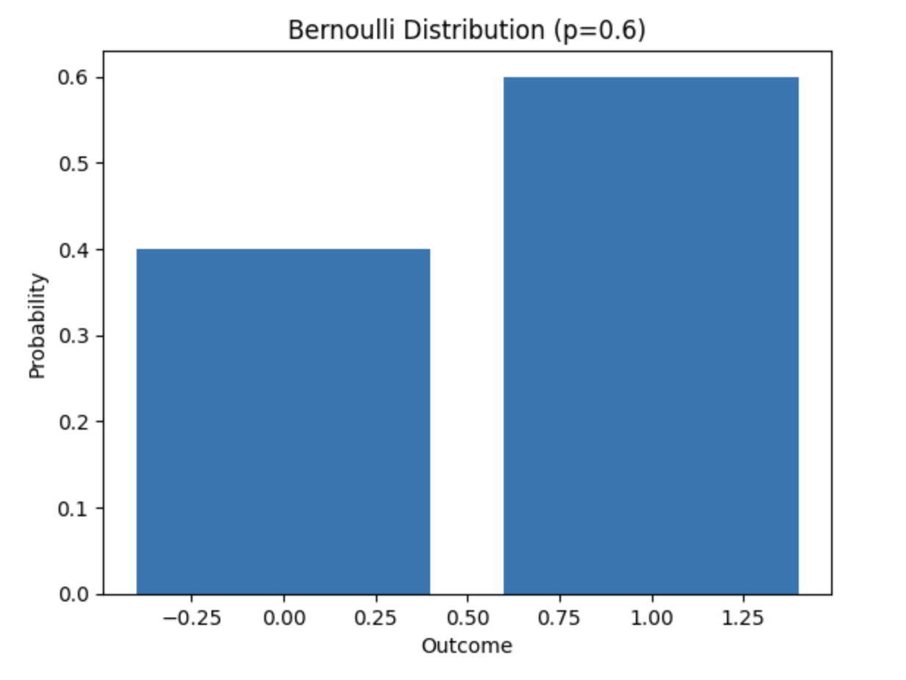


**2. Binomial Distribution**

- Use: Number of successes in n independent Bernoulli trials

- PMF: 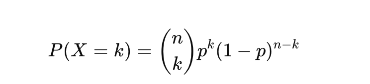

```
from scipy.stats import binom

n, p = 10, 0.5
x = range(n+1)
pmf = binom.pmf(x, n, p)

plt.bar(x, pmf)
plt.title("Binomial Distribution (n=10, p=0.5)")
plt.xlabel("Successes")
plt.ylabel("Probability")
plt.show()
```

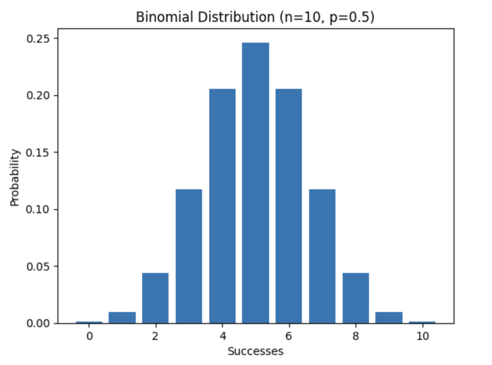


**3. Poisson Distribution**

- Use: Events occurring in a fixed interval

- PMF: 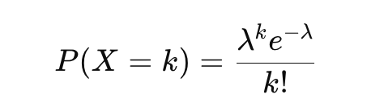

```
from scipy.stats import poisson

mu = 4
x = range(0, 15)
pmf = poisson.pmf(x, mu)

plt.bar(x, pmf)
plt.title("Poisson Distribution (λ=4)")
plt.xlabel("Number of Events")
plt.ylabel("Probability")
plt.show()
```

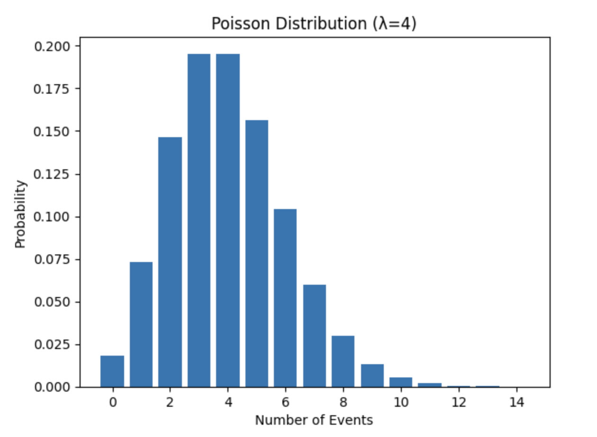


**📈 Continuous Probability Distributions**

**1. Uniform Distribution**

- Use: All outcomes equally likely

- PDF: 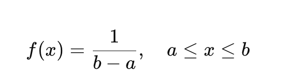


```
from scipy.stats import uniform
import numpy as np

a, b = 0, 1
x = np.linspace(a, b, 100)
pdf = uniform.pdf(x, a, b-a)

plt.plot(x, pdf)
plt.title("Uniform Distribution [0,1]")
plt.xlabel("x")
plt.ylabel("Density")
plt.show()
```


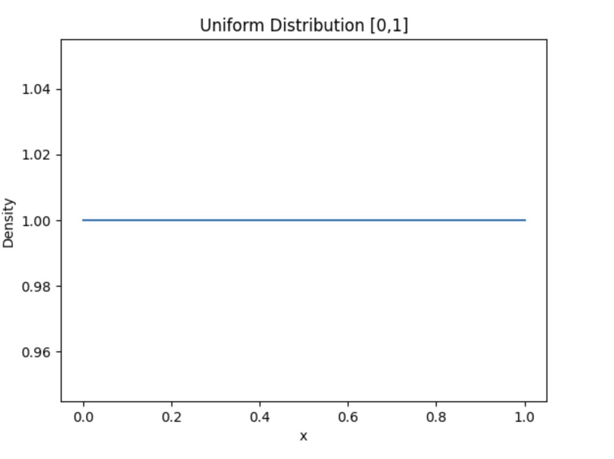


**2. Normal (Gaussian) Distribution**

- Use: Natural phenomena, bell-shaped curve

PDF: 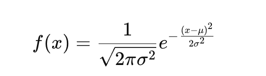

```
from scipy.stats import norm

mu, sigma = 0, 1
x = np.linspace(-4, 4, 100)
pdf = norm.pdf(x, mu, sigma)

plt.plot(x, pdf)
plt.title("Normal Distribution (μ=0, σ=1)")
plt.xlabel("x")
plt.ylabel("Density")
plt.grid()
plt.show()
```

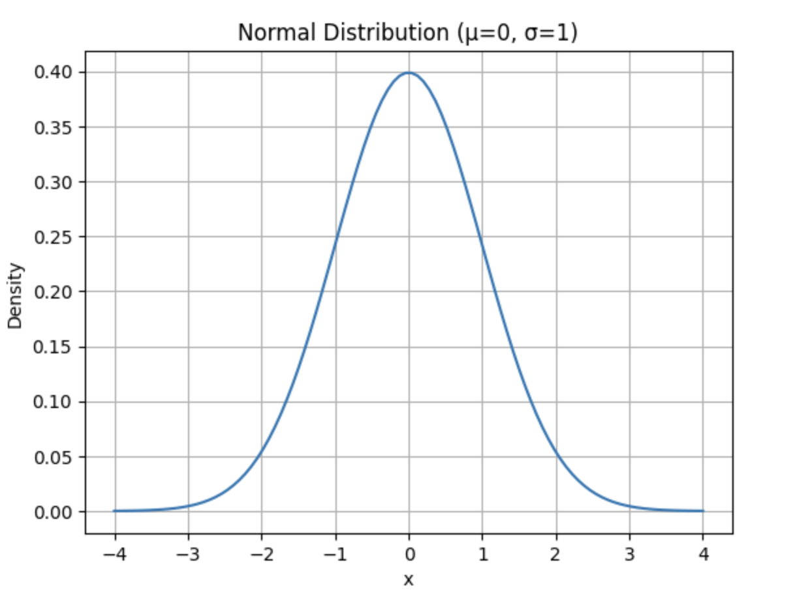

**3. Exponential Distribution**

Use: Time between Poisson events

PDF: 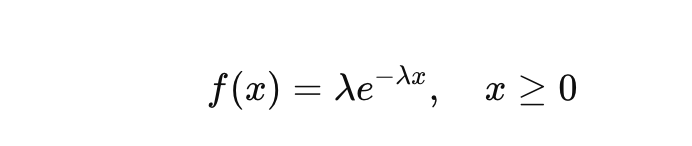


```
from scipy.stats import expon

lam = 1
x = np.linspace(0, 10, 100)
pdf = expon.pdf(x, scale=1/lam)

plt.plot(x, pdf)
plt.title("Exponential Distribution (λ=1)")
plt.xlabel("x")
plt.ylabel("Density")
plt.grid()
plt.show()
```

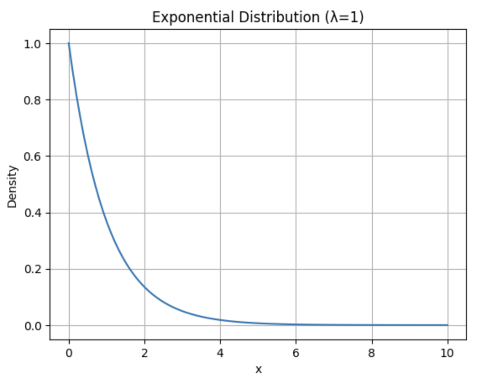


**📚 Summary Table**

| Distribution      | Type       | Use Case Example                   |
| ----------------- | ---------- | ---------------------------------- |
| Bernoulli         | Discrete   | Single coin toss                   |
| Binomial          | Discrete   | Number of heads in multiple tosses |
| Poisson           | Discrete   | Number of arrivals in an hour      |
| Uniform           | Continuous | Roll of a fair die                 |
| Normal (Gaussian) | Continuous | Heights, test scores               |
| Exponential       | Continuous | Time to next event                 |


