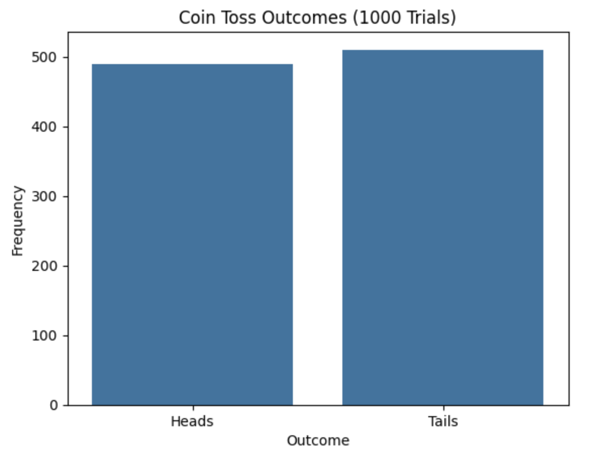

<h2 style="color:red;">✅ Probability Theory</h2>
**Probability Theory** is the branch of mathematics that deals with **quantifying uncertainty**. It provides the foundation for making inferences and predictions about random events.

**Key Definitions**

| Term                 | Meaning                                                       |
| -------------------- | ------------------------------------------------------------- |
| **Experiment**       | A process that produces an outcome (e.g., tossing a coin)     |
| **Sample Space (S)** | The set of all possible outcomes (e.g., {Heads, Tails})       |
| **Event (E)**        | A subset of the sample space (e.g., getting Heads)            |
| **Probability (P)**  | A measure between 0 and 1 representing how likely an event is |


**📘 Types of Probability**

| Type             | Description                | Example                                    |
| ---------------- | -------------------------- | ------------------------------------------ |
| **Theoretical**  | Based on logical reasoning | P(Head) = 1/2                              |
| **Experimental** | Based on observed data     | Flip a coin 100 times: Head shows 47 times |
| **Subjective**   | Based on personal belief   | "I think India has a 70% chance to win"    |


**🧠 Probability Rules**

1. **0 ≤ P(E) ≤ 1**

2. **P(Sample Space) = 1**

3. **P(A ∪ B) = P(A) + P(B) - P(A ∩ B)**

4. **Complement Rule: P(Aᶜ) = 1 - P(A)**

**📊 Types of Events**

| Event Type             | Description                                | Example                           |
| ---------------------- | ------------------------------------------ | --------------------------------- |
| **Independent Events** | One event does not affect the other        | Tossing two coins                 |
| **Dependent Events**   | One event affects the other                | Drawing cards without replacement |
| **Mutually Exclusive** | Events that cannot happen at the same time | Getting Head or Tail in one toss  |
| **Exhaustive Events**  | All possible outcomes covered              | Rolling a 6-sided die (1-6)       |


**🎲 Real-World Example in Python**

**Scenario:**

You flip a fair coin 1000 times. Estimate the probability of getting heads.

```
import numpy as np

# Simulate 1000 coin tosses
np.random.seed(42)
coin_tosses = np.random.choice(['Heads', 'Tails'], size=1000)

# Count heads
heads_prob = np.sum(coin_tosses == 'Heads') / 1000
print(f"Estimated Probability of Heads: {heads_prob:.2f}")
```

Estimated Probability of Heads: 0.49

**📈 Visualization: Coin Toss Simulation**

```
import matplotlib.pyplot as plt
import seaborn as sns

sns.countplot(x=coin_tosses)
plt.title("Coin Toss Outcomes (1000 Trials)")
plt.xlabel("Outcome")
plt.ylabel("Frequency")
plt.show()
```



**🔁 Probability Distributions (Preview)**

Probability theory leads into Probability Distributions, such as:

- **Discrete:** Bernoulli, Binomial, Poisson

- **Continuous:** Uniform, Normal, Exponential