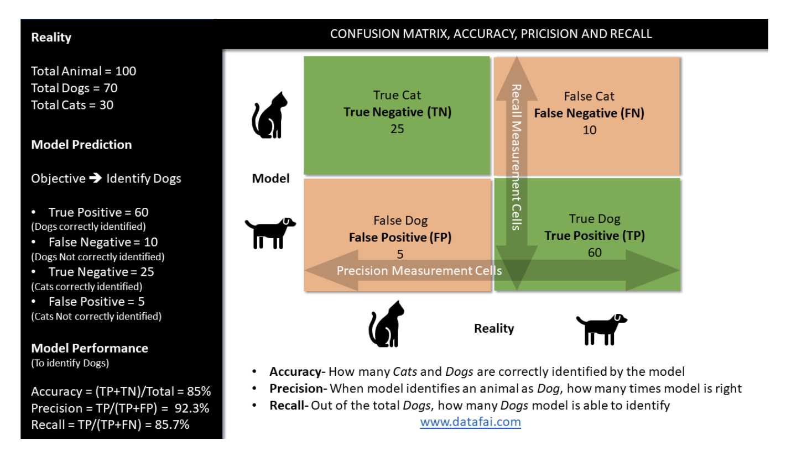
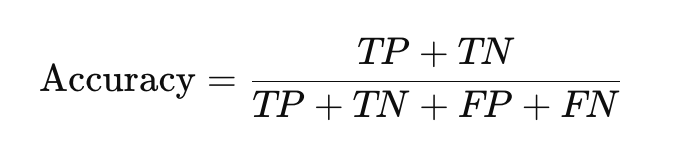
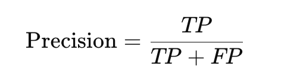
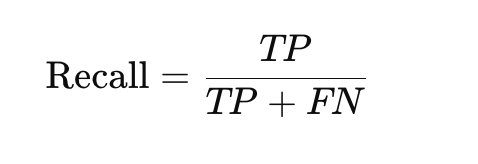
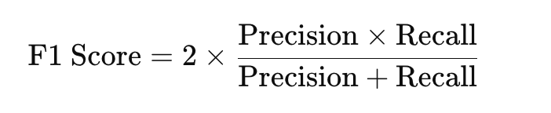
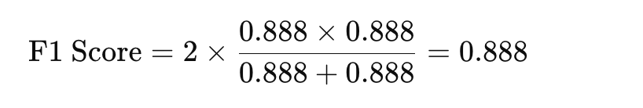
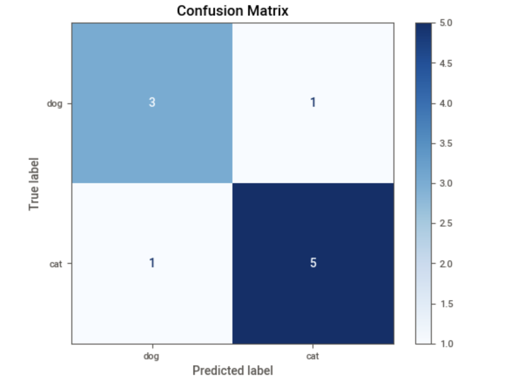
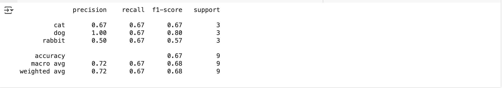
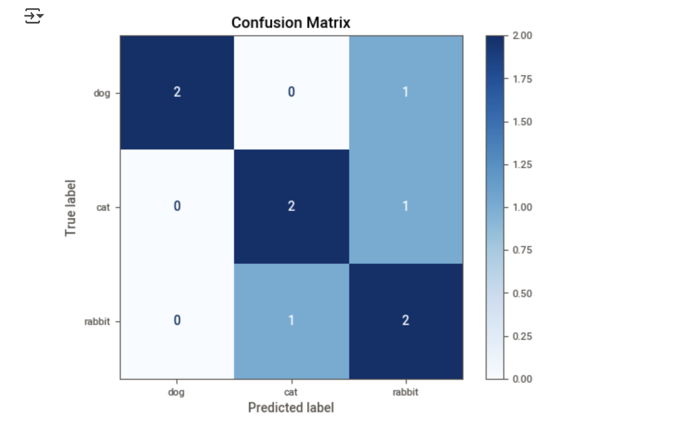

## Classification Evaluation Metrics

**x-axis:** Typically represents the independent variable.
            - The x-axis is horizontal

**y-axis:** Typically represents the dependent variable.
            - y-axis is vertical

Several important metrics which are used in classification algorithms under supervised learning.
Although there are many metrics which can be potentially used for measuring performance of a classification model, some of the main metrics are listed below

- **Confusion matrix–** This is one of the most important and most commonly used metrics for evaluating the classification accuracy.
Typically on the **x-axis “true classes”** are shown and on the **y axis “predicted classes”** are represented.
Confusion Matrix is applicable for both **binary** and **multi class** classification.

See the cat and dog classification example listed.



In the below example, let’s pretend that we have built a classification algorithm to identify Dogs ( Positive Class) from a total of 100 animals where in reality 70 animals are Dogs (Positive Class) and 30 are Cats (Negative Class).


|                      | **Predicted: Positive** | **Predicted: Negative** |
| -------------------- | ----------------------- | ----------------------- |
| **Actual: Positive** | True Positive (TP)      | False Negative (FN)     |
| **Actual: Negative** | False Positive (FP)     | True Negative (TN)      |


## ✅ 2. Key Metrics Explained

- **TP** = Model predicted Positive and it's actually Positive
- **TN** = Model predicted Negative and it's actually Negative
- **FP** = Model predicted Positive but it's actually Negative
- **FN** = Model predicted Negative but it's actually Positive

## 🔹 Accuracy:
 This measures model’s overall performance in correctly identifying all classes.This metric is valid for both binary and multi-class classification however this is not very robust for the unbalanced data and we should use Precision and Recall metrics instead

- How often the model is correct overall.



## 🔹 Precision:
 When a model identifies an observation as a positive, this metric measure the performance of the model in correctly identifying the true positive from the false positive. This is a very robust matrix for multiclass classification and the unbalanced data. The closer the Precision value to 1, the better the model

 - Out of the predicted positives, how many are actually positive?

 


## 🔹 Recall (Sensitivity or True Positive Rate):
This metric measures a  model’s performance in identifying the true positive out of the total true positive cases.  The closer the Recall value to 1, the better the model. As is the case with the Precision metric, this metric is a very robust matrix for multi-class classification and the unbalanced data.

- Out of all actual positives, how many did the model catch?




## ✅ Example

Suppose you're building a spam classifier. You test it on 100 emails, and get:

- **TP = 40** (Spam correctly identified as spam)
- **TN = 50** (Not spam correctly identified as not spam)
- **FP = 5** (Not spam incorrectly identified as spam)
- **FN = 5** (Spam incorrectly identified as not spam)

## 📊 Confusion Matrix

|                      | **Predicted: Spam** | **Predicted: Not Spam** |
| -------------------- | ------------------- | ----------------------- |
| **Actual: Spam**     | 40 (TP)             | 5 (FN)                  |
| **Actual: Not Spam** | 5 (FP)              | 50 (TN)                 |


## 🔢 Calculated Metrics

- **Accuracy** = (TP + TN) / Total = (40 + 50) / 100 = **90%**
- **Precision** = TP / (TP + FP) = 40 / (40 + 5) = **88.9%**
- **Recall** = TP / (TP + FN) = 40 / (40 + 5) = **88.9%**


## ✅ When to Use What?

| Metric        | Best Used When...                                                          |
| ------------- | -------------------------------------------------------------------------- |
| **Accuracy**  | Classes are balanced and cost of errors is equal.                          |
| **Precision** | False positives are costly (e.g., predicting a healthy person has diabatic). |
| **Recall**    | False negatives are costly (e.g., missing a disease).                      |


## ✅ F1 Score

The **F1 Score** is the **harmonic mean** of **Precision** and **Recall**. It balances both metrics — especially useful when you want to **balance false positives and false negatives.**


## 🔹 F1 Score Formula:



- **Precision** = 40 / (40 + 5) = 0.888
- **Recall** = 40 / (40 + 5) = 0.888



## ✅ When to Use F1 Score?

- **Imbalanced datasets**
(e.g., fraud detection, disease diagnosis)

- When **both** false positives and false negatives are important

## ⚖️ Precision vs Recall vs F1 Summary

| Metric    | Best For                            |
| --------- | ----------------------------------- |
| Precision | You want fewer false positives (FP) |
| Recall    | You want fewer false negatives (FN) |
| F1 Score  | You want a balance of both          |


## Example

```
import matplotlib.pyplot as plt
from sklearn.metrics import confusion_matrix, ConfusionMatrixDisplay
from sklearn.metrics import precision_score, recall_score, f1_score

# True and predicted labels
y_true = ['dog', 'dog', 'cat', 'dog', 'cat', 'cat', 'dog', 'cat', 'cat', 'cat']
y_pred = ['dog', 'cat', 'cat', 'dog', 'cat', 'cat', 'dog', 'dog', 'cat', 'cat']

# Metrics for class "dog" as positive
precision = precision_score(y_true, y_pred, pos_label='dog')
recall = recall_score(y_true, y_pred, pos_label='dog')
f1 = f1_score(y_true, y_pred, pos_label='dog')

print(f"Precision: {precision:.2f}")
print(f"Recall: {recall:.2f}")
print(f"F1 Score: {f1:.2f}")

# Confusion matrix
cm = confusion_matrix(y_true, y_pred, labels=['dog', 'cat'])
disp = ConfusionMatrixDisplay(confusion_matrix=cm, display_labels=['dog', 'cat'])
disp.plot(cmap=plt.cm.Blues)
plt.title("Confusion Matrix")
plt.show()
```

# Explanation:

**Note:** ```dog: positive(1) and cat: negative(0)```

- **Total count** = 10
- **Total actual dog count** =  4
- **Total actual cat count** =  6

- **Correctly predicted as dog count(TP)** = 3
- **Correctly predicted as cat count(TN)** = 5

- **Predicted dog but actual is cat count(FN)** = 1
- **Predicted cat but actual is dog count(FP)** = 1

# 📊 Confusion Matrix Interpretation (for 'dog' as positive):

|             | Predicted: dog | Predicted: cat |
| ----------- | -------------- | -------------- |
| Actual: dog | TP = 3         | FN = 1         |
| Actual: cat | FP = 1         | TN = 5         |


- **Precision** = 3 / (3 + 1) = 0.75

- **Recall** = 3 / (3 + 1) = 0.75

- **F1 Score** = 0.75


| Index | y\_true | y\_pred | Result                    |
| ----- | ------- | ------- | ------------------------- |
| 0     | dog     | dog     | ✅ TP                      |
| 1     | dog     | cat     | ❌ FN                      |
| 2     | cat     | cat     | ✅ TN (not counted for F1) |
| 3     | dog     | dog     | ✅ TP                      |
| 4     | cat     | cat     | ✅ TN                      |
| 5     | cat     | cat     | ✅ TN                      |
| 6     | dog     | dog     | ✅ TP                      |
| 7     | cat     | dog     | ❌ FP                      |
| 8     | cat     | cat     | ✅ TN                      |
| 9     | cat     | cat     | ✅ TN                      |





## Multi-class classification
For multi-class classification, metrics like precision, recall, and F1 score are calculated per class and then aggregated using different methods:

## 🎯 Step-by-Step
Let’s assume you have 3 classes: ```'cat', 'dog', and 'rabbit'```.

```
from sklearn.metrics import precision_score, recall_score, f1_score

y_true = ['cat', 'dog', 'rabbit', 'cat', 'dog', 'rabbit', 'dog', 'cat', 'rabbit']
y_pred = ['cat', 'dog', 'cat', 'rabbit', 'dog', 'rabbit', 'rabbit', 'cat', 'rabbit']
```

## ✅ Method 1: Per-class scores

```
precision_score(y_true, y_pred, average=None, labels=['cat', 'dog', 'rabbit'])
```

This gives precision for each class separately:

- Precision for ```'cat'```
- Precision for ```'dog'```
- Precision for ```'rabbit'```

```
from sklearn.metrics import precision_score, recall_score, f1_score
from sklearn.metrics import classification_report

y_true = ['cat', 'dog', 'rabbit', 'cat', 'dog', 'rabbit', 'dog', 'cat', 'rabbit']
y_pred = ['cat', 'dog', 'cat', 'rabbit', 'dog', 'rabbit', 'rabbit', 'cat', 'rabbit']


print(classification_report(y_true, y_pred, labels=['cat', 'dog', 'rabbit']))
```



## Confusion matrix
```
cm = confusion_matrix(y_true, y_pred, labels=['dog', 'cat', 'rabbit'])
disp = ConfusionMatrixDisplay(confusion_matrix=cm, display_labels=['dog', 'cat', 'rabbit'])
disp.plot(cmap=plt.cm.Blues)
plt.title("Confusion Matrix")
plt.show()
```




## 🧠 How It Works (One-vs-Rest)
Suppose we have 3 classes: ```cat, dog, rabbit```. Here's how metrics are computed ```per class``` using a ```one-vs-rest``` strategy:

1. **For Class** cat:
   - **Positive class** = cat
   - **Negative classes** = dog, rabbit


| Metric       | Meaning                                        |
| ------------ | ---------------------------------------------- |
| **TP (cat)** | Predicted `cat` and actually `cat`             |
| **FP (cat)** | Predicted `cat` but actually `dog` or `rabbit` |
| **FN (cat)** | Actual `cat` but predicted `dog` or `rabbit`   |
| **TN (cat)** | All others (correct non-cat classifications)   |


2. **For Class** dog:
   - **Positive class** = dog
   - **Negative classes** = cat, rabbit

| Metric       | Meaning                                        |
| ------------ | ---------------------------------------------- |
| **TP (dog)** | Predicted `dog` and actually `dog`             |
| **FP (dog)** | Predicted `dog` but actually `cat` or `rabbit` |
| **FN (dog)** | Actual `dog` but predicted `cat` or `rabbit`   |
| **TN (dog)** | All others (correct non-cat classifications)   |


3. **For Class** rabbit:
  - **Positive class** = rabbit
  - **Negative classes** = cat, dog

| Metric       | Meaning                                        |
| ------------ | ---------------------------------------------- |
| **TP (rabbit)** | Predicted `rabbit` and actually `rabbit`       |
| **FP (rabbit)** | Predicted `rabbit` but actually `cat` or `dog` |
| **FN (rabbit)** | Actual `rabbit` but predicted `cat` or `dog`   |
| **TN (rabbit)** | All others (correct non-cat classifications)   |


## ✅ So, in multi-class:
 - **There’s no single "positive"/"negative" class.**
 - Instead, **each class becomes the “positive”** class in turn, and metrics are computed accordingly.
